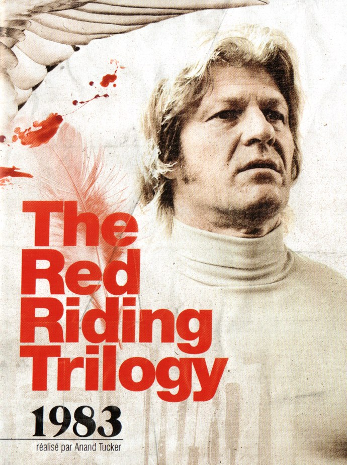
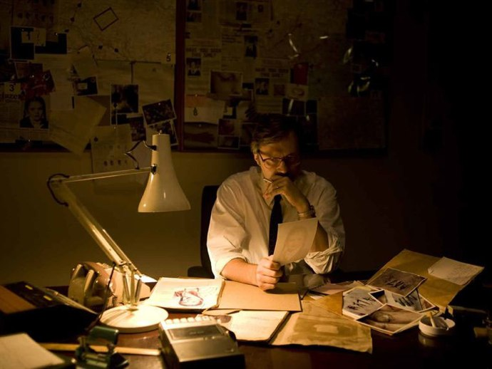
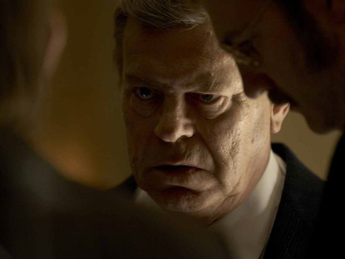
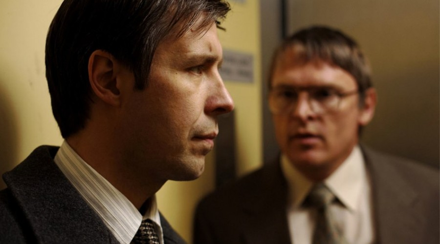

+++
type = "post"
titre = "The Red Riding Trilogy : 1983, Anand Tucker"
title = "The Red Riding Trilogy : 1983, Anand Tucker"
url = "/red-riding-trilogy-1983-tucker"
date = "2010-05-29T23:37:56"
Lastmod = "2012-10-23T10:45:42"
cover = "the-red-riding-trilogy-1983.jpg"
categorie = [ "À voir" ]
tag = [ "Corruption", "Mafia", "Pédophilie", "Thriller" ]
createur = [ "Anand Tucker" ]
annee = [ "2009" ]
weight = 2009

+++

<em>The Red Riding Trilogy</em> se termine avec <em>1983</em>, épisode hautement important donc puisqu&rsquo;il est logiquement celui des résolutions. Le nombre de questions encore en suspens était important, mais la trilogie ne tourne fort heureusement pas à l&rsquo;explication complète qui aurait été d&rsquo;une lourdeur pénible. Non, fidèle à son habitude, la série se conclut en présentant tous les éléments nécessaires, sans jamais insister, faisant confiance à l&rsquo;intelligence du spectateur. La trilogie <em>Red Riding</em> a su rester brillante jusqu&rsquo;au bout.

<strong>Note : difficile de ne rien révéler de l’intrigue de la trilogie <em>Red Riding</em>, surtout concernant le dernier épisode. Je vous conseille donc chaudement de voir <em><a href="http://voiretmanger.fr/2010/05/15/red-riding-trilogy-1974-jarrold/">1974</a></em>, <em><a href="http://voiretmanger.fr/2010/05/17/red-riding-trilogy-1980-marsh/">1980</a></em> et <em>1983</em> avant de lire ce qui suit.</strong>

<em>The Red Riding Trilogy : 1983</em> se déroule peu après le second opus de la trilogie et c&rsquo;est à nouveau l&rsquo;occasion d&rsquo;un changement de point de vue. Mais alors que <em>1974</em> et <em>1980</em> suivaient à chaque fois un seul homme, <em>1983</em> est plus riche puisque l&rsquo;on suit plus ou moins trois hommes. Néanmoins, le principe du changement de point de vue est respecté puisque l&rsquo;on a cette fois affaire à un homme de l&rsquo;intérieur — un policier complice depuis l&rsquo;origine —, un avocat et même une victime. Brillante idée qui permet au réalisateur de dénouer les principaux fils de l&rsquo;intrigue sans avoir à convoquer de lourds artifices. La victime est en fait le jeune prostitué de <em>1974</em> que l&rsquo;on avait aussi croisé en <em>1980</em> et qui sort ici de prison et part se venger. La cible de sa vengeance demeure un mystère tout au long du film, mais on comprend immédiatement qu&rsquo;elle n&rsquo;est pas sans rapport avec l&rsquo;intrigue générale. L&rsquo;avocat se retrouve propulsé bien malgré lui dans cette sombre affaire en devenant l&rsquo;avocat de celui qui avait été condamné pour les crimes de l&rsquo;année 1974. Le policier enfin était au cœur de la mafia mise en place dans les années 1970 et alors qu&rsquo;une nouvelle disparition trop semblable à toutes les autres a lieu, ses remords prennent le dessus.

L&rsquo;intrigue de <em>1983</em> est assez complexe tout en restant toujours très claire à condition de ne pas avoir oublié les épisodes précédents. <em>1983</em> est parcouru de flashbacks qui remettent un peu les choses en place, notamment en replaçant quelques scènes clés de <em>1974</em> qui est quand même l&rsquo;origine de toute l&rsquo;intrigue. Mais dans l&rsquo;ensemble, mieux vaut se souvenir précisément de qui est qui, et de qui fait quoi, car vous n&rsquo;aurez pas vraiment le loisir de tout comprendre sans le savoir. On retrouve quelques personnages centraux de la trilogie, à commencer par la victime et le complice présents depuis le début. Mais l&rsquo;espérance de vie moyenne de l&rsquo;Angleterre septentrionale était manifestement faible à l&rsquo;époque, si bien que la trilogie <em>Red Riding</em> offre un &laquo;&nbsp;<em>turn-over</em>&nbsp;&raquo; très impressionnant. De nouveaux personnages apparaissent donc, même si la tendance étant à la résolution, le scénario n&rsquo;ajoute pas de nouvelles ramifications inutiles.

Cet épisode est sans doute le plus classique sur le plan de l&rsquo;histoire. Le coupable n&rsquo;est pas des plus originaux, même si je dois dire que la trilogie a tout fait pour brouiller les pistes à son sujet, si bien que s&rsquo;il faisait partie de ma liste de candidats potentiels, je n&rsquo;en étais pas du tout certain. De manière assez traditionnelle, le coupable idéal n&rsquo;est pas forcément le véritable coupable et <em>1983</em> ajoute à l&rsquo;ensemble une couche supplémentaire dans les atrocités. Au-delà du monde politique et de la mafia, c&rsquo;est une thématique très contemporaine autour de la religion qui s&rsquo;impose. C&rsquo;est en tout cas une série de crimes au vu et au su de toute la communauté. C&rsquo;est sans doute d&rsquo;ailleurs la force de <em>The Red Riding Trilogy</em> : paradoxalement, son intérêt vient de son éloignement final de la thématique mafieuse. Si la mafia policière est toujours un thème central et si, par les flashbacks en particulier, ses méthodes sont largement expliquées, l&rsquo;enquête se détourne <em>in fine</em> de la mafia. C&rsquo;est peut-être décevant sur le plan politique, mais cela évite indéniablement l&rsquo;effet intrigue sur rails qui aurait pu suivre <em>1974</em>. À cet égard, le changement de point de vue, du journaliste au complice et la victime au cœur du système criminel, est très intéressant et ajoute un niveau de lecture supplémentaire à cette série déjà riche.

La réalisation change encore avec cet ultime opus. Anand Tucker réalise un film encore marqué par cette atmosphère pesante si caractéristique, et propose un film comme alourdi par le poids du passé. C&rsquo;est l&rsquo;effet que procurent les nombreux (peut-être trop, à mon goût) flashbacks qui parsèment le film. La musique se fait aussi plus mélancolique alors que tous les personnages principaux sont marqués par une mélancolie sourde. <em>1983</em> est peut-être aussi l&rsquo;épisode le plus frontal à l&rsquo;écran, celui qui montre vraiment les meurtres quand les précédents se contentaient souvent de les évoquer, éventuellement de les montrer par photos interposées.

<em>The Red Riding</em> est vraiment une excellente trilogie. En trois films, elle impose une atmosphère, une ambiance et campe une série de personnages comme on a rarement l&rsquo;occasion d&rsquo;en voir au cinéma. Prévue pour être une série télévisée au départ, la trilogie se révèle bien supérieure à ce que l&rsquo;on peut voir en moyenne sur le petit écran. Dommage, dès lors, qu&rsquo;elle soit sortie aussi discrètement sur les grands écrans. Le coffret DVD est en tout cas un achat indispensable…

Rob Gordon <a href="http://www.toujoursraison.com/2009/11/red-riding-trilogy-1983.html">regrette</a> que <em>1983</em> soit aussi démonstratif. Il est vrai qu&rsquo;il est beaucoup plus explicite que les deux épisodes précédents, mais je ne l&rsquo;ai pas trouvé si lourd que cela. Sans doute m&rsquo;attendais-je à quelque chose de bien pire, quelque chose qui arrivera certainement si <a href="http://voiretmanger.fr/createur/ridley-scott/">Ridley Scott</a> doit en faire sa propre version, comme il l&rsquo;écrit. Je crains déjà le pire.

<em>Et avant de conclure cette trilogie d&rsquo;articles, je tenais encore une fois à remercier Rob Gordon pour son concours, sans lequel je n&rsquo;aurais sans doute pas vu la trilogie Red Riding, en tout cas pas dans ces conditions. Merci, donc !</em>

<h3 style="text-align:center">Trilogie Red Riding</h3>

<h3>Vous voulez m&rsquo;aider ?<a href="#footnote_0_3378" id="identifier_0_3378" class="footnote-link footnote-identifier-link" title="&Agrave; propos de la publicit&eacute;&hellip;">1</a></h3>
<ul>
<li><a href="http://www.amazon.fr/gp/product/B001TEKJZW/ref=as_li_ss_tl?ie=UTF8&#038;tag=leblogdenic07-21&#038;linkCode=as2&#038;camp=1642&#038;creative=19458&#038;creativeASIN=B001TEKJZW">Acheter la trilogie en DVD sur Amazon</a></li>
</ul>

<ol class="footnotes"><li id="footnote_0_3378" class="footnote"><a href="http://nicolinux.fr/soutien/">À propos de la publicité…</a> [<a href="#identifier_0_3378" class="footnote-link footnote-back-link">&#8617;</a>]</li></ol>
