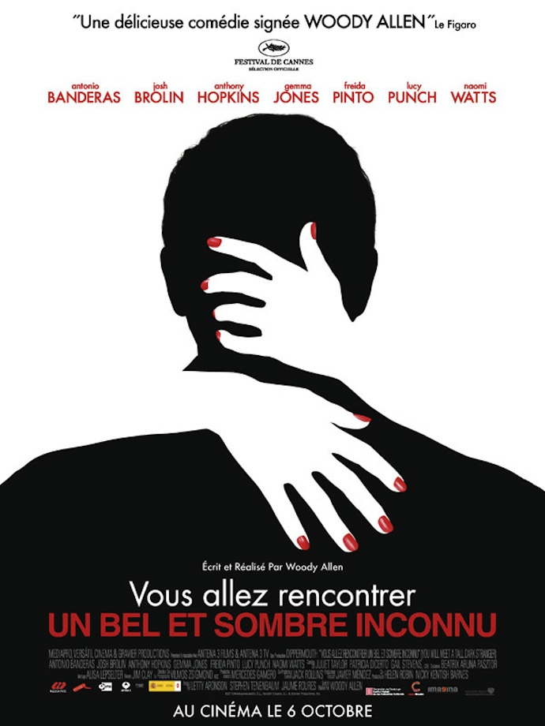
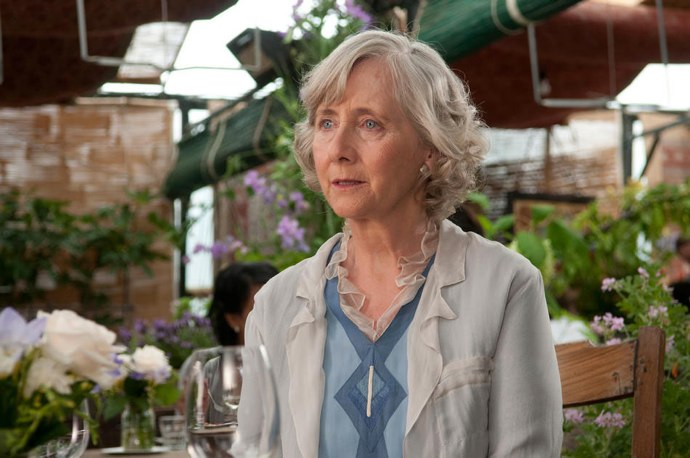

+++
type = "post"
titre = "<em>Vous allez rencontrer un bel et sombre inconnu</em>, Woody Allen"
title = "Vous allez rencontrer un bel et sombre inconnu, Woody Allen"
url = "/rencontrer-bel-sombre-inconnu-allen"
date = "2010-10-06T01:01:13"
Lastmod = "2014-10-28T21:38:54"
cover = "you-will-meet-a-tall-dark-stranger-allen.jpg"
categorie = [ "À voir" ]
tag = [ "Comédie", "Drame", "Film choral", "Société", "Vite oublié" ]
createur = [ "Woody Allen" ]
acteur = [ "Anthony Hopkins", "Antonio Banderas", "Naomi Watts" ]
annee = [ "2010" ]
weight = 2010
pays = [ "États-Unis" ]
original = "You Will Meet a Tall Dark Stranger"

+++

Lettres blanches sur fond noir et musique de jazz ou une vieille chanson… les génériques de tous les films de Woody Allen sont strictement identiques. Tel un rituel, ils introduisent la dose annuelle du réalisateur new-yorkais. Comme tous les ans, je me suis empressé d&rsquo;aller voir &laquo;&nbsp;le dernier Woody Allen&nbsp;&raquo;, presque par automatisme, avec la certitude d&rsquo;être en terrain connu, comme si on allait rendre visite à un vieil ami. <em>Vous allez rencontrer un bel et sombre inconnu</em>, la cuvée 2010 est ainsi sans conteste un film de Woody Allen, tout est là, l&rsquo;histoire, la galerie de personnages, le style… Sans aller jusqu&rsquo;à parler de déception, le dernier Allen n&rsquo;est pourtant pas son meilleur film, loin de là.

La galerie de stars qui orne l&rsquo;affiche ne laisse aucune place au doute, <em>Vous allez rencontrer un bel et sombre inconnu</em> est un film choral. Woody Allen nous fait suivre plusieurs personnes dans leur quotidien londonien. AU centre du dispositif, Sally, jeune diplômée en beaux-arts qui travaille comme secrétaire à tout faire dans une grande galerie de la ville. C&rsquo;est autour d&rsquo;elle que les autres personnages s&rsquo;agencent : on trouve sa mère, Helena, femme âgée qui se fait larguer par Alfie, son époux depuis 40 ans qui se réveille un beau jour paniqué à l&rsquo;idée de vieillir et mourir. Helena cherche le réconfort auprès de Cristal, une voyante qui lui prédit son avenir tout en lui offrant les principes de base de la réincarnation et du bouddhisme. Helena n&rsquo;aime pas son gendre, Roy, écrivain qui a connu un court succès avec un premier roman et n&rsquo;arrive plus, depuis, à proposer un seul roman digne d&rsquo;intérêt. Alfie de son côté tente en vain de combattre la vieillesse en épousant une jeunette, une ancienne prostituée qu&rsquo;il couvre de cadeaux, mais qui fait aussi rapidement de lui un cocu. Les couples se font et se défont : Roy et Sally se séparent, lui rencontre une jeune indienne très séduisante quand elle, de son côté, aimerait bien conclure avec son patron.

On le voit, le scénario de <em>Vous allez rencontrer un bel et sombre inconnu</em> contient de nombreuses ramifications qui se croisent ou avancent en parallèle. Ce procédé n&rsquo;a rien d&rsquo;original et Woody Allen s&rsquo;en sort plutôt bien, sans s&rsquo;emmêler les pinceaux et en rendant les personnages attachants. Si tous ne sont pas traités à égalité par le scénario, tous ont un rôle dans l&rsquo;histoire et forment une grande histoire où, comme souvent chez le réalisateur, la description de la société, en l&rsquo;occurrence londonienne, est centrale. Woody Allen prolonge avec <em>Vous allez rencontrer un bel et sombre inconnu</em> sa série européenne, après le bref détour américain de <em><a href="http://voiretmanger.fr/2009/07/05/whatever-works-allen/">Whatever Works</a></em>, mais après une série de films tournés au Royaume-Uni ou en <a href="http://voiretmanger.fr/2008/10/11/vicky-cristina-barcelona-woody-allen/">Espagne</a> (avant la France, l&rsquo;année prochaine). Les personnages de ce film sont classiques dans le cinéma du cinéaste, on retrouve cette classe assez élevée où l&rsquo;argent peut poser un problème, mais coule quand même globalement à flot, avec une large part d&rsquo;artistes (ici un écrivain et une actrice) ou en tout cas de personnes liées à l&rsquo;art (par le biais des galeries d&rsquo;art). Les portraits de ces personnages sont caractéristiques du travail de Woody Allen : hypocrisie, faux-semblants, mensonges, tromperies… l&rsquo;humour allenien est présent et utilise toujours les mécanismes bien huilés désormais. Si le réalisateur n&rsquo;est pas devant la caméra, on reconnaît à travers ses personnages le petit bonhomme cynique et pessimiste.

Dès l&rsquo;ouverture du film, le narrateur nous explique, citant Shakespeare, que ce qui va suivre est &laquo;&nbsp;<em>une histoire, racontée par un idiot, pleine de bruit et de fureur, et qui ne signifie… rien</em>.&nbsp;&raquo;<a href="#footnote_0_4124" id="identifier_0_4124" class="footnote-link footnote-identifier-link" title="J&rsquo;aurais ador&eacute; ressortir la citation comme &ccedil;a, mais ce serait mentir et oublier ma l&eacute;gendaire amn&eacute;sie. Rendons ainsi &agrave; C&eacute;sar&hellip; j&rsquo;ai piqu&eacute; la citation chez Nicolas&hellip;">1</a> D&rsquo;emblée le ton est posé et Woody Allen semble dénigrer son film. Bien sûr, il faut y voir la malice du cinéaste qui se dédouane ainsi de toutes les critiques que l&rsquo;on pourrait faire sur le film, critiques qui n&rsquo;ont plus lieu d&rsquo;être puisque la vacuité était voulue. Et de fait, <em>Vous allez rencontrer un bel et sombre inconnu</em> ne raconte finalement pas grand-chose. Le film multiplie les idées, les histoires, mais n&rsquo;en développe vraiment aucune et surtout ne conclut rien. Il y a plusieurs très bonnes pistes, comme l&rsquo;écrivain que l&rsquo;on croit mort et qui n&rsquo;est que dans le coma, ou comme la voyante qui déconseille à la mère d&rsquo;aider sa fille, mais ces pistes ne sont qu&rsquo;esquivées et jamais exploitées. Les scènes défilent sans que l&rsquo;on ait vraiment l&rsquo;impression de voir un film, mais plutôt plein de petites scènes juxtaposées un peu comme elles venaient. Cet argument du non-sens ne tient pas, car on ne comprend jamais ce que Woody Allen a voulu montrer. L&rsquo;idée n&rsquo;était pas mauvaise en soi, elle aurait pu servir à présenter la vacuité d&rsquo;un univers par exemple, mais ce n&rsquo;est même pas le cas ici. Le mécanisme n&rsquo;a aucune fin et donne plutôt l&rsquo;impression désagréable que Woody Allen a filmé des scènes comme elles venaient, en roue libre complète, et a inventé <em>a posteriori</em> une justification. L&rsquo;ensemble n&rsquo;en est pas déplaisant pour autant, non, le film se laisse regarder avec plaisir, mais il n&rsquo;en reste vraiment rien à la sortie, contrairement à de nombreux autres films du réalisateur new-yorkais.

Après un nombre aussi impressionnant de films, il serait étonnant que Woody Allen se plante sur le plan technique. Sans surprise, <em>Vous allez rencontrer un bel et sombre inconnu</em> se révèle sans faille dans le domaine, mais sans ingéniosité particulière, et encore moins d&rsquo;inventivité. On est en terrain connu, avec un travail efficace. Contrairement à ses précédents films, plus ancrés dans un contexte géographique particulier (on pense par exemple à la campagne anglaise de <em>Match Point</em> ou à Gaudi dans <em>Vicky Cristina Barcelona</em>), <em>Vous allez rencontrer un bel et sombre inconnu</em> se déroule à Londres, mais cela n&rsquo;a aucune importance. Un mot par contre des acteurs, tous impeccables avec certaines bonnes surprises comme un Antonio Banderas grand séducteur, mais aussi doté de failles ou un Anthony Hopkins qui, lui aussi, laisse voir ses faiblesses. Parmi la gent féminine, outre Naomi Watts, on notera la prestation de Gemma Jones, parfaite en mère rendue complètement folle par sa voyante.

<em>Vous allez rencontrer un bel et sombre inconnu</em> n&rsquo;est pas un très bon Woody Allen. Sans aller jusqu&rsquo;à dire que c&rsquo;est un mauvais film, on peut quand même trouver que le réalisateur new-yorkais ne s&rsquo;est pas tellement foulé sur ce dernier film. Panne d&rsquo;inspiration ou effets combinés de l&rsquo;âge et de l&rsquo;usure, difficile de le dire, mais on regardera avec intérêt son prochain film, déjà rendu célèbre par la fameuse première dame qui est censée y jouer. En attendant, la cuvée 2010 se regarde sans réel plaisir, mais sans dégoût pour autant.

<h3>Vous voulez m&rsquo;aider ?<a href="#footnote_1_4124" id="identifier_1_4124" class="footnote-link footnote-identifier-link" title="&Agrave; propos de la publicit&eacute;&hellip;">2</a></h3>
<ul>
<li><a href="http://www.amazon.fr/gp/product/B008YBQBIW/ref=as_li_ss_tl?ie=UTF8&tag=leblogdenic07-21&linkCode=as2&camp=1642&creative=19458&creativeASIN=B008YBQBIW">Acheter le film en Blu-Ray sur Amazon</a></li>
<li><a href="http://www.amazon.fr/gp/product/B0044XU00O/ref=as_li_ss_tl?ie=UTF8&tag=leblogdenic07-21&linkCode=as2&camp=1642&creative=19458&creativeASIN=B0044XU00O">Acheter le film en DVD sur Amazon</a></li>
<li><a href="https://itunes.apple.com/fr/movie/vous-allez-rencontrer-bel/id424441655">Acheter ou louer le film sur l&rsquo;iTunes Store</a></li>
</ul>

<ol class="footnotes"><li id="footnote_0_4124" class="footnote">J&rsquo;aurais adoré ressortir la citation comme ça, mais ce serait mentir et oublier ma légendaire amnésie. Rendons ainsi à César… j&rsquo;ai piqué la citation chez <a href="http://www.filmosphere.com/2010/10/critique-vous-allez-rencontrer-un-bel-et-sombre-inconnu-you-will-meet-a-tall-dark-stranger-2010/">Nicolas</a>… [<a href="#identifier_0_4124" class="footnote-link footnote-back-link">&#8617;</a>]</li><li id="footnote_1_4124" class="footnote"><a href="http://voiretmanger.fr/soutien/">À propos de la publicité…</a> [<a href="#identifier_1_4124" class="footnote-link footnote-back-link">&#8617;</a>]</li></ol>
