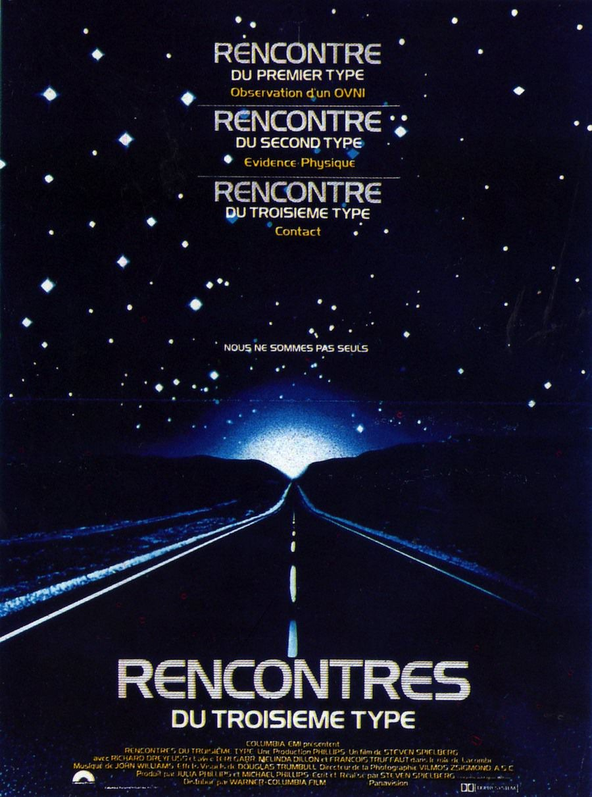
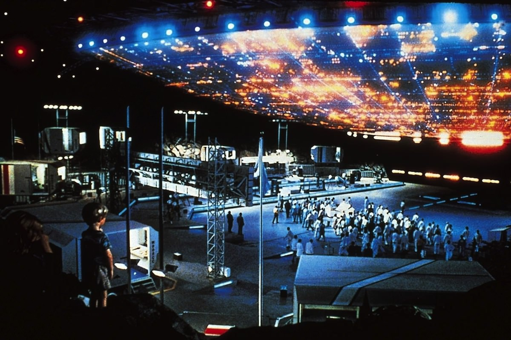
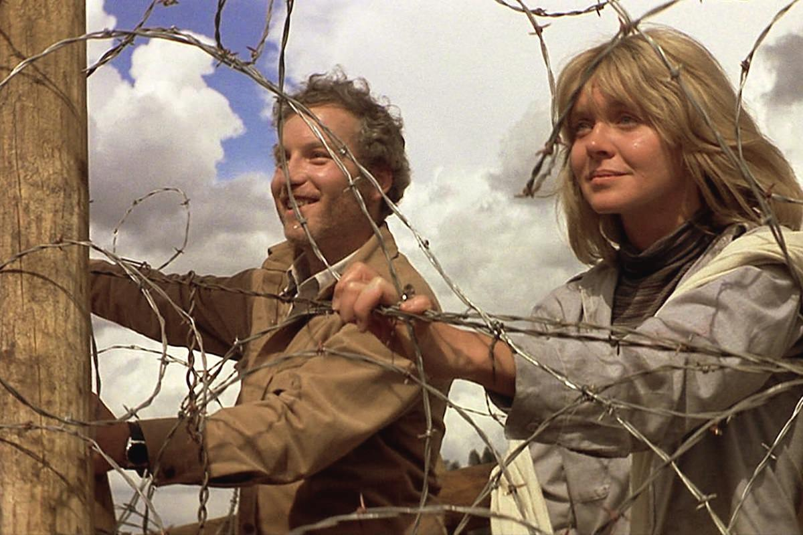

+++
type = "post"
titre = "<em>Rencontres du troisième type</em>, Steven Spielberg"
title = "Rencontres du troisième type, Steven Spielberg"
url = "/rencontres-du-troisieme-type-spielberg"
date = "2013-02-15T23:39:18"
Lastmod = "2014-12-06T15:35:04"
cover = "rencontre-troisieme-type-steven-spielberg.jpg"
categorie = [ "À voir" ]
tag = [ "Aventure", "Blockbuster", "Extra-terrestre", "Science-Fiction" ]
createur = [ "Steven Spielberg" ]
acteur = [ "François Truffaut", "Melinda Dillon", "Richard Dreyfuss", "Teri Garr" ]
annee = [ "1978" ]
weight = 1978
pays = [ "États-Unis" ]
original = "Close Encounters of the Third Kind"

+++

Depuis <a href="http://voiretmanger.fr/les-dents-de-la-mer-spielberg/" title="Les Dents de la Mer, Steven Spielberg"><em>Les Dents de la mer</em></a>, Steven Spielberg est devenu un cinéaste à la fois très connu du grand public et très rentable pour Hollywood. C’est <em>le</em> réalisateur du moment et les studios lui laissent carte blanche pour son prochain film. Changement de style, ce sera de la science-fiction, un genre très en vogue à la fin des années 1970. <em>Rencontres du troisième type</em> ne répond pas opportunément à <a href="http://voiretmanger.fr/2012/06/03/star-wars-episode-4-nouvel-espoir-lucas/" title="Star Wars, Épisode IV : Un nouvel espoir, George Lucas - À voir et à manger"><em>Star Wars, Épisode IV : Un nouvel espoir</em></a> sorti quelques mois auparavant, c’est un vieux projet très personnel du jeune Steven Spielberg qui est remis au goût du jour. Devenu culte, ce long-métrage pose les bases de bon nombre de films de science-fiction à venir avec un scénario construit d’abord et avant tout sur le mystère… Un classique !

On ne verra aucun signe extra-terrestre pendant vingt minutes et il faudra ensuite attendre les quinze dernières minutes de <em>Rencontres du troisième type</em> pour apercevoir un extra-terrestre à proprement parler. Reprenant un principe qui avait payé avec son précédent film, Steven Spielberg construit son œuvre sur l’attente et le mystère. Même si le spectateur sait qu’il s’agit d’êtres venus d’ailleurs et peut ainsi deviner dès les premières minutes de quoi il retourne précisément, le long-métrage ne dit rien et se contente de donner des indices en faisant monter la sauce. <em>Rencontres du troisième type</em> commence ainsi avec une série de vignettes : on découvre des avions disparus depuis la Seconde Guerre mondiale et retrouvés en plein désert mexicain, puis un navire dans le désert de Gobi, avant une étrange manifestation collective en Inde. Peu à peu, un puzzle se forme, des manifestations étranges réunies par une musique et une équipe de chercheurs franco-américains. L’action principale se déroule bien évidemment aux États-Unis et Steven Spielberg poursuit son film avec les premières rencontres entre les humains et les visiteurs de l’espace. Au départ, ces rencontres ne se résument qu’à des manifestations étranges au sol — pannes d’électricité, appareils qui s’activent d’eux-mêmes… — et par des lumières vives, dans le ciel noir. Même quand les OVNIS font leur apparition, le cinéaste prend un grand soin à les masquer derrière des halos lumineux qui entretiennent en permanence le mystère.

Hollywood n’étant pas motivée pour financer un film de science-fiction, Steven Spielberg avait d’abord songé à tourner un film à petit budget qui aurait pris la forme d’un faux documentaire. Pour <em>Rencontres du troisième type</em>, il abandonne totalement cette idée avec une grosse réalisation, de nombreux effets spéciaux pour les vaisseaux spatiaux et de gigantesques décors remplis de nombreux figurants. Un énorme projet donc, mais le cinéaste n’abandonne pas totalement son idée de départ pour autant. En effet, le long-métrage baigne dans une certaine science qui se manifeste dès le titre : la rencontre de troisième type est en fait le niveau le plus élevé dans la <a href="http://fr.wikipedia.org/wiki/Système_de_classification_de_Hynek">classification de Hynek</a> qui établit une hiérarchie des rencontres supposées avec des OVNI. Dans ce type-là, non seulement le témoin a vu un objet volant non identifié, mais il a aussi établi un contact avec ses occupants. Cet indice laissé aux spécialistes en ufologie n’est pas un simple clin d’œil de la part de Spielberg. Le personnage du docteur Claude Lacombe qui mène les recherches avec l’armée américaine est français dans le film pour une raison bien précise : il est inspiré par un ufologue français (et interprété de manière assez surprenante par le très rare François Truffaut). Ainsi, <em>Rencontres du troisième type</em> est né d’une époque où les recherches vers l’espace et une autre forme de vie terrestre se développent et le film se veut assez sérieux, dans les limites du raisonnable pour un tel blockbuster bien évidemment. Exemple significatif de cet état d’esprit : le choix de la musique pour communiquer. Pour son film, Steven Spielberg imagine que les extra-terrestres communiquent avec les humains par une séquence de cinq notes et c’est en reproduisant cette séquence que les hommes parviennent à attirer les OVNI. Une bonne idée sur le plan scénaristique, mais aussi une bonne astuce pour ancrer <em>Rencontres du troisième type</em>. Imaginée par John Williams qui compose toute la musique du film, cette très brève séquence est restée dans les mémoires et utilisée à de nombreuses reprises.

Qui dit film à gros budget dit évidemment personnages émouvants. Steven Spielberg a choisi un père de famille en guise de personnage principal : cette figure récurrente de son cinéma est ici Roy Neary, simple employé du fournisseur d’électricité local qui se trouve justement envoyé en renfort lors d’une gigantesque panne de courant provoquée par les extra-terrestres. La première rencontre entre Roy et un OVNI se fait ce soir-là et c’est aussi la première fois que l’on voit un vaisseau spatial dans <em>Rencontres du troisième type</em>. Pris dans le faisceau lumineux de l’appareil, il devient rapidement asocial et force sa famille qui ne parvient pas à le comprendre à fuir. C’est en essayant de comprendre d’où viennent ces lumières dans la nuit qu’il rencontre Jillian, la mère d’un petit garçon emporté par les extra-terrestres. Les deux deviennent très proches, mais il n’est nullement question d’histoire d’amour ici : contrairement à ce que l’on aurait pu attendre dans un tel film, Steven Spielberg reste très proche de sa ligne originale et il maintient sa structure qui monte en puissance en attendant la rencontre annoncée par le titre. Un choix qui se révèle assez audacieux en comparaison des blockbusters actuels : <em>Rencontres du troisième type</em> est un long-métrage étonnamment calme et vide au regard de nos standards, et ce n’est absolument pas une critique… Le jeune cinéaste sait prendre son temps pour construire une ambiance et le final, assez impressionnant encore aujourd’hui, n’en est que plus réussi.

Les extra-terrestres ont souvent le mauvais rôle au cinéma. Ils sont en général représentés comme des êtres hideux et mauvais dans la culture populaire, ils sont le mal absolu et ils viennent souvent en tant qu’envahisseurs<a href="#footnote_0_8602" id="identifier_0_8602" class="footnote-link footnote-identifier-link" title="On en trouvait encore la preuve tr&egrave;s r&eacute;cemment dans le si banal Battleship.">1</a>. <em>Rencontres du troisième type</em> a une approche toute différente, puisque la visite est ici toute amicale. Steven Spielberg fait le choix d’imaginer des êtres dénués d’intentions belliqueuses et au contraire curieux de notre planète, même si le film se garde judicieusement de trop en dévoiler quant à leurs intentions. On sait juste qu’ils ne viennent pas envahir notre planète, bien que les premiers contacts restent assez effrayants. La bonne idée du film est de laisser planer un doute sur la nature des relations entre les humains et les extra-terrestres : jusqu’à la toute fin, le spectateur ne sait pas ce qui va se passer et les deux hypothèses — celle d’une rencontre pacifique ou d’un envahissement — sont alors tout à fait possibles. <em>Rencontres du troisième type</em> sait ainsi maintenir la pression, d’autant que le rôle actif de l’armée participe à cet état de psychose. Le choix de la paix permet à Steven Spielberg de s’économiser des scènes de bataille pour un résultat plus apaisé, tandis que les effets spéciaux ont été particulièrement travaillés. Le résultat est à la hauteur : même si les effets visuels ont un peu vieilli, l’ensemble reste efficace, même aujourd’hui. Il faut dire que le choix de ne pas mettre en avant les vaisseaux spatiaux ne sert pas qu’à créer l’attente, il permet aussi de ne pas trop les montrer, à une époque où les effets spéciaux créés à l’ordinateur ne sont encore qu’aux balbutiements.

<em>Rencontres du troisième type</em> a été repris dès 1979 dans <em>Moonraker</em>. Dans cet épisode de la saga <em>James Bond</em>, ce n’est qu’un clin d’œil aux notes qui permettent aux humains et aux extra-terrestres de communiquer, mais ce clin d’œil est significatif de l’importance prise par ce long-métrage. Steven Spielberg parvient à créer une œuvre culte, un long-métrage qui pose les bases de nombreuses autres réalisations en matière de science-fiction dans les années à venir. Une belle performance, pour un film encore très efficace et plaisant à ce jour : <em>Rencontres du troisième type</em> mérite d’être vu et revu…

<h3>Vous voulez m’aider ?</h3>
<ul>
<li><a href="http://www.amazon.fr/gp/product/B004BAUD2U/ref=as_li_ss_tl?ie=UTF8&tag=leblogdenic07-21&linkCode=as2&camp=1642&creative=19458&creativeASIN=B004BAUD2U">Acheter le film en Blu-Ray sur Amazon</a></li>
<li><a href="http://www.amazon.fr/gp/product/B000M05W1K/ref=as_li_ss_tl?ie=UTF8&tag=leblogdenic07-21&linkCode=as2&camp=1642&creative=19458&creativeASIN=B000M05W1K">Acheter le film en DVD sur Amazon</a></li>
<li><a href="https://itunes.apple.com/fr/movie/rencontre-du-troisieme-type/id491657342">Acheter ou louer le film sur l’iTunes Store</a></li>
</ul>

<ol class="footnotes"><li id="footnote_0_8602" class="footnote">On en trouvait encore la preuve très récemment dans le si banal <a href="http://voiretmanger.fr/2012/04/14/battleship-berg/" title="Battleship, Peter Berg - À voir et à manger"><em>Battleship</em></a>. [<a href="#identifier_0_8602" class="footnote-link footnote-back-link">&#8617;</a>]</li></ol>
