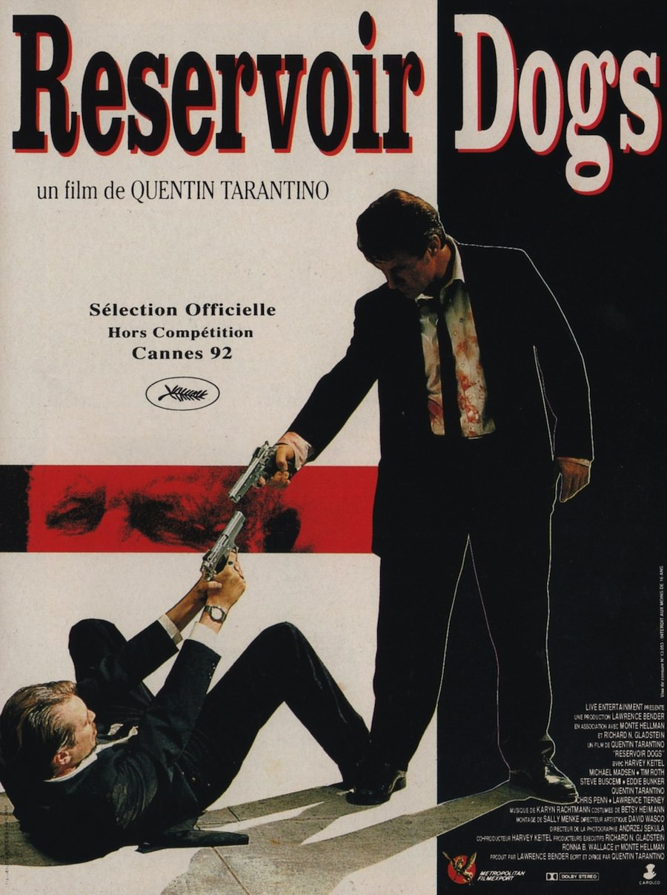
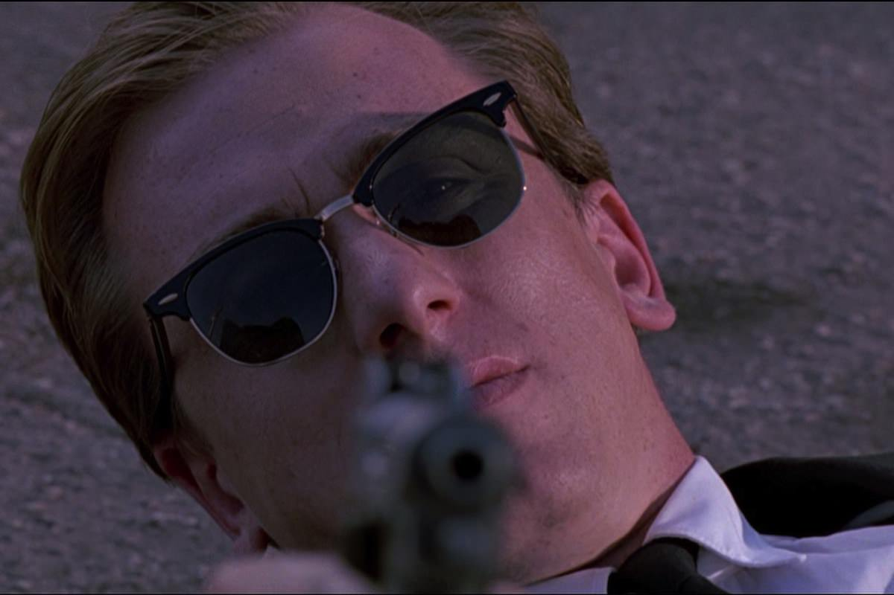
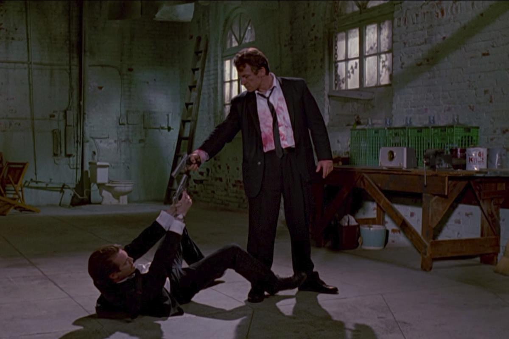

+++
type = "post"
titre = "<em>Reservoir Dogs</em>, Quentin Tarantino"
title = "Reservoir Dogs, Quentin Tarantino"
url = "/reservoir-dogs-tarantino"
date = "2013-01-16T15:55:14"
Lastmod = "2014-02-18T14:36:29"
cover = "reservoir-dogs-quentin-tarantino.jpg"
categorie = [ "À voir" ]
tag = [ "Film de gangsters", "Mafia", "Police", "Société", "Thriller", "Violence" ]
createur = [ "Quentin Tarantino" ]
acteur = [ "Chris Penn", "Harvey Keitel", "Michael Madsen", "Tim Roth" ]
annee = [ "1992" ]
weight = 1992
pays = [ "États-Unis" ]

+++

Le premier film d’un cinéaste est toujours un élément important et intéressant d’une œuvre. Avec <em>Reservoir Dogs</em>, Quentin Tarantino impose son univers et son style : tout est là, ou presque, des dialogues fournis et toujours savoureux à la violence qui éclate brutalement, en passant encore par l’univers des malfrats ou encore un scénario déconstruit. Un premier film fauché, mais qui n’est pas honteux, bien au contraire même : pour un premier essai, <em>Reservoir Dogs</em> est un petit thriller réussi et prenant à (re)découvrir !

<em>Reservoir Dogs</em> ouvre dans un restaurant, sur une table où se tiennent huit hommes en costume. Ils discutent de tout et de rien, d’une chanson de Madonna ou encore du pourboire qu’il convient de donner à la serveuse. Une première scène qui permet d’introduire tous les personnages du film, mais aussi de donner le ton avec un dialogue sans queue ni tête, qui semble partir dans tous les sens, mais qui est en fait parfaitement maîtrisé. Sans autre forme de procès, on retrouve deux d’entre eux — ils se font appeler Mr. White et Mr. Orange — dans une voiture. Ils sont manifestement en fuite et Quentin Tarantino ne prend pas la peine de trop en dire, mais on comprend à travers leur conversation hachée qu’un cambriolage s’est mal passé. Ces deux hommes visaient, avec les six autres que l’on a pu découvrir précédemment, une bijouterie, mais la police les attendait dès le départ. Une seule question se pose alors : quelle est la taupe qui les a trahis en prévenant les forces de l’ordre qui ne devaient pas arriver sur place aussi rapidement ? 

C’est à partir de cette situation extrêmement classique que Quentin Tarantino construit son premier film. On l’a compris, <em>Reservoir Dogs</em> surprend d’abord par sa structure : commençant avec une anodine conversation au restaurant, il se poursuit avec la fin d’un braquage raté. Le plan n’a pas pu être suivi, puisque la police l’a interrompu dès le départ en intervenant dans les premières minutes. Commence alors une débandade que le cinéaste transcrit par bribes, à travers les conversations essentiellement. Le braquage devrait être au cœur de <em>Reservoir Dogs</em>, mais c’est bien simple : on ne le voit jamais, on ne voit même pas le lieu du braquage, encore moins l’action. Le film évoque sa préparation et surtout ses conséquences, mais jamais l’acte lui-même. Si cette absence trouve d’abord une justification budgétaire — <em>Reservoir Dogs</em> est un film indépendant et fauché —, elle constitue aussi une brillante idée de scénario. Loin d’affaiblir le récit des malfrats, cette absence lui offre une présence encore plus vive et permet d’imaginer ce qui s’est passé. N’ayant pas vu le braquage, on ne sait pas vraiment ce qui s’est passé, même si le film finit par donner quelques informations précises par la suite. Pendant longtemps, la seule vision que l’on peut avoir des faits est celle donnée par les dialogues, une excellente idée de <em>Reservoir Dogs</em> incontestablement.

Par restrictions budgétaires aussi, Quentin Tarantino a limité le nombre de décors et ils se limitent, nonobstant le restaurant initial, essentiellement à deux lieux. Dans <em>Reservoir Dogs</em>, l’action se déroule essentiellement dans la planque des malfrats, un ancien garage où les cinq malfaiteurs présents à la bijouterie doivent se retrouver après les faits. À la manière d’une scène de théâtre, les personnages entrent et sortent dans ce lieu au fil du récit, dans un ballet incessant qui est l’occasion de plusieurs scènes entre deux ou trois personnages. On y trouve d’abord Mr. White et Mr. Orange, bien vite rejoints par un Mr. Pink hystérique qui cherche à savoir qui les a dénoncés. Par la suite, on retrouvera les organisateurs du coup, Mr. Blonde qui a ouvert le feu et tiré sur tout ce qui bouge dans la bijouterie. Certains n’ont pas eu autant de chance et sont morts sur place et ce choix du lieu unique permet à Quentin Tarantino de maintenir le suspense d’un bout à l’autre. Pour cela, il lui fallait un bon scénario, mais aussi de bons acteurs et la galerie qu’il rassemble pour <em>Réservoir Dogs</em> est excellente. En tête d’affiche, Harvey Keitel en impose dans son rôle de malfrat, mais tous les acteurs sont très bons, à commencer par un Tim Roth parfait en victime ensanglantée. 

Tous les films de Quentin Tarantino sont marqués par un même style et par une même ambiance et cette première réalisation, déjà, respecte cette règle. Dès les premières minutes, le cinéaste impose son univers dans <em>Reservoir Dogs</em> qui, s’il n’atteint pas le degré de perfectionnement des suivants, propose déjà un surprenant condensé du travail de Tarantino. La manière de filmer les conversations avec une caméra toujours mobile, leur place dans le long-métrage et surtout leur durée, les jeux avec la chronologie — ici des flashbacks qui auraient été inspirés par l&rsquo;<a href="http://voiretmanger.fr/2011/05/15/ultime-razzia-kubrick/" title="L'Ultime Razzia, Stanley Kubrick - À voir et à manger"><em>L&rsquo;Ultime Razzia</em></a> de Stanley Kubrick —, les multiples références aux films préférés du cinéaste, mais aussi une violence assez crue et l’utilisation de termes vulgaires, voilà autant d’éléments caractéristiques que l’on retrouve dans toute la filmographie de Quentin Tarantino et que l’on retrouve aussi ici. <em>Reservoir Dogs</em> est fascinant à cet égard : il est rare d’avoir un premier film aussi cohérent avec le reste de l’œuvre de son réalisateur. Au passage, on note aussi ses excellents choix musicaux, avec un assemblage très réussi de morceaux souvent méconnus de la musique américaine des années 1960 et 1970, là encore ces choix deviendront une marque de fabrique du cinéaste.

Premier film relativement fauché — un million de dollars, ce n’est pas rien —, <em>Reservoir Dogs</em> n’est en rien un film au rabais. C’est même un excellent Quentin Tarantino, construit exclusivement autour d’un braquage raté, mais jamais sur cet évènement. Les dialogues sont extrêmement bien écrits, les flashbacks sont réussis et permettent de comprendre sans trop en dire la situation… bref <em>Reservoir Dogs</em> est un excellent film, à (re)découvrir !

<h3>Vous voulez m’aider ?<a href="#footnote_0_8353" id="identifier_0_8353" class="footnote-link footnote-identifier-link" title="&Agrave; propos de la publicit&eacute;&hellip;">1</a></h3>
<ul>
<li><a href="http://www.amazon.fr/gp/product/B002UMCWES/ref=as_li_ss_tl?ie=UTF8&tag=leblogdenic07-21&linkCode=as2&camp=1642&creative=19458&creativeASIN=B002UMCWES">Acheter le film en Blu-Ray sur Amazon</a></li>
<li><a href="http://www.amazon.fr/gp/product/B00748JKIE/ref=as_li_ss_tl?ie=UTF8&tag=leblogdenic07-21&linkCode=as2&camp=1642&creative=19458&creativeASIN=B00748JKIE">Acheter le film en DVD sur Amazon</a></li>
<li><a href="https://itunes.apple.com/fr/movie/reservoir-dogs-vost/id481499429">Acheter ou louer le film sur l’iTunes Store</a></li>
</ul>

<ol class="footnotes"><li id="footnote_0_8353" class="footnote"><a href="http://voiretmanger.fr/soutien/">À propos de la publicité…</a> [<a href="#identifier_0_8353" class="footnote-link footnote-back-link">&#8617;</a>]</li></ol>
