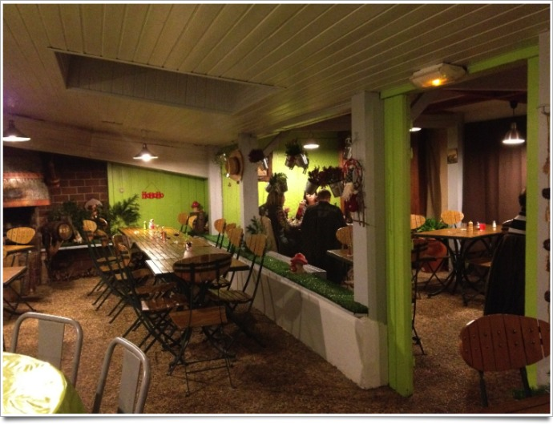
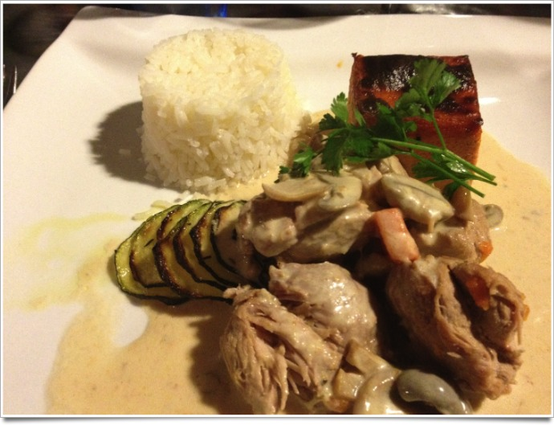
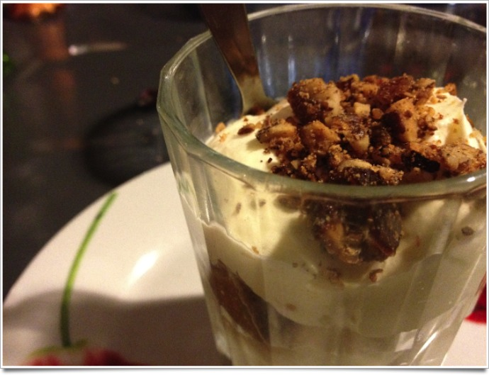

+++
type = "post"
titre = "Restaurant Campagne, Lyon"
title = "Restaurant Campagne, Lyon"
url = "/restaurant-campagne-lyon"
date = "2011-12-11T13:04:28"
Lastmod = "2012-01-31T19:49:46"
cover = "restaurant-campagne-lyon.jpg"
categorie = [ "À manger" ]
tag = [ "À manger", "Cuisine française" ]

+++

Rarement devanture aura été si trompeuse. Le <strong><a href="http://www.restaurant-campagne-lyon.com/">Restaurant Campagne</a></strong> situé sur les hauteurs de Lyon, derrière le quartier de Saint-Just, ne fait pas envie à la première approche. Le quartier, essentiellement résidentiel, se vide rapidement à la tombée de la nuit et la façade est, disons, à l&rsquo;abandon. La peinture défraichie, les rideaux un peu sales aux fenêtres… on se demande bien où l&rsquo;on va manger quand on arrive. Mais de la même manière qu&rsquo;il ne faut pas juger un livre à sa couverture, il ne faut pas s&rsquo;arrêter à la devanture et oser entrer dans le <strong>Restaurant Campagne</strong>.

Un univers étonnant s&rsquo;ouvre alors : le restaurant s&rsquo;est greffé à l&rsquo;ancien bar qui existait à l&rsquo;origine. Les anciens terrains de boule ont cédé la place à une salle de restaurant en partie couverte et en partie extérieure. L&rsquo;ensemble est fait de bric et de broc, mais l&rsquo;ambiance chaleureuse du restaurant séduit immédiatement. Il faut dire que nous étions nombreux, ce samedi soir-là, dans le <strong>Restaurant Campagne</strong>. Le bouche à oreilles doit manifestement compenser l&rsquo;isolement du lieu et la salle était bien pleine, surtout composée de groupes d&rsquo;adultes, mais avec également quelques couples. Un cadre très agréable qui tranche avec l&rsquo;entrée, même si un défaut technique s&rsquo;avère assez pénible : toute la salle est en pente, ce qui n&rsquo;est pas très agréable pour manger. Un bon point toutefois sur l&rsquo;acoustique, étonnamment bonne dans ce lieu pourtant vaste.

La carte du <strong>Restaurant Campagne</strong> propose une cuisine d&rsquo;inspiration campagnarde, mais modernisée. On y retrouve des classiques, comme un pavé de bœuf au foie gras qui devrait régaler les amateurs, mais aussi quelques plats plus originaux. Cette entrée composée de fromage de brousse et de dès de courgette crue s&rsquo;est avérée ainsi extrêmement plaisante. Dans le pot en verre qui lui servait de contenant, on trouvait également un peu de confiture de figue sur les bords ; sur l&rsquo;ardoise qui complétait l&rsquo;ensemble, un peu de crème de pain d&rsquo;épices qui vient relever de tout de manière surprenante. Tous les plats proposés sont assez simples, mais très efficaces. Le sot-l&rsquo;y-laisse de volaille évoque une blanquette de veau, mais avec une viande extrêmement tendre et très bonne. On trouve peu de poisson sur cette carte, mais différentes viandes toujours cuisinées avec goût. Les accompagnes sont également réussis : quelques courgettes cuisinées simplement façon tian et surtout un flan de légumes vraiment très bon. Les desserts sont également assez conventionnels, mais bons : le tiramisu que j&rsquo;ai choisi était très efficace même si le rhum annoncé dans le nom du plat s&rsquo;est révélé bien trop discret. On trouvera aussi un assortiment de tartes et autres desserts bien peu légers, mais goûteux.

Excellente surprise que ce <strong>Restaurant Campagne</strong> ! Excentré par rapport aux autres restaurants lyonnais, il ne paye pas de mine, mais constitue une excellente adresse. La cuisine est simple, mais efficace et elle n&rsquo;est pas simpliste. Quelques touches modernes lui ajoutent un peu de dynamisme pour un résultat vraiment plaisant. Une adresse à retenir pour sortir des bouchons lyonnais, le tout pour un prix très modeste (compter une trentaine d&rsquo;euros par personne, sans le vin bien sûr).

