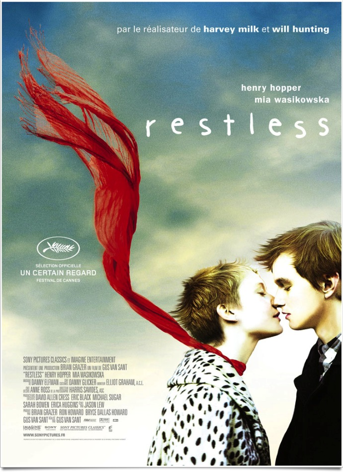
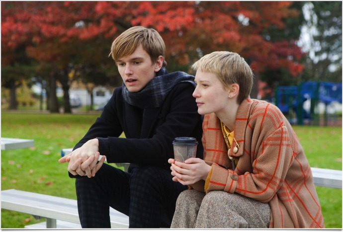

+++
type = "post"
titre = "Restless, Gus Van Sant"
title = "Restless, Gus Van Sant"
url = "/restless-van-sant"
date = "2011-09-29T23:26:32"
Lastmod = "2011-09-29T23:31:19"
cover = "restless.jpg"
categorie = [ "À voir" ]
tag = [ "Adolescence", "Amour", "Drame", "Maladie", "Mort", "Vite oublié" ]
acteur = [ "Henry Hooper", "Mia Wasikowska" ]
annee = [ "2011" ]
weight = 2011
pays = [ "États-Unis" ]

+++

Le dernier film de Gus Van Sant ne promettait pas d&rsquo;être très plaisant : <em>Restless</em> raconte les derniers jours d&rsquo;une jeune fille atteinte d&rsquo;un cancer incurable et de son histoire d&rsquo;amour avec un garçon qui peine à se remettre de la mort de ses parents. Belle histoire sur le papier, mais qui ne donne rien de passionnant à l&rsquo;écran. <em>Restless</em> est un film que l&rsquo;on oubliera vite, une bluette adolescente qui peine à apporter de la crédibilité à son sujet pourtant bien sérieux. Dommage…

Enoch a survécu au tragique accident de la route qui a causé la mort de ses deux parents. Après quelques minutes entre la vie et la mort et trois mois dans le coma, il est hébergé par la seule famille qui lui reste, une tante, mais cet accident l&rsquo;a profondément marqué. Il préfère la compagnie d&rsquo;un fantôme, un pilote japonais mort dans un porte-avion américain pendant la guerre, à celle des vivants et il a envoyé à l&rsquo;hôpital un camarade de classe qui s&rsquo;était moqué de ses parents. Annabel quant à elle est atteinte d&rsquo;un cancer cérébral. Un examen montre qu&rsquo;elle ne pourra y survivre et qu&rsquo;elle n&rsquo;en a plus que pour quelques mois. C&rsquo;est alors qu&rsquo;elle rencontre Enoch et le coup de foudre entre les deux adolescents est immédiat. <em>Restless</em> est le récit de cette histoire aussi brève que forte, du premier regard au cours d&rsquo;un enterrement à l&rsquo;enterrement d&rsquo;Annabel. Un récit qui devrait être poignant, mais qui manque cruellement d&rsquo;émotions. Gus Van Sant tente de toutes ses forces de les provoquer, mais son film évoque plus la collection de clichés sur les rapports complexes que bon nombre d&rsquo;adolescents peuvent éprouver face à la mort. Pendant tout le film, on peine à croire à la mort prochaine d&rsquo;Annabel et on croirait voir deux jeunes qui flirtent avec le gothique pour protester contre leurs parents.

Si l&rsquo;émotion attendue n&rsquo;est pas au rendez-vous dans <em>Restless</em>, c&rsquo;est certainement parce qu&rsquo;elle beaucoup trop appuyée et soulignée par Gus Van Sant. Alors qu&rsquo;il avait fait preuve de tant de simplicité, pour ne pas dire de sécheresse dans <em><a href="http://voiretmanger.fr/2011/06/06/elephant-van-sant/">Elephant</a></em> et surtout <em>Last Days</em>, le cinéaste en fait ici des tonnes. La musique est omniprésente et a parfois tendance à écraser les deux personnages et le film. L&rsquo;image, quoique parfois très belle, rappelle trop certaines publicités pour des parfums : elle est propre, presque lisse et parvient souvent à rendre l&rsquo;histoire ridicule. Les deux acteurs et leurs personnages sont mignons, leur histoire est mignonne et <em>Restless</em> est globalement un film mignon… Mignon, c&rsquo;est peut-être l&rsquo;adjectif qui caractérise mieux le film et ce n&rsquo;est pas vraiment un compliment. <em>Restless</em> manque d&rsquo;épaisseur dans tous les domaines : on ne croit ni à l&rsquo;amour des deux jeunes, ni même, un comble, à la maladie de la jeune fille. On voit à un moment un IRM, quelques couloirs d&rsquo;hôpital et des blouses de malade, mais c&rsquo;est à peu près tout et c&rsquo;est finalement peu. Sur le même sujet, un film comme <em><a href="http://voiretmanger.fr/2010/12/14/oxygene-van-nuffel/">Oxygène</a></em> est beaucoup plus fort et intéressant en montrant aussi les ravages de la maladie sur les corps.

Gus Van Sant prend manifestement un malin plaisir à brouiller les cartes. Après une série de films très marqués sur le plan formel, de <em>Gerry</em> à <em>Paranoid Park</em>, le cinéaste a changé radicalement avec <em><a href="http://voiretmanger.fr/2009/03/07/harvey-milk-gus-van-sant/">Harvey Milk</a></em>, un biopic bien trop classique pour intéresser au-delà de son histoire. Avec <em>Restless</em>, le réalisateur va encore ailleurs. On retrouve certains éléments typiques de son cinéma, certes, à commencer par ces deux adolescents hors du monde, semblables à ceux d&rsquo;<em>Elephant</em> ou de <em>Paranoid Park</em>. La comparaison s&rsquo;arrête là et Gus Van Sant semble même tout faire pour s&rsquo;éloigner de son propre cinéma avec un film beaucoup plus léger. Idée honorable et après tout on ne devrait pas juger <em>Restless</em> en fonction des films précédents, mais la déception est inévitable en ce qui me concerne. Le flou narratif d&rsquo;<em>Elephant</em> et compagnie me manque, le trop-plein d&rsquo;émotions créées à tout prix par l&rsquo;image et le son conduit au contraire à un manque d&rsquo;émotions et ce film m&rsquo;a semblé… sans intérêt, tout simplement.

Une nouvelle fois, Gus Van Sant m&rsquo;a déçu parce que j&rsquo;attendais un travail dans la veine d&rsquo;<em>Elephant</em> ou <em>Paranoid Park</em> et parce que le cinéaste est parti vers d&rsquo;autres horizons cinématographiques. Aurais-je mieux apprécié <em>Restless</em> s&rsquo;il n&rsquo;avait pas été réalisé par ce cinéaste ? Peut-être, mais j&rsquo;en doute : ce film ne m&rsquo;intéresse pas, et je me désole que le Gus Van Sant des années 2010 soit si différent de celui des années 2000… En attendant de voir ce que le suivant film donnera, celui-ci sera vite oublié.

