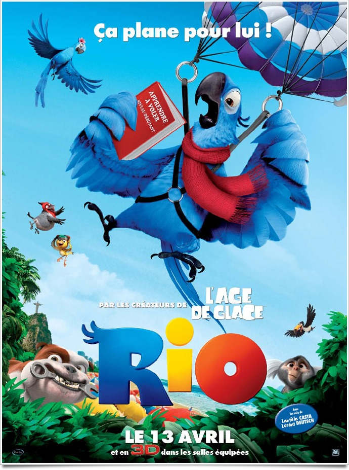
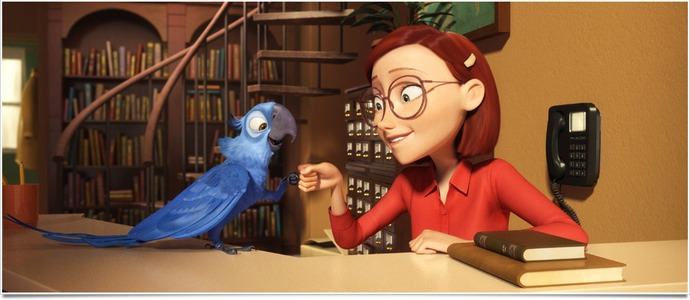
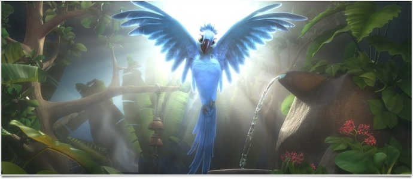

+++
type = "post"
titre = "Rio, Carlos Saldanha"
title = "Rio, Carlos Saldanha"
url = "/rio-saldanha"
date = "2011-04-18T00:02:57"
Lastmod = "2013-02-09T15:33:36"
cover = "rio-carlos-saldanha.jpg"
categorie = [ "À voir" ]
tag = [ "Amour", "Animation", "Blockbuster", "Vite oublié" ]
createur = [ "Carlos Saldanha" ]
annee = [ "2011" ]
weight = 2011
pays = [ "Brésil", "États-Unis" ]

+++

&laquo;&nbsp;Par les créateurs de <em>L&rsquo;Âge de Glace</em>&laquo;&nbsp;. Procédé classique, mais efficace il faut bien l&rsquo;avouer, pour attirer l&rsquo;œil sur cet énième film d&rsquo;animation. Vérifications faites, Carlos Saldanha a réalisé ou co-réalisé la célèbre trilogie qui, en son temps, avait changé la façon de concevoir l&rsquo;animation pour enfant en la modernisant. Mais la série a mal vieilli tandis qu&rsquo;elle donnait naissance à une infinité de films d&rsquo;animation reprenant toujours la même recette. <em>Rio</em> appartient clairement à cette tendance, et ce n&rsquo;est pas vraiment un compliment. C&rsquo;est un film taillé pour un public jeune manifestement jugé incapable de comprendre autre chose qu&rsquo;une romance mignonne, mais tellement téléphonée. Résultat, les enfants s&rsquo;amusent, les grands s&rsquo;ennuient un peu…

On prend (encore) les mêmes et on recommence. Sur le fond, on ne trouve pas tant de différences entre <em>Rio</em> et <em>L&rsquo;Âge de Glace</em> : l&rsquo;histoire de Blu, ce perroquet bleu, dernier représentant mâle de son espèce, en quête de l&rsquo;amour à Rio de Janeiro, son pays natal, n&rsquo;a rien d&rsquo;original. Comme on peut s&rsquo;y attendre dès la lecture du synopsis, le dernier film de Carlos Saldanha est une quête initiatrice comme on en a vu tant. Au départ, Blu est un oiseau domestique qui ne sait ni voler, ni survivre en environnement hostile, mais qui sait faire fonctionner un grille-pain, qui se lave les dents et qui fait des câlins avec sa maîtresse. Bref, un parfait animal de compagnie, parfaitement inadapté à son environnement naturel qu&rsquo;il va devoir brutalement fréquenter. L&rsquo;intrigue de <em>Rio</em> est simple : l&rsquo;espèce de Blu est menacée, il ne reste que lui et une femelle qu&rsquo;il va rencontrer au Brésil pour tenter de perpétuer son espèce. Bien entendu, rien ne va se dérouler selon ce plan et les deux tourtereaux bien malgré eux vont devoir affronter de terribles dangers et éviter les contrebandiers qui volent les espèces protégées pour les revendre une fortune en Occident.

La perpétuation de l&rsquo;espèce ne saurait faire l&rsquo;objet d&rsquo;un document dans un film d&rsquo;animation grand public et destiné avant tout aux enfants. <em>Rio</em> est donc d&rsquo;abord une histoire d&rsquo;amour entre deux oiseaux, un amour très anthropomorphique pour parler au plus large public. La quête initiatrice du jeune Blu passe ainsi par la découverte de l&rsquo;amour en parallèle de la découverte de son environnement naturel. Autant le dire, l&rsquo;amour est ici cousu de fil blanc : on sait d&rsquo;emblée que le couple se formera à la fin, mais que les deux tourtereaux vont se chamailler pendant tout le reste du film. Cela ne loupe pas dans <em>Rio</em> qui réunit de force les deux oiseaux alors que seul un des deux vole. Cette astuce scénaristique offre de nombreuses opportunités pour des gags visuels peu élaborés, mais relativement efficaces. On sourit plus qu&rsquo;on ne rigole dans <em>Rio</em>, même si quelques gags sont plutôt bien vus, quoique souvent trop systématiques (la transformation d&rsquo;un personnage supposé dangereux et viril en danseur un peu efféminé est amusante une fois, pas quatre).

Finalement, le principal problème de <em>Rio</em> est qu&rsquo;il arrive après tous les autres. Le film se contente de recycler des idées déjà vues des dizaines de fois ailleurs et il faut le dire, une certaine lassitude sera ressentie par tous ceux qui ont vu des films d&rsquo;animation ces dix dernières années. Tout est là, le couple qui se chamaille puis forme une famille, les vilains méchants très méchants, mais un peu bêtas, qui sont finalement condamnés, le happy-end dégoulinant et familial, les personnages secondaires censés servir de caution comique et même les chansons. Ces dernières posent un vrai problème, au moins en version française. Si elles tiennent la route musicalement, les paroles niaises les desservent complètement. C&rsquo;est en fait un problème plus général dans <em>Rio</em> : le film est d&rsquo;abord pensé pour les enfants et il est animé d&rsquo;une conception assez rétrograde de ce qui plait aux enfants. On reste ainsi dans le premier degré constant (alors que le second degré était une force de <em>L&rsquo;Âge de Glace</em>) et dans l&rsquo;humour simple, pour ne pas dire simpliste.

Le palmarès n&rsquo;est pas très positif pour <em>Rio</em>, mais le film se rattrape toutefois sur le plan visuel. La technique est indéniablement au point, même si on n&rsquo;atteint pas le niveau des plus gros studios Pixar ou Dreamworks, mais l&rsquo;animation est très fluide et s&rsquo;oublie vite, tandis que le Rio reconstitué est assez réussi, même s&rsquo;il accumule les clichés de carte postale. Au-delà de la technique pure, on apprécie l&rsquo;explosion de couleurs proposée par le film, avec un côté exotique qui fonctionne plutôt bien. Le carnaval était attendu, mais il est bien intégré au film et offre quelques séquences bien menées, à défaut d&rsquo;être originales. Comme tout film d&rsquo;animation moderne, la 3D est au rendez-vous et on sent que <em>Rio</em> a été pensé pour cette technique. Elle reste confinée au gadget, mais elle s&rsquo;avère plutôt efficace et ne gêne pas le film outre mesure.

Dans le cinéma d&rsquo;animation pour enfants, deux écoles semblent s&rsquo;affronter. D&rsquo;un côté, il y a les partisans des animaux qui parlent, suivant là une vieille tradition qui remonte, pour l&rsquo;animation au moins, à quelques grands classiques de Walt Disney. De l&rsquo;autre, il y a ceux qui estiment que les enfants n&rsquo;ont pas besoin d&rsquo;animaux qui parlent et que l&rsquo;on peut faire rêver avec autre chose, comme des jouets ou un petit robot rouillé. Les studios Blue Sky continuent de parier sur les animaux parlant, mais <em>Rio</em> prouve bien que ce n&rsquo;est pas une bonne idée. L&rsquo;histoire fonctionne bien sûr, mais faire parler des animaux ne suffit pas et le scénario est vraiment trop pauvre dans ce film d&rsquo;animation, et c&rsquo;est bien dommage. Le film n&rsquo;est pas déplaisant pour autant, non, mais il est insipide et oublié dès la sortie du cinéma. Cela conviendra pour un cinéma en famille, mais c&rsquo;est à peu près tout.

<h3>Vous voulez m&rsquo;aider ?<a href="#footnote_0_4739" id="identifier_0_4739" class="footnote-link footnote-identifier-link" title="&Agrave; propos de la publicit&eacute;&hellip;">1</a></h3>
<ul>
<li><a href="http://www.amazon.fr/gp/product/B004UPIDGY/ref=as_li_ss_tl?ie=UTF8&tag=leblogdenic07-21&linkCode=as2&camp=1642&creative=19458&creativeASIN=B004UPIDGY">Acheter le film en Blu-Ray sur Amazon</a></li>
<li><a href="http://www.amazon.fr/gp/product/B004UPIDDC/ref=as_li_ss_tl?ie=UTF8&tag=leblogdenic07-21&linkCode=as2&camp=1642&creative=19458&creativeASIN=B004UPIDDC">Acheter le film en DVD sur Amazon</a></li>
<li><a href="http://itunes.apple.com/fr/movie/rio-2011/id438417222">Acheter le film sur l&rsquo;iTunes Store</a></li>
</ul>

<ol class="footnotes"><li id="footnote_0_4739" class="footnote"><a href="http://voiretmanger.fr/soutien/">À propos de la publicité…</a> [<a href="#identifier_0_4739" class="footnote-link footnote-back-link">&#8617;</a>]</li></ol>
