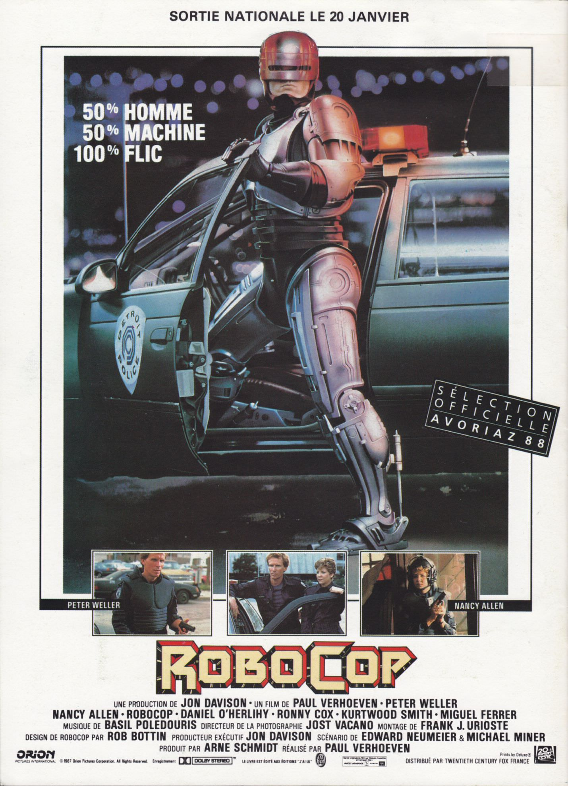
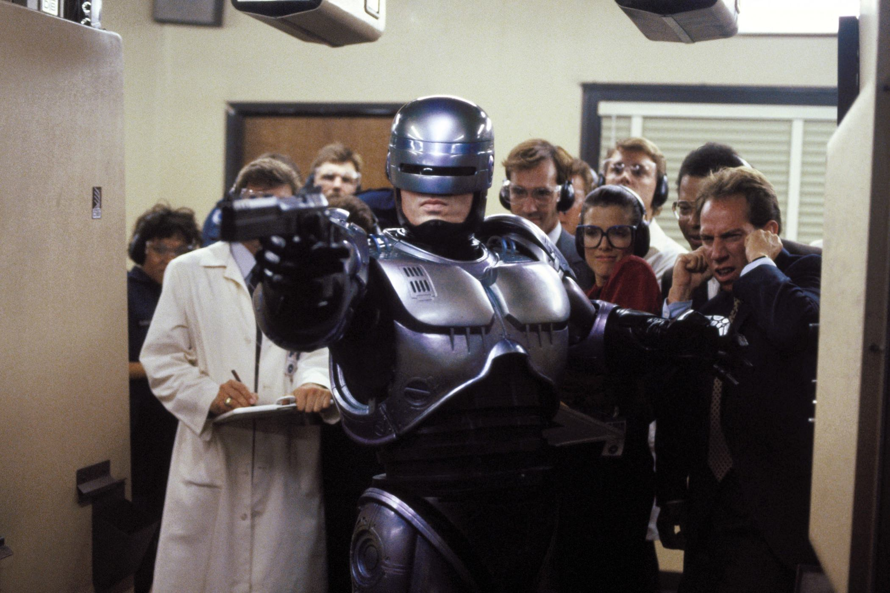
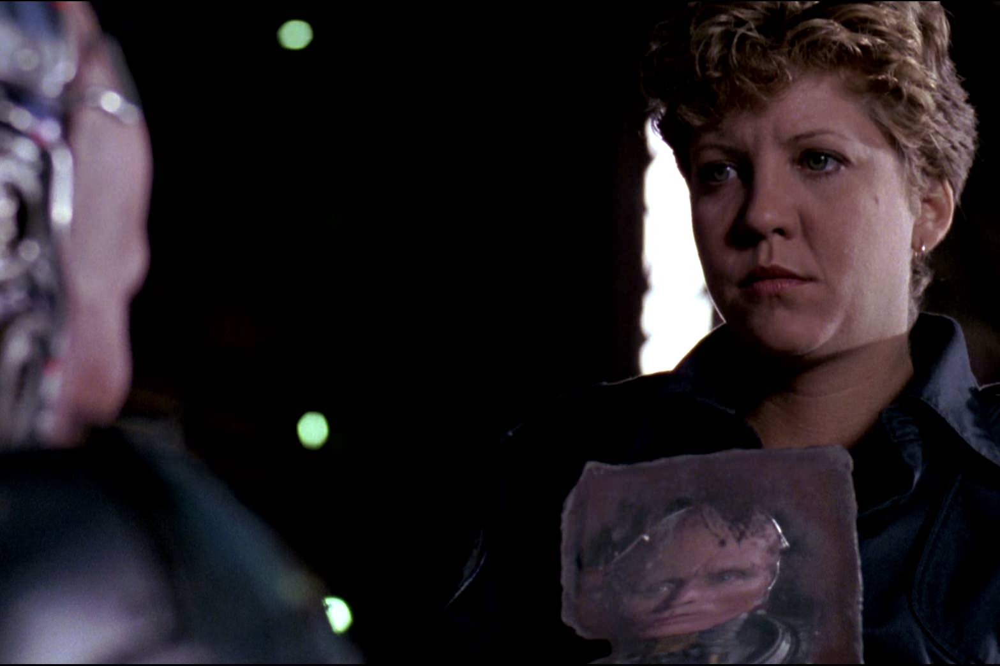

+++
type = "post"
titre = "<em>RoboCop</em>, Paul Verhoeven"
title = "RoboCop, Paul Verhoeven"
url = "/robocop-verhoeven"
date = "2014-09-13T12:23:47"
Lastmod = "2014-09-13T12:31:55"
cover = "robocop-paul-verhoeven.jpg"
categorie = [ "À voir" ]
tag = [ "Action", "Blockbuster", "Capitalisme", "Crise", "Dystopie", "Police", "Robot", "Science-Fiction", "Société" ]
createur = [ "Paul Verhoeven" ]
acteur = [ "Nancy Allen", "Peter Weller", "Ronny Cox" ]
annee = [ "1987" ]
weight = 1987
saga = [ "RoboCop" ]
pays = [ "États-Unis" ]

+++

<em>RoboCop</em> a imaginé un personnage qui est entré dans l&rsquo;imaginaire collectif, à tel point que l&rsquo;on pourrait oublier que c&rsquo;est ce film de 1987 qui en est le créateur. Pourtant, s&rsquo;il s&rsquo;est inspiré d&rsquo;autres personnages existant auparavant, c&rsquo;est bien le premier long-métrage américain de Paul Verhoeven qui imagine ce policier à moitié humain et à moitié robot. Une belle idée pour un film de science-fiction construit comme une dystopie extrêmement critique de la société américaine de la fin des années 1980. Près de trente ans après, <em>RoboCop</em> souffre naturellement un peu du poids des années, mais Paul Verhoeven a vu juste en dépeignant une société qui est loin de nous être étrangère aujourd&rsquo;hui. Un blockbuster étonnamment violent au regard des standards actuels, un classique à (re)découvrir…

Détroit, 2030. Même si son film se déroule dans un futur assez éloigné à sa sortie, Paul Verhoeven ne veut pas faire un film de science-fiction trop futuriste, si bien que les éléments de décalage avec l&rsquo;actualité de la deuxième moitié des années 1980 restent très discrets. <em>RoboCop</em> ouvre ainsi sur une séquence de journal télévisé qui semble bien daté à nos yeux de spectateurs contemporains. C&rsquo;était certainement l&rsquo;intention : à l&rsquo;époque, ce JT devait ressembler à tous ceux que les spectateurs d&rsquo;alors avaient l&rsquo;habitude de voir, mais avec une différence majeure. Entre deux sujets sérieux, une publicité est diffusée sans intermédiaire, sans même prévenir que l&rsquo;on n&rsquo;est plus dans l&rsquo;actualité. Au passage, cette séquence sert d&rsquo;introduction à un monde où la violence domine la planète toute entière, mais ce n&rsquo;est pas son but premier. Avec cette publicité intégrée au milieu du journal, Paul Verhoeven porte d&rsquo;emblée un coup contre la télévision américaine, et plus largement une société dominée par de grosses entreprises capitalistes qui n&rsquo;ont d&rsquo;autres ambitions que faire de l&rsquo;argent partout, à n&rsquo;importe quel prix. À ce titre, <em>RoboCop</em> est un pamphlet contre une société dirigée exclusivement par l&rsquo;argent et avant d&rsquo;être une histoire de robots ou même de polices, le cinéaste marque son rejet du capitalisme à tout prix. Dans cet univers, la police de Détroit est contrôlée par une société privée qui cherche à faire de ce service en théorie public, une manne financière. Une séquence à faire froid dans le dos présente une réunion des dirigeants de cette entreprise pendant laquelle ils discutent de leur prochain produit pour contrôler les rues de la ville, une sorte d&rsquo;immense robot capable de faire la loi seul. La démonstration tourne mal et le robot tue de plusieurs dizaines de balles le malheureux qui devait permettre la présentation. Une mort terrifiante, soulignée par les litres d&rsquo;hémoglobine que Paul Verhoeven s&rsquo;amuse à faire dégouliner, mais qui laisse tout le monde dans la pièce indifférent. À peine un personnage aura un mot futile pour regretter la mort d&rsquo;untel, mais c&rsquo;est tout : cette erreur ne compte que parce qu&rsquo;elle fera perdre de l&rsquo;argent à l&rsquo;entreprise.

C&rsquo;est précisément parce que cette première tentative échoue que l&rsquo;entreprise lance son plan B : le projet RoboCop. Profitant de la mort d&rsquo;un policier tué de multiples balles par la mafia, ils conçoivent une machine partiellement humaine qui est beaucoup plus résistante qu&rsquo;un homme, beaucoup plus forte aussi, qui n&rsquo;a pas besoin de s&rsquo;arrêter pour manger ou dormir et surtout qui n&rsquo;est pas contrôlé par des émotions futiles. Bref, un policier parfait : le personnage principal de <em>RoboCop</em> est né. Paul Verhoeven est très astucieux en mettant en scène cette naissance, non pas du point de vue du créateur, mais de l&rsquo;être créé pour l&rsquo;occasion. Après la mort du policier, Murphy, que l&rsquo;on venait juste de découvrir, on a une séquence où l&rsquo;on voit comme le robot en cours de création et on comprend ainsi ce qui se passe, sans le voir. L&rsquo;idée est très bien trouvée, autant pour simplifier la mise en scène et réduire les coûts de production, que pour augmenter l&rsquo;impatience du spectateur et susciter l&rsquo;attente et la curiosité. Quand on le découvre enfin, le personnage est vraiment impressionnant et qu&rsquo;importe si techniquement, on ferait mieux aujourd&rsquo;hui. Son costume en plastique gris, ses pas martelés par une batterie électronique si typique des années 1980… tout ceci n&rsquo;empêche pas d&rsquo;être touché par l&rsquo;histoire de cet être mécanique qui retrouve peu à peu la mémoire. En théorie, Murphy est censé être mort et son esprit vidé doit uniquement servir de base pour le robot, mais <em>RoboCop</em> montre que le passé finir par refaire surface. Le robot purement mécanique obtient au passage une forme de conscience : il reste pour cette raison à mi-chemin entre l&rsquo;humanité et la robotisation. Une vision intéressante sur le sujet, même s&rsquo;il ne faut pas perdre de vue que le long-métrage signé Paul Verhoeven reste un blockbuster chargé de convaincre le plus grand nombre. On est surpris aujourd&rsquo;hui de découvrir la violence de certaines séquences, ou plutôt leur côté très gore qui est totalement absent des productions actuelles. Par certains aspects, <em>RoboCop</em> fait plus penser à un film d&rsquo;horreur qu&rsquo;à de la science-fiction, mais on retrouve bien l&rsquo;efficacité des films d&rsquo;action de l&rsquo;époque. Le scénario ne s&rsquo;embarrasse pas d&rsquo;intrigues secondaires autour de la famille du policier, comme ce serait probablement le cas aujourd&rsquo;hui, il est direct et fait de l&rsquo;efficacité son maître mot.

Paul Verhoeven signe son premier film américain avec <em>RoboCop</em>, mais le cinéaste hollandais n&rsquo;a pas totalement abandonné ses idées pour autant. Un réalisateur américain aurait-il proposé une critique aussi acerbe de la société d&rsquo;alors ? C&rsquo;est peut-être ce qui surprend le plus aujourd&rsquo;hui : nous sommes habitués aux blockbusters spectaculaires, mais souvent un peu lisses sur le fond. Ici, la technique ne permet pas toujours des rendus réalistes et spectaculaires — les scènes avec le robot filmé image par image ont très mal vieilli —, mais le scénario est rugueux. <em>RoboCop</em> n&rsquo;est pas un chef-d&rsquo;œuvre du septième art, mais il n&rsquo;est pas devenu un film culte sans raison.

<h3>Vous voulez <a href="/soutien/">m&rsquo;aider</a> ?</h3>
<ul>
<li><a href="http://www.amazon.fr/gp/product/B00IZO4I4W/ref=as_li_ss_tl?ie=UTF8&amp;tag=leblogdenic07-21&amp;linkCode=as2&amp;camp=1642&amp;creative=19458&amp;creativeASIN=B00IZO4I4W">Acheter le film en Blu-ray sur Amazon</a></li>
<li><a href="http://www.amazon.fr/gp/product/B000091R3R/ref=as_li_ss_tl?ie=UTF8&amp;tag=leblogdenic07-21&amp;linkCode=as2&amp;camp=1642&amp;creative=19458&amp;creativeASIN=B000091R3R">Acheter le film en DVD sur Amazon</a></li>
<li><a href="https://itunes.apple.com/fr/movie/robocop/id251112030">Acheter ou louer le film sur l&rsquo;iTunes Store</a></li>
</ul>

