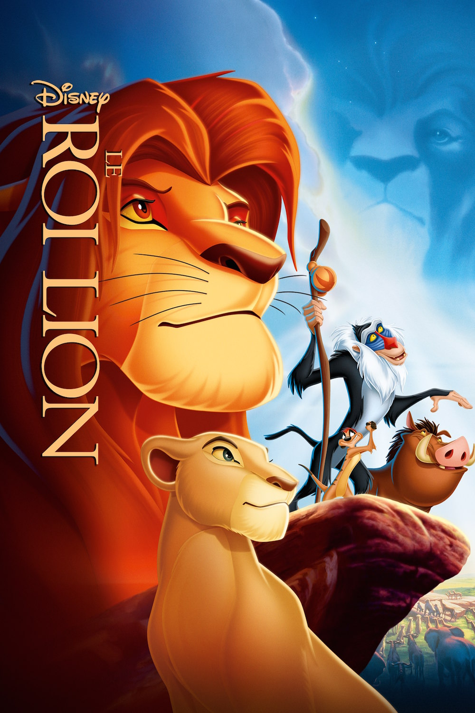
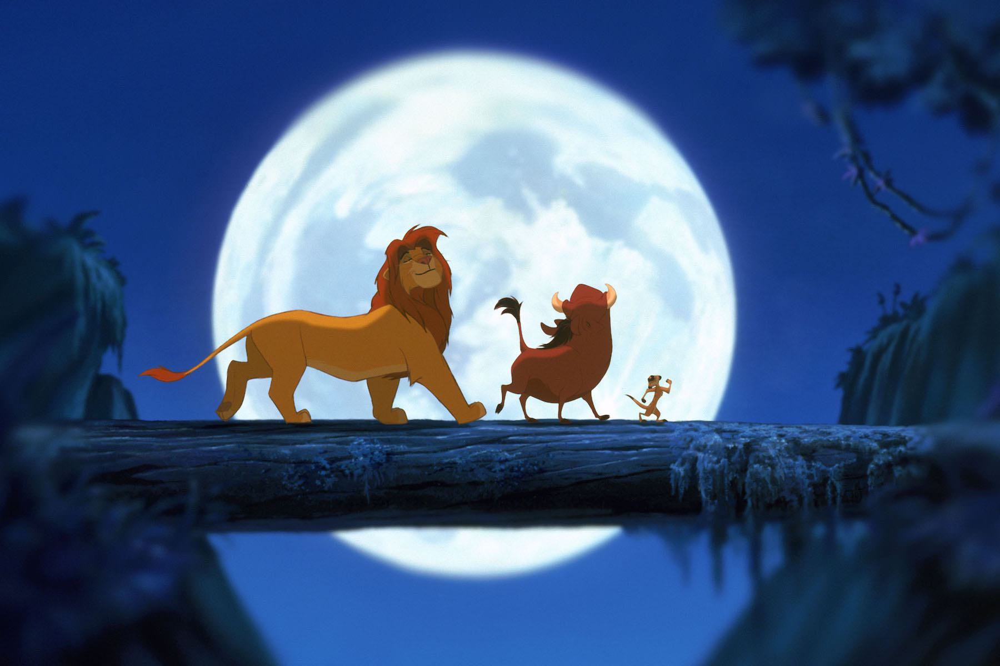
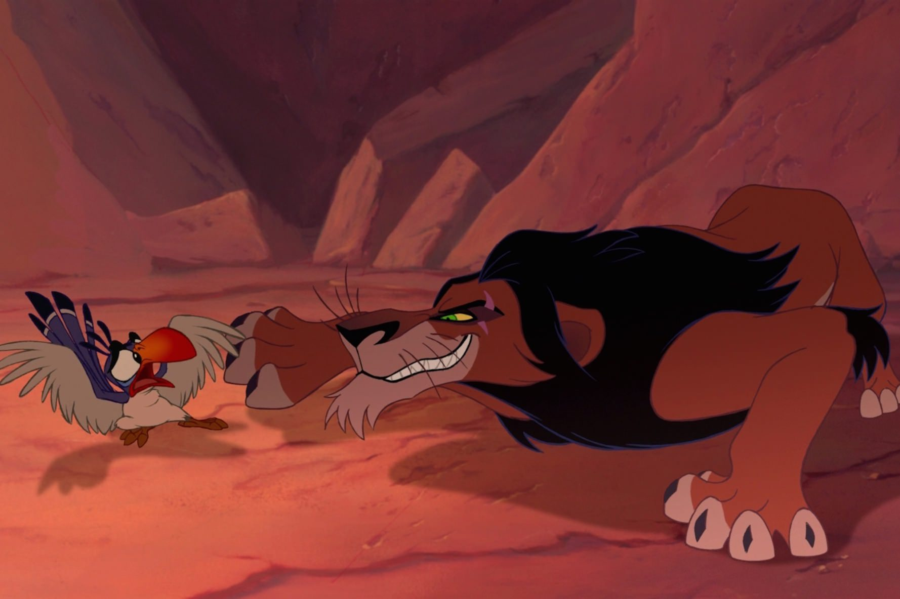

+++
type = "post"
titre = "<em>Le Roi Lion</em>, Roger Allers et Rob Minkoff"
title = "Le Roi Lion, Roger Allers et Rob Minkoff"
url = "/roi-lion-allers-minkoff"
date = "2014-06-22T16:47:43"
Lastmod = "2014-06-27T15:20:55"
cover = "le-roi-lion.jpg"
categorie = [ "À voir" ]
tag = [ "Animation", "Animaux", "Comédie musicale", "Famille", "Mort", "Politique", "Vengeance" ]
createur = [ "Rob Minkoff", "Roger Allers" ]
annee = [ "1994" ]
weight = 1994
saga = [ "Classiques d'animation Disney" ]
pays = [ "États-Unis" ]
original = "The Lion King"

+++

Quand <em>Le Roi Lion</em> sort à l’été 1994, personne chez Disney ne veut croire à ce petit film qui n’est censé être qu’une pause en attendant le prochain grand film. C’est <em>Pocahontas, une légende indienne</em> sorti l’année suivante qui concentre les efforts du studio après l’énorme succès d’<a href="http://voiretmanger.fr/aladdin-musker-clements/" title="Aladdin, John Musker et Ron Clements"><em>Aladdin</em></a> qui représentait une sorte de quintessence du savoir-faire Disney. Les plus grands noms de l’animation travaillent sur l’histoire de Pocahontas et cet autre projet est laissé un peu de côté. Loin du regard des responsables du studio, <em>Le Roi Lion</em> bénéficie d’une liberté rare, et c’est sans doute ce qui a fait la différence. Pour la première fois, Disney se libère d’un texte préexistant et imagine une histoire sans l’homme, mais qui n’a jamais été aussi émouvante. Vingt ans après sa sortie, le long-métrage n’a pas pris une ride et propose très précisément tout ce qu’il faut faire pour plaire aux enfants aussi bien qu’aux parents. Une histoire riche en émotions, des situations noires et drôles, des personnages particulièrement bien écrits : tout est là pour faire un succès et Roger Allers et Rob Minkoff ne se sont pas trompés. Un classique au-dessus du lot, à voir et à revoir !

Le début est à lui seul mythique. Le soleil se lève sur la savane et la première chanson du film commence sur une <a href="http://www.youtube.com/watch?v=Q3Lgg6URLtI">poignée de notes</a> qui a fait frissonner des générations entières. Comment rester insensible face à cette chanson qui monte en intensité jusqu’à la présentation du nouveau lion, le personnage principal ? En moins de quatre minutes, <em>Le Roi Lion</em> a déjà captivé son audience, de 3 à 93 ans : on n’a qu’une envie, découvrir la suite. Comme on le disait en ouverture, le trente-deuxième <a href="http://voiretmanger.fr/saga/classiques-danimation-disney/">classique Disney</a> n’est pas l’adaptation d’un conte, ou d’un récit plus moderne. Même si les scénaristes se sont fortement inspirés de <em>Hamlet</em>, le scénario mis en place n’est pas directement tiré de l’œuvre de Shakespeare, si bien qu’on peut la qualifier d’originale. Et quelle histoire : certes, on suit le fils d’un roi, mais on est loin des princes et des princesses qui ont monopolisé les grands succès des années précédentes. Le ton général de ce long-métrage est bien différent et s’il commence avec la légèreté propre aux Disney, la gravité revient vite. Dès l’épisode du cimetière des éléphants, la vie de Simba est menacée directement et il n’est sauvé par son père qu’<em>in extremis</em>. Dans la majorité des films du studio, on s’attendrait à une histoire interne aux lions qui sont les personnages principaux : entre Mufasa et son fils, ou entre Simba et son amie la lionne, il y avait sans doute de quoi faire. L’histoire mise en images par Roger Allers et Rob Minkoff est toutefois bien plus ambitieuse : piochant du côté des drames, voire des tragédies classiques, elle imagine la mort précoce du roi et le bannissement du prince. L’adulte qui regarde <em>Le Roi Lion</em> ne peut d’ailleurs qu’être frappé par la violence du propos : jusqu’à la mort de Mufasa, le film hésite constamment entre la gaieté et la noirceur et quelques séquences sont vraiment dures. La mort est partout, ne serait-ce que sous la forme de squelettes, et le méchant n’est pas cette sorcière totalement noire, mais un personnage fourbe et sadique.

Un enfant ne peut pas comprendre tout le sous-texte politique présent dans <em>Le Roi Lion</em>. Comment pourrait-il savoir que la prise de pouvoir de Scar est une allusion directe à la montée au pouvoir de Hitler et du nazisme dans l’Allemagne des années 1930 ? Qu’importe, il sait que ce personnage est un méchant, et un méchant d’autant plus terrifiant qu’il est aussi l’oncle du héros et, en toute logique du moins, un bon. Le mal est ici présent au cœur même de la famille, alors que dans la majorité des œuvres de Disney, il est à l’extérieur, ce qui le rend, au fond, moins terrifiant, ou moins dangereux. On n’insistera sans doute jamais assez sur la noirceur de ce film où le vilain met implacablement son plan en place, tuant au passage dans les premières minutes un personnage pourtant essentiel. Pour relâcher un peu la pression, Roger Allers et Rob Minkoff changent ensuite de registre et introduisent les deux personnages comiques du récit, mais on ne peut jamais se tromper : <em>Le Roi Lion</em> reste un film sombre et la noirceur fera son retour bien assez tôt. Face à un tel constat, on pourrait penser que le film devrait échouer à plaire aux enfants, mais il n’en est rien et si l’on cherchait un bon exemple du travail d’équilibriste des productions Disney, ce serait le meilleur. La noirceur est au cœur de ce qui est bon, mais même en plein désespoir, on trouve aussi matière à se réjouir. Plus encore peut-être que pour <em>Aladdin</em> qui faisait déjà fort sur ce point, les chansons écrites par Tim Rice et Elton John sont excellentes et elles expliquent en grande partie le succès du film. Loin d’être mièvres, ces morceaux sont des bijoux de composition, rythmés, émouvants et que l’on retient immédiatement. Tout le monde connaît « <a href="http://www.youtube.com/watch?v=slP4oNsJsHs&amp;feature=kp"><em>Hakuna Matata</em></a> » naturellement, mais elles sont toutes réussies, y compris les plus mélancoliques. La musique de manière générale joue un rôle central ici, et la <a href="https://itunes.apple.com/fr/album/lion-king-special-edition/id714529227">bande-originale</a> composée par Hans Zimmer est une grande musique de cinéma, incontestablement. On comprend aisément pourquoi <em>Le Roi Lion</em> est devenu une <a href="http://voiretmanger.fr/le-roi-lion-la-comedie-musicale/">comédie musicale</a> qui a, elle aussi, connu un énorme succès.

<em>Le Roi Lion</em> sort à l’été 1994 et le succès est immédiat. Aux États-Unis, c’est le long-métrage d’animation le plus rentable de l’histoire du cinéma et il a récolté, uniquement au cinéma, près d’un milliard de dollars. Les responsables du studio avaient-ils conscience que leur trente-deuxième classique allait devenir un mythe ? Sans doute pas, mais c’est pourtant évident quand on le revoit aujourd’hui. En piochant dans les querelles familiales et en s’inspirant de l’œuvre de Shakespeare, les scénaristes ont atteint une forme d’universelle. <em>Le Roi Lion</em> ne peut pas plaire qu’aux enfants, qu’aux filles ou uniquement aux Américains : tout le monde peut se retrouver dans cette lutte familiale pour le pouvoir. Au-delà de l’histoire personnelle, Roger Allers et Rob Minkoff illustrent simplement des concepts philosophiques assez complexes autour de la vie, de la mort ou encore de l’équilibre de la nature. Les enfants ne comprendront pas tout, peut-être, mais ils en comprendront bien assez pour se sentir concernés, et c’est bien là l’essentiel. Une réussite complète et qui reste toujours autant d’actualité : quel que soit votre âge, <em>Le Roi Lion</em> mérite d’être vu et revu…

<h3>Vous voulez <a href="http://voiretmanger.fr/soutien/">m’aider</a> ?</h3>
<ul>
<li><a href="http://www.amazon.fr/gp/product/B009DH9E62/ref=as_li_ss_tl?ie=UTF8&amp;tag=leblogdenic07-21&amp;linkCode=as2&amp;camp=1642&amp;creative=19458&amp;creativeASIN=B009DH9E62">Acheter le film en Blu-ray sur Amazon</a></li>
<li><a href="http://www.amazon.fr/gp/product/B004ZKTBF6/ref=as_li_ss_tl?ie=UTF8&amp;tag=leblogdenic07-21&amp;linkCode=as2&amp;camp=1642&amp;creative=19458&amp;creativeASIN=B004ZKTBF6">Acheter le film en DVD sur Amazon</a></li>
<li><a href="https://itunes.apple.com/fr/movie/le-roi-lion/id443302489">Acheter ou louer le film sur l’iTunes Store</a></li>
</ul>

