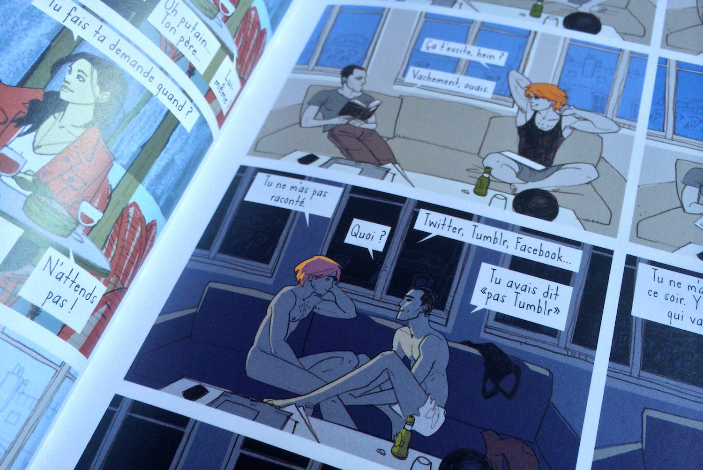
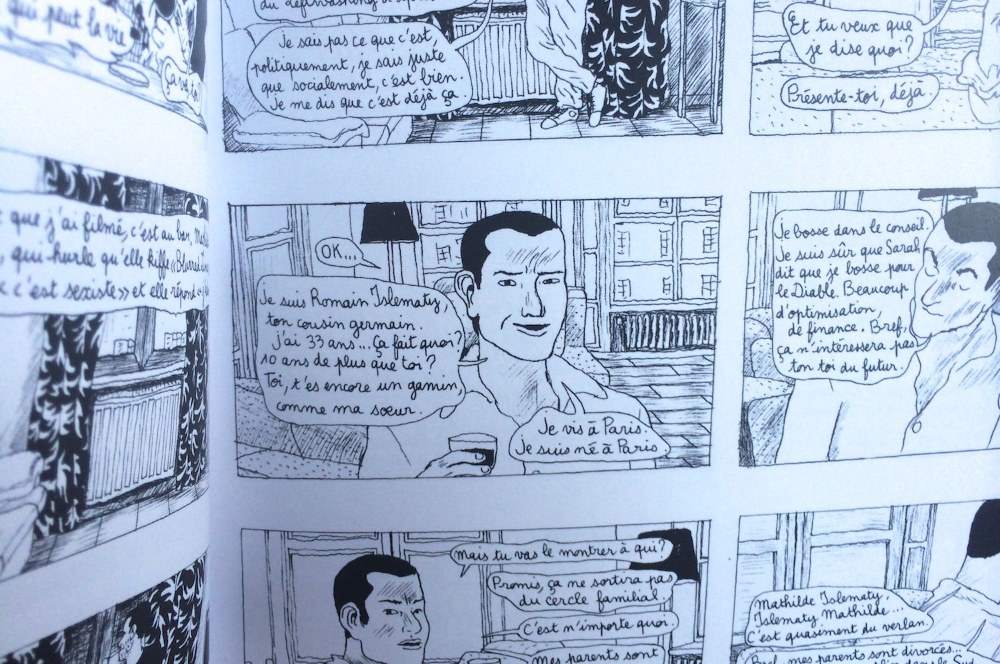
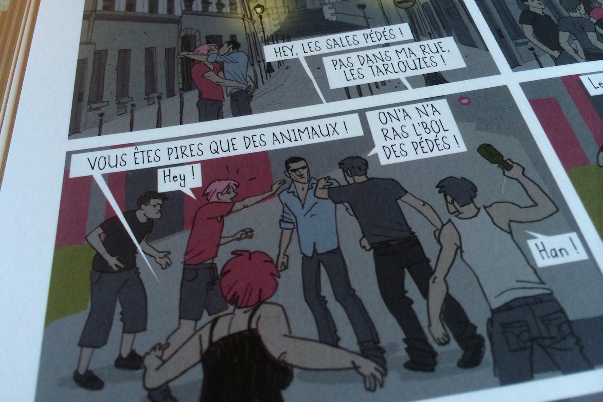

+++
type = "post"
titre = "<em>Romain &#038; Augustin, un mariage pour tous</em>, Thomas Cadène, Didier Garguilo et Joseph Falzon"
title = "Romain &#038; Augustin, un mariage pour tous, Thomas Cadène, Didier Garguilo et Joseph Falzon"
url = "/romain-augustin-mariage-pour-tous-cadene-garguilo-falzon"
date = "2013-12-08T16:17:48"
Lastmod = "2014-10-05T10:43:09"
cover = "romain-et-augustin-mariage-pour-tous.jpg"
categorie = [ "À lire" ]
tag = [ "Amour", "Bande dessinée", "Famille", "Homosexualité", "Mariage", "Politique", "Société" ]
createur = [ "Didier Garguilo", "Joseph Falzon", "Thomas Cadène" ]
annee = [ "2013" ]
weight = 2013
pays = [ "France" ]

+++

L’année 2013 est sur le point de se terminer et on s’en souviendra certainement au moins pour une chose : le « mariage pour tous », le nom qu’a pris le projet visant à ouvrir le mariage aux personnes de même sexe. Votée le 17 mai 2013 après de longs et âpres débats qui ont secoué la société française, cette loi est en train d’entrer dans les mœurs et les débats et manifestations qui ont précédé commencent à entrer dans l’histoire comme une de ces bizarreries dont la France a le secret. Pour marquer le coup, <em>Le Nouvel Observateur</em> a publié pendant tout l’été un feuilleton bande dessinée qui évoquait le sujet. L’été est passé, le feuilleton est devenu un vrai livre vendu dans toutes les bonnes librairies. <em>Romain &amp; Augustin, un mariage pour tous</em> raconte l’histoire de deux hommes qui veulent se marier, mais aussi les réactions de leurs familles, en guise d’aperçu des débats qui ont pu secouer la société. Un livre politique raconté par Thomas Cadène et mis en images par Didier Garguilo et Joseph Falzon qui peut faire peur, mais on est rassuré à la lecture. Derrière le fond politique, une histoire personnelle passionnante en elle-même en même qu’un témoignage qui paraîtra absurde dans quelques années. Une œuvre complexe et imparfaite, mais qui mérite incontestablement d’être lue.

<blockquote class="pull-quote">
C’est l’histoire d’une demande en mariage, de préparatifs jusqu’au grand jour. C’est aussi l’histoire des gens qui entourent les mariés, ceux qui les comprennent comme ceux qui ne les acceptent pas.<cite class="author"> — , Romain &#038; Augustin, un mariage pour tous, septième de couverture</cite>

</blockquote>

<em>Romain &amp; Augustin, un mariage pour tous</em> se déroule peu après la loi sur le mariage pour tous. Romain vit avec Augustin depuis quelques mois, les deux hommes s’aiment et vivent une vie normale à Paris. Augustin, le plus jeune, voudrait épouser Romain, mais pas forcément pour les bonnes raisons. Ses deux parents ont très mal accepté son homosexualité : sa mère, au-dessus de laquelle il vit toujours, est une fervente catholique qui a vu dans la sexualité de son fils une punition divine pour sa mauvaise éducation. Son père a quitté sa mère quand il était tout jeune et il refuse de se mêler de la vie de son fils, d’autant plus depuis son coming-out. Romain a eu un parcours radicalement opposé : sa famille a très bien accepté son homosexualité, c’est presque si elle ne l’a pas félicité pour son orientation sexuelle. Thomas Cadène commence son récit un jour ou deux avant qu’Augustin fasse sa demande surprise à Romain. Au fil du récit, on en apprend plus sur le passé de l’un comme de l’autre et on découvre que Romain a vécu une histoire passionnelle avec le même homme pendant plusieurs années, avant une rupture qui l’a mis a plat et qu’il s’en est sorti grâce à l’amour d’Augustin. Un passé compliqué pour les deux, ce qui ne facilite pas cette demande en mariage. Même si dès sa couverture, <em>Romain &amp; Augustin, un mariage pour tous</em> ne laisse guère de place aux doutes, on se demande quand même si ce mariage aboutit pendant une bonne partie de l’histoire. Il faut dire que Romain a toujours de l’affection pour son ex, qu’Augustin de son côté est très jaloux. Et puis cette demande en mariage est-elle une manière, pour le plus jeune, d’officialiser une union que sa famille rejette ? Toutes ces questions générales sont très bien menées par la bande dessinée et on se passionne facilement pour l’histoire de ce couple atypique, comme tous les couples. La question politique toutefois, n’est jamais très loin.

Œuvre complexe, <em>Romain &amp; Augustin, un mariage pour tous</em> est signé de deux dessinateurs différents pour une bonne raison. Didier Guarguilo a dessiné la partie qui concerne strictement le mariage des deux garçons, une partie en couleurs qui tranche avec celle dessinée par Joseph Falzon, en noir et blanc. Ces intermèdes qui découpent régulièrement le récit principal servent essentiellement à parler des réactions de l’entourage sur le mariage. L’idée est que le cousin de Romain réalise une vidéo avec tous les proches des deux mariés pour montrer les mots des uns et des autres au cours de la fête qui suit le mariage. À partir de cette idée, Thomas Cadène imagine des réactions variées, tout en se laissant aller à un commentaire politique. Alors que le récit principal en est dépourvu, même si on a des clins d’œil à l’actualité à l’image de l’agression de rue dont souffre le couple à un moment donné, ces récits intermédiaires sont très politisés. On entend des discours de gauche et de droite, des discours de gens qui ne sont pas homophobes, « mais », certains qui ne comprennent pas comment on peut avoir envie de se marier, d’autres heureusement qui sont très favorables au mariage. Ces intermèdes sont à la fois une excellente idée pour peindre un portrait exhaustif de la société actuelle, mais ils sont aussi le point faible de <em>Romain &amp; Augustin, un mariage pour tous</em>. Sans parler du style qui est affaire de goût — j’ai préféré la partie en couleurs, plus simple et plus agréable à lire —, on est avec ces intermèdes dans l’actualité et donc dans ce qui vieillira sans doute le moins bien. Fort heureusement, ils font en même temps avancer l’intrigue, notamment en donnant des éléments précieux pour faire de Romain et d’Augustin des personnages crédibles. C’est sans doute la grande réussite de Thomas Cadène, Didier Garguilo et Joseph Falzon : ils ont réussi à créer plus que des symboles d’une réforme, de vrais personnages attachants. On apprécie leurs erreurs, la réaction un peu stupide d’un Augustin jaloux, leurs faiblesses en somme. Leur amour sort des clichés et de la politique pour le sentiment puissant qu’il est censé être et cette bande dessinée d’actualité parvient bien à transmettre ce sentiment.

Sous sa forme de bande dessinée imprimée, <em>Romain &amp; Augustin, un mariage pour tous</em> fait totalement oublier la dimension feuilleton publié chaque semaine sur internet. On la retrouve peut-être dans un trait simple qui va à l’essentiel, mais qui n’est pas simpliste pour autant. Le récit avance toutefois avec beaucoup de détermination, sans qu’il erre au hasard des semaines. De ce côté, Thomas Cadène a fait un bon travail et le côté politique et opportuniste que l’on craignait un peu n’a pas trop de place ici. <em>Romain &amp; Augustin, un mariage pour tous</em> mêle deux styles de dessin très différents, comme si deux récits parallèles s’entremêlaient. Je ne suis pas forcément fan des coups de crayon de Joseph Falzon, mais son style radicalement opposé à celui de Didier Garguilo était important pour créer une rupture. <em>Romain &amp; Augustin, un mariage pour tous</em> mérite d’être lu, ne serait-ce que pour constater dans quelques années à quel point tous ces débats ont pu être ridicules…

<h3>Vous voulez m’aider ?<a href="#footnote_0_10678" id="identifier_0_10678" class="footnote-link footnote-identifier-link" title="&Agrave; propos de la publicit&eacute;&hellip;">1</a></h3>
<ul>
<li><a href="http://www.amazon.fr/gp/product/2756051373/ref=as_li_ss_tl?ie=UTF8&#038;tag=leblogdenic07-21&#038;linkCode=as2&#038;camp=1642&#038;creative=19458&#038;creativeASIN=2756051373">Acheter la bande dessinée sur Amazon</a></li>
<li><a href="https://itunes.apple.com/fr/book/romain-augustin-mariage-pour/id738359380?mt=11">Acheter la bande dessinée sur l’iTunes Store</a></li>
</ul>

<ol class="footnotes"><li id="footnote_0_10678" class="footnote"><a href="http://voiretmanger.fr/soutien/">À propos de la publicité…</a> [<a href="#identifier_0_10678" class="footnote-link footnote-back-link">&#8617;</a>]</li></ol>
