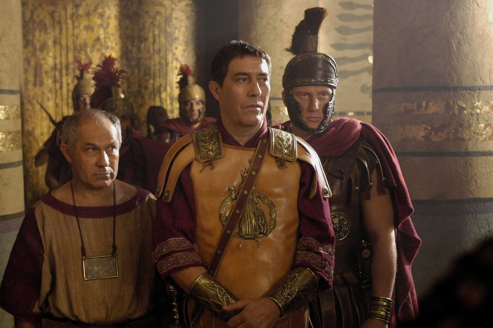
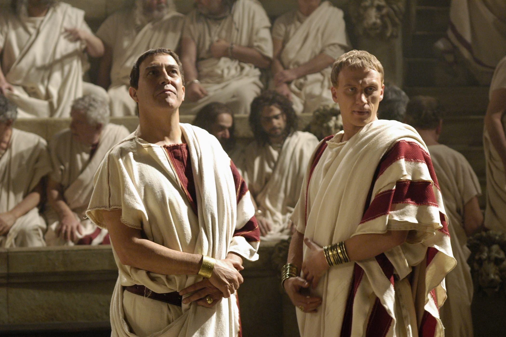
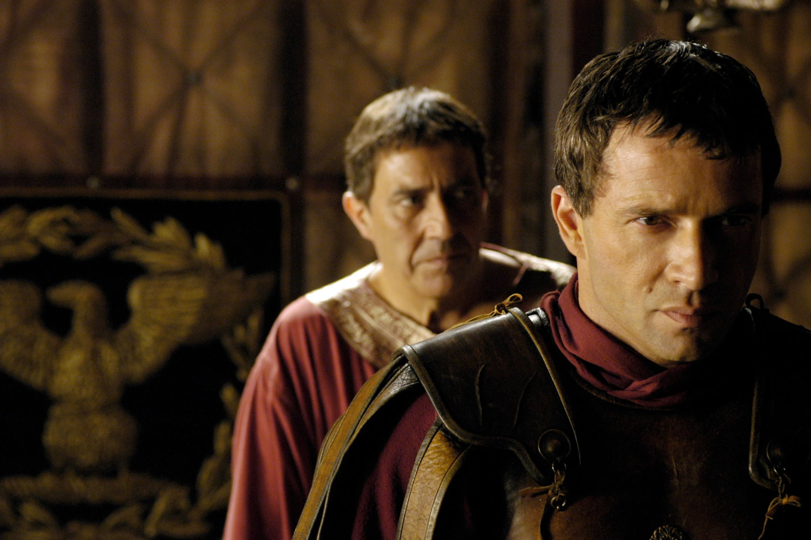

+++
titre = "<em>Rome</em>, John Milius, William J. MacDonald et Bruno Heller (HBO)"
title = "Rome, John Milius, William J. MacDonald et Bruno Heller (HBO)"
url = "/rome-milius-macdonald-heller-hbo"
date = "2015-02-09T18:14:16"
Lastmod = "2015-02-09T18:18:43"
cover = "rome-hbo.jpg"
categorie = [ "À voir" ]
tag = [ "Amour", "Drame", "Famille", "Guerre", "Histoire", "Histoire vraie", "Peplum", "Politique", "Religion", "Série", "Violence" ]
createur = [ "Bruno Heller", "HBO", "John Millius", "William J. MacDonald" ]
acteur = [ "Allen Leech", "Ciarán Hinds", "James Purefoy", "Kerry Condon", "Kevin McKidd", "Polly Walker", "Ray Stevenson", "Tobias Menzies" ]
annee = [ "2005" ]
weight = 2005
pays = [ "États-Unis", "Grande-Bretagne", "Italie" ]

+++

Interrompue après deux saisons seulement pour de mauvaises raisons<a href="#fn-13109-1" rel="footnote">1</a>, <em>Rome</em> reste ainsi une série anormalement courte et qui pèche un petit peu par sa fin précipitée. Malgré tout, elle impressionne par son ambition et par la qualité de sa restitution. Les historiens pointeront facilement du doigt les incohérences chronologiques et on pourra naturellement critique la faculté des personnages principaux à se retrouver systématiquement au bon endroit, au bon moment, mais la vision de la Rome de Jules César créée par John Millius, William J. MacDonald et Bruno Heller est saisissante de réalisme. Et ce n&rsquo;est pas aussi propre que dans la majorité des peplums classiques : la violence est omniprésente, autant physique que psychologique, le sexe et la mort sont partout et c&rsquo;est un peuple sale et un peu sauvage qui nous est présenté. C&rsquo;est probablement cela, la plus grande réussite de <em>Rome</em> : bien loin des clichés habituels du genre, HBO a signé plongée saisissante dans ce passé que l&rsquo;on connait, au fond, assez mal. Tout en racontant une histoire et des personnages passionnants : une vraie réussite !

<em>Rome</em> commence paradoxalement loin de Rome, mais à un endroit et surtout une date clé dans l&rsquo;histoire romaine antique. La série ouvre avec l&rsquo;une des batailles de Jules César en Gaulle, mais pas n&rsquo;importe laquelle, puisqu&rsquo;il ne s&rsquo;agit rien de moins qu&rsquo;Alésia, la célèbre bataille qui scelle la victoire romaine. Cette victoire place surtout celui qui n&rsquo;est alors que Proconsul de Gaule sur le devant de la scène et les intrigues politiques se mettent vite en place. L&rsquo;homme est présence comme un comploteur talentueux, mais c&rsquo;est surtout son ambition qui frappe d&rsquo;entrée de jeu. Après tout, le Sénat l&rsquo;avait envoyé en Gaule dans l&rsquo;espoir de l&rsquo;enfermer dans un placard doré, mais cette victoire éclatante prouve bien vite que c&rsquo;était une erreur monumentale. Comme dans toutes les séries, <em>Rome</em> pose rapidement ses personnages principaux. Outre César, qui joue un rôle central dans la première saison, on découvre les deux autres personnages principaux, deux soldats de son armée. Il y a d&rsquo;un côté Lucius Vorenus, officier très loyal, mais colérique et de l&rsquo;autre, Titus Pullo, simple légionnaire qui a fait ses preuves sur le terrain de bataille, mais qui a un tempérament un peu trop violent. Deux hommes très différents qui forment pendant toute la série un couple inattendu : la méthode est assez classique, mais elle a fait ses preuves.

Surtout, la grande force de cette série HBO, comme de toutes les autres, c&rsquo;est de composer des personnages très solides et parfaitement crédibles. On finit par apprécier ces hommes bourrus, incapables de revenir à une vie normale en temps de paix et qui font beaucoup de mal, malgré eux. John Millius, William J. MacDonald et Bruno Heller imaginent aussi toute une série de personnages secondaires très convaincants, autour de César d&rsquo;une part — on reconnaît Marc-Antoine, Octave et d&rsquo;autres personnages inventés — et des deux soldats d&rsquo;autre part. Au total, <em>Rome</em> offre une plongée passionnante dans l&rsquo;Antiquité, mais ce n&rsquo;est pas seulement instructif. La reconstitution se veut réaliste, non pas forcément dans le sens où tout est historiquement véridique — il y a quelques gros soucis dans la chronologie, qui a été en particulier raccourcie d&rsquo;une vingtaine d&rsquo;années entre les deux saisons -, mais parfaitement crédible. Et la Rome présentée par HBO n&rsquo;a rien à voir avec les peplums sages et propres que l&rsquo;on avait l&rsquo;habitude de voir. Ici, tout est sale et violent, on égorge des gens dans la rue en plein jour, les esclaves sont traités comme des meubles quand ils ne servent pas d&rsquo;objets sexuels, bref, ce n&rsquo;est pas rose. La série se réserve plutôt à un public adulte avec ses nombreuses scènes de sexe qui ne sont jamais explicites, mais très suggestives, et sa violence ambiante. Le sang coule souvent à flot, les injures fusent… toutes dans un anglais parfait d&rsquo;ailleurs, mais on peut au moins arguer qu&rsquo;ils parlaient tous la même langue à l&rsquo;époque.

HBO a encore signé une grande série avec cette reconstitution historique d&rsquo;excellente qualité. On peut regretter que le projet ait été interrompu si tôt pour des problèmes de financement, mais on peut aussi reconnaître que la vingtaine d&rsquo;épisodes produits reste parmi les plus réussis en matière de série historique. À bien des égards, <em>Rome</em> fait mieux que de nombreux longs-métrages pourtant bien mieux financés. Avec ses personnages tous convaincants et son scénario bien écrit, la série créée par John Millius, William J. MacDonald et Bruno Heller est une vraie réussite, à (re)voir avec plaisir !

<h3>Vous voulez <a href="http://voiretmanger.fr/soutien/">m&rsquo;aider</a> ?</h3>
<ul>
<li><a href="http://www.amazon.fr/gp/product/B002MGJSQW/ref=as_li_ss_tl?ie=UTF8&amp;tag=leblogdenic07-21&amp;linkCode=as2&amp;camp=1642&amp;creative=19458&amp;creativeASIN=B002MGJSQW">Acheter la série en Blu-ray sur Amazon</a></li>
<li><a href="http://www.amazon.fr/gp/product/B005BHE48Q/ref=as_li_ss_tl?ie=UTF8&amp;tag=leblogdenic07-21&amp;linkCode=as2&amp;camp=1642&amp;creative=19458&amp;creativeASIN=B005BHE48Q">Acheter la série en DVD sur Amazon</a></li>
<li><a href="https://itunes.apple.com/fr/tv-season/rome-saison-1-vost/id398464199">Acheter ou louer la série sur l&rsquo;iTunes Store</a></li>
</ul>

<ol>
<li id="fn-13109-1">
Des raisons financières : malgré le succès de la série, HBO et ses partenaires anglais et italiens ne pouvaient pas justifier son prix astronomique. La deuxième saison ne dure que sur dix épisodes, mais elle a coûté à elle seule 125 millions de dollars… le prix d&rsquo;un blockbuster hollywoodien !&#160;<a href="#fnref-13109-1" rev="footnote">&#8617;</a>
</li>
</ol>

