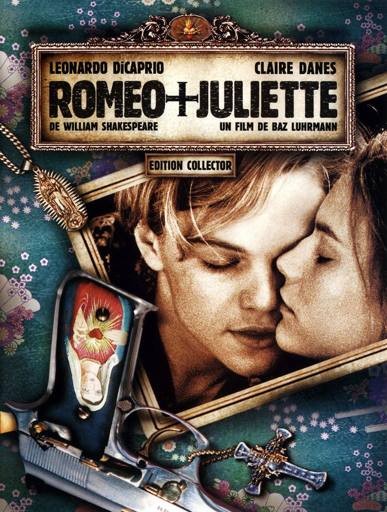
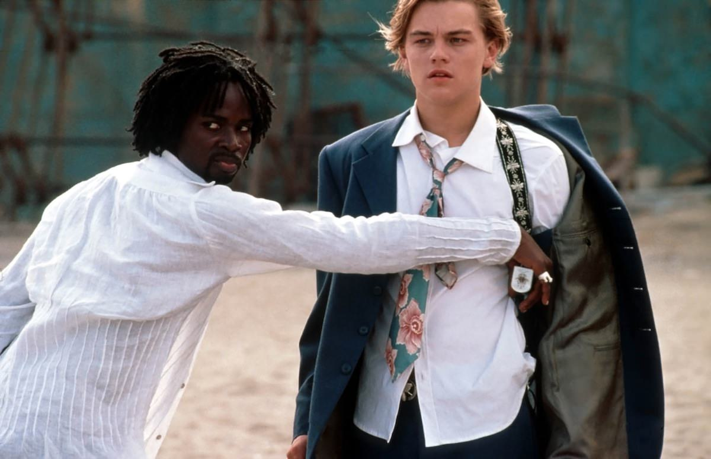
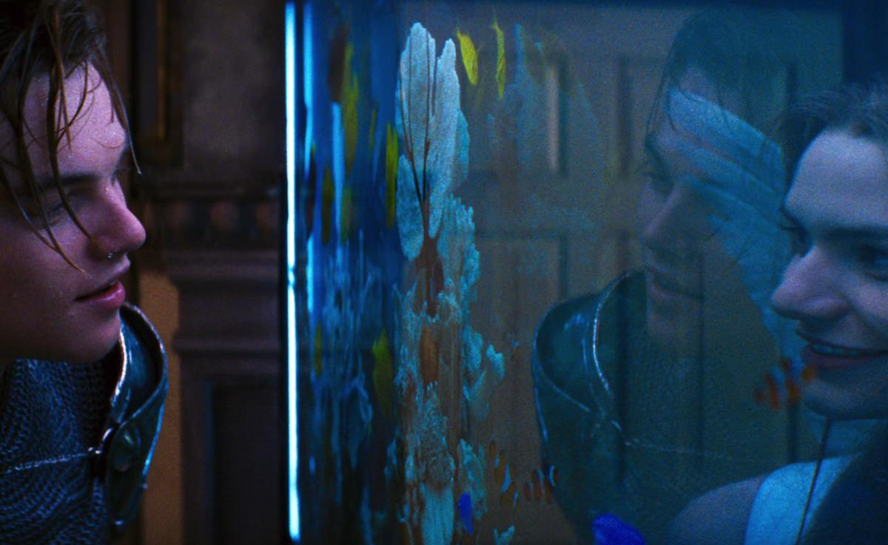

+++
type = "post"
titre = "<em>Romeo + Juliette</em>, Baz Lurhmann"
title = "Romeo + Juliette, Baz Lurhmann"
url = "/romeo-juliette-luhrmann"
date = "2012-08-13T00:27:20"
Lastmod = "2015-05-10T21:24:11"
cover = "romeo+juliette-luhrmann-di-caprio-danes.jpg"
categorie = [ "À voir" ]
tag = [ "Adolescence", "Amour", "Kitsch", "Parodie", "Romance", "Théâtre", "Tragedie" ]
createur = [ "Baz Luhrmann" ]
acteur = [ "Claire Danes", "Harold Perrineau", "John Leguizamo", "Leonardo Di Caprio" ]
annee = [ "1997" ]
weight = 1997
pays = [ "États-Unis" ]
original = "William Shakespeare's Romeo + Juliet"

+++

Qui pourrait ignorer l&rsquo;histoire de Roméo et Juliette ? Non pas la pièce de William Shakespeare, que bien peu ont pris la peine de lire, mais l&rsquo;histoire d&rsquo;amour tragique et universelle qui est entrée au panthéon des plus grandes histoires d&rsquo;amour. Difficile, dès lors, de l&rsquo;adapter en étant original, mais c&rsquo;était pourtant l&rsquo;objectif de Baz Lurhmann. Le cinéaste australien qui s&rsquo;est surtout fait connaître avec le succès de <em>Mounlin Rouge</em>, son film suivant, fait ici un pari risqué. <em>Romeo + Juliette</em> reprend non seulement l&rsquo;histoire originale, mais aussi le texte original dans une version légèrement adaptée et raccourcie. Rien d&rsquo;extraordinaire jusque-là, mais le réalisateur a voulu intégrer son histoire à un contexte modernisé et violent… un mélange qui détonne et fonctionne en partie seulement.

Dans <em>Romeo + Juliette</em>, tous les personnages principaux de la pièce de Shakespeare sont là, mais le contexte a quelque peu changé. Finie la Vérone de la Renaissance, place au Los Angeles du XXe siècle. L&rsquo;action se déroule à Verona beach, un quartier imaginaire, mais qui s&rsquo;inspire bien évidemment de quartiers bien réels de la première ville californienne. La guerre fait rage dans la ville, une guerre de gangs entre la bande des Capulets et celle des Montague. Les deux familles se haïssent depuis des années et elles se font la guerre plus ou moins ouvertement. Dans la rue, les gangsters d&rsquo;un camp affrontent ceux de l&rsquo;autre à coup d&rsquo;insultes, de coups et même parfois de balles. Un environnement dangereux que le capitaine Prince, chef de la police, peine à maîtriser. Un soir, les Capulets organisent leur grand bal traditionnel. Roméo, le fils des Montague, parvient à y entrer avec l&rsquo;aide d&rsquo;un ami. Ils sont venus profiter incognito de la fête de leurs ennemis, mais une rencontre bouleverse le jeune homme. Son regard croise par hasard celui d&rsquo;une charmante jeune fille et c&rsquo;est immédiatement le coup de foudre. Comme Roméo va vite le comprendre, cette magnifique jeune fille est en fait Juliette, la fille des Capulets. Leur amour est impossible, mais il est si fort que les deux tourtereaux vont tout fait pour le réaliser. La suite est connue…

Les adaptations de <em>Roméo et Juliette</em> ne manquent pas. Certains font dans l&rsquo;adaptation littérale, en costume et en langue d&rsquo;époque, d&rsquo;autres au contraire font le pari de moderniser l&rsquo;histoire ou de la transposer, comme la saga <em>Twilight</em> en fournit encore un exemple récent. Baz Lurhmann a fait un pari assez audacieux : moderniser le contexte, mais conserver l&rsquo;intrigue et surtout les textes de William Shakespeare. Dès les premiers dialogues, le décalage est patent et crée une forme de malaise difficile à cerner pour le spectateur. <em>Romeo + Juliette</em> ne semble pas naturel, quelque chose cloche dès les premières scènes sans que l&rsquo;on puisse dire exactement quoi. L&rsquo;œuvre originale a été raccourcie et en partie remodelée, mais le film est resté assez fidèle aux mots du dramaturge et on est surpris d&rsquo;entendre un gangster de bas étage s&rsquo;adresser de manière particulièrement châtiée, faisant des phrases complexes et surtout utilisant des tournures d&rsquo;anglais ancien. La gêne disparaît assez rapidement, mais ce choix est incontestablement gonflé de la part de Baz Luhrmann.

Le résultat aurait été plutôt satisfaisant ainsi et <em>Romeo + Juliette</em> aurait constitué une version moderne et décalée réussie. Baz Luhrmann n&rsquo;a pas su s&rsquo;arrêter toutefois et ce cinéaste de l&rsquo;outrance a aussi choisi de donner à ce film un ton outrancier, tout à la fois kitsch, barré et même par moment parodique. Dès la première séquence qui voit s&rsquo;affronter les deux bandes à une station-service, le ton est donné. Les personnages sont habillés de façon caricaturale — le gang des Montague est assez bizarrement toujours torse nu… —, ils agissent comme on imagine que des gangsters de Los Angeles agiraient pour une scène totalement artificielle. C&rsquo;est le droit du réalisateur d&rsquo;opter pour ce ton encore plus décalé, mais il contribue à fatiguer inutilement le spectateur. <em>Romeo + Juliette</em> est un film qui file en permanence à 200 km/h, Baz Luhrmann fait toujours dans la surenchère et la première demi-heure est assez éprouvante. Certains effets sont assez bien vus et rappellent par moments le cinéma second degré de Quentin Tarantino, d&rsquo;autres sont plus pénibles à l&rsquo;image de la nourrice qui se contente pendant tout le film de hurler le nom de Juliette. Le réalisateur se calme un peu dans la seconde moitié du film, quand il déroule la tragédie shakespearienne, mais le mal est fait. Le premier décalage de la langue était bien vu, la surenchère visuelle et scénaristique passe beaucoup plus mal et <em>Romeo + Juliette</em>, même s&rsquo;il reste intéressant, ne reste pas en souvenir comme un très bon film.

Baz Luhrmann aggrave son cas en choisissant de filmer <em>Romeo + Juliette</em> comme un clip MTV, ou plutôt comme une mauvaise parodie de clip MTV. Les deux clans forment de parfaits gangsters et ce n&rsquo;est pas le talon métallisé de l&rsquo;un d&rsquo;entre eux qui va dissiper cette impression. On croirait regarder un mauvais clip de rap, mais le cinéaste semble s&rsquo;amuser comme un fou avec sa caméra, multipliant les effets de ralentissement et d&rsquo;accélération, usant d&rsquo;un montage extrêmement rapide. Les effets sont bien connus et ils ne sont pas réellement utilisés dans ce film qui se contente de les accumuler plus par obligation que par intérêt scénaristique ou formel. Cela n&rsquo;apporte pas grand-chose et c&rsquo;est fatigant… heureusement <em>Romeo + Juliette</em> finit par se calmer également sur le plan technique. Le kitsch assumé façon Bollywood est moins gênant et il est même plutôt en accord avec certaines représentations que l&rsquo;on peut avoir de cette histoire d&rsquo;amour : la conclusion dans l&rsquo;église est à cet égard plutôt réussie, même si le film s&rsquo;éloigne alors singulièrement du matériau original. Dans ce grand bazar, les acteurs dirigés par Baz Lurhmann font ce qu&rsquo;ils veulent pour exister. Quelques mois avant le rôle qui a propulsé sa carrière dans <a title="Titanic, James Cameron" href="/2012/04/08/titanic-cameron/"><em>Titanic</em></a>, Leonardo DiCaprio montre déjà son talent en réussissant à composer un Roméo sincère. Le rester des troupes est moins mémorable, tandis que <em>Romeo + Juliette</em> fait à nouveau usage du pot-pourri habituel chez ce cinéaste en guise de <a href="http://itunes.apple.com/fr/album/romeo-+-juliet-music-from/id213378751" target="_blank">bande originale</a>. Notons quand même la présence bienvenue de Radiohead, avec deux titres, dont un très bon inédit.

<em>Romeo + Juliette</em> est un film étrange, un mélange burlesque comme on en voit rarement au cinéma. Le résultat surprend, pas toujours de manière positive, même si le deuxième long-métrage de Baz Luhrmann s&rsquo;améliore sur la fin. On regrette que le cinéaste ne soit pas contenté de l&rsquo;idée du décalage entre un contexte ultra-contemporain et la langue de William Shakespeare, mais <em>Romeo + Juliette</em> reste une expérience de cinéma qui mérite d&rsquo;être vue…

<h3>Vous voulez m&rsquo;aider ?</h3>
<ul>
<li><a href="http://www.amazon.fr/gp/product/B0041HU44U/ref=as_li_ss_tl?ie=UTF8&amp;tag=leblogdenic07-21&amp;linkCode=as2&amp;camp=1642&amp;creative=19458&amp;creativeASIN=B0041HU44U">Acheter le film en Blu-Ray sur Amazon</a></li>
<li><a href="http://www.amazon.fr/gp/product/B00005Y1QQ/ref=as_li_ss_tl?ie=UTF8&amp;tag=leblogdenic07-21&amp;linkCode=as2&amp;camp=1642&amp;creative=19458&amp;creativeASIN=B00005Y1QQ">Acheter le film en DVD sur Amazon</a></li>
<li><a href="http://itunes.apple.com/fr/movie/romeo-et-juliette/id380271266">Acheter ou louer le film sur l&rsquo;iTunes Store</a></li>
</ul>

