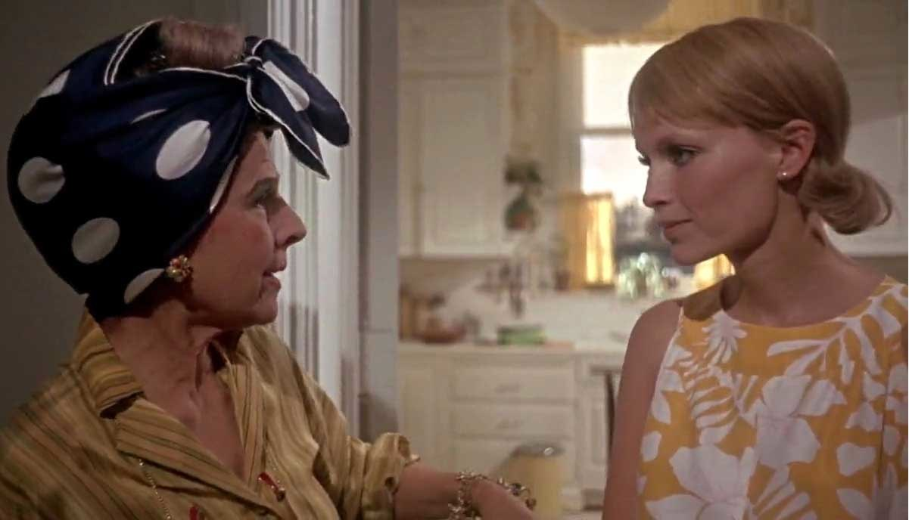
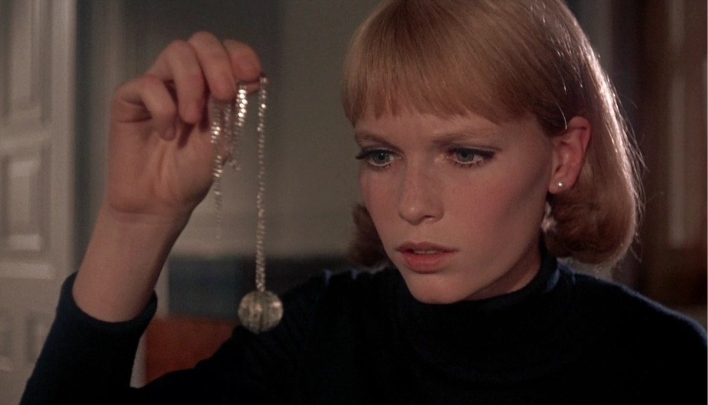

+++
type = "post"
titre = "Rosemary&rsquo;s Baby, Roman Polanski"
title = "Rosemary's Baby, Roman Polanski"
url = "/rosemary-s-baby-polanski"
date = "2012-05-01T00:26:17"
Lastmod = "2012-05-05T10:54:58"
cover = "rosemary-s-baby.jpg"
categorie = [ "À voir" ]
tag = [ "Drame", "Famille", "Fantastique", "Folie", "Suspense" ]
createur = [ "Roman Polanski" ]
acteur = [ "Mia Farrow", "Ruth Gordon" ]
annee = [ "1968" ]
weight = 1968
pays = [ "États-Unis" ]

+++

<em>Rosemary&rsquo;s Baby</em> est un film très surprenant aujourd&rsquo;hui encore. Son énorme succès public à sa sortie, en 1967, propulse la carrière de Roman Polanski en même temps qu&rsquo;il remet au goût du jour le fantastique, un genre qui avait un peu disparu. <em>Rosemary&rsquo;s Baby</em> n&rsquo;est pas un film d&rsquo;horreur au sens strict du terme et c&rsquo;est surtout une œuvre qui hésite constamment entre plusieurs pistes et qui donne le sentiment gênant de ne jamais savoir où aller. Roman Polanski signe là un long-métrage qui dérange et c&rsquo;est bien sa plus grande réussite.

Un couple de jeunes mariés cherche un appartement à New York. Lui, Guy Woodhouse, est un acteur de théâtre un peu raté qui gagne toutefois bien sa vie grâce à des publicités. Elle, Rosemary, est appelée à devenir une mère au foyer dans cette Amérique encore très conservatrice. Le couple craque pour un appartement assez vaste au huitième étage d&rsquo;un immeuble ancien. Après un bon coup de jeune bien mérité, ce nouveau logis s&rsquo;avère confortable et lumineux et le couple s&rsquo;installe en prévision d&rsquo;un futur enfant. Ils rencontrent vite leurs voisins, les Castevet, un autre couple plus âgé. Ils s&rsquo;avèrent vite très accueillants, un peu trop peut-être : ils sont aussi très curieux et s&rsquo;intéressent bien vite à leurs nouveaux voisins et surtout à leur désir d&rsquo;enfants. Quand Rosemary tombe enfin enceinte, les Castevet ne quittent plus les Woodhouse et ils sont au petit soin pour accompagner la grossesse, tandis que la carrière de Guy prend enfin son envol avec le grand rôle qui l&rsquo;attendait tant. Tout semble aller pour le mieux dans le meilleur des mondes, à tel point que cela en devient suspect. Et si le charmant couple de petits vieux avait d&rsquo;autres objectifs, moins faciles à avouer ?

Le point fort de <em>Rosemary&rsquo;s Baby</em> est incontestablement sa façon de ne pas abattre toutes ses cartes d&rsquo;entrée de jeu et de faire durer au contraire le suspense. Le troisième film de Roman Polanski commence avec un générique léger, avec lettres roses fantaisistes à la clé, qui rappelle plus une comédie romantique qu&rsquo;un film fantastique. La première partie du long-métrage continue d&rsquo;ailleurs sur cette voie : la première visite de l&rsquo;appartement respire bon les premières années de mariage, les projets, le début d&rsquo;une nouvelle vie de couple, l&rsquo;insouciance… <em>Rosemary&rsquo;s Baby</em> intègre pourtant dès les premières minutes des ombres au tableau : l&rsquo;immeuble ancien semble aussi assez délabré, il y a des trous dans le couloir et l&rsquo;appartement est un peu vieillot. Par la suite, le nom de l&rsquo;immeuble est associé à des rumeurs qui ne sont pas prises au sérieux : il s&rsquo;agirait d&rsquo;un endroit occupé par des sorciers et qui serait donc hanté. Ni Rosemary, ni son mari ne prennent ces bruits de couloir au sérieux, jusqu&rsquo;au jour où le suicide d&rsquo;une voisine jette le trouble. Cet évènement tragique pris pourtant à la légère par les voisins, mais aussi le comportement beaucoup trop attentionné de ces derniers élève les soupçons de la jeune femme qui devient vite enceinte.

Roman Polanski sait à merveille faire tendre son histoire vers le fantastique par petites touches apparemment anodines, mais qui combinées forment un tableau de plus en plus douteux. Rosemary est méfiante dans un premier temps, mais la jeune femme se laisse vite convaincre et elle a une confiance longtemps totale en son mari. <em>Rosemary&rsquo;s Baby</em> s&rsquo;avère lui-même trouble et on ne sait jamais où le film veut en venir. Par moment, l&rsquo;orientation vers le fantastique semble évidente, quand parfois on doute de la santé psychologique de son personnage principal. Un soir, les Castevet apportent aux jeunes mariés de la mousse au chocolat qui fait évanouir la jeune femme. Pendant la nuit, elle fait une série de cauchemars dans lesquels une forme diabolique la viole et elle se réveille avec des marques de griffe. Peu de temps après, elle apprend qu&rsquo;elle est enceinte : faut-il y voir un acte du diable comme elle le prétend ? Ou bien est-elle tout simplement effrayée par la natalité, au point de la diaboliser ? <em>Rosemary&rsquo;s Baby</em> donne finalement une réponse qui ne laisse aucune place au doute, mais Roman Polanski a la bonne idée de repousser longtemps ce moment et de faire entre-temps de son film une allégorie de la peur maternelle. Cette incertitude provoque un malaise constant chez le spectateur qui ne parvient jamais à savoir où l&rsquo;histoire va finir. Ce n&rsquo;est pas confortable, mais c&rsquo;est sans conteste la force de <em>Rosemary&rsquo;s Baby</em> et le surgissement final du fantastique n&rsquo;en est que plus fort.

Avec ce film, Roman Polanski prouve que l&rsquo;on peut créer une psychose, voire de l&rsquo;horreur, sans montrer de sang ou d&rsquo;autres horreurs dans le même esprit. <em>Rosemary&rsquo;s Baby</em> a beau avoir été interdit aux moins de 18 ans à sa sortie en salles, il s&rsquo;agit d&rsquo;un film visuellement très sage, pour ne pas dire pauvre. Tout est question d&rsquo;ambiance et c&rsquo;est justement cette ambiance menaçante, où la menace n&rsquo;est jamais clairement définie, qui caractérise le long-métrage. Roman Polanski est à la fois derrière les caméras et l&rsquo;auteur du scénario et cela se sent : <em>Rosemary&rsquo;s Baby</em> est d&rsquo;une précision et d&rsquo;une maîtrise qui forcent le respect et c&rsquo;est justement ces deux caractéristiques qui en font un film réussi. Beaucoup moins explicite que la plupart des films d&rsquo;horreur sortis depuis, ce film sait faire preuve de beaucoup de finesse dans l&rsquo;introduction d&rsquo;éléments fantastiques et constitue ainsi une ambiance prenante. Cette réussite, Roman Polanski la doit aussi à Mia Farrow qui compose une jeune mère terrifiée totalement crédible, ou encore à Ruth Gordon qui excelle en voisine aussi prévenante qu&rsquo;effrayante.

<em>Rosemary&rsquo;s Baby</em> laisse un peu perplexe sur le moment. Roman Polanski oscille entre les genres, il donne parfois le sentiment d&rsquo;hésiter et le final, presque brutal, déstabilise encore une fois. Comme souvent toutefois, ce film gênant pendant la séance reste en mémoire et s&rsquo;impose vite sous un meilleur angle. <em>Rosemary&rsquo;s Baby</em> est un excellent film, justement parce qu&rsquo;il semble incertain et c&rsquo;est l&rsquo;introduction lente du fantastique et son atmosphère poisseuse qui sont particulièrement réussies.

<h3>Vous voulez m&rsquo;aider ?<a href="#footnote_0_6329" id="identifier_0_6329" class="footnote-link footnote-identifier-link" title="&Agrave; propos de la publicit&eacute;&hellip;">1</a></h3>
<ul>
<li><a href="http://www.amazon.fr/gp/product/B00005QSV1/ref=as_li_ss_tl?ie=UTF8&#038;tag=leblogdenic07-21&#038;linkCode=as2&#038;camp=1642&#038;creative=19458&#038;creativeASIN=B00005QSV1">Acheter le film en DVD sur Amazon</a></li>
<li><a href="http://itunes.apple.com/fr/movie/rosemarys-baby/id422798324">Acheter ou louer le film sur l&rsquo;iTunes Store</a></li>
</ul>

<ol class="footnotes"><li id="footnote_0_6329" class="footnote"><a href="http://voiretmanger.fr/a-propos/publicite/">À propos de la publicité…</a> [<a href="#identifier_0_6329" class="footnote-link footnote-back-link">&#8617;</a>]</li></ol>
