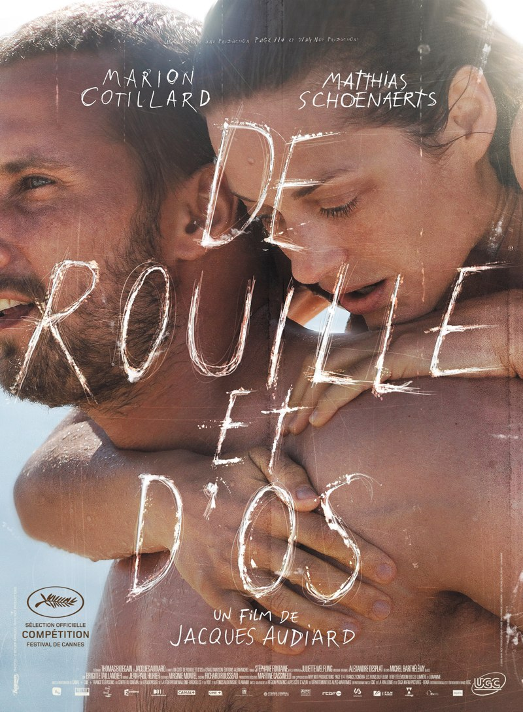

+++
type = "post"
titre = "<em>De rouille et d&rsquo;os</em>, Jacques Audiard"
title = "De rouille et d'os, Jacques Audiard"
url = "/rouille-os-audiard"
date = "2012-05-24T00:07:17"
Lastmod = "2014-02-17T14:57:09"
cover = "cotillard-schoenaerts-de-rouille-et-d-os.jpg"
categorie = [ "À voir" ]
tag = [ "Amour", "Drame", "Famille", "Handicap", "Romance", "Violence" ]
createur = [ "Jacques Audiard" ]
acteur = [ "Marion Cotillard", "Matthias Schoenaerts" ]
annee = [ "2012" ]
weight = 2012
pays = [ "Belgique", "France" ]

+++

Après l&rsquo;excellent huis clos carcéral d&rsquo;<em><a href="http://voiretmanger.fr/2009/08/28/un-prophete-audiard/">Un Prophète</a></em>, Jacques Audiard revient cette année dans les salles avec un genre bien différent. <em>De rouille et d&rsquo;os</em> raconte la naissance d&rsquo;un amour improbable entre une jeune femme qui perd ses deux jambes et un Belge un peu paumé et violent. Sur le papier, le film a tout pour déplaire et on craint le mélodrame parfaitement maîtrisé, mais c&rsquo;était sans compter sur la mise en scène sèche du réalisateur. Le film parvient ainsi à éviter les plus gros clichés du genre et il s&rsquo;avère finalement assez réussi…

Un homme marche sur le bord de la route. À ses côtés, un petit garçon en claquettes. Les deux ont une allure sale, ils ne sont sans doute pas lavés depuis longtemps. Ali et son fils quittent la Belgique qui ne leur offre manifestement aucun avenir, direction le sud de la France, direction Antibes où sa sœur, Anna, peut les héberger. Ali est très musclé, il a fait quelques années de boxe et il n&rsquo;hésite pas à montrer les poings. Très naturellement, il s&rsquo;oriente vers les métiers de sécurité et commence comme videur dans une boîte de nuit. Un soir, il sort une très belle femme d&rsquo;une bagarre à la sortie de la boîte. Stéphanie n&rsquo;est pas du même monde qu&rsquo;Ali, elle mène une vie bourgeoise avec son compagnon et travaille à Marineland où elle élève des orques. L&rsquo;un comme l&rsquo;autre semblent toutefois attirés et Ali lui laisse son numéro. Quelques semaines se passent, il n&rsquo;a aucune nouvelle jusqu&rsquo;au jour où Stéphanie se voit amputée des deux jambes suite à un accident de travail. La jeune femme digère très mal son handicap, elle n&rsquo;a plus envie de vivre et c&rsquo;est un appel à l&rsquo;aide qu&rsquo;elle lance à Ali en le contactant. Ce dernier accepte de la revoir et de l&rsquo;aider, sans pitié, comme s&rsquo;il n&rsquo;y avait pas de handicap. Entre les deux, des liens se tissent, mais Ali est-il prêt à succomber aux charmes de la jeune femme et à l&rsquo;aimer ?

<em>De rouille et d&rsquo;os</em> raconte une rencontre amoureuse assez classique. Il n&rsquo;est pas question ici de coup de foudre soudain : la relation amoureuse se construit dans le temps, elle met du temps à s&rsquo;installer. La première rencontre est toutefois déterminante. Ali est attiré par le corps de Stéphanie et cette dernière semble tout aussi intéressée, au point de faire monter le videur chez elle, où l&rsquo;attend pourtant son copain. Leur relation aurait pu en rester là, mais l&rsquo;accident rapproche les deux êtres. En acceptant d&rsquo;aider Stéphanie, Ali passe du temps avec elle, il apprend à la connaître et l&rsquo;apprécier. Jacques Audiard montre bien cependant qu&rsquo;il y a un décalage entre les deux. Alors qu&rsquo;elle rêve d&rsquo;aller plus loin avec lui, de former un vrai couple qui s&rsquo;aime, lui reste longtemps à l&rsquo;amie et éventuellement le plan sexe régulier. Le scénario de <em>De rouille et d&rsquo;os</em> s&rsquo;avère alors plus fin qu&rsquo;au premier abord. Tout oppose les deux personnages principaux : à l&rsquo;une la finesse, l&rsquo;argent, l&rsquo;intelligence ; à l&rsquo;autre la force, la violence et les plans sexes. L&rsquo;histoire du film semblait dès lors sur des rails, mais le cinéaste est suffisamment malin pour brouiller les pistes. Stéphanie prend du plaisir lors de ses rendez-vous purement charnels avec Ali, de même qu&rsquo;elle s&rsquo;habitue vite à la violence qui forge le quotidien de son amant. Veut-elle vraiment aller plus loin ? Le film se garde bien de trop en dire, mais ce n&rsquo;est pas si évident…

Depuis le considérable succès d&rsquo;<em><a href="http://voiretmanger.fr/2011/11/08/intouchables-toledano-nakache/">Intouchables</a></em>, le handicap semble être un sujet à la mode. Il serait pourtant totalement injuste de qualifier Jacques Audiard d&rsquo;opportuniste : si <em>De rouille et d&rsquo;os</em>, par la présence d&rsquo;un personnage principal handicapé, évoque le handicap, ce n&rsquo;est pas son sujet. Il est d&rsquo;ailleurs significatif que le personnage d&rsquo;Ali ne s&rsquo;intéresse jamais vraiment aux membres en moins de Stéphanie. Cet homme un peu bourru et simple ne traite pas cette dernière comme une handicapée, mais comme une personne normale et il ne lui passe rien. Ali l&rsquo;incite à se baigner, à danser en discothèque et même à faire l&rsquo;amour. Cette indifférence envers le handicap est précisément ce qui séduit la jeune femme. Quand elle se fait draguer en discothèque par un type qui s&rsquo;excuse en découvrant les prothèses, elle s&rsquo;énerve et devient même violente. Au contraire, le regard indifférent d&rsquo;Ali la fait sortir de sa léthargie et lui donne envie de se battre. Cet aspect est assez cliché, mais il faut reconnaître que <em>De rouille et d&rsquo;os</em> l&rsquo;évoque avec toute la finesse et la justesse nécessaires, si bien que le scénario ne semble jamais forcé.

Si <em>De rouille et d&rsquo;os</em> parvient à convaincre, c&rsquo;est d&rsquo;abord par la finesse d&rsquo;écriture de son scénario, mais aussi grâce à ses deux acteurs principaux. Croisé précédemment dans l&rsquo;excellent <em><a href="http://voiretmanger.fr/2012/02/23/bullhead-roskam/">Bullhead</a></em>, Matthias Schoenaerts se retrouve ici avec un rôle moins bovin, mais tout aussi bestial. L&rsquo;acteur compose à nouveau un personnage assez violent, renfermé, mais pas monolithique et Ali se révèle aussi délicat et attentionné qu&rsquo;il peut être violent. Marion Cotillard trouve de son côté un rôle qui lui convient et elle est ici fragile et touchante, loin des interprétations forcées que l&rsquo;on avait l&rsquo;habitude de voir dans ses incursions hollywoodiennes. Jacques Audiard n&rsquo;a plus rien à prouver en terme de réalisation, mais le mélodrame est un genre qui surprend un peu. De fait, <em>De rouille et d&rsquo;os</em> n&rsquo;est en rien une œuvre acidulée et légère, c&rsquo;est au contraire un film assez dur. Le rythme du film est assez élevé d&rsquo;un bout à l&rsquo;autre et la réalisation est efficace, même si le cinéaste donne parfois l&rsquo;impression de se regarder filmer. Les ralentis en particulier sont un peu trop présents, même s&rsquo;il faut avouer qu&rsquo;ils sont souvent à l&rsquo;origine de plans souvent spectaculaires, parfois très beaux. On peut en tout cas féliciter les choix musicaux de Jacques Audiard. Toujours de très bon goût — les nappes de violons attendues pour un tel film sont fort heureusement aux abonnés absents —, ils accompagnent l&rsquo;action en allant souvent à contresens.

<em>De rouille et d&rsquo;os</em> est une bonne surprise. Si Jacques Audiard ne signe pas là un chef-d&rsquo;œuvre ni même son meilleur film — <em>Un Prophète</em> me semble supérieur —, il propose une œuvre convaincante. Son histoire d&rsquo;amour est sincère et juste, ses personnages sont attachants et le film s&rsquo;avère très prenant. Sans aller jusqu&rsquo;à parler de thriller, <em>De rouille et d&rsquo;os</em> ménage une tension digne du genre et c&rsquo;est bien cela, la condition de sa réussite.

<h3>Vous voulez m&rsquo;aider ?<a href="#footnote_0_6533" id="identifier_0_6533" class="footnote-link footnote-identifier-link" title="&Agrave; propos de la publicit&eacute;&hellip;">1</a></h3>
<ul>
<li><a href="http://www.amazon.fr/gp/product/B0084C70UO/ref=as_li_ss_tl?ie=UTF8&tag=leblogdenic07-21&linkCode=as2&camp=1642&creative=19458&creativeASIN=B0084C70UO">Acheter le film en Blu-Ray sur Amazon</a></li>
<li><a href="http://www.amazon.fr/gp/product/B0084C70NQ/ref=as_li_ss_tl?ie=UTF8&tag=leblogdenic07-21&linkCode=as2&camp=1642&creative=19458&creativeASIN=B0084C70NQ">Acheter le film en DVD sur Amazon</a></li>
<li><a href="https://itunes.apple.com/fr/movie/de-rouille-et-dos/id557480771">Acheter ou louer le film sur l&rsquo;iTunes Store</a></li>
</ul>

<ol class="footnotes"><li id="footnote_0_6533" class="footnote"><a href="http://voiretmanger.fr/soutien/">À propos de la publicité…</a> [<a href="#identifier_0_6533" class="footnote-link footnote-back-link">&#8617;</a>]</li></ol>
