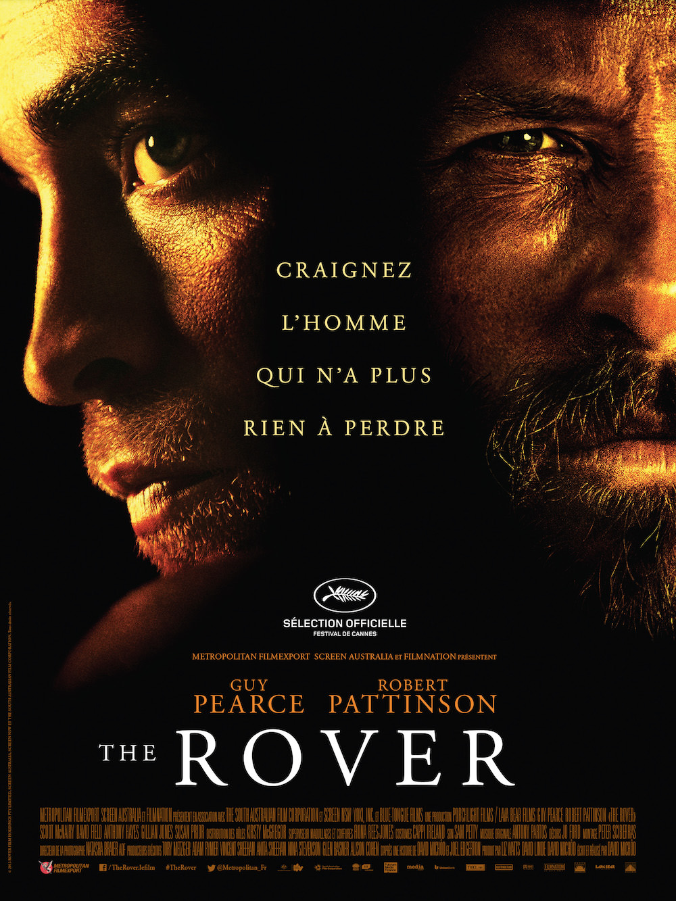
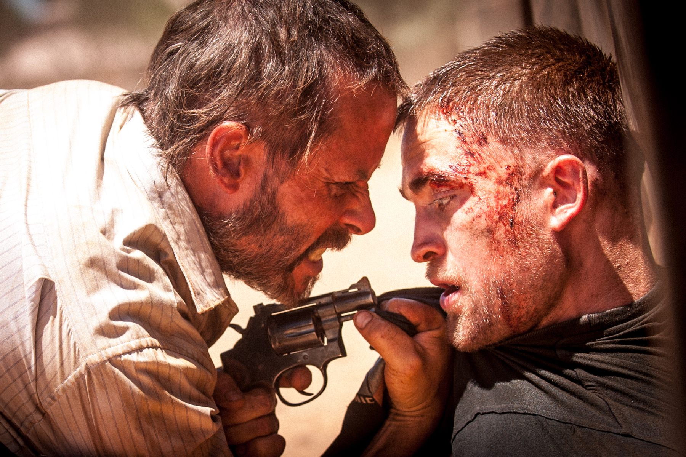
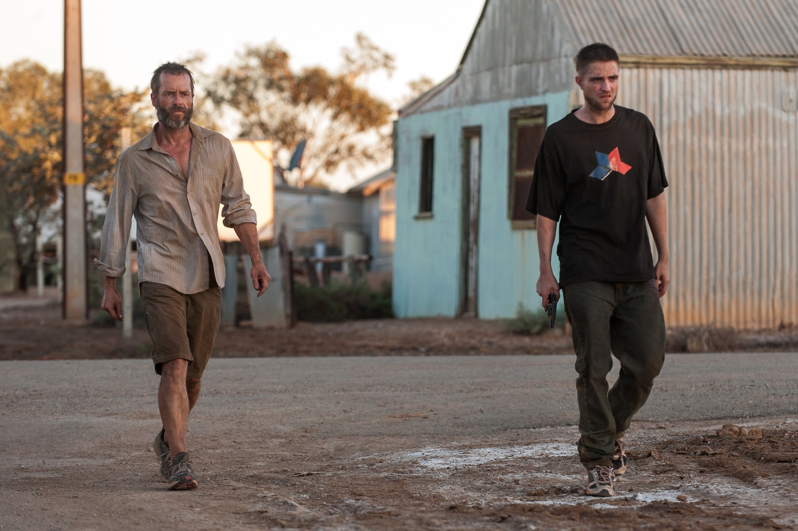

+++
type = "post"
titre = "<em>The Rover</em>, David Michôd"
title = "The Rover, David Michôd"
url = "/rover-michod"
date = "2014-06-08T17:11:22"
Lastmod = "2014-06-08T23:18:16"
cover = "the-rover-david-michod.jpg"
categorie = [ "À voir" ]
tag = [ "Apocalypse", "Drame", "Dystopie", "Famille", "Mort", "Road-movie", "Sorties du mois", "Violence" ]
createur = [ "David Michôd" ]
acteur = [ "David Field", "Guy Pearce", "Robert Pattinson", "Scoot McNairy" ]
annee = [ "2014" ]
weight = 2014
pays = [ "Australie", "États-Unis" ]

+++

David Michôd s’était fait remarquer en 2011 avec <a href="/animal-kingdom-michod/" title="Animal Kingdom, David Michôd"><em>Animal Kingdom</em></a>, un premier film coup de poing, psychologiquement violent et très réussi. Trois ans après, le deuxième long-métrage du cinéaste a été sélectionné à Cannes, une forme de reconnaissance qui montre bien qu’il n’a, déjà, plus rien à prouver. Après le drame familial, on change de registre avec une sorte de road-trip post-apocalyptique dans le désert australien. <em>The Rover</em> n’a rien d’un film de science-fiction, mais ce récit désespéré se passe dans un futur proche où les sociétés se seraient écroulées au profit du retour de la loi du plus fort et de la sauvagerie. David Michôd n’a rien perdu de son regard acéré et son propos reste aussi violent : <em>The Rover</em> n’est absolument pas un film plaisant, mais cette lutte pour leur survie de quelques hommes sans espoir est poignante. Une réussite.

David Michôd n’entend pas faire de la science-fiction, du moins pas au sens traditionnel du terme. <em>The Rover</em> se passe pourtant bien dans le futur, mais un futur si proche de nous qu’il nous semble totalement concevable dès aujourd’hui. Pour des raisons qui ne sont jamais données par le film, les sociétés capitalistes telles qu’on les connaît aujourd’hui ont connu une crise sans précédent qui a tout détruit. Il n’y a plus de travail nulle part, l’argent n’a plus aucune valeur et la société en est réduite à une lutte pour survivre. Seule l’Australie s’en sort un petit mieux, puisque le pays regorge d’un minerai indispensable qui fournit encore un peu de travail. Tel un western post-apocalyptique, des hommes sont prêts à tout pour y venir travailler, dans les pires conditions. Et comme dans l’Amérique en construction du XIXe siècle, ce ne sont pas les plus sympathiques que l’on retrouve : ici, il n’y a que des truands, des criminels ou des voleurs en quête d’un peu d’argent. <em>The Rover</em> impose en quelques minutes un univers particulier en ce qu’il est à la fois si familier et si différent. Le cinéaste s’est souvent contenté de poser sa caméra dans les immenses paysages désertiques de son pays, et il lui suffit souvent de poser quelques maisons délabrées et poussiéreuses pour créer un sentiment d’inconnue. Ce futur est si proche que les voitures n’ont pas changé, elles sont uniquement plus sales et cabossées. On roule toujours avec de l’essence qui s’achète à prix d’or, les armes fonctionnent toujours avec du plomb et de la poudre et on meurt toujours d’une blessure mal soignée. Au fond, David Michôd nous présente une vision désespérée de notre présent, ce qui explique sans doute pourquoi <em>The Rover</em> installe un climat de gène dès les premières images. Sans que l’on sache très bien pourquoi, on se sent oppressé par ce film impitoyable, et ce sentiment pénible ne quitte plus le spectateur jusqu’à la dernière minute. On sort de la salle soulagés de voir la lumière, et c’est bien le signe que le long-métrage a atteint son objectif.

Dans cette ambiance désespérée, <em>The Rover</em> suit deux hommes qui n’ont pas beaucoup plus de chance. Eric est un Australien au passé trouble, mais qui a tout perdu quand le film commence. Il ne lui reste plus qu’une voiture et lorsque trois bandits lui volent le véhicule, sa colère froide et qui semblait éteinte entre en action. Il met tout en œuvre pour retrouver son seul bien, quitte à kidnapper Rey, le frère de l’un des bandits, abandonné laissé pour mort après un vol qui s’est mal placé. Les deux hommes se mettent en quête de la voiture et donc des malfrats et le film de David Michôd prend ainsi des traits du road-movie, même s’il est assez clair dès le début que cette quête ne mènera nulle part. Rey est un Américain, venu avec son frère en Australie en quête d’un travail, mais les deux frères n’ont trouvé que la violence et le vol pour survivre. Interprété par un Robert Pattinson bien éloigné désormais de ses prestations dans la <a href="/saga/twilight/">saga <em>Twilight</em></a>, ce personnage est touchant par ses tics et ses difficultés à agir comme on attend de lui, mais il se révèle aussi vite impitoyable quand le récit avance. C’est Eric qui impressionne le plus toutefois : Guy Pearce, impeccable, compose un personnage à la fois vidé par une vie qui n’a plus de sens, et rongé par une colère profonde qui le pousse à tuer de sang-froid, presque sans y prêter attention. <em>The Rover</em> rassemble ainsi deux personnages très différents, forcés par des circonstances exceptionnelles à avancer ensemble. Même si le scénario manque parfois de logique — certaines actions sont particulièrement stupides, en particulier vers la fin —, David Michôd tient son sujet avec beaucoup de force et, tout en prenant son temps pour poser ses personnages, ses paysages et son ambiance, il sait entretenir la dose de suspense nécessaire. Ce long-métrage n’a rien du thriller naturellement, mais on se demande bien comment il peut terminer et on a des surprises jusqu’au bout, même si on ne s’attend jamais à un <em>happy-end</em>, une perspective qui semble hors de propos dès le départ.

<em>The Rover</em> est, à nouveau, un film coup-de-poing. Plus ample que son prédécesseur, le deuxième long-métrage de David Michôd est désespéré, poisseux et si pessimiste qu’il en devient presque pénible à regarder. Ce n’est pas un défaut, bien au contraire : dans ce western post-apocalyptique, l’homme survit comme il peut et ce n’est pas très glorieux. <em>The Rover</em> n’est pas un divertissement plaisant, mais il n’en est pas moins une œuvre radicale et réussie, à ne pas rater.

