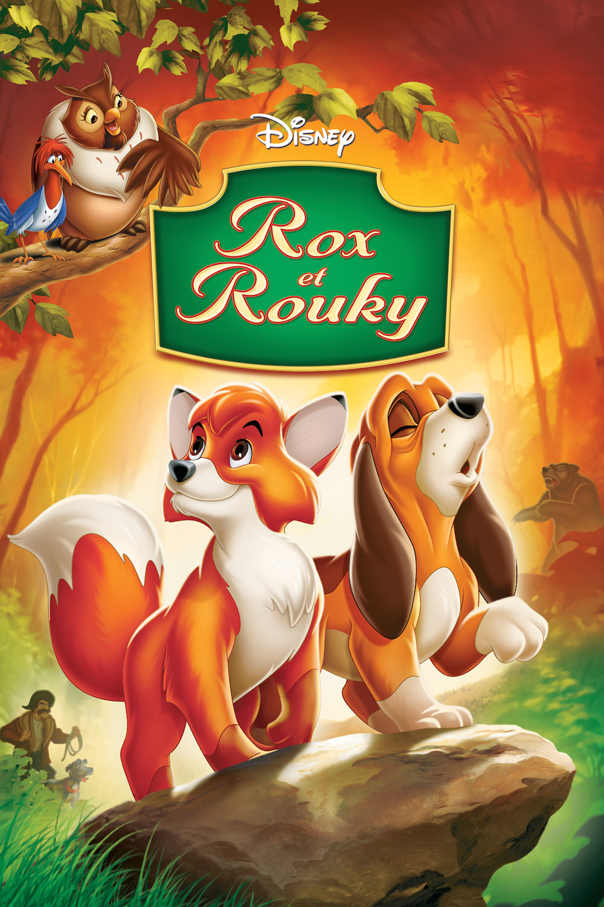
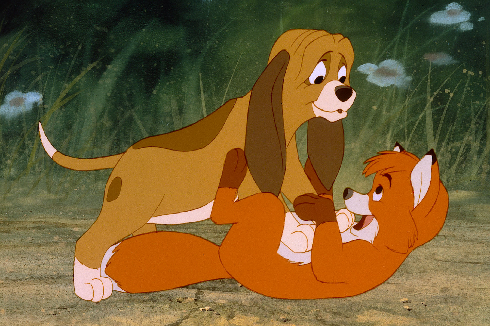
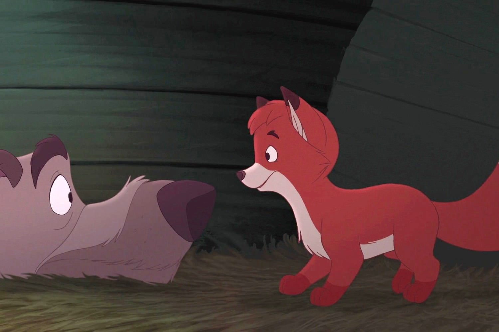

+++
titre = "<em>Rox et Rouky</em>, Ted Berman, Richard Rich et Art Stevens"
title = "Rox et Rouky, Ted Berman, Richard Rich et Art Stevens"
url = "/rox-rouky-berman-rich-stevens"
date = "2014-05-04T20:46:35"
Lastmod = "2014-05-04T20:48:36"
cover = "disney-rox-et-rouky.jpg"
categorie = [ "À voir" ]
tag = [ "Amitié", "Animation", "Animaux", "Drame", "Enfance", "Morale" ]
createur = [ "Art Stevens", "Richard Rich", "Ted Berman", "Walt Disney" ]
annee = [ "1981" ]
weight = 1981
saga = [ "Classiques d'animation Disney" ]
pays = [ "États-Unis" ]
original = "The Fox and the Hound"

+++

Puisque les animaux lui ont offert des films à succès par le passé, le studio Disney semble incapable d’en sortir. Depuis <a href="http://voiretmanger.fr/livre-jungle-reitherman/" title="Le Livre de la Jungle, Wolfgang Reitherman"><em>Le Livre de la Jungle</em></a>, sorti quatorze ans avant <em>Rox et Rouky</em>, on n’a eu exclusivement des films animaliers. Et même si la relève commence à poindre son nez avec ce vingt-quatrième classique, les productions Disney restent ancrées dans un schéma bien établi. Wolfgang Reitherman a cédé sa place, même si le long-métrage signé Ted Berman, Richard Rich et Art Stevens reste supervisé par le cinéaste qui occupe ici le place de producteur. Pour le reste, le sentiment de déjà-vu qui s’est emparé des productions du studio ne disparaît pas, mais ce <em>Rox et Rouky</em> séduira les plus jeunes par son caractère charmant, malgré la gravité de certaines scènes.

<em>Rox et Rouky</em> est le dernier <a href="http://voiretmanger.fr/saga/classiques-danimation-disney/">classique Disney</a> à commencer par un générique intégral et à se terminer sur le fameux « <em>The End</em> ». <em>Taram et le Chaudron magique</em> qui suit quatre ans plus tard ouvre sur l’action et se termine avec le générique, comme tous les films modernes. Cela n’a aucune importance, mais c’est un symbole des changements à l’œuvre dans le studio. Depuis la mort de Walt Disney, le fondateur, on ne sait pas trop que faire, si ce n’est reprendre toujours la même formule. Les années 1980 ne seront pas riches en innovation sur ce point, jusqu’à la toute fin et le retour du studio à un grand niveau avec <em>La Petite Sirène</em>. En attendant, c’est un livre de Daniel P. Mannix publié à la fin des années 1960 qui sert de base au nouveau film. La gestation de ce <em>Rox et Rouky</em> a été longue, perturbée par des luttes en interne entre deux camps. D’un côté, Wolfgang Reitherman qui a été sans doute l’acteur le plus important du studio depuis <a href="http://voiretmanger.fr/101-dalmatiens-geronimi-luske-reitherman/" title="Les 101 Dalmatiens, Clyde Geronimi, Hamilton Luske et Wolfgang Reitherman"><em>Les 101 Dalmatiens</em></a>, vint ans auparavant. On imagine qu’il voulait réaliser ce nouveau film et il avait apparemment sa propre idée de ce que <em>Rox et Rouky</em> devait être. Face à lui, des animateurs plus jeunes qui voient les choses différemment et qui essaient d’imposer leurs idées. Ainsi, la production commence dès la sortie de <a href="http://voiretmanger.fr/aventures-bernard-et-bianca-reitherman-stevens-lounsbery/" title="Les Aventures de Bernard et Bianca, Wolfgang Reitherman, Art Stevens et John Lounsbery"><em>Les Aventures de Bernard et Bianca</em></a>, le précédent classique, en 1977. Mais très vite, les conflits sont tels qu’une partie de l’équipe quitte le navire, retardant de quelques années la sortie de ce nouvel opus. Quand le long-métrage sort enfin, à l’été 1981, on peut sentir que la relève a gagné : Wolfgang Reitherman n’est plus qu’un producteur parmi d’autres, et surtout ses idées n’ont pas été retenues. Tous ces combats en interne sont importants pour comprendre l’histoire de Walt Disney, mais ils n’ont en fait qu’un impact limité sur <em>Rox et Rouky</em>. Le résultat, à l’écran, reste en effet extrêmement conventionnel.

Dès le générique d’ouverture, la référence est évidente : alors même que l’on ne sait rien de l’histoire, par le style déjà, <em>Rox et Rouky</em> évoque <a href="http://voiretmanger.fr/bambi-hand/" title="Bambi, David Hand"><em>Bambi</em></a>. La référence est telle que l’on peut parler d’affiliation et ces lents travelings dans une forêt qui reprend exactement les codes du cinquième classique du studio Disney sont trop similaires pour que ce ne soit pas voulu. Au-delà du style, l’histoire elle-même est proche : avant même que l’intrigue ne s’installe, on a un jeune animal abandonné parce que sa mère a été tuée par des chasseurs. Même si le faon cède la place à un petit renard, la proximité n’en est pas moins troublante, mais Ted Berman, Richard Rich et Art Stevens choisissent de ne pas se concentrer exclusivement sur les animaux. Ici, les hommes occupent une place importante, essentielle même, puisque ce sont à cause d’eux que l’histoire tourne mal. À l’origine, le renardeau Rox rencontre son voisin, le chiot Rouky, et les deux animaux ignorant qu’elles sont censées s’entretuer, se lient d’amitié. Une période de paix joyeuse qui ne dure pas : le maître de Rouky l’emmène à la chasse pour le former et le gentil chiot devient un dangereux chien de chasse. Face à ce conditionnement, l’amitié d’enfance a du mal et le conflit est inéluctable. Cela faisait longtemps que les studios Disney n’avaient pas choisi d’illustrer une morale assez simple avec l’un de leurs classiques. <em>Rox et Rouky</em> évoque, par le biais d’animaux, une amitié d’enfance ruinée par les contraintes de la société, ce qui est une idée assez moderne d’ailleurs. Le ton est très enfantin, mais le sujet n’en est pas moins bien vu et plutôt bien raconté. Dommage, toutefois, que l’on ait autant le sentiment de déjà-vu : fallait-il vraiment reprendre des séquences entières de <em>Bambi</em>, comme ces passages de familles d’oiseaux à un moment donné ? On sent que le studio essaie d’économiser au maximum ou manque d’idées nouvelles et ce ne sont pas les chansons ridicules au possible qui viennent aider.

<em>Rox et Rouky</em> n’est pas un mauvais Disney, et c’est même un bon film d’animation pour les plus jeunes. Pour les autres, le ton un peu trop enfantin et les redites gâchent un peu le plaisir, même s’il faut reconnaître que le sujet est, au fond, plus intéressant qu’à première vue. À ce titre, ce vingt-quatrième classique mérite qu’on s’y intéresse, d’autant qu’il est le premier signe d’une transition à l’œuvre pour le studio.

<h3>Vous voulez <a href="http://voiretmanger.fr/soutien/">m’aider</a> ?</h3>
<ul>
<li><a href="http://www.amazon.fr/gp/product/B007MFUGEG/ref=as_li_ss_tl?ie=UTF8&amp;tag=leblogdenic07-21&amp;linkCode=as2&amp;camp=1642&amp;creative=19458&amp;creativeASIN=B007MFUGEG">Acheter le film en Blu-ray sur Amazon</a></li>
<li><a href="http://www.amazon.fr/gp/product/B000LXS8CS/ref=as_li_ss_tl?ie=UTF8&amp;tag=leblogdenic07-21&amp;linkCode=as2&amp;camp=1642&amp;creative=19458&amp;creativeASIN=B000LXS8CS">Acheter le film en DVD sur Amazon</a></li>
<li><a href="https://itunes.apple.com/fr/movie/rox-et-rouky/id369583049">Acheter ou louer le film sur l’iTunes Store</a></li>
</ul>

