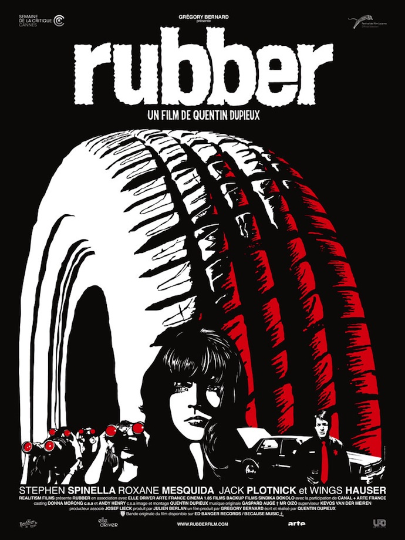
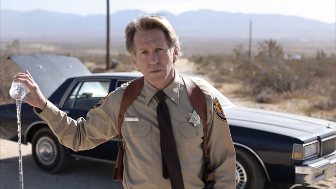

+++
type = "post"
titre = "<em>Rubber</em>, Quentin Dupieux"
title = "Rubber, Quentin Dupieux"
url = "/rubber-dupieux"
date = "2010-11-11T23:52:30"
Lastmod = "2015-02-19T23:20:14"
cover = "rubber-dupieux.jpg"
categorie = [ "À voir" ]
tag = [ "Absurde", "Horreur", "Humour", "Philosophie", "Société" ]
createur = [ "Quentin Dupieux" ]
acteur = [ "Jack Plotnick", "Roxane Mesquida", "Stephen Spinella" ]
annee = [ "2010" ]
weight = 2010
pays = [ "France" ]

+++

<em>Rubber</em> ou l&rsquo;histoire de Robert, un pneu serial-killer. Dire cela, c&rsquo;est tout dire sur le délire complet du film de Quentin Dupieux, mais c&rsquo;est aussi ne rien dire. Partisan de l&rsquo;absurde, au sens du théâtre de l&rsquo;absurde ou du <em><a href="http://en.wikipedia.org/wiki/Nonsense">nonsense</a></em> à l&rsquo;anglaise, ce film pose d&rsquo;emblée le principe que le monde est régi non par des règles rationnelles, mais par l&rsquo;absurde renommé &laquo;&nbsp;<em>no reason</em>&nbsp;&raquo; dans le film. Derrière la blague un peu potache du pneu aux pouvoirs psychiques, c&rsquo;est une véritable réflexion sur le sens du cinéma, du spectacle et des spectateurs qui se met en place. Étonnant, drôle, brillant.

Un homme dans le désert californien, il tient dans chaque main des jumelles. Une voiture noire arrive et renverse méticuleusement la dizaine de chaises noires installées le long de la route. Elle s&rsquo;arrête devant l&rsquo;homme aux jumelles, le coffre s&rsquo;ouvre et un shérif en sort. Il contourne la voiture, échange ses lunettes contre un verre d&rsquo;eau puis s&rsquo;avance devant la caméra pour s&rsquo;adresser à nous, spectateurs. Il explique que tous les grands films fonctionnent pour des raisons qui restent largement inconnues, voire absentes : pourquoi l&rsquo;extraterrestre d&rsquo;<em>E.T.</em> est marron, pourquoi le président est tué par un inconnu dans <em>JFK</em>, pourquoi dans <em>Massacre à la tronçonneuse</em> les héros ne vont pas aux toilettes comme tout le monde… ? À chaque fois, il répond &laquo;&nbsp;<em>no reason</em>&laquo;&nbsp;, embraye sur des exemples de la vie courante avant d&rsquo;expliquer que le film qui va suivre est une ode à la gloire du &laquo;&nbsp;<em>no reason</em>&laquo;&nbsp;. Il vide alors son verre sur le sol, rentre dans le coffre et la voiture repart alors que l&rsquo;homme aux jumelles distribue ses instruments optiques aux spectateurs. Une dizaine d&rsquo;hommes, femmes et enfants que l&rsquo;on devine de tout âge et de toute condition qui, à l&rsquo;aide de jumelles, assiste à un film… l&rsquo;histoire du pneu serial-killer.

En quelques minutes, le pré-générique de <em>Rubber</em> a tout dit et propose un programme pour le moins alléchant où le n&rsquo;importe quoi succédera à encore plus de n&rsquo;importe quoi. Et de fait, on découvre la naissance du pneu conscient et doté de la capacité à se mouvoir seul. Comme un nourrisson, il a d&rsquo;abord du mal à se tenir droit sans tomber, mais finit par maîtriser son &laquo;&nbsp;corps&nbsp;&raquo; et à rouler en contrôlant sa trajectoire. Il découvre alors son environnement, sous la forme de &laquo;&nbsp;rencontres&nbsp;&raquo; successives : d&rsquo;abord avec une bouteille en plastique, puis une autre en verre, une canette et puis des animaux, un scorpion et un lapin. À chaque fois, le sadisme du pneu est évident et il prend un malin plaisir à écrabouiller tout ce qu&rsquo;il rencontre, ou à les exploser quand l&rsquo;élément lui résiste. C&rsquo;est que le pneu est aussi télépathe et peut faire exploser ses victimes à distance, ou au moins leur tête pour les humains, ce qui est largement suffisant. Commence alors une véritable chasse au pneu : les cadavres s&rsquo;accumulent et la police… tout cela devant les yeux des spectateurs. Reprenant à son compte le fameux principe du théâtre dans le théâtre, <em>Rubber</em> propose ainsi une sorte de film dans le film, mais régi là encore par l&rsquo;absurde permanent. Ainsi, les spectateurs sont censés rester sur place pendant plusieurs jours sans manger, jusqu&rsquo;à ce qu&rsquo;on leur apporte une dinde empoisonnée sur laquelle ils se jettent tous, affamés, avant de mourir dans d&rsquo;horribles douleurs. Le pneu de son côté continue sa vie de serial-killer qui est finalement une vie très normale : il dort dans les motels, se lave, regarde la télévision et s&rsquo;il n&rsquo;y avait la forme, disons particulières, et un goût prononcé et peu recommandable pour les meurtres, il s&rsquo;agirait d&rsquo;un individu tout à fait correct.   L&rsquo;humanité du pneu ressort assez bien, à tel point que l&rsquo;on en oublierait presque sa nature pneumatique. Dans l&rsquo;esprit du <em>nonsense</em>, c&rsquo;est quand même très fort…

Mais <em>Rubber</em> n&rsquo;est pas que le pari un peu stupide &laquo;&nbsp;faire un film sur un pneu serial-killer&nbsp;&raquo; que l&rsquo;on imagine bien avoir été pris après une soirée entre amis bien arrosée. C&rsquo;est cela, certes, mais c&rsquo;est aussi, l&rsquo;air de rien, une réflexion très intéressante sur notre société et sur le cinéma. Un élément central du film est ainsi le groupe de spectateurs qui est évidemment l&rsquo;incarnation des vrais spectateurs du film, nous, à l&rsquo;intérieur du film. Ce dispositif n&rsquo;est pas nouveau, mais il est ici très bien exploité et sert de structure au film, notamment en permettant au scénario d&rsquo;avancer. Le pneu seul aurait été sans doute répétitif et ennuyeux, alors que le pneu commenté par le groupe de spectateurs est vraiment la bonne idée du film et souvent source d&rsquo;humour. Ce groupe représentatif d&rsquo;une partie de la société américaine comme souvent révèle la vraie nature humaine : ils sont tous voyeurs par excellence, avec leurs jumelles et leurs commentaires de jouissance quand le pneu commet ses premiers meurtres. Ils commentent tous abondamment, se demandent si un pneu n&rsquo;est pas censé flotter, mais aucun ne penserait intervenir. On leur a dit que c&rsquo;était du cinéma, à aucun moment l&rsquo;un d&rsquo;entre eux ne remet en cause cette assertion, allant jusqu&rsquo;à intervenir pour demander plus d&rsquo;action… Des voyeurs qui retournent à l&rsquo;état animal à la première occasion : dans une variante absurde d&rsquo;un jeu de télé-réalité tel que Koh-Lanta, les spectateurs restent sur place sans boire ni manger pendant plusieurs jours et quand une dinde leur est apportée, ils se jettent tous dessus comme une meute de chiens affamés, sans plus aucun respect pour l&rsquo;être humain. L&rsquo;histoire du pneu est censée n&rsquo;être qu&rsquo;un film pour les spectateurs, et <em>Rubber</em> montre bien que le film n&rsquo;existe que pour eux. À un moment donné, alors que le shérif est en train d&rsquo;interroger un suspect suite à un meurtre commis par le pneu, l&rsquo;interrogatoire s&rsquo;arrête brusquement quand la montre du shérif sonne, indiquant que le poison de la dinde a maintenant agi. Dès lors, il n&rsquo;y a plus de spectateurs pour regarder et il n&rsquo;y a plus aucune raison de continuer la comédie. Ce qui est intéressant, c&rsquo;est qu&rsquo;il est le seul à en être conscient et doit convaincre ses collègues éberlués. Sauf qu&rsquo;un des spectateurs n&rsquo;avait pas mangé de dinde et donc, dans la logique absurde du film, la fiction du pneu se poursuit et devient réelle alors que le nombre de victimes augmente de manière exponentielle. Reprenant à son compte certaines théories philosophiques qui disent que le monde n&rsquo;existe que par le regard de l&rsquo;homme, <em>Rubber</em> peut en fait faire l&rsquo;objet d&rsquo;une lecture beaucoup plus complexe que celle à laquelle on pouvait s&rsquo;attendre à la lecture du synopsis.

Quentin Dupieux a beau être partisan de l&rsquo;absurde et du &laquo;&nbsp;<em>no reason</em>&laquo;&nbsp;, il n&rsquo;en filme pas moins avec sérieux et un certain talent. <em>Rubber</em> est en effet marqué par une réalisation soignée qui met bien en avant le désert de Californie. Les cadres sont tantôt larges, tantôt resserrés sur le pneu avec un jeu efficace sur la distance focale et les flous. Sans être radicalement originale, la réalisation est plaisante et offre à ce film par ailleurs foutraque un cadre relativement classique bienvenu. Au-delà de la photographie, les responsables des effets spéciaux ont travaillé d&rsquo;arrache-pied sur le pneu pour l&rsquo;humaniser et il faut bien avouer que le résultat est bluffant. Ils ne se sont pas contentés de faire tourner un pneu en supprimant les cordages et autres artifices techniques, ils ont donné des sentiments à un bout de caoutchouc. Cela ne passe pas par beaucoup de choses : il se tourne comme s&rsquo;il avait un dos et un visage, il &laquo;&nbsp;tâte&nbsp;&raquo; la bouteille en verre et il semble vraiment capable de penser. On pourrait juger le voir bouillonner de colère quand il voit une décharge où l&rsquo;on brule des pneus ou quand il regarde une course automobile. Le film parvient presque à nous faire oublier qu&rsquo;il s&rsquo;agit d&rsquo;un pneu, c&rsquo;est quand même une belle performance, même si l&rsquo;ambiance absurde y contribue largement.

Un pneu serial-killer… voilà qui aurait fait un bon sketch pour les Monty-Pythons. On pense en effet aux maîtres de l&rsquo;absurde en regardant <em>Rubber</em>, on y retrouve ce sérieux implacable quand il s&rsquo;agit d&rsquo;assumer un délire complet. Quentin Dupieux fait une ode au n&rsquo;importe quoi, mais il le fait bien. Le résultat est à la fois loufoque, drôle et en même temps pas si idiot que cela pourrait en avoir l&rsquo;air : le film se paye ainsi le luxe d&rsquo;offrir aux spectateurs qui veulent bien le voir plus qu&rsquo;une simple plaisanterie sur un pneu. <em>Rubber</em> offre une réflexion méta-cinématographique plutôt intéressante, même si le ton n&rsquo;est pas aux grands discours théoriques. En tout cas, je n&rsquo;y croyais pas vraiment à cette histoire de pneu serial-killer, mais je dois avouer avoir été totalement sous le charme. Comme quoi, un scénario complexe n&rsquo;est pas toujours nécessaire…

Je ne serais pas allé voir <em>Rubber</em> sans les critiques élogieuses d&rsquo;<a href="http://www.plan-c.fr/article-critique-rubber-de-quentin-dupieux-56937249.html">Alexandre</a>, <a href="http://www.toujoursraison.com/2010/11/rubber.html">Rob Gordon</a> et <a href="http://www.critikat.com/Rubber.html">Critikat</a>.

<h3>Vous voulez m&rsquo;aider ?</h3>
<ul>
<li><a href="http://www.amazon.fr/gp/product/B004OQJSVS/ref=as_li_ss_tl?ie=UTF8&tag=leblogdenic07-21&linkCode=as2&camp=1642&creative=19458&creativeASIN=B004OQJSVS">Acheter le film en Blu-Ray sur Amazon</a></li>
<li><a href="http://www.amazon.fr/gp/product/B004NF8V0E/ref=as_li_ss_tl?ie=UTF8&tag=leblogdenic07-21&linkCode=as2&camp=1642&creative=19458&creativeASIN=B004NF8V0E">Acheter le film en DVD sur Amazon</a></li>
<li><a href="https://itunes.apple.com/fr/movie/rubber/id401294092">Acheter ou louer le film sur l&rsquo;iTunes Store</a></li>
</ul>

