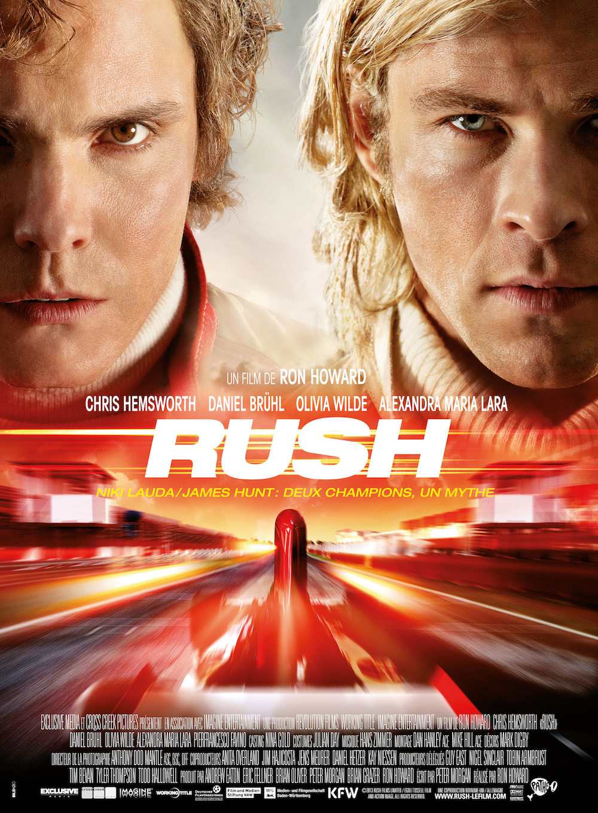
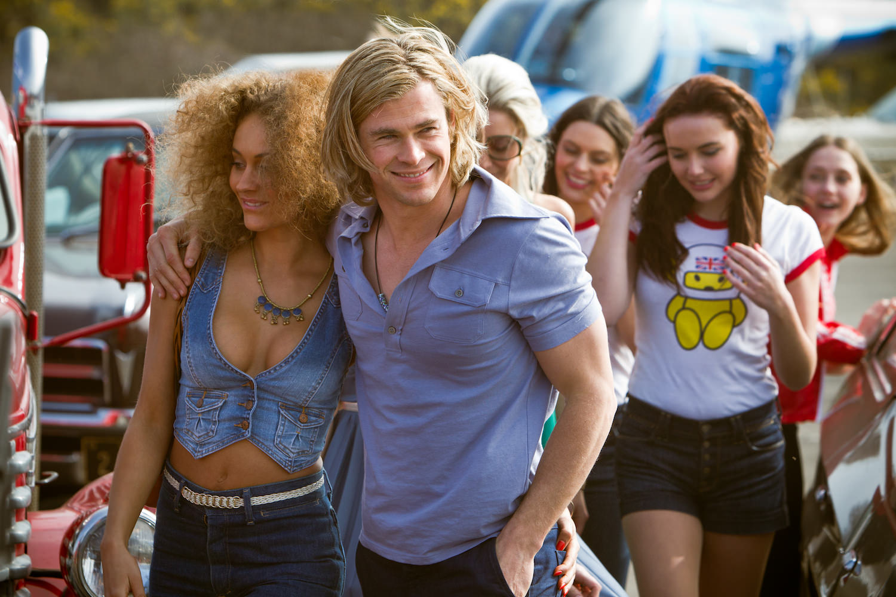
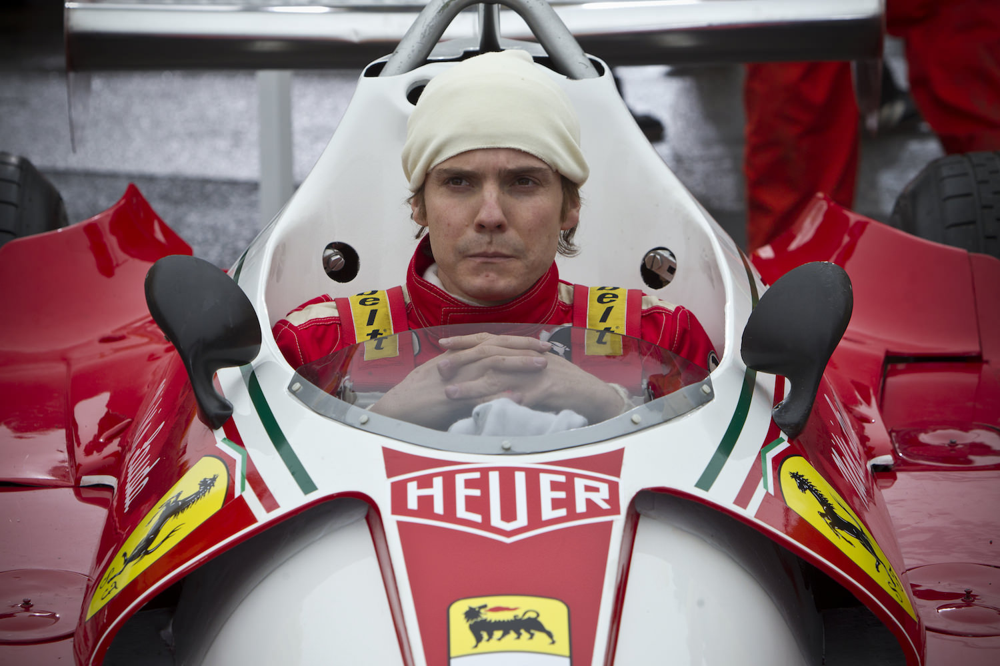

+++
titre = "<em>Rush</em>, Ron Howard"
title = "Rush, Ron Howard"
url = "/rush-howard"
date = "2013-10-02T23:21:50"
Lastmod = "2015-02-04T00:06:08"
cover = "rush-howard-bruhl-hemsworth.jpg"
categorie = [ "À voir" ]
tag = [ "Action", "Blockbuster", "Course", "Histoire vraie", "Sport", "Voiture" ]
createur = [ "Ron Howard" ]
acteur = [ "Alexandra Maria Lara", "Chris Hemworth", "Daniel Brühl", "Olivia Wilde", "Pierfrancesco Favino" ]
annee = [ "2013" ]
weight = 2013
pays = [ "États-Unis" ]

+++

Sur le papier, <em>Rush</em> a de quoi refroidir les ardeurs de tous ceux qui ne comprennent vraiment pas quel peut être l’intérêt de voir des voitures tourner en rond pendant des dizaines et des dizaines de tour. Ron Howard s’attaque à un sujet difficile sur le papier, mais il s’y intéresse par l’angle de la confrontation de deux hommes, sujet universel s’il en est. L’affiche ne laisse d’ailleurs aucun doute sur le sujet du film : « <em>Niki Lauda / James Hunt : deux champions, un mythe</em> ». De fait, pour les amateurs de Formule 1, ces noms sont associés à un Grand Prix de légende en 1976. À partir de ces deux parcours exceptionnels, le cinéaste tisse une histoire intense qui fera aimer la F1 même aux plus réfractaires. <em>Rush</em> filme la course automobile avec une force rarement vue au cinéma et un suspense intense que l’on conseillera de préserver en ne lisant rien sur le sujet avant la séance, surtout si on ne connaît pas l’histoire de ces deux pilotes.

On le comprend d’emblée, le principe de <em>Rush</em> est d’opposer deux hommes radicalement opposés. James Hunt est l’archétype du <em>bad boy</em> : ce jeune Britannique est le champion d’une petite équipe aristocratique dirigée par un Lord passionné d’automobile. Fêtard, le pilote entend profiter de la vie et d’en profiter pleinement : il enchaîne les conquêtes d’un soir, boit un peu de tout jusqu’aux veilles des compétitions et prend la compétition avec désinvolture. Ce qui lui plait, c’est de défier la mort sur le circuit car, dit-il, les femmes le sentent et c’est grâce à cette aptitude qu’il parvient à les séduire. Face à lui, Ron Howard commence par dessiner un portrait qui ne saurait être plus radicalement différent. Niki Lauda est un pilote autrichien issu d’une famille d’hommes d’affaires extrêmement riche, mais qui le renie pour sa passion automobile. Une passion qu’il vit avec précision et sévérité : travailleur acharné, il fait tout pour se préparer et maîtrise autant la conduite que la mécanique, ce qui lui permet de rouler vite et bien, mais aussi d’améliorer ses voitures. <em>Rush</em> les oppose tout d’abord comme la presse et l’opinion populaire les opposaient à l’époque : à la rigueur germanique répond l’insouciance britannique et les deux pilotes deviennent vite ennemis jurés. Alors que Niki Lauda gagne successivement plusieurs Grands Prix, James Hunt devient littéralement obsédé à l’idée d’en remporter un et l’affrontement est total en 1976. Ron Howard a toutefois l’excellente idée de ne pas en rester à cette opposition manichéenne. Plus son film avance et plus ces deux personnages inconciliables se rapprochent et se confondent. Finalement, leur obsession est la même et leurs réussites sont d’abord liées à leur envie tenace de battre l’autre. Sans cette carotte, ces pilotes ambitieux ne seraient sans doute jamais devenus des champions et <em>Rush</em> le montre bien. Le long-métrage sait même faire preuve d’une étonnante subtilité à cet égard, même si le blockbuster massif reprend vite ses droits.

Au-delà de l’opposition passionnante de ces deux pilotes si différents, la force de <em>Rush</em> est incontestablement la course. Même si vous ne comprenez rien à la Formule 1, même si ce sport est celui qui vous intéresse le moins, vous allez être emporté par toutes les émotions que Ron Howard parvient à rassembler sur les différents circuits que l’on traverse. Sans parler de grand film, on peut quand même noter le soin apporté à la réalisation et à la photographie du long-métrage : l’image est souvent granuleuse comme les films d’époque, tandis que le montage extrêmement nerveux convient tout particulièrement au sujet. Le réalisateur pose sa caméra au cœur de la compétition, entre les voitures qui rugissent, les pneus qui crissent, la foule en délire, mais aussi les accidents, souvent mortels. <em>Rush</em> ne nous épargne rien et quelques scènes pourront choquer les plus sensibles, c’est le revers de la médaille que Ron Howard a sans doute tenu à montrer pour rappeler à quel point ce sport est dangereux. C’est d’ailleurs un leitmotiv et la peur de la mort revient très régulièrement dans le scénario qui en fait même un moteur de l’action. Si, côté face, on craint en permanence pour la vie de ces pilotes totalement dingues — ils le reconnaissent eux-mêmes, une personne saine d’esprit ne ferait jamais ces courses —, le côté pile le compense largement. Posant ses caméras au cœur de l’action, et même parfois au cœur des moteurs, <em>Rush</em> en met plein la vue et le spectacle est assurément au rendez-vous. Même si on aurait aimé plus de plans au ras du bitume, comme si on était la voiture, force est de constater que Ron Howard a bien su rendre les sensations de vitesse de ces bolides légers et très puissants. C’est extrêmement efficace et on redemande, même si on sent en permanence la menace de l’accident, une menace qui se concrétise immanquablement. Les voitures sont au cœur des enjeux et le long-métrage est une belle démonstration, mais qui resterait bien vaine sans ses personnages principaux. Les vraies stars restent ainsi les acteurs : Chris Hemsworth est plutôt séduisant dans son rôle de James Hunt, mais c’est surtout l’acteur allemand Daniel Brühl qui séduit dans le rôle de Niki Lauda.

<em>Rush</em> est un blockbuster avec tout ce qu’il implique de conventions — envolées lyriques un peu trop appuyées, scénario parfois un peu caricatural —, mais cela n’enlève rien à sa puissance. Que l’on aime ou non la Formule 1, on ne peut qu’être happé par l’intensité de ces courses où les pilotes risquent tout, jusqu’à leur vie, par amour du sport. Ron Howard a parfaitement su capter cette détermination et c’est sans doute ce qui explique la réussite de son dernier long-métrage, tandis que l’histoire de ces deux pilotes pas si différents est passionnante. Pas un grand film, non, mais du grand spectacle techniquement réussi qui mérite d’être vu…

<h3>Vous voulez <a href="http://voiretmanger.fr/soutien/">m&rsquo;aider</a> ?</h3>
<ul>
<li><a href="http://www.amazon.fr/gp/product/B00F4T4DOG/ref=as_li_ss_tl?ie=UTF8&amp;tag=leblogdenic07-21&amp;linkCode=as2&amp;camp=1642&amp;creative=19458&amp;creativeASIN=B00F4T4DOG">Acheter le film en Blu-ray sur Amazon</a></li>
<li><a href="http://www.amazon.fr/gp/product/B00IXZGB7A/ref=as_li_ss_tl?ie=UTF8&amp;tag=leblogdenic07-21&amp;linkCode=as2&amp;camp=1642&amp;creative=19458&amp;creativeASIN=B00IXZGB7A">Acheter le film en DVD sur Amazon</a></li>
<li><a href="https://itunes.apple.com/fr/movie/rush/id768588129">Acheter ou louer le film sur l&rsquo;iTunes Store</a></li>
</ul>

