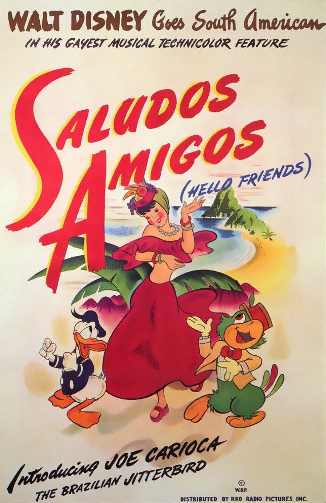
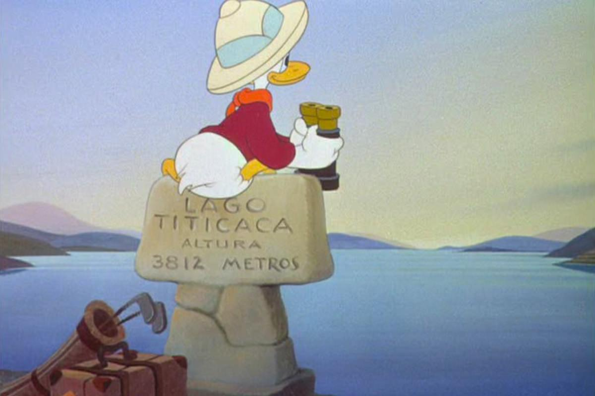
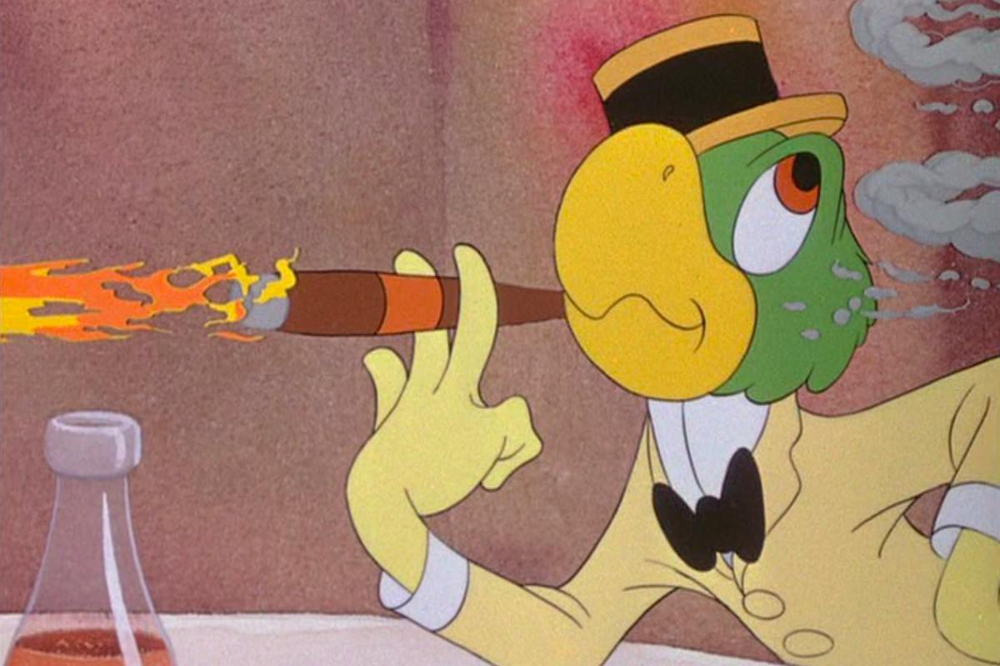

+++
titre = "<em>Saludos Amigos</em>, Norman Ferguson"
title = "Saludos Amigos, Norman Ferguson"
url = "/saludos-amigos-ferguson"
date = "2014-02-01T18:54:57"
Lastmod = "2014-01-31T18:58:00"
cover = "saludos-amigos-walt-disney.jpg"
categorie = [ "À voir" ]
tag = [ "Animation", "Avion", "Documentaire", "Propagande", "Tourisme" ]
createur = [ "Norman Ferguson", "Walt Disney" ]
annee = [ "1942" ]
weight = 1942
saga = [ "Classiques d'animation Disney" ]
pays = [ "États-Unis" ]

+++

1941, année difficile pour les studios Disney. Alors que la production de <a href="http://voiretmanger.fr/bambi-hand/" title="Bambi, David Hand"><em>Bambi</em></a> continue de patiner entre hésitations sur la réalisation et grève d’une partie des équipes, Walt Disney n’a plus un sou et les deux échecs commerciaux successifs de <a href="http://voiretmanger.fr/pinocchio-luske-sharpsteen/" title="Pinocchio, Hamilton Luske et Ben Sharpsteen"><em>Pinocchio</em></a> et de <em>Fantasia</em> ne facilitent pas les choses. Pour ne pas mettre la clé sous la porte, le studio est contraint aux concessions : <em>Bambi</em> est décalé au profit de <a href="http://voiretmanger.fr/dumbo-sharpsteen/" title="Dumbo, Ben Sharpsteen"><em>Dumbo</em></a>, film beaucoup moins ambitieux qui ne coûte pas grand-chose et rapporte un peu. Malheureusement, cela ne suffit toujours pas, la faute notamment à la Seconde Guerre mondiale qui prive le studio d’une partie de ses revenus. Face à toutes ces difficultés, Walt Disney n’a d’autre choix que d’accepter la proposition du gouvernement américain. Les États-Unis ne sont pas encore entrés en guerre, mais les idées nazies connaissent un succès inquiétant en Amérique du Sud. C’est pour contrer cet essor que Walt Disney en personne et une partie de ses équipes sont envoyés au Brésil, en Argentine ou encore au Chili pour assurer la présence américaine. En échange, de l’argent pour réaliser un film : <em>Saludos Amigos</em> est né. 

Même s’il est classé parmi les <a href="http://voiretmanger.fr/saga/classiques-danimation-disney/">classiques d’animation Disney</a>, <em>Saludos Amigos</em> n’est pas un long-métrage traditionnel. Et pour cause, ce film extrêmement bref — une quarantaine de minutes seulement — mélange images réelles et animation, pour une collection de quatre courts-métrages et un ton de documentaire. Puisque ce film a été conçu dès le départ pour coûter le moins possible, les scénaristes ne sont jamais vraiment sollicités et Norman Ferguson qui doit le réaliser ne s’embarrasse pas avec un joli emballage. Le film commence ainsi en expliquant la situation, expurgée de toute dimension politique. Les animateurs Disney partent donc en Amérique du Sud pour s’imprégner des ambiances et des couleurs de ces régions et ramener des idées nouvelles. Ils sont filmés dans l’avion qui les emmène, on découvre Walt Disney et quelques dessinateurs et puis une animation présente la carte des régions visitées et un petit avion qui nous montre où ils vont. D’emblée, c’est le ton qui surprend dans <em>Saludos Amigos</em>. Pour accompagner les prises de vue en images réelles, un narrateur nous détaille ce que l’on voit avec un ton de documentaire simplifié pour enfants. Ce long-métrage est une collection de cartes postales, un rassemblement de clichés importants sur chaque région, pays ou ville. Ce Wikipedia des années 1940 avait à sa sortie un rôle pédagogique essentiel, il peut aujourd’hui intéresser pour son témoignage historique, mais le commentaire et les images ne sont pas très originaux. Et puis il y a aussi de l’animation et de la fiction.

Tout au long de ses quarante minutes, <em>Saludos Amigos</em> rassemble quatre courts-métrages différents. Tous sont inspirés par les pays d’Amérique du Sud et trois d’entre eux reprennent des personnages mythiques du studio. Le premier évoque le voyage d’un touriste — Donald — au lac Titicaca et il est l’occasion d’un petit tour d’horizon des clichés, avec quelques idées amusantes entre Donald et un lama. Le second est beaucoup plus intéressant : l’histoire de Pedro, un petit avion qui doit remplacer son père pour récupérer le courier de l’autre côté des montagnes chiliennes. L’idée générale, certains éléments d’animation et même quelques éléments de décors ne sont pas sans rappeler des longs-métrages beaucoup plus tardifs : on pense à <a href="http://voiretmanger.fr/planes-hall/" title="Planes, Klay Hall"><em>Planes</em></a> bien évidemment, mais avant cela à <a href="http://voiretmanger.fr/cars-pixar/" title="Cars, John Lasseter"><em>Cars</em></a> qui reprenait cette même idée de personnages-objets. L’idée est bonne, le résultat un peu moins : très enfantine, la séquence est dans l’ensemble assez peu intéressante. Le court-métrage suivant met en scène Dingo, un cow-boy devenu <em>gaucho</em> argentin. Cette séquence est l’occasion d’expérimentations visuelles — on apprécie le travail sur les transitions — et c’est assez drôle et plutôt gai. <em>Saludos Amigos</em> se termine avec une histoire qui marque plus les esprits : à Rio de Janeiro cette fois, Donald rencontre José Carioca, un oiseau local qui initie le canard hollywoodien au carnaval. C’est bariolé, le pinceau joue un rôle essentiel et cette séquence pose surtout un personnage qui connaîtra par la suite un grand succès au Brésil.

L’histoire de <em>Saludos Amigos</em> est passionnante, bien plus que le long-métrage lui-même. Né des difficultés financières connues par le studio et de tractations politiques avec le pouvoir, il n’est qu’un brouillon assez peu abouti et qui semble avoir été fait à la légère. Le succès étant au rendez-vous, Walt Disney lance une suite et <em>Les Trois Caballeros</em> sort deux ans après, cette fois au Mexique, mais avec la même idée de compiler des courts-métrages. En fait, <em>Saludos Amigos</em> ouvre une longue séquence dans l’histoire du studio où, faute d’argent, plus aucun long-métrage ambitieux n’est signé Walt Disney. En attendant <em>Cendrillon</em>, huit ans après ce film, les spectateurs de l’époque doivent se contenter de compilations…

<h3>Vous voulez m&rsquo;aider ?<a href="#footnote_0_11067" id="identifier_0_11067" class="footnote-link footnote-identifier-link" title="&Agrave; propos de la publicit&eacute;&hellip;">1</a></h3>
<ul>
<li><a href="http://www.amazon.fr/gp/product/B000223WBK/ref=as_li_ss_tl?ie=UTF8&#038;tag=leblogdenic07-21&#038;linkCode=as2&#038;camp=1642&#038;creative=19458&#038;creativeASIN=B000223WBK">Acheter le film en DVD sur Amazon</a></li>
<li><a href="https://itunes.apple.com/fr/movie/saludos-amigos/id466332159">Acheter ou louer le film sur l&rsquo;iTunes Store</a></li>
</ul>

<ol class="footnotes"><li id="footnote_0_11067" class="footnote"><a href="http://voiretmanger.fr/soutien/">À propos de la publicité…</a> [<a href="#identifier_0_11067" class="footnote-link footnote-back-link">&#8617;</a>]</li></ol>
