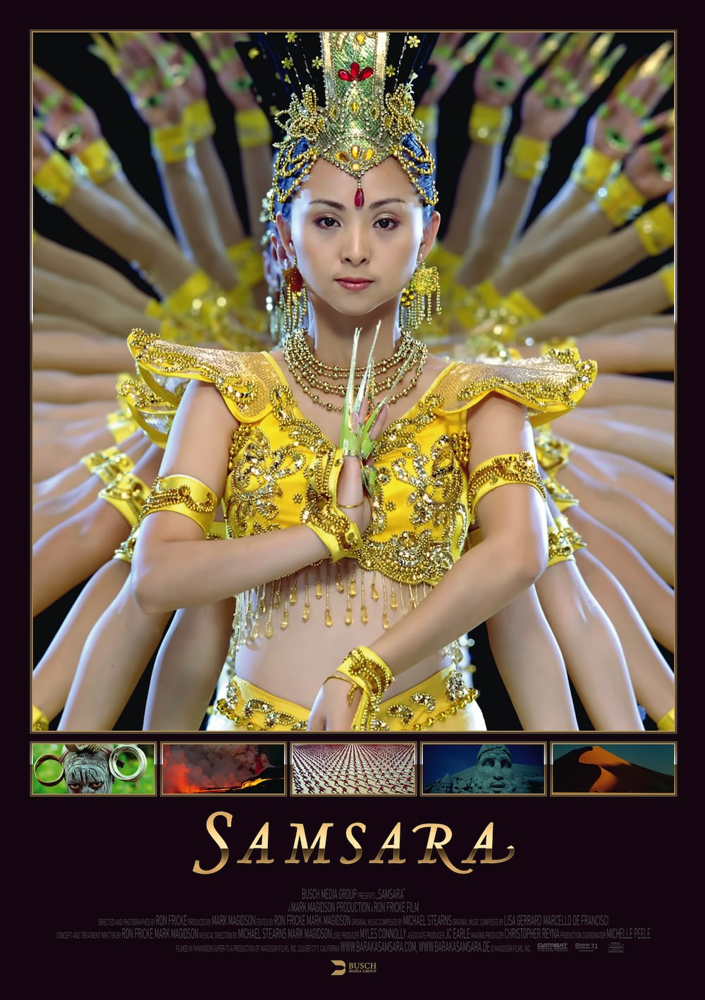

+++
type = "post"
titre = "Samsara, Ron Fricke"
title = "Samsara, Ron Fricke"
url = "/samsara-fricke"
date = "2013-03-28T22:44:45"
Lastmod = "2013-03-29T10:20:26"
cover = "samsara-fricke.jpg"
categorie = [ "À voir" ]
tag = [ "Art", "Documentaire", "Expérience", "Nature", "Paysage", "Société" ]
createur = [ "Ron Fricke" ]
annee = [ "2013" ]
weight = 2013
pays = [ "États-Unis" ]

+++

Difficile de qualifier précisément <em>Samsara</em>. Ce projet titanesque — tournage de 5 ans dans 25 pays — n’est pas une fiction, puisqu’il ne met en scène aucun acteur ni aucun personnage, mais ce n’est pas vraiment un documentaire non plus. Accumulation d’images sans lien évident entre elles, le long-métrage de Ron Fricke déroute dans un premier temps, même si son message finit par s’éclaircir. <em>Samsara</em> devient alors, paradoxalement, un peu trop prévisible en accumulant des images et des idées que l’on a déjà vu ailleurs. Reste que cet étrange objet est aussi — d’abord ? — un magnifique objet. Filmé entièrement en 70 mm, il propose un aperçu de notre planète qui ne prétend pas à l’exhaustivité, mais qui impressionne constamment par sa beauté. Difficile toutefois de recommander ce film pour ses seules belles images, tant le résultat s’apparente parfois plus à un film destiné à un musée qu’à du cinéma, mais <em>Samsara</em> peut s’avérer envoutant à condition d’accepter de se laisser porter.

De petites danseuses roses aux yeux écarquillés. Un volcan en éruption. Des temples bouddhistes dans la jungle. Des moines tibétains qui construisent un tableau uniquement avec du sable coloré. <em>Samsara</em> ne prend même pas le temps de nous expliquer avec un bref panneau son projet ou son but, mais commence immédiatement en nous envoyant aux quatre coins de la planète. Le projet de Ron Fricke est plutôt atypique : là où Yann Arthus-Bertrand avec son <em>Home</em> ou Jacques Perrin et Jacques Cluzaud avec <a href="/2010/02/19/oceans-perrin-cluzaud/" title="Océans, Jacques Perrin et Jacques Cluzaud - À voir et à manger"><em>Océans</em></a> cherchaient à faire passer un message avec leurs images et usaient, voire abusaient, du didactisme, <em>Samsara</em> n’est absolument pas didactique, puisque totalement dépourvu de message écrit ou oral. Pendant plus d’une heure quarante, on n’aura que les images de la planète à regarder, sans aucun commentaire pour les accompagner. Ce principe est tenu d’un bout à l’autre et le cinéaste est allé jusqu’à effacer les voix des personnes qu’il filme, seules quelques paroles se glissent dans la bande originale du film, souvent dans des langues que l’on ne comprend pas. Ron Fricke préfère laisser parler ses images et faire confiance à l’intelligence des spectateurs, ce qui est très frustrant par moment, mais ce qui est aussi la meilleure idée du film. Les premières minutes sont assez difficiles, il faut s’habituer au dispositif et accepter de se laisser transporter d’un lieu à un autre, sans forcément l’identifier, ni surtout savoir pourquoi les images s’enchaînent ainsi. Le montage est assez rapide, même si <em>Samsara</em> laisse le temps d’admirer ses plans magnifiques, mais il y a de quoi se perdre un petit peu au départ. Le cinéaste apprécie particulièrement les formes géométriques, qu’elles soient naturelles ou crées par l’homme, et les meilleurs cadres sont ceux qui justement mettent en avant une régularité géométrique. Certaines images sont connues, d’autres plus originales, mais c’est quasiment un sans-faute sur le plan esthétique, même si le film n&rsquo;évite pas tout à fait l&rsquo;effet collection de cartes postales. Dans les premières minutes, on retrouve aussi l&rsquo;esprit de <a href="/2011/05/17/tree-of-life-malick/" title="The Tree of Life, Terrence Malick (Palme d’or 2011)"><em>The Tree of Life</em></a>, le message explicite en moins bien sûr.

<em>Samsara</em> commence par perdre un petit peu ses spectateurs, mais sans doute était-ce une étape obligatoire pour la suite. Très vite en effet, Ron Fricke introduit son message et donne du sens à ses images qui semblaient au départ totalement aléatoires. Le changement se fait autour de la société de consommation : le film montre astucieusement l’envers du décor avec d’un côté les usines qui renferment des centaines de milliers d’ouvriers chinois, et tout à l’autre bout de la chaine, d’énormes décharges un peu partout dans le monde où tout le matériel consommé a été tout aussi vite produit que jeté. Plus fortes encore, les images de la malbouffe dans le monde avec cette fois d’abord les conditions de vie déplorables pour les animaux, les usines de traitement tellement gigantesques qu’elles en deviennent irréelles et de l’autre côté, les fast-foods américains et l’obésité. <em>Samsara</em> ne fait pas preuve d’une originalité folle sur ces sujets, mais son absence de commentaires et au contraire le choix de poser l’objectif de la caméra l’air de rien offre au film une force rare. Les discours ont déjà été entendus et répétés, mais Ron Fricke parie astucieusement sur la puissance des images et joue constamment des contrastes. On passe d’un côté de la chaine de production d’électroménager au supermarché, de l’abattage de centaines de milliers de poulets par des milliers d’ouvriers chinois au fast-food et tout le message passe ainsi par cette juxtaposition. Cette partie, au cœur de <em>Samsara</em> est la plus réussie, sans doute parce que c’est la plus explicite. Plus tard, le film s’attaque à la religion, mais le message est moins clair et le cinéaste semble absorber par la beauté de ses images, plus que par son intention. Plus gênant, le sentiment de déjà-vu est persistant et on devine souvent à l’avance où Ron Fricke veut nous emmener. C’est dommage, surtout après une entrée en matière au contraire déroutante, mais le film reste intéressant et surtout magnifique.

<iframe class="aligncenter" width="100%" height="388" src="http://www.youtube.com/embed/RIeF1Asz3Kc" frameborder="0" allowfullscreen></iframe>

Dans le bouddhisme, le « <a href="http://fr.wikipedia.org/wiki/Samsara"><em>samsāra</em></a> » est un terme sanskrit qui désigne le cycle de la vie et de la réincarnation. Ron Fricke a construit son deuxième long-métrage de la même manière, comme un cycle qui revient à son point de départ après un aperçu du monde, en quelque sorte. <em>Samsara</em> ne cherche pas à passer un seul message explicité par un discours de toute manière, il est au contraire totalement libéré et peut ainsi accepter toutes les interprétations des spectateurs. Difficile en tout cas de totalement recommander cet étrange objet qui aurait tout à fait sa place dans les salles du <a href="/2012/03/20/visite-futuroscope/">Futuroscope</a> et sa diffusion à <a href="http://www.lageode.fr/programme/evenements/samsara/">la Géode</a> n’a rien d’un hasard. On peut s’ennuyer ferme devant ces images, considérer qu’il ne s’agit guère plus que d’un économiseur d’écran de luxe ou d’un film de musée, mais on peut aussi se laisser porter et peut-être se laisser emporter. <em>Samsara</em> est extrêmement bien fait et certaines séquences particulièrement convaincantes font mouche. Rien que pour elles, le deuxième long-métrage de Ron Fricke mérite qu’on s’y intéresse. 

