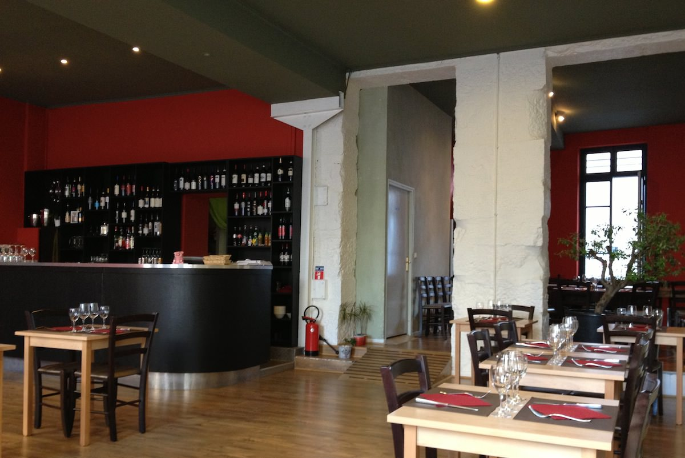
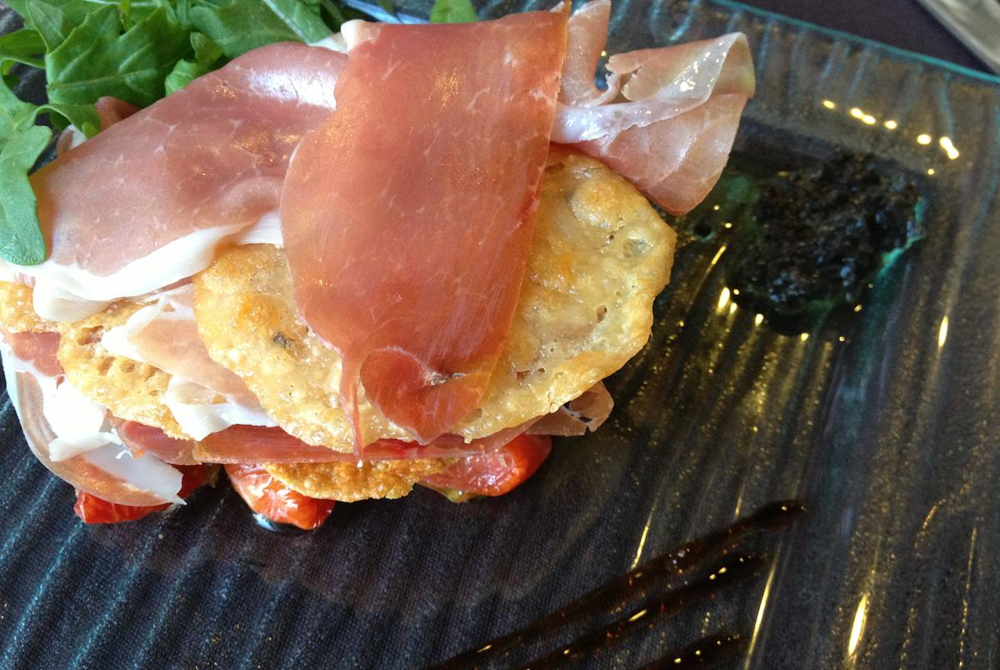
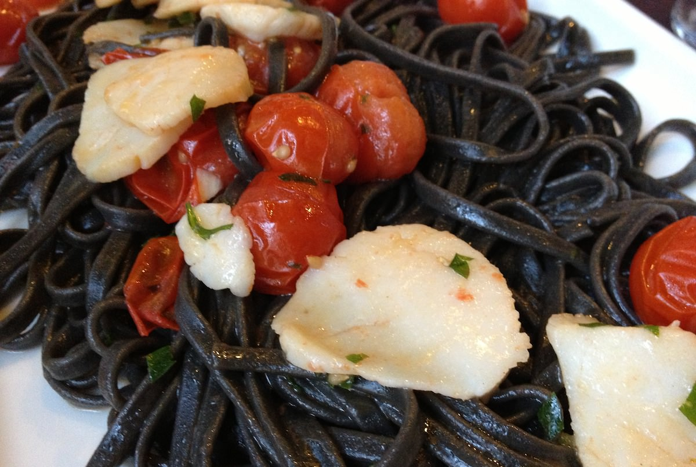
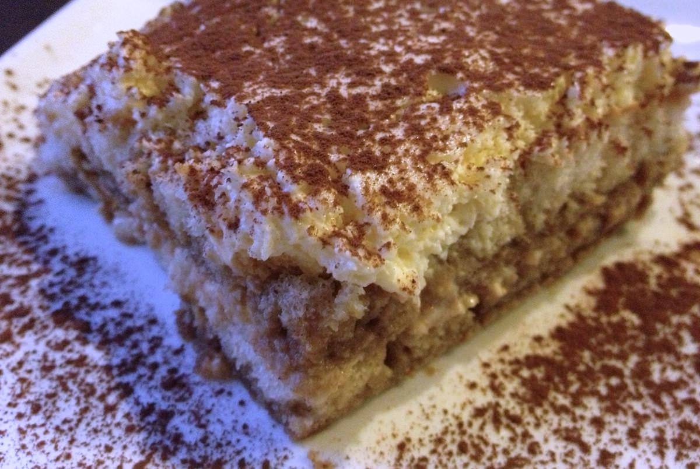

+++
titre = "Le Sapori e Colori à Lyon"
title = "Le Sapori e Colori à Lyon"
url = "/sapori-colori-lyon"
date = "2012-07-17T23:31:44"
Lastmod = "2012-07-17T23:44:38"
cover = "sapori-e-colori-lyon.jpg"
categorie = [ "À manger" ]
tag = [ "Cuisine italienne", "Pâtes" ]

+++

Le <a href="http://www.lyonresto.com/restaurant-Lyon/restaurant-Sapori-e-Colori-Lyon/restaurant-Sapori-e-Colori-Lyon-1024.html"><strong>Sapori e Colori</strong></a> annonce la couleur dès le départ : le nom de cette adresse située au cœur du troisième arrondissement lyonnais aurait du mal à cacher son origine italienne. Ce restaurant n&rsquo;a pas choisi le meilleur des quartiers à Lyon et la présence d&rsquo;une ancienne pizzeria surmontée d&rsquo;un immeuble à l&rsquo;abandon n&rsquo;inspire rien qui vaille. Vous auriez pourtant tort de ne pas franchir le pas de la porte, tant cette adresse italienne vaut le détour…

La salle tranche avec le cadre extérieur. Rénovée il y a un an, elle fait dans la sobriété et fait la part belle à l&rsquo;espace. Vous ne serez jamais tassés contre vos voisins au <strong>Sapori e Colori</strong>, les tables sont suffisamment espacées pour préserver l&rsquo;intimité, un bon point. Les volumes sont importants, mais le lieu ne fait pas hangar vide. La sonorisation est bonne et le grand bar au fond de la salle ajoute un peu de chaleur à l&rsquo;ensemble qui s&rsquo;avère ainsi simple, mais efficace. L&rsquo;été, le patron installe quelques tables devant, sur le trottoir. Quand la température n&rsquo;est pas trop élevée comme c&rsquo;était le cas ce soir-là, c&rsquo;est plutôt agréable, à condition d&rsquo;accepter la rue de Créqui qui reste malgré tout assez passante. Le public est varié, mais les couples nombreux… il faut croire que la cuisine italienne attire toujours autant les amoureux.

De cuisine italienne, il en est justement question au <strong>Sapori e Colori</strong>, et même que de cuisine italienne. La carte est assez resserrée puisqu&rsquo;il suffit de deux pages pour rassembler toutes les entrées, les plats et les desserts du restaurant. Trois menus complètent le tableau, deux avec entrée, plat et dessert où seul le prix du plat varie et un autre spécial qui n&rsquo;est servi qu&rsquo;à la table entière et qui consiste en une découverte de la cuisine italienne. Dans ce dernier cas, pour une quarantaine d&rsquo;euros par convive, vous pourrez vous laisser porter par le chef italien : le nombre de plats n&rsquo;est pas précisé, mais si l&rsquo;on en croit les avis glanés sur Internet, il faut avoir bon appétit. Les menus permettent de s&rsquo;en tirer pour un peu moins de 30 €, ce qui reste raisonnable surtout au vu de la qualité proposée. Les amateurs accompagneront ce repas italien d&rsquo;un vin… lui aussi italien. Si la carte des plats est assez resserrée, celle des vins est beaucoup plus étendue et elle n&rsquo;est composée que de vins transalpins. Il y en a pour tous les goûts et pour tous les budgets, n&rsquo;hésitez pas à demander conseil en fonction de vos choix. Nous nous en sommes tirés pour une bouteille de Lacrimoso à une trentaine d&rsquo;euros qui correspondait parfaitement à nos plats.

Ne demandez pas une pizza, vous fâcheriez le patron du <strong>Sapori e Colori</strong>. Le restaurant a fait le choix osé, mais bienvenu, de ne mettre aucune pizza à sa carte et de faire la part belle aux pâtes. Dans le lot, on repère les incontournables lasagnes, mais aussi quelques propositions plus originales. La truffe est à l&rsquo;honneur, à la fois la truffe noire classique et la <a href="http://fr.wikipedia.org/wiki/Truffe_blanche">truffe blanche d&rsquo;Alba</a>, la variété plus chère et la plus réputée de cet étrange champignon. Les raviolis au parmesan et à la truffe blanche étaient particulièrement succulents, ils étaient bien gros pour faire la part belle à leur farce excellente et toute en finesse. C&rsquo;était vraiment une réussite, bien loin des pâtes fraiches que l&rsquo;on peut trouver en supermarché et on regretterait presque de ne pas en avoir une ou deux de plus dans l&rsquo;assiette, par gourmandise. Les autres plats de pâtes sont tout aussi bons, à l&rsquo;image des spaghettis à l&rsquo;encre de seiche servis avec de tendres et épais morceaux de saint-jacques.

Les pâtes sont clairement mises à l&rsquo;honneur au <strong>Sapori e Colori</strong>, si bien que le reste de la carte est un peu décevant. En entrée, le millefeuille composé de tuiles de parmesan et de jambon sec était joliment présenté et très bon, surtout accompagné de la réduction de vinaigre de truffes, mais c&rsquo;était un plat plus classique, quoique bien réalisé. Les desserts n&rsquo;étaient pas à la hauteur de nos attentes : le tiramisu, incontournable de la gastronomie italienne, était fade par manque de liqueur de café et sec à cause du déséquilibre entre mascarpone et biscuit. Le tiramisu aux spéculoos était bien meilleur, mais bizarrement servi dans ce tout petit verre qui limitait sérieusement le plaisir de la dégustation — cette taille aurait plutôt convenu à un café gourmand qu&rsquo;à un dessert complet.

Si vous aimez la cuisine italienne et tout particulièrement ses pâtes, découvrez sans attendre le <strong>Sapori e Colori</strong>. Certes, le cadre n&rsquo;est pas le plus réussi, mais vous payez ici pour ce qu&rsquo;il y a dans l&rsquo;assiette. Justement, les pâtes proposées par le chef italien sont un délice, tout simplement. Les saveurs explosent dans la bouche, c&rsquo;est un régal tout en finesse, avec des produits assez rares. Si vous n&rsquo;avez pas trop faim, un plat de pâtes suffira amplement : les entrées et les desserts ne sont pas à leur hauteur…

