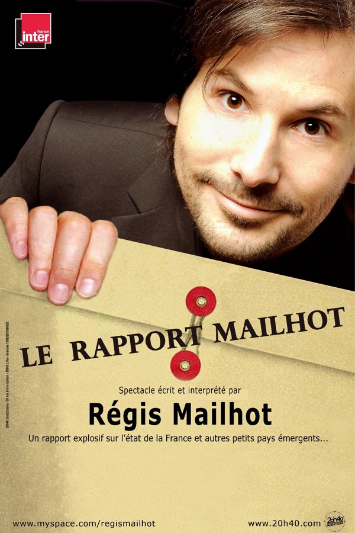

+++
type = "post"
titre = "Sauvons les humoristes !"
title = "Sauvons les humoristes !"
url = "/sauvons-les-humoristes"
date = "2009-03-22T01:16:11"
Lastmod = "2010-02-03T11:17:16"
cover = "regis-mailhot.jpg"
categorie = [ "À voir… en live" ]
tag = [ "À voir… en live", "Comique", "Humour", "Politique", "Société" ]
createur = [ "Régis Mailhot" ]
annee = [ "2009" ]
weight = 2009
pays = [ "France" ]

+++

Ce soir, sur un coup de tête, je suis enfin allé voir Régis Mailhot en vrai, au <a href="http://www.lepointvirgule.com/index.php">Point-Virgule</a> où il joue du mercredi au samedi à 21 h 15 <em>Le Rapport Mailhot</em> pendant encore une semaine, avant de battre la campagne de France et de Navarre pour une <a href="http://regis-mailhot.com/tournee">tournée</a>. Les amateurs d&rsquo;humour noir devraient se presser, ce spectacle vaut le déplacement. Et par ailleurs, je le dis comme je le pense, il faut sauver les humoristes, surtout ceux de France Inter !

Régis Mailhot ne laisse personne indifférent. N&rsquo;étant ni consensuel ni partisan du politiquement correct, il peut en choquer plus d&rsquo;un et il en choque d&rsquo;ailleurs plus d&rsquo;un (ne serait-ce que ma môman par exemple, qui ne peut pas l&rsquo;encadrer). Disons-le d&rsquo;emblée, Régis Mailhot donne dans l&rsquo;humour noir, tendance irrévérence. Il n&rsquo;hésitera pas à taper sur le physique, ou à balancer une méchanceté douteuse sur le plan moral, par exemple quand il évoque la Seconde Guerre mondiale (le dernier Autrichien qui a réussi avant Schwarzenegger était Hitler), ou encore quand il suggère de tuer tous les vieux pour régler définitivement le problème des retraites. Il devient encore plus limite quand il évoque une population autrichienne (décidément) bien plus importante dans les caves qu&rsquo;en surface ou félicite Josef Fritzl pour avoir caché l&rsquo;existence de sa fille plus longtemps que Mitterand.

À titre purement personnel (néanmoins, je partage mon avis), j&rsquo;aime beaucoup l&rsquo;humour de Régis Mailhot. Parfois, il ne réussit pas à faire rire, il se plante sur une vanne qui ne fonctionne pas, parfois même il ne me fait plus rire quand il tombe dans la scatologie, mais en moyenne, je ris en l&rsquo;écoutant chez Stéphane Bern, une fois par semaine (vendredi, un peu avant midi et demi). Sur scène, et dans la toute petite et fort inconfortable salle du Point Virgule, en plein cœur du Marais, on rigole aussi. Le problème étant néanmoins qu&rsquo;il recycle une partie de ses chroniques dans le spectacle (ou vice-versa) donc on connaît certaines blagues avant de les entendre quand on suit très attentivement le Fou du Roi. Ce léger détail mis à part, son spectacle est efficace et le point de départ — il se dit employé du &laquo;&nbsp;Patron&nbsp;&raquo; (vous savez, celui à talonnettes) et il doit rendre un rapport sur l&rsquo;État de la France en vue de sa vente — crée un lien bienvenu à la succession de vannes qui constituent, comme il se doit, ce <em>stand-up/one man show</em> (les subtiles différences me dépassent totalement, je dois bien l&rsquo;avouer).

Ce qui m&rsquo;a le plus étonné à aller voir Régis Mailhot en spectacle, c&rsquo;est que j&rsquo;ai mis un visage sur une voix que je connaissais bien. Et le contraste entre ce que j&rsquo;imaginais et la réalité a été assez saisissante je dois dire, et c&rsquo;est plutôt un compliment. En effet, sa voix, ses intonations m&rsquo;ont toujours fait penser qu&rsquo;il imitait plus ou moins le Français moyen, façon caricature de film, façon Gérard Jugnot un peu (pour le physique et certains rôles hein, pas pour l&rsquo;humour). À la place, on découvre un jeune homme qui, au cinéma, ne jouerait pas vraiment le rôle du concierge (alors que Jugnot le ferait très bien&#8230;). Comme quoi, il a réussi à camoufler sa personne derrière sa voix, et ce fut très agréable d&rsquo;avoir été surpris ainsi.

Le spectacle traitant d&rsquo;actualité, il est amené à évoluer fréquemment donc il ne servirait à rien de détailler le contenu du <em>Rapport Mailhot</em>. Disons simplement que tous les hommes politiques en prennent pour leur grade, surtout ceux au pouvoir. Néanmoins, l&rsquo;humoriste ne se contente pas de les épingler les uns après les autres, ses thèmes sont bien plus vastes et concernent divers problèmes de société (la psychologie en prend pour son grade) et plus généralement la société française, en passe d&rsquo;être vendue donc et avec elle ses traditionnels défauts.

Ce que j&rsquo;aime particulièrement avec cet humour, c&rsquo;est sa tendance à l&rsquo;ironie ou au sarcasme. Quand il entre sur scène, Mailhot commence par embrasser le portait de Sarko qui se trouve sur son bureau et il va passer tout le temps du spectacle à nous expliquer à quel point son &laquo;&nbsp;Patron&nbsp;&raquo; est génial. D&rsquo;ailleurs, ce dernier n&rsquo;est pas celui qui est le plus critiqué, du moins en apparence. Il faut savoir décoder, écouter entre les mots et si parfois il fait dans le potache (qui n&rsquo;a jamais fait de mal à personne), son humour est souvent plus fin qu&rsquo;il n&rsquo;en a l&rsquo;air initialement.

Bon, en bref, allez-y si l&rsquo;humour noir est votre truc, et que les blagues sur la religion, le sexe et les tabous traditionnels (dont l&rsquo;inceste) ne vous font pas peur. Dans la salle, si la moyenne d&rsquo;âge était plus basse, il y avait quelques personnes âgées donc ma voisine qui, manifestement, n&rsquo;a pas tellement apprécié, surtout quand on évoque sur scène la réaction de Benoit XVI quand il a vu Carla (je vous laisse deviner).

Si je comprends très bien que l&rsquo;on soit choqué par un humoriste, je comprends beaucoup moins que l&rsquo;on veuille le faire taire. Bien évidemment, qui dit humoriste en ce moment, dit France Inter et Stéphane Guillon (à droite) ainsi que son acolyte, le gauchiste de toujours Didier Porte (à gauche&#8230; he he)<a href="#footnote_0_1401" id="identifier_0_1401" class="footnote-link footnote-identifier-link" title="J&rsquo;avais d&eacute;j&agrave; &eacute;voqu&eacute; mon amour de l&rsquo;humoriste sur un pr&eacute;c&eacute;dent billet exprimant mon d&eacute;sir d&rsquo;entrer en r&eacute;sistance. Bon, quelques mois apr&egrave;s, force est de le constater, ce fut une r&eacute;sistance bien tranquille&hellip;">1</a>. Ces deux-là officient sur la radio publique donc, soit uniquement le matin pour le premier (vers 7h55), mais également dans l&rsquo;émission de Stéphane Bern pour le second (peu après midi). Tous les deux font dans l&rsquo;humour noir tendance irrévérence que j&rsquo;ai évoqué à propos de Mailhot. Et ils sont plus ou moins concernés dans une polémique impliquant le renouvellement du patron actuel de Radio France, le président de la République et Dominique Strauss-Khan.

Je ne sais pas si quelqu&rsquo;un, en France, n&rsquo;a pas entendu/vu cette chronique, dans le doute elle est disponible sur <a href="http://www.dailymotion.com/playlist/xo10o_franceinter_humour/video/x8efvy_guillon-visite-de-dsk-a-france-inte_fun">Dailymotion</a>. Pour résumer, Guillon fait une excellente chronique sur la venue de DSK à la Maison de la Radio et les mesures préventives qui ont été prises à cette occasion, mesures visant, on s&rsquo;en doute, à protéger le personnel féminin de la station. Cette chronique est excellente, mais n&rsquo;a rien d&rsquo;original, tous les humoristes et imitateurs s&rsquo;en sont déjà donnés à cœur joie sur le thème. Mais DSK a jugé bon de répondre et commence alors une affaire digne d&rsquo;un roman, avec un président qui dans un avion aurait dit trouver Stéphane Guillon insupportable et exprimé sa volonté de virer Jean-Paul Cluzel, actuel patron de Radio France.

Entendant ça, je ne peux dire à quel point j&rsquo;ai été à la fois en colère et inquiet. On sait bien que Sarko verrouille le système, notamment les médias et particulièrement la télévision, désormais à sa merci. Mais la radio semblait encore résister, et d&rsquo;abord France Inter qui a su entretenir un ton très libre qui a d&rsquo;ailleurs porté ses fruits si l&rsquo;on en croit les audiences. Là, brusquement, tout le monde (et moi le premier) s&rsquo;est aperçu que le président pouvait changer, et que des humoristes tels que les trois cités ici pourraient bien partir avec. Certes, le tollé serait sans doute général parmi les auditeurs de la station et sans doute au-delà, mais&#8230;, et alors ? Déjà qu&rsquo;en temps normal, la société française semble s&rsquo;être désintéressée de la chose publique, alors en temps de crise, il ne fait aucun doute que tout peut passer comme une lettre à la poste.

Ça n&rsquo;est pas, cela dit, une raison pour baisser les bras. Il faut sauver les humoristes et j&rsquo;encourage tous ceux pour qui la notion de liberté d&rsquo;expression fait sens à soutenir tous les humoristes, quel que soit votre opinion à leur propos, même si vous trouvez qu&rsquo;ils exagèrent, qu&rsquo;ils vont trop loin, car n&rsquo;oublions jamais que les dictatures se sont toujours instaurées en enlevant un bout de liberté, parfois totalement insignifiant. Ce soutien n&rsquo;est vraiment pas compliqué : il vous suffit d&rsquo;écouter les émissions où les humoristes s&rsquo;expriment, ou alors de télécharger leurs podcasts. Maintenir Guillon ou Porte en tête du classement des podcasts d&rsquo;iTunes, c&rsquo;est un geste citoyen (cela fonctionne aussi pour le couple Canteloup/Gerra&#8230; bon par contre M6, vous forcez pas hein, c&rsquo;est vraiment pas la peine) ! Si vous en avez l&rsquo;occasion, allez les voir en spectacle : Didier Porte est ainsi toujours sur la route, et tous les deuxièmes lundis du mois au <a href="http://www.cdlg.org/w/">Café de la Gare</a> à Paris.

Pour écouter Stéphane Guillon, c&rsquo;est <a href="http://itunes.apple.com/WebObjects/MZStore.woa/wa/viewPodcast?id=292299637">ICI</a>, alors que pour Didier Porte, c&rsquo;est <a href="http://itunes.apple.com/WebObjects/MZStore.woa/wa/viewPodcast?id=291672813">LÀ</a>. Et si vous voulez écouter <a href="http://www.radiofrance.fr/franceinter/em/fouduroi/">Le fou du Roi</a> en entier, c&rsquo;est <a href="http://itunes.apple.com/WebObjects/MZStore.woa/wa/viewPodcast?id=135072860">PAR ICI</a>. Vous y entendrez notamment Régis Mailhot, tous les vendredis, et Trinidad, très bien. Sans oublier Daniel Morin, premier chroniqueur de l&rsquo;émission présent tous les jours, qui a un style assez inimitable qui a fini par me séduire, après des débuts assez difficiles de mon côté. On est loin du très politique Didier Porte.

Merci pour eux&#8230; Et en plus, vous vous ferez sans doute plaisir à les écouter. 😉

À noter pour finir qu&rsquo;Arrêt sur images a réalisé une très intéressante émission avec les deux humoristes incriminés. Une émission au cours de laquelle Didier Porte a exprimé sa vision de l&nbsp;&raquo;humoriste comme journaliste de complément, toujours aux limites de ce qui est acceptable, comme, justement, pour tester cette limite. C&rsquo;est une vision très intéressante et que je partage pleinement.

<em>Crédit couverture : Radio France / Christophe Abramowitz</em>

<ol class="footnotes"><li id="footnote_0_1401" class="footnote">J&rsquo;avais déjà évoqué mon amour de l&rsquo;humoriste sur <a href="http://voiretmanger.fr/2008/09/20/cest-decide-jentre-en-resistance/">un précédent billet</a> exprimant mon désir d&rsquo;entrer en résistance. Bon, quelques mois après, force est de le constater, ce fut une résistance bien tranquille&#8230; [<a href="#identifier_0_1401" class="footnote-link footnote-back-link">&#8617;</a>]</li></ol>
