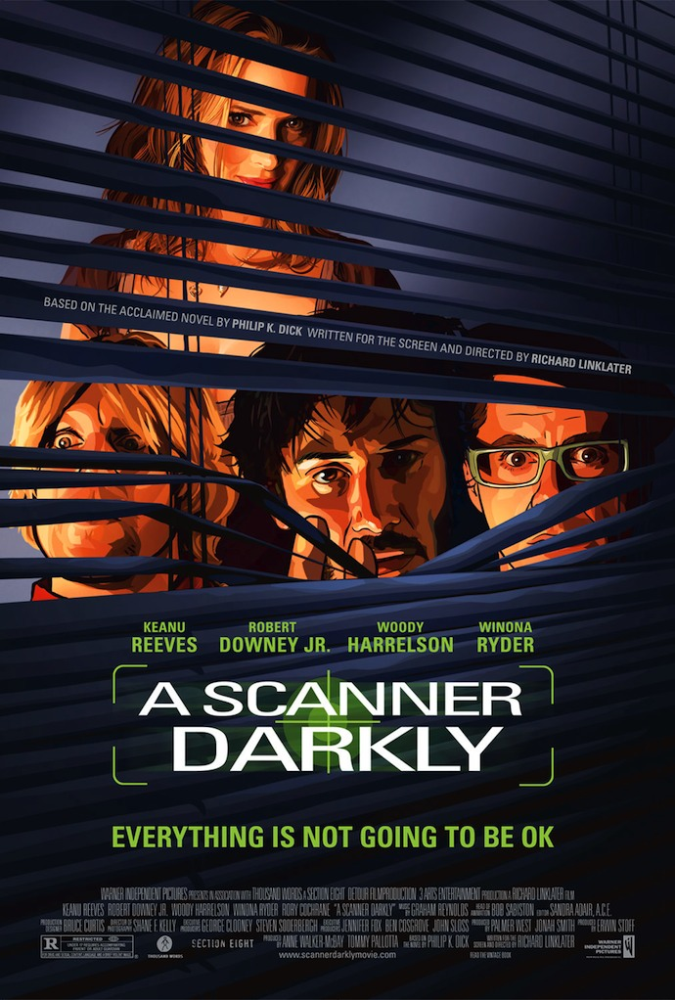
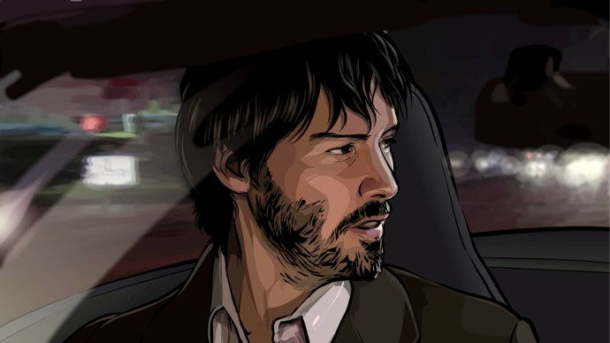
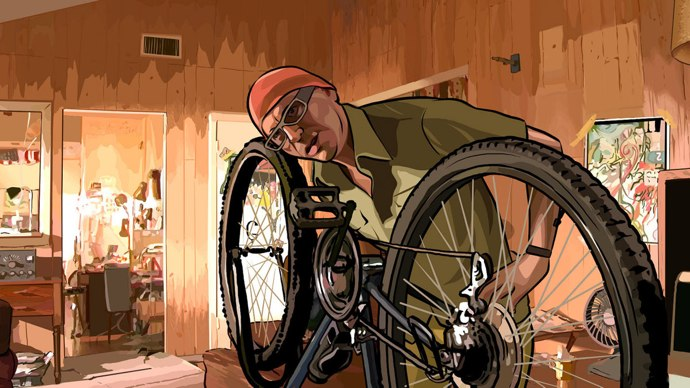

+++
type = "post"
titre = "<em>A Scanner Darkly</em>, Richard Linklater"
title = "A Scanner Darkly, Richard Linklater"
url = "/scanner-darkly-linklater"
date = "2010-07-26T00:05:05"
Lastmod = "2014-07-23T23:05:25"
cover = "a-scanner-darkly-keanu-reeves.jpg"
categorie = [ "À voir" ]
tag = [ "Animation", "Drogue", "Psychologie", "Science-Fiction" ]
createur = [ "Richard Linklater" ]
acteur = [ "Ethan Hawke", "Keanu Reeves", "Robert Downey Jr" ]
annee = [ "2006" ]
weight = 2006
pays = [ "États-Unis" ]

+++

Le cinéma aime <a href="http://fr.wikipedia.org/wiki/Philip_K._Dick">Philip K. Dick</a>, c&rsquo;est peu de le dire. On ne compte plus les adaptations des écrits de ce romancier américain de talent, de <em>Blade Runner</em> à <em>Minority Report</em>, sans compter les innombrables films inspirés par l&rsquo;univers de l&rsquo;écrivain. <em>A Scanner Darkly</em> est l&rsquo;adaptation d&rsquo;un roman qui a comme particularité majeure d&rsquo;avoir été entièrement travaillé après le tournage pour obtenir un effet proche du dessin. Un effet étonnant et assez impressionnant pour un film intrigant, mais pas vraiment réussi.

<a href="http://www.allocine.fr/film/fichefilm_gen_cfilm=56561.html" target="_blank">

<em>A Scanner Darkly</em> se déroule aux États-Unis dans un futur proche. On est en 2013 d&rsquo;après le synopsis et les éléments du futur se font discrets. Le quotidien ne change en fait pas, si ce n&rsquo;est que l&rsquo;on peut installer des caméras si petites qu&rsquo;elles en sont indétectables et qu&rsquo;il existe des combinaisons de camouflage révolutionnaires. Au lieu d&rsquo;essayer de fondre la personne dans le paysage, ces combinaisons affichent une galerie aléatoire de morceaux d&rsquo;humains. Une combinaison en perpétuel mouvement qui crée en permanence de nouvelles personnes à partir de milliers d&rsquo;hommes et de femmes réels. Au-delà de l&rsquo;aspect purement esthétique, une société de protection utilise cette combinaison pour camoufler ses agents : la voix étant aussi modifiée, il est impossible de reconnaître qui se cache derrière la combinaison. Le héros du film, Bob Arctor, est un de ces agents. Il est en mission d&rsquo;infiltration auprès de ses amis un peu louche pour essayer de démanteler une organisation mafieuse autour de la drogue. Ce job ne l&rsquo;enchante guère, d&rsquo;autant que son travail implique de se droguer et le film montre sa lente descente aux enfers. Il perd peu à peu pied, se met à avoir des hallucinations toujours plus fortes et plus présentes il finit par perdre complètement la tête.

La science-fiction n&rsquo;est ici qu&rsquo;un prétexte à évoquer le sujet plus général de la drogue. <em>A Scanner Darkly</em> est un film sur la drogue autant qu&rsquo;il semble être sous l&rsquo;effet de la drogue. La &laquo;&nbsp;D&nbsp;&raquo; est au cœur de toutes les préoccupations et de tous les dialogues et contrairement aux drogues habituelles, elle est ici omniprésente et semble même normale dans cet univers. Les personnages en prennent des doses à intervalle régulier, tandis qu&rsquo;un organisme se charge spécifiquement de désintoxiquer les habitués de cette drogue apparemment très forte. Un des personnages dit à un moment qu&rsquo;il suffit d&rsquo;en goûter une fois pour devenir accroc : menace terrible, mais qui semble largement répandue dans la société du futur dépeinte par le film. La police essaie bien de démanteler les réseaux de distribution, mais fait appel pour ça à un drogué censé se dénoncer lui-même ou dénoncer ses amis. Tout se passe comme si l&rsquo;usage de la drogue était accepté, toléré, voire encouragé par les autorités. <em>A Scanner Darkly</em> présente un univers riche comme Philip K. Dick sait si bien les construire, mais le film ne propose que quelques éléments d&rsquo;explication, laisse de grandes parts d&rsquo;ombre. Cela renforce ce sentiment de profondeur de l&rsquo;univers puisque l&rsquo;on sent que l&rsquo;ensemble est beaucoup plus complexe et que l&rsquo;on n&rsquo;a qu&rsquo;une partie devant nous. Cela dit, le film se fait vraiment discret sur un trop grand nombre de points, si bien que l&rsquo;on peut rapidement se perdre. Des pistes sont esquissées, mais aucune n&rsquo;est vraiment approfondie et le spectateur se sent rapidement abandonné. <em>A Scanner Darkly</em> est aussi sombre que son titre le laissait entendre : sombre par cette descente aux enfers que l&rsquo;on sent cruelle, surtout quand Bob se souvient de sa vie antérieure, avec femme et enfants. Sombre aussi pour le spectateur qui n&rsquo;a pas toutes les clés pour comprendre et qui se sent un peu isolé de ce qui apparaît à plusieurs reprises comme un trip sans queue ni tête.

La technique utilisée par Richard Linklater renforce, il est vrai, ce sentiment. <em>A Scanner Darkly</em> a été filmé normalement, avant d&rsquo;être entièrement retravaillé pour donner à l&rsquo;image un effet évoquant un dessin à la main. Les traits sont simplifiés, les couleurs sont beaucoup plus réduites, ce qui donne l&rsquo;impression d&rsquo;un film d&rsquo;animation à l&rsquo;ancienne. L&rsquo;effet est original, jamais vu au cinéma, et évoque, pour les connaisseurs d&rsquo;Illustrator, la <a href="http://help.adobe.com/fr_FR/Illustrator/13.0/help.html?content=WS714a382cdf7d304e7e07d0100196cbc5f-6229.html">vectorisation dynamique</a>. Cet effet est obtenu au cinéma par un procédé aussi vieux que <em>Blanche-Neige</em> (1937) nommé <a href="http://fr.wikipedia.org/wiki/Rotoscopie">rotoscopie</a>. Pour l&rsquo;anecdote, le logiciel utilisé par les équipes du film est la propriété du réalisateur ce qui explique sans doute, outre le résultat très spécial, la rareté de ce procédé au cinéma. Le résultat est plutôt convaincant et évoque certains films d&rsquo;animation récents comme <em>Valse avec Bashir</em>. Si l&rsquo;on regardait le film de loin, le procédé ne se verrait pas. Il se dévoile de plus près, un peu à la manière des tableaux impressionnistes. Cette technique offre indéniablement au film son originalité, au point même d&rsquo;effacer un peu l&rsquo;histoire elle-même, mais elle n&rsquo;est pas qu&rsquo;un gadget visuel prévu pour parler du film. Elle ajoute aussi du sens en figurant l&rsquo;effet des drogues. Concrètement, l&rsquo;espace n&rsquo;est pas aussi stable et cartésien qu&rsquo;il est censé être, les cloisons, le sol se déplacent ainsi que les objets, de manière parfois franche, ou simplement par petites touches. On se sent en permanence désorientés, comme si cet univers ne nous était pas familier. Pour évoquer un trip, c&rsquo;est plutôt réussi.

La technique écrase néanmoins un peu <em>A Scanner Darkly</em>, même si elle n&rsquo;est pas un gadget comme on l&rsquo;a évoqué. Le procédé est un peu lourd et empêche parfois de se concentrer sur l&rsquo;histoire elle-même. Le film propose aussi une belle brochette d&rsquo;acteurs, de Keanu Reeves à Robert Downey Jr. qui cabotine toujours autant, même en version numérique. Ils ne sont pas mauvais dans leurs rôles respectifs, s&rsquo;exposant souvent plus que d&rsquo;habitude (c&rsquo;est typique pour Keanu Reeves) dans ces rôles de drogués complètement frappés. On peine néanmoins à les trouver vraiment convaincants, peut-être à cause de la technique qui crée une sorte de masque. L&rsquo;ensemble passe à côté de la vraie réussite, sans être vraiment mauvais. D&rsquo;ailleurs, un film qui exploite autant Radiohead (utilisations d&rsquo;extraits à plusieurs reprises) ne peut être foncièrement mauvais…

<em>A Scanner Darkly</em> apparaît <em>in fine</em> comme une expérience intéressante, pour un film qui n&rsquo;est pas vraiment réussi. Si l&rsquo;on peut apprécier le travail réalisé après le tournage pour transformer un film &laquo;&nbsp;normal&nbsp;&raquo; en film d&rsquo;animation à l&rsquo;ancienne, ce procédé limite un peu l&rsquo;intérêt pour le scénario. Ce dernier aurait mérité un peu plus d&rsquo;explications, pour une fois : le spectateur en sait finalement trop peu pour vraiment s&rsquo;intéresser à un univers qui mériterait plus de considération. Cela dit, on ne peut que saluer l&rsquo;expérimentation qui ne suffit pas à faire un vraiment bon film, mais qui, à l&rsquo;image de <em>Renaissance</em>, justifie qu&rsquo;on s&rsquo;y intéresse. À voir donc, au moins par curiosité.

<h3>Vous voulez <a href="http://voiretmanger.fr/soutien/">m&rsquo;aider</a> ?</h3>
<ul>
<li><a href="http://www.amazon.fr/gp/product/B003M8NGQM/ref=as_li_ss_tl?ie=UTF8&amp;tag=leblogdenic07-21&amp;linkCode=as2&amp;camp=1642&amp;creative=19458&amp;creativeASIN=B003M8NGQM">Acheter le film en Blu-ray sur Amazon</a></li>
<li><a href="http://www.amazon.fr/gp/product/B000OMCJ1M/ref=as_li_ss_tl?ie=UTF8&amp;tag=leblogdenic07-21&amp;linkCode=as2&amp;camp=1642&amp;creative=19458&amp;creativeASIN=B000OMCJ1M">Acheter le film en DVD sur Amazon</a></li>
<li><a href="https://itunes.apple.com/fr/movie/a-scanner-darkly/id396742575">Acheter ou louer le film sur l&rsquo;iTunes Store</a></li>
</ul>

