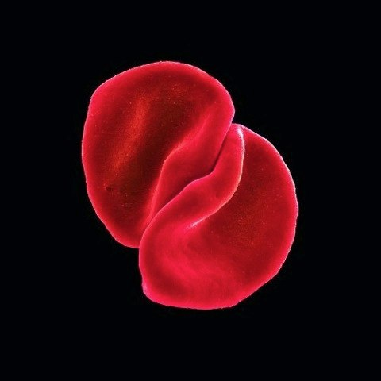
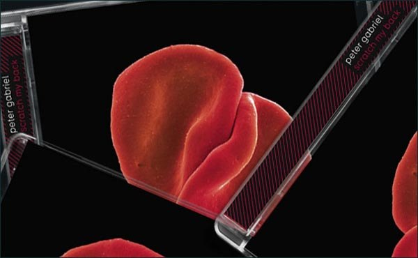

+++
titre = "Scratch My Back, Peter Gabriel"
title = "Scratch My Back, Peter Gabriel"
url = "/scratch-my-back-peter-gabriel"
date = "2010-02-08T23:26:55"
Lastmod = "2013-01-10T08:52:41"
cover = "peter-gabriel-scratch-my-back1.jpg"
categorie = [ "Musique" ]
tag = [ "Classique", "Mélange", "Reprises", "Rock", "Scratch My Back" ]
annee = [ "2010" ]
weight = 2010

+++

Il y a quelques années, si l&rsquo;on me demandait qui était mon artiste préféré, je répondais sans la moindre hésitation Peter Gabriel. Des années Genesis jusqu&rsquo;à <em>UP</em>, il incarnait à mes yeux et à mes oreilles le summum en matière de recherche musicale, avec le meilleur compromis imaginable entre la recherche technicienne du progressif et la simplicité du rock &laquo;&nbsp;traditionnel&nbsp;&raquo;. Une alliance parfaite en somme pour un artiste en plus toujours en recherche sur le plan musical et visuel. Depuis, de l&rsquo;eau a coulé entre les ponts et mon univers musical s&rsquo;est si largement développé que l&rsquo;idée même d&rsquo;ériger un seul groupe ou artiste comme étant le meilleur me semble saugrenue. Mais Peter Gabriel reste incontestablement comme un artiste que j&rsquo;admire éperdument et dont je suis l&rsquo;actualité avec une attention sans faille.

Peter Gabriel n&rsquo;est pas ce que l&rsquo;on pourrait appeler un artiste prolifique. Avec neuf albums en quasiment 35 ans de carrière solo, il n&rsquo;a pas vraiment suivi un rythme forcené, d&rsquo;autant moins que les quatre premiers albums ont été publiés en 6 ans seulement. Son rythme semble en fait baisser régulièrement en même temps que s&rsquo;allonge sa carrière, et on n&rsquo;était sans nouveauté réelle<a href="#footnote_0_2789" id="identifier_0_2789" class="footnote-link footnote-identifier-link" title="Je mets volontairement de c&ocirc;t&eacute; un de ses projets anciens exhum&eacute;s r&eacute;cemment, Big Blue Ball, non pas que l&rsquo;album soit mauvais &mdash; j&rsquo;ai eu l&rsquo;occasion de le d&eacute;fendre d&eacute;j&agrave; sur ce blog &mdash;, mais il ne s&rsquo;agit pas vraiment d&rsquo;un nouvel album">1</a> depuis son dernier album, <em>UP</em> sorti en 2001. Et alors que tout le monde attendait un successeur déjà baptisé <em>I/O</em>, Peter Gabriel a surpris en annonçant à la place <em>Scratch My Back</em>, un projet de reprises composées pour un orchestre symphonique. Un projet plus que casse-gueule sur le papier, mais qui rappelle magistralement que l&rsquo;on peut faire confiance à Peter Gabriel&#8230;

Le projet de Peter Gabriel est pour le moins ambitieux. Sur un premier album, l&rsquo;artiste reprend un certain nombre de titres écrits par d&rsquo;autres qui répondront ensuite par des reprises de Peter Gabriel sur un second opus. Avec <em>Scratch my Back</em>, c&rsquo;est ainsi un dialogue musical entre plusieurs artistes que Peter Gabriel veut instaurer. On retrouve ici un goût de l&rsquo;échange qui est, je pense, une constante de sa longue carrière et qui l&rsquo;a conduit notamment à s&rsquo;intéresser à la world music et à fonder un label pour sortir des artistes venus du monde entier. Finalement, il ne lui manquait qu&rsquo;un album de reprises et c&rsquo;est ce manque que vient combler <em>Scratch My Back</em>. Mais là où la plupart des musiciens se seraient contentés de reprises dans un sens, ce qui est déjà une belle forme de dialogue, Peter Gabriel va beaucoup plus loin en instituant un droit de réponse, si l&rsquo;on veut. Reste, bien sûr, à savoir ce que ces reprises valent, mais l&rsquo;idée me parait très intéressante.

L&rsquo;ambition du chanteur va beaucoup plus loin encore, au risque même de paraitre démesurée. Non content de se lancer dans une dizaine de reprises, exercice toujours périlleux et souvent ennuyeux, il a en plus choisi d&rsquo;abandonner tous les instruments liés, pour le dire vite, au rock. Tous les instruments amplifiés sont ainsi délaissés au profit d&rsquo;un orchestre symphonique accompagné du piano et de la voix de l&rsquo;artiste. Peter Gabriel a ainsi composé autant de pièces symphoniques que de reprises. Et quand je dis composé, je ne veux pas dire simplement réarrangé. Non, il s&rsquo;agit véritablement de nouvelles compositions qui méritent tout l&rsquo;intérêt de l&rsquo;auditeur, même si elles ne sont pas toutes au même niveau.

Le risque était grand, et je crois que l&rsquo;on peut utiliser la reprise de &laquo;&nbsp;Heroes&nbsp;&raquo; de David Bowie qui ouvre magistralement l&rsquo;album, pour souligner à quel point Peter Gabriel a su rester éloigné de ce risque. Ce titre est intéressant, car il est l&rsquo;un des plus connus de David Bowie, et c&rsquo;est l&rsquo;un des morceaux qui a servi à composer la bande originale de l&rsquo;horripilant <em>Moulin Rouge</em>. Dans ce dernier, la reprise est limitée à quelques secondes et l&rsquo;on est tenté de dire &laquo;&nbsp;tant mieux&nbsp;&raquo;. Tout, mais vraiment tout ce qu&rsquo;il ne faut pas faire en matière de reprise symphonique s&rsquo;y concentre : les nappes de violons, les trompettes pour bien marquer que le moment est important et évidemment le duo de chanteurs au ridicule affirmé (voire assumé). Je mets cet extrait en ligne, si jamais vous ne l&rsquo;aviez pas en mémoire, il est important de le réécouter. Placez ensuite l&rsquo;album de Peter dans votre lecteur ou liste de lecture, et appuyez sur play. Je pense que je peux instantanément arrêter la comparaison, on ne saurait trouver deux versions plus éloignées. Les violons sont toujours présents, mais ils se font aussi légers que la voix de Peter Gabriel n&rsquo;est pas pompière. C&rsquo;est un morceau intime et émouvant (les montées en puissance, c&rsquo;est toujours d&rsquo;une efficacité redoutable), malgré l&rsquo;orchestre, malgré la chanson et c&rsquo;est une réussite là où la version <em>Moulin Rouge</em> n&rsquo;est qu&rsquo;une farce.

<!--[if lt IE 9]><![endif]-->
<audio class="wp-audio-shortcode" id="audio-2789-1" preload="none" style="width: 100%; visibility: hidden;" controls="controls"><source type="audio/mpeg" src="heroes-moulin-rouge1.mp3</a></audio>

Peter Gabriel aurait très bien pu se contenter de reprendre des tubes planétaires, c&rsquo;eut été vendeur et on aurait affiché sur la pochette le nom des artistes repris en plus gros encore que le nom de celui qui reprend. Mais il n&rsquo;est pas un artiste qui choisit la facilité. Il dit, à propos de <em>Scratch My Back</em>, que c&rsquo;est son album le plus personnel, ce qui peut paraître étonnant sur le papier — après tout, il n&rsquo;a pas écrit les morceaux —, mais qui prend tout son sens quand on écoute et quand on constate de la liste des morceaux relève effectivement d&rsquo;un choix personnel. On trouve ainsi à la fois de grandes stars du rock (David Bowie ou Neil Young par exemple), mais aussi des &laquo;&nbsp;petits&nbsp;&raquo; groupes comme Arcade Fire ou Elbow. Mieux, il choisit souvent des morceaux moins connus : c&rsquo;est flagrant pour les deux groupes cites précédemment : on sent bien que le choix ne s&rsquo;est pas fait en fonction du nombre de singles vendus, mais bien plus de l&rsquo;intérêt du chanteur. Au passage, on constate que l&rsquo;ancien leader de Genesis évolue avec son temps et n&rsquo;est pas resté bloqué à une époque, ce qui est certainement le meilleur signe de l&rsquo;intelligence musicale. On note aussi qu&rsquo;il est capable de partager autant avec les grands qu&rsquo;avec les &laquo;&nbsp;petits&nbsp;&raquo;. Le résultat est un savant mélange de musiques finalement très différentes pour un album très riche et réuni par la voix.

<em><a href="http://www.petergabriel.com/features/Scratch_My_Back/">petergabriel.com</a></em>

Logiquement, face à la diversité proposée par <em>Scratch My Back</em>, les titres m&rsquo;ont plus ou moins convaincu. Si l&rsquo;idée fonctionne à plein sur certains morceaux, d&rsquo;autres sont plus convenus, comme &laquo;&nbsp;The Book of Love&nbsp;&raquo; par exemple qui se rapproche imperceptiblement des travers de l&rsquo;exercice à base de violons un peu sirupeux sur les bords. Je suis tatillon, car, dans l&rsquo;ensemble, l&rsquo;écoute de l&rsquo;album d&rsquo;un bout à l&rsquo;autre se fait avec un plaisir constant de bout en bout, notamment grâce à la magnifique voix de Peter Gabriel. Et cela n&rsquo;empêche pas l&rsquo;existence de morceaux vraiment sublimes, comme &laquo;&nbsp;My Body Is a Cage&nbsp;&raquo; qui fait certainement partie des meilleurs de l&rsquo;album. De manière générale, je préfère les morceaux un peu plus originaux sur le plan de l&rsquo;écriture musicale, c&rsquo;est-à-dire les morceaux qui sortent de l&rsquo;utilisation traditionnelle d&rsquo;un ensemble de cordes comme support unique de la mélodie. En plus des titres déjà évoqués précédemment, j&rsquo;ajouterai &laquo;&nbsp;Après toi&nbsp;&raquo;, très belle reprise avec son entrée en trompettes et une structure plus travaillée.

Il est néanmoins certain que mon goût pour les reprises tient aussi de mon goût pour les morceaux originaux. Ceci étant, les reprises de Peter Gabriel sont toutes très travaillées, au point de rendre certains titres méconnaissables. Cela m&rsquo;a frappé pour la reprise de Radiohead qui clôt l&rsquo;album. Il a fallu que je regarde le titre du morceau pour reconnaître le morceau. Pourtant, je pense très bien connaître Radiohead (qui serait venu juste après Peter Gabriel dans le classement, voire premier <em>ex aequo</em>) et même si l&rsquo;album qui contient &laquo;&nbsp;Street Spirit (Fade Out)&nbsp;&raquo; n&rsquo;est pas mon préféré du groupe, je le connais quand même très bien. J&rsquo;apprécie ce grand écart créé avec le matériau d&rsquo;origine, on sent que Peter Gabriel s&rsquo;est approprié totalement les morceaux pour créer autre chose. La reprise de Radiohead est, sans nul doute, la plus difficile de l&rsquo;album, la plus opaque. Mais c&rsquo;est aussi, peut-être, la plus belle, la plus forte de l&rsquo;album. On ressent avec une force incroyable la tristesse du chanteur, accompagné du piano et de quelques cordes légères dans un format qui rappelle un peu &laquo;&nbsp;Father, Son&nbsp;&raquo;, titre très émouvant de Peter Gabriel publié sur le très sous-estimé <em>Ovo</em>.

C&rsquo;est là que l&rsquo;on prend toute la mesure à la fois du travail accompli sur <em>Scratch My Back</em>, mais aussi de l&rsquo;implication personnelle du chanteur. Une implication qui s&rsquo;entend aussi à travers la voix. Omniprésente, elle est toujours douce, chaleureuse, mais aussi puissante parfois. Un vrai bonheur, tout en nuances, et une belle démonstration des capacités de Peter Gabriel. On retrouve là son perfectionnisme de toujours, la qualité de l&rsquo;enregistrement est superbe et c&rsquo;est un bonheur à l&rsquo;écoute.

J&rsquo;en ai déjà tellement dit sur <em>Scratch My Back</em>, mieux vaut certainement m&rsquo;arrêter, non sans recommander à nouveau le dernier album de Peter Gabriel. Cela fait plus de quarante ans qu&rsquo;il fait de la musique de manière professionnelle et j&rsquo;ai beau connaître sa discographie par cœur, il a encore réussi à me surprendre et rien que pour cela, je lui en suis reconnaissant. J&rsquo;espère qu&rsquo;il réussira encore à l&rsquo;avenir à toujours nous surprendre, encore et toujours.

L&rsquo;album sortira le 15 février. D&rsquo;ici là, et avant aussi le concert parisien du 22 mars, je vous recommande aussi la lecture de la <a href="http://www.smahut.com/BlogQuenelle/2010/02/03/peter-gabriel-scratch-my-back-2010/">critique de Thibault</a> sur <em>La Quenelle Culturelle</em>.

<h3>Vous voulez m&rsquo;aider ?<a href="#footnote_1_2789" id="identifier_1_2789" class="footnote-link footnote-identifier-link" title="&Agrave; propos de la publicit&eacute;&hellip;">2</a></h3>
<ul>
<li><a href="http://www.amazon.fr/gp/product/B0032W7D0I/ref=as_li_ss_tl?ie=UTF8&#038;tag=leblogdenic07-21&#038;linkCode=as2&#038;camp=1642&#038;creative=19458&#038;creativeASIN=B0032W7D0I">Acheter l&rsquo;album en CD sur Amazon</a></li>
<li><a href="http://www.amazon.fr/gp/product/B0035XPPQI/ref=as_li_ss_tl?ie=UTF8&#038;tag=leblogdenic07-21&#038;linkCode=as2&#038;camp=1642&#038;creative=19458&#038;creativeASIN=B0035XPPQI">Acheter l&rsquo;album en MP3 sur Amazon</a></li>
<li><a href="https://itunes.apple.com/fr/album/scratch-my-back/id351845566">Acheter l&rsquo;album sur l&rsquo;iTunes Store</a></li>
</ul>

<ol class="footnotes"><li id="footnote_0_2789" class="footnote">Je mets volontairement de côté un de ses projets anciens exhumés récemment, <em>Big Blue Ball,</em> non pas que l&rsquo;album soit mauvais — j&rsquo;ai eu l&rsquo;occasion de le défendre déjà <a href="http://voiretmanger.fr/2008/09/04/big-blue-ball-et-coldplay-mes-disques-de-lete-2008/">sur ce blog</a> —, mais il ne s&rsquo;agit pas vraiment d&rsquo;un nouvel album [<a href="#identifier_0_2789" class="footnote-link footnote-back-link">&#8617;</a>]</li><li id="footnote_1_2789" class="footnote"><a href="http://voiretmanger.fr/soutien/">À propos de la publicité…</a> [<a href="#identifier_1_2789" class="footnote-link footnote-back-link">&#8617;</a>]</li></ol>
