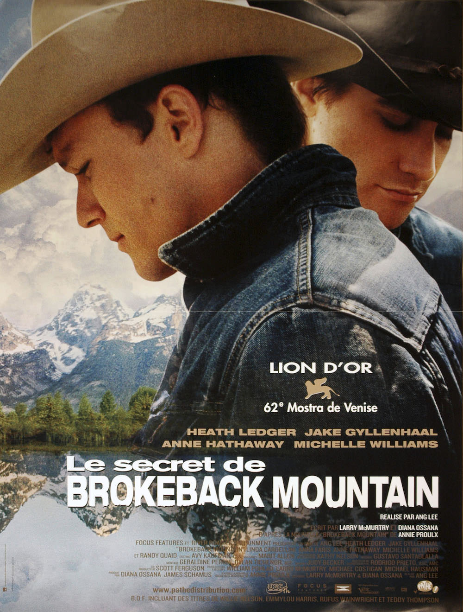
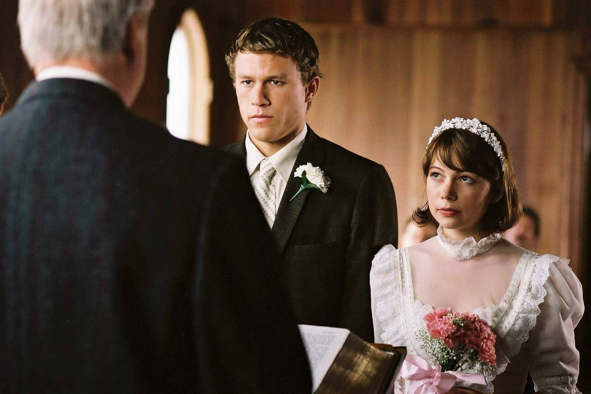
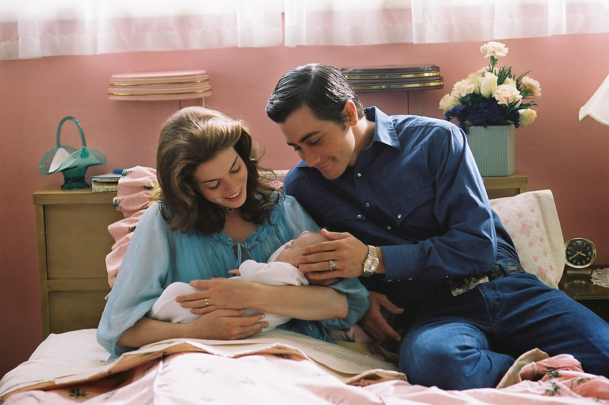

+++
titre = "<em>Le secret de Brokeback Mountain</em>, Ang Lee"
title = "Le secret de Brokeback Mountain, Ang Lee"
url = "/secret-brokeback-mountain-lee"
date = "2014-01-26T21:43:52"
Lastmod = "2014-01-26T21:50:48"
cover = "le-secret-de-brokeback-mountain-ang-lee-heath-ledger-jake-gyllenhaal.jpg"
categorie = [ "À voir" ]
tag = [ "Adaptation littéraire", "Amour", "Drame", "Famille", "Homosexualité", "Nature", "Société", "Western" ]
createur = [ "Ang Lee" ]
acteur = [ "Anne Hathaway", "Heath Ledger", "Jake Gyllenhaal", "Michelle Williams" ]
annee = [ "2005" ]
weight = 2005
pays = [ "États-Unis" ]
original = "Brokeback Mountain"

+++

Après le film de kung-fu avec <a href="http://voiretmanger.fr/tigre-et-dragon-lee/" title="Tigre et Dragon, Ang Lee"><em>Tigre et Dragon</em></a>, après le blockbuster et les superhéros avec <em>Hulk</em>, Ang Lee change à nouveau de genre pour son neuvième long-métrage. Le cinéaste taïwanais est parmi les plus éclectiques et il ne cesse constamment de changer de style : <em>Le secret de Brokeback Mountain</em> aborde ainsi une histoire d&rsquo;amour homosexuel dans une société extrêmement conservatrice. S&rsquo;étalant sur plusieurs années, prenant son temps de poser ses personnages et son histoire, ce film dépasse largement le statut de film gay au profit d&rsquo;un récit extrêmement touchant. Ang Lee parvient à montrer l&rsquo;homosexualité avec une sensibilité rare et, porté par deux acteurs exceptionnels, <em>Le secret de Brokeback Mountain</em> est un film magnifique, à ne pas rater.

Wyoming, été 1963. Jack et Ennis n&rsquo;ont pas vingt ans et ils cherchent un petit boulot pour passer l&rsquo;été. Dans cette région isolée des États-Unis, il n&rsquo;y a bien que l&rsquo;élevage qui paye un peu et les deux jeunes hommes s&rsquo;engagent pour garder un troupeau de moutons dans la montagne de Brokeback. Le travail est difficile, il faut passer des nuits entières à surveiller le troupeau et éloigner les prédateurs, mais cela ne leur fait pas peur. Les deux héros filmés par Ang Lee ont besoin d&rsquo;argent pour fonder leur famille : Ennis doit se marier à l&rsquo;automne et il veut un peu d&rsquo;argent pour son propre ranch. <em>Le secret de Brokeback Mountain</em> prend son temps pour les montrer au quotidien et le film ne brusque rien. On sent très vite une attirance réciproque entre les deux garçons, même s&rsquo;ils ne veulent pas se l&rsquo;avouer. Jack regarde Ennis en coin et ce dernier n&rsquo;est aussi insensible aux charmes du premier qu&rsquo;il veut bien se l&rsquo;avouer. Un soir, alors qu&rsquo;ils ont tous deux un peu trop bu, ils vont se coucher sous la même tente et ce qui devait arriver, arriva. Une première étreinte assez brutale — ce sont des cow-boys après tout —, mais le mal est fait. À partir de ce moment, plus rien ne pourra séparer les deux amoureux. Alors qu&rsquo;il a pris son temps jusque-là, Ang Lee accélère astucieusement le rythme de son film. L&rsquo;été touche à sa fin, les deux hommes se séparent et chacun va vivre sa vie de son côté. Ils se marient, ils ont des enfants et fondent une famille… jusqu&rsquo;au jour où, quatre ans après, ils se retrouvent et ne peuvent s&rsquo;empêcher de s&rsquo;embrasser avec passion. <em>Le secret de Brokeback Mountain</em> n&rsquo;est pas terminé, loin de là : le récit s&rsquo;étale ensuite sur de nombreuses années, jusqu&rsquo;aux années 1980. Malgré toute leur volonté, ni Jack, ni Ennis ne parviennent à s&rsquo;oublier et ils ont beau tout faire pour entrer dans la norme de cette société rurale très conservatrice, ils ne peuvent vivre l&rsquo;un sans l&rsquo;autre. 

Avant tout, <em>Le secret de Brokeback Mountain</em> raconte une histoire d&rsquo;amour, qu&rsquo;il s&rsquo;agisse de deux hommes semble presque secondaire, du moins dans un premier temps. Ang Lee filme deux êtres qui sont frappés par un coup de foudre que rien, ni les années, ni leur mariage respectif avec une autre personne, ne pourront effacer. Quatre, cinq, dix ou même vingt ans après leur premiers baisers à Brokeback Mountain, ils continuent à s&rsquo;aimer avec autant de force, délaissant leurs familles. L&rsquo;une des scènes est à cet égard déchirante : Alma, la femme de Ennis, découvre que son mari la trompe et ose même présenter celui qu&rsquo;il aime, prétendant qu&rsquo;il ne s&rsquo;agit que d&rsquo;un pote de pèche. Cette comédie dure pendant des années et détruit la pauvre Alma qui ne peut rien faire, si ce n&rsquo;est finalement divorcer. À un premier niveau, l&rsquo;homosexualité n&rsquo;a aucune importance, mais il serait faux de s&rsquo;en tenir là. Ang Lee a aussi réalisé un film sur l&rsquo;homosexualité et son acceptation par la société, mais aussi et surtout par soi-même. Dès le début, la relation des deux hommes est marquée par la peur qu&rsquo;elle soit publique. <em>Le secret de Brokeback Mountain</em> commence dans la montagne, loin des regards indiscrets, du moins en théorie, mais cette relation cachée ne quittera jamais vraiment les lieux. Vers la fin, alors que les anciens cow-boys ont vieilli, ils font un constat amer : ils n&rsquo;ont jamais eu que Brokeback à eux, ils n&rsquo;ont jamais su mettre en place quelque chose ensemble. Il faut dire que la société présentée par le film n&rsquo;accepte pas du tout le fait que deux hommes vivent ensemble : une anecdote tragique vécue par le jeune Ennis suffit à décrire le niveau de barbarie que les habitants du coin pouvaient atteindre face à l&rsquo;homosexualité. C&rsquo;est important, mais au fond, les deux personnages principaux eux-mêmes n&rsquo;acceptent jamais tout à fait leur sexualité et font tout pour s&rsquo;en éloigner. <em>Le secret de Brokeback Mountain</em> montre admirablement bien comment ils nient leur relation, surtout Ennis qui semble le plus dur des deux. Ils pensent que ce n&rsquo;est qu&rsquo;une passade, qu&rsquo;un amour de jeunesse qui sera oublié et se leurrent totalement, ce que le cinéaste réussit encore mieux à montrer. On ne racontera pas la fin, mais il suffit de dire que l&rsquo;émotion des personnages atteint un tel niveau qui emporte celle des spectateurs. 

C&rsquo;est rare que l&rsquo;on atteigne au cinéma une telle force évocatrice. Que l&rsquo;on soit gay ou pas, comment rester insensible face à cet amour total d&rsquo;autant plus puissant que <em>Le secret de Brokeback Mountain</em> fait preuve d&rsquo;une économie de moyens bienvenue. À l&rsquo;image de la discrétion de ses deux personnages, Ang Lee n&rsquo;en fait pas des tonnes et parie plutôt sur la prestation remarquable de ses deux acteurs. Jeunes ou plus âgés, Jake Gyllenhaal et Heath Ledger sont tout simplement parfaits, leur interprétation est d&rsquo;une justesse folle et le succès du film repose largement sur leurs épaules. <em>Le secret de Brokeback Mountain</em> mérite d&rsquo;être (re)vu rien que pour ces deux prestations…

<h3>Vous voulez m&rsquo;aider ?<a href="#footnote_0_11036" id="identifier_0_11036" class="footnote-link footnote-identifier-link" title="&Agrave; propos de la publicit&eacute;&hellip;">1</a></h3>
<ul>
<li><a href="http://www.amazon.fr/gp/product/B003TP3VPO/ref=as_li_ss_tl?ie=UTF8&#038;tag=leblogdenic07-21&#038;linkCode=as2&#038;camp=1642&#038;creative=19458&#038;creativeASIN=B003TP3VPO">Acheter le film en Blu-Ray sur Amazon</a></li>
<li><a href="http://www.amazon.fr/gp/product/B000FGG7E2/ref=as_li_ss_tl?ie=UTF8&#038;tag=leblogdenic07-21&#038;linkCode=as2&#038;camp=1642&#038;creative=19458&#038;creativeASIN=B000FGG7E2">Acheter le film en DVD sur Amazon</a></li>
</ul>

<ol class="footnotes"><li id="footnote_0_11036" class="footnote"><a href="http://voiretmanger.fr/soutien/">À propos de la publicité…</a> [<a href="#identifier_0_11036" class="footnote-link footnote-back-link">&#8617;</a>]</li></ol>
