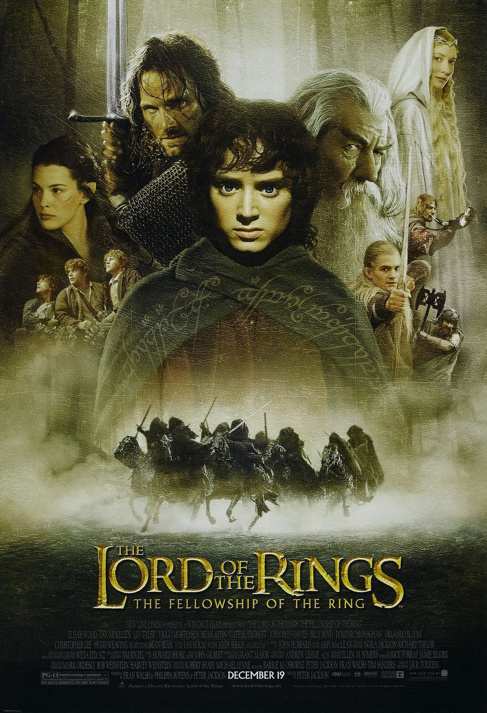
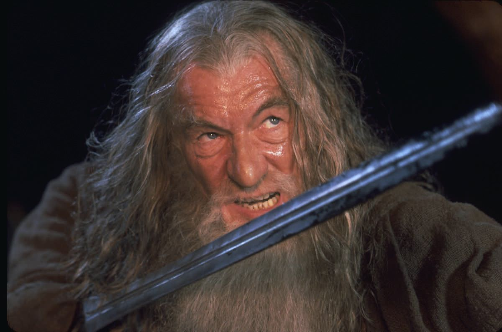
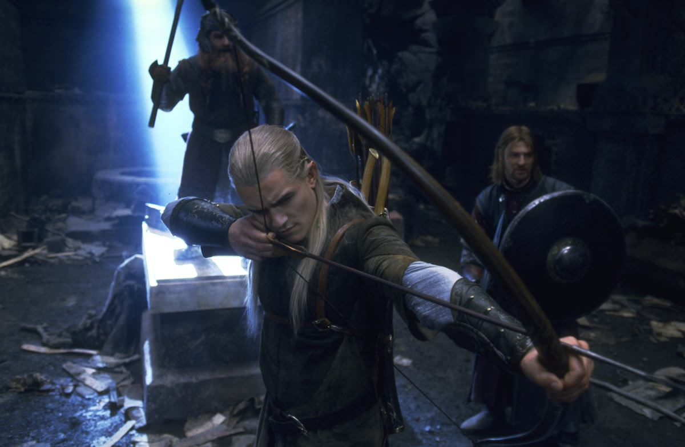
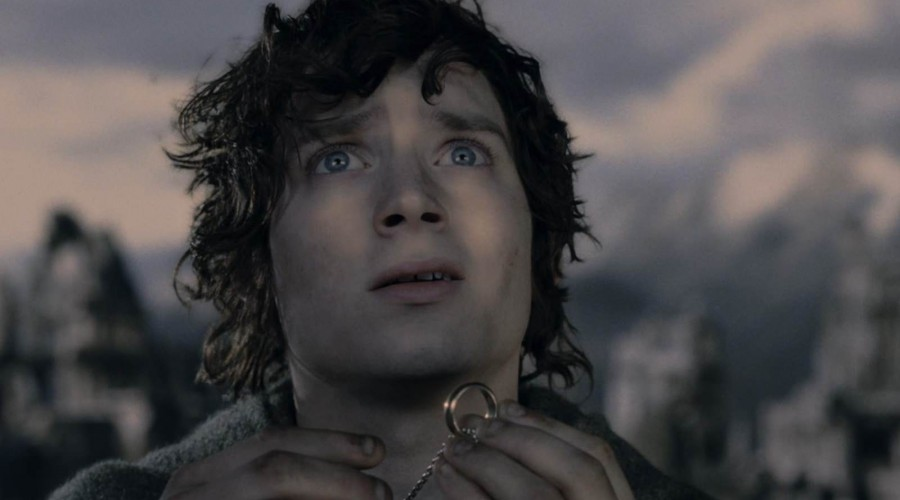

+++
type = "post"
titre = "<em>Le Seigneur des anneaux : la Communauté de l&rsquo;anneau</em>, Peter Jackson"
title = "Le Seigneur des anneaux : la Communauté de l'anneau, Peter Jackson"
url = "/seigneur-anneaux-communaute-anneau-jackson"
date = "2012-07-08T10:38:46"
Lastmod = "2013-09-13T13:31:17"
cover = "seigneur-anneaux-elijah-wood-peter-jackson.jpg"
categorie = [ "À voir" ]
tag = [ "Blockbuster", "Épopée", "Fantastique", "Guerre", "Heroïc-Fantasy", "Mythe", "Saga" ]
createur = [ "Peter Jackson" ]
acteur = [ "Andy Serkis", "Cate Blanchett", "Christopher Lee", "Elijah Wood", "Hugo Weaving", "Ian Holm", "Ian McKellen", "Orlando Bloom", "Sean Astin", "Viggo Mortensen" ]
annee = [ "2001" ]
weight = 2001
saga = [ "Le Seigneur des Anneaux" ]
pays = [ "États-Unis", "Nouvelle-Zélande" ]
original = "The Lord of the Rings: The Fellowship of the Ring"

+++

Adapter au cinéma la trilogie de J.R.R. Tolkien… il fallait quelqu&rsquo;un de suffisamment dingue pour s&rsquo;y risquer. Il fallait un fan absolu du <em>Seigneur des Anneaux</em>, quelqu&rsquo;un de suffisamment borné et ambitieux pour tenir tête aux studios et imposer son projet pharaonique. La plus grande saga d&rsquo;heroïc-fantasy a trouvé son meilleur défenseur avec Peter Jackson, réalisateur néo-zélandais totalement inconnu du grand public quand le premier film sort. Après plus d&rsquo;un an de tournage qui accumule les records et après un an de production, <em>Le Seigneur des anneaux : la Communauté de l&rsquo;anneau</em> sort en salles à la fin de l&rsquo;année 2001. À l&rsquo;époque, le souffle épique de la fresque et la richesse de son univers frappent les esprits : on n&rsquo;avait jamais vu une histoire d&rsquo;une telle ampleur au cinéma. Peter Jackson ouvre ainsi sa trilogie avec un film qui fait office d&rsquo;introduction aux personnages et à l&rsquo;histoire, un film épique qui n&rsquo;a pas pris une ride…

Pour ceux qui pourraient encore l&rsquo;ignorer, <em>Le Seigneur des Anneaux</em> raconte l&rsquo;histoire d&rsquo;un hobbit, Frodon, qui traverse un univers fantastique pour détruire un anneau maléfique, mais aussi l&rsquo;histoire plus ample d&rsquo;un combat entre le bien et le mal. La force de J.R.R. Tolkien par rapport aux nombreuses œuvres du même genre est indéniablement le réalisme et l&rsquo;ampleur de l&rsquo;univers qu&rsquo;il a imaginé. Son œuvre entière est construite autour d&rsquo;un espace créé de toutes pièces, mais doté de plusieurs langues que l&rsquo;écrivain a imaginé et surtout d&rsquo;une histoire logique pensée sur plusieurs milliers d&rsquo;années. Un travail extrêmement ambitieux auquel <em>Le Seigneur des anneaux : la Communauté de l&rsquo;anneau</em> devait introduire, tout en se concentrant essentiellement sur la quête de Frodon. Le film débute ainsi sur un prologue qui remonte quelques milliers d&rsquo;années en arrière expliquer l&rsquo;origine de l&rsquo;anneau, avant de revenir au présent de la trilogie. L&rsquo;histoire commence donc dans la paisible Comté, le pays des hobbits. Le mage Gandalf s&rsquo;y rend pour fêter les 111 ans de son ami Bilbon qui entend profiter de l&rsquo;évènement pour quitter sa communauté et finir sa vie ailleurs. Pour partir, il utilise le pouvoir d&rsquo;un anneau magique récupéré plusieurs années auparavant, un anneau qui lui permet de devenir totalement invisible. Gandalf est immédiatement intrigué par cet anneau qu&rsquo;il ne connait pas, mais qui lui semble dangereux. En attendant d&rsquo;en savoir plus, il le confie à Frodon, le neveu de Bilbon. Très vite, le mage comprend le danger représenté par cet anneau conçu par le maléfique Sauron et il demande à Frodon de l&rsquo;amener jusqu&rsquo;aux elfes, où on décidera de ce qu&rsquo;il faudra en faire. Sans le savoir, le jeune hobbit se lance dans une longue et dangereuse aventure…

<em>Le Seigneur des anneaux : la Communauté de l&rsquo;anneau</em> a la lourde tâche d&rsquo;introduire l&rsquo;une des plus ambitieuses trilogies qui soient. Peter Jackson utilise un prologue pour situer l&rsquo;histoire de son film dans la chronologie générale de l&rsquo;univers imaginé par J.R.R. Tolkien, si bien que le spectateur a d&rsquo;emblée le sentiment de se trouver face à un univers beaucoup plus riche qu&rsquo;il n&rsquo;y paraît. La Terre du Milieu a affronté le Mordor 3000 ans auparavant, on apprend que plusieurs races partagent cet espace avec deux clans constitués : les hommes, elfes, nains et hobbits du côté du bien, les trolls, orques et autres créatures maléfiques du côté du mal et du Mordor. Le scénario du premier film dose parfaitement la quantité d&rsquo;informations délivrée aux spectateurs pour lui donner précisément ce qu&rsquo;il faut pour comprendre l&rsquo;histoire, sans le noyer dans les informations. Peter Jackson simplifie un peu le travail du romancier et oppose nettement le bien et le mal dans une guerre sans merci qui est sur le point de s&rsquo;ouvrir quand débute <em>Le Seigneur des anneaux : la Communauté de l&rsquo;anneau</em>. L&rsquo;essentiel des combats se concentrera dans les deux autres films, mais le cinéaste parvient bien à rendre le sentiment d&rsquo;urgence qui habite Gandalf et les elfes, les seuls qui sachent vraiment ce qui se trame. L&rsquo;heure est au rassemblement des forces côté Mordor, avec des alliances qui se forment — celle de Saroumane en particulier —, mais la guerre n&rsquo;est pas encore vraiment arrivée et l&rsquo;insouciance règne dans la majeure partie du film. C&rsquo;est évidemment vrai au début, quand l&rsquo;existence de l&rsquo;anneau est encore ignorée, c&rsquo;est vrai par la suite et la communauté formée autour de Frodon et de l&rsquo;anneau est assez joyeuse dans un premier temps, même si les difficultés ne tardent pas.

À l&rsquo;image des trois livres qu&rsquo;il adapte, les trois films de Peter Jackson développent deux intrigues parallèles, même si elles se croisent parfois. <em>Le Seigneur des anneaux : la Communauté de l&rsquo;anneau</em> ne respecte pas encore ce principe toutefois, la séparation n&rsquo;arrivant qu&rsquo;à la toute fin du film. L&rsquo;heure est à la constitution du groupe et par là, à la découverte des personnages principaux et secondaires les plus importants. Le film s&rsquo;ouvre naturellement sur Frodon, celui qui porte l&rsquo;anneau vers le Mordor dans toute la trilogie, même s&rsquo;il n&rsquo;est alors qu&rsquo;un hobbit heureux et insouciant. Gandalf suit de près : le magicien a un rôle prépondérant dans la saga, c&rsquo;est déjà le cas dans ce premier volet puisque c&rsquo;est lui qui comprend la vraie nature de l&rsquo;anneau de Bilbon. Les autres personnages arrivent ensuite les uns après les autres : les trois autres hobbits, le chevalier Aragorn, l&rsquo;elfe Legolas, le nain Gimli… Les personnages de J.R.R. Tolkien sont assez courants dans les œuvres d&rsquo;heroïc-fantasy, ils constituent une communauté hétéroclite autour de Frodon, mais c&rsquo;est justement sa force. Les scènes de combat restent relativement rares dans <em>Le Seigneur des anneaux : la Communauté de l&rsquo;anneau</em>, même si les mines de la Moria offrent déjà une scène d&rsquo;anthologie, mais Peter Jackson exploite bien ses personnages, que ce soit sur le plan du combat — la légèreté et la précision de Legolas contre la force brute et puissante de Gimli évidemment — ou du style. Cet aspect sera renforcé dans la suite, mais on sent déjà poindre l&rsquo;humour dans ce premier film, présent quasiment exclusivement du côté des compagnons de Frodon, et non de ce dernier qui passe de l&rsquo;insouciance à la gravité dès qu&rsquo;il prend l&rsquo;anneau. <em>Le Seigneur des anneaux : la Communauté de l&rsquo;anneau</em> est de ce fait le film le plus équilibré de la trilogie, il rassemble plusieurs genres et offre même quelques scènes légères que <a href="http://voiretmanger.fr/2012/07/15/seigneur-anneaux-deux-tours-jackson/" title="Le Seigneur des anneaux : les deux tours, Peter Jackson"><em>Les Deux Tours</em></a> et <em>Le Retour du Roi</em> peineront à proposer.

Quatorze mois de tournage dans plus de 150 lieux et avec sept équipes qui filment au même moment… Ces <a href="http://fr.wikipedia.org/wiki/Le_Seigneur_des_anneaux_(films_de_Peter_Jackson)#Tournage">quelques chiffres</a> résument à eux seuls la démesure du projet mené par Peter Jackson. La trilogie marque une étape dans l&rsquo;histoire des blockbusters, on n&rsquo;avait jamais vu des films si ambitieux que même <a title="La saga Star Wars sur le blog de Nicolinux" href="http://voiretmanger.fr/archives/saga-star-wars/">la saga <em>Star Wars</em></a> ressemble à un film d&rsquo;auteur à côté. Ces moyens monstrueux pour l&rsquo;époque n&rsquo;ont pas été déployés en vain et on sent dès les premières images du film que <em>Le Seigneur des anneaux : la Communauté de l&rsquo;anneau</em> est exceptionnel. Peter Jackson se surpasse encore dans les deux suivants, la technologie numérique mise au point spécifiquement pour le film évoluant rapidement, mais déjà ce premier opus impressionne à sa sortie et c&rsquo;est toujours le cas aujourd&rsquo;hui. Le tournage commence en 1999, à l&rsquo;époque les effets numériques ne sont pas encore ce qu&rsquo;ils sont devenus et on ne peut pas reconstituer un univers complet devant un fond vert, comme <a title="Avatar, James Cameron" href="http://voiretmanger.fr/2009/12/18/avatar-james-cameron/"><em>Avatar</em></a> le fait quelques années après. Le cinéaste doit à la place construire des décors monstrueux, quasiment à taille réelle : la Comté a été <a href="http://fr.wikipedia.org/wiki/Le_Seigneur_des_anneaux_:_La_Communauté_de_l%27anneau#Design">reconstituée</a> sur 2 km², la tour d&rsquo;Isengard a été construite, de même que les deux statues de l&rsquo;Argonath qui apparaissent à la fin du film et qui mesurent 2 mètres 40 au moment du tournage. À ces éléments de décor réels qui rattachent le film aux plus vieilles techniques du cinéma, Peter Jackson ajoute les plus modernes et comme George Lucas avant lui, en invente de nouvelles pour ses propres besoins. L&rsquo;un des défis de <em>Le Seigneur des anneaux : la Communauté de l&rsquo;anneau</em> est de représenter d&rsquo;immenses armées virtuelles et un logiciel spécifique est développé pour ce besoin précis. Filmer des personnages de tailles différentes relève également du casse-tête pendant le tournage, mais il faut saluer le rendu : Peter Jackson et ses acteurs font un excellent travail et le résultat est bluffant. La musique composée par Howard Shore l&rsquo;est tout autant : épique et ample, elle est composée à la manière d&rsquo;un opéra de Wagner autour de thèmes associés à des situations, des personnages ou encore des lieux. On a rarement fait aussi efficace que la bande originale du <em>Seigneur des Anneaux</em>.

Seul un réalisateur un peu dingue pouvait se risquer à l&rsquo;adaptation de la trilogie de J.R.R. Tolkien. Peter Jackson était le candidat idéal : en vrai fan du <em>Seigneur des Anneaux</em>, il compose une version cinématographique suffisamment proche des originaux pour ne pas en trahir l&rsquo;esprit, mais suffisamment adaptée pour ne pas perdre les spectateurs en route. <em>Le Seigneur des anneaux : la Communauté de l&rsquo;anneau</em> offre une belle ouverture à la trilogie, Peter Jackson prend tout son temps pour installer son récit, ce qui le conduit peut-être à faire un petit peu trop long avec quelques baisses de rythme. Qu&rsquo;importe, le souffle épique est bien au rendez-vous et le spectacle atteint des niveaux jamais vus. Du grand cinéma, encore aujourd&rsquo;hui…

<h3 style="text-align: center;">Trilogie Le Seigneur des anneaux</h3>

<h3>Vous voulez m&rsquo;aider ?<a href="#footnote_0_7009" id="identifier_0_7009" class="footnote-link footnote-identifier-link" title="&Agrave; propos de la publicit&eacute;&hellip;">1</a></h3>
<ul>
<li><a href="http://www.amazon.fr/gp/product/B003BGASZW/ref=as_li_ss_tl?ie=UTF8&amp;tag=leblogdenic07-21&amp;linkCode=as2&amp;camp=1642&amp;creative=19458&amp;creativeASIN=B003BGASZW">Acheter le film en Blu-Ray sur Amazon</a></li>
<li><a href="http://www.amazon.fr/gp/product/B004JP8ONM/ref=as_li_ss_tl?ie=UTF8&amp;tag=leblogdenic07-21&amp;linkCode=as2&amp;camp=1642&amp;creative=19458&amp;creativeASIN=B004JP8ONM">Acheter le film en DVD sur Amazon</a></li>
</ul>
<ul>
<li><a href="http://www.amazon.fr/gp/product/B003BGAT0G/ref=as_li_ss_tl?ie=UTF8&amp;tag=leblogdenic07-21&amp;linkCode=as2&amp;camp=1642&amp;creative=19458&amp;creativeASIN=B003BGAT0G">Acheter la trilogie en Blu-Ray sur Amazon</a> (<a href="http://www.amazon.fr/gp/product/B004WEHLKC/ref=as_li_ss_tl?ie=UTF8&amp;tag=leblogdenic07-21&amp;linkCode=as2&amp;camp=1642&amp;creative=19458&amp;creativeASIN=B004WEHLKC">versions longues</a>)</li>
<li><a href="http://www.amazon.fr/gp/product/B0052OSNGM/ref=as_li_ss_tl?ie=UTF8&amp;tag=leblogdenic07-21&amp;linkCode=as2&amp;camp=1642&amp;creative=19458&amp;creativeASIN=B0052OSNGM">Acheter la trilogie en DVD sur Amazon</a> (<a href="http://www.amazon.fr/gp/product/B0052OSMJK/ref=as_li_ss_tl?ie=UTF8&amp;tag=leblogdenic07-21&amp;linkCode=as2&amp;camp=1642&amp;creative=19458&amp;creativeASIN=B0052OSMJK">versions longues</a>)</li>
</ul>

<ol class="footnotes"><li id="footnote_0_7009" class="footnote"><a href="http://voiretmanger.fr/soutien/">À propos de la publicité…</a> [<a href="#identifier_0_7009" class="footnote-link footnote-back-link">&#8617;</a>]</li></ol>
