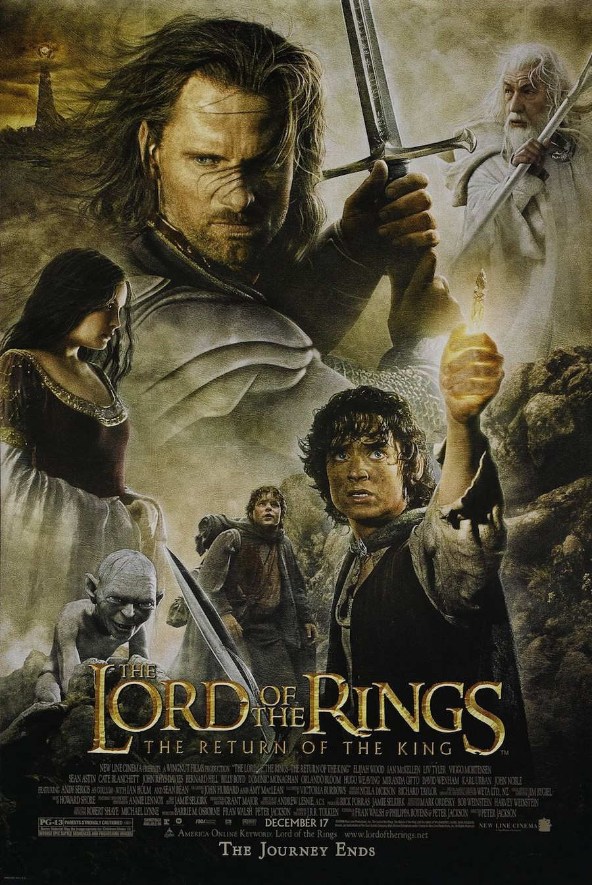
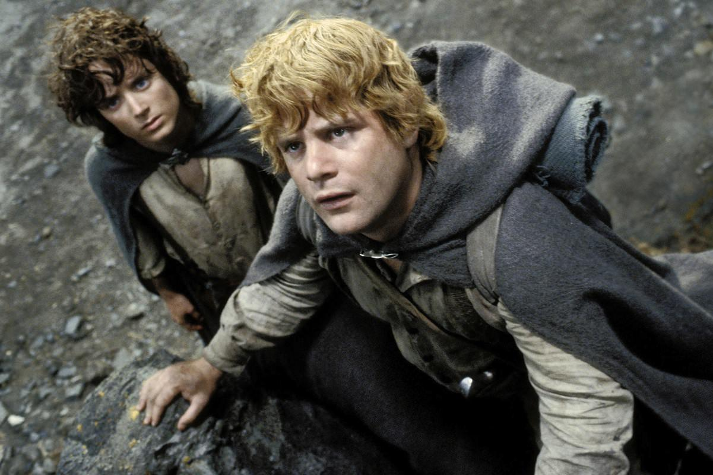
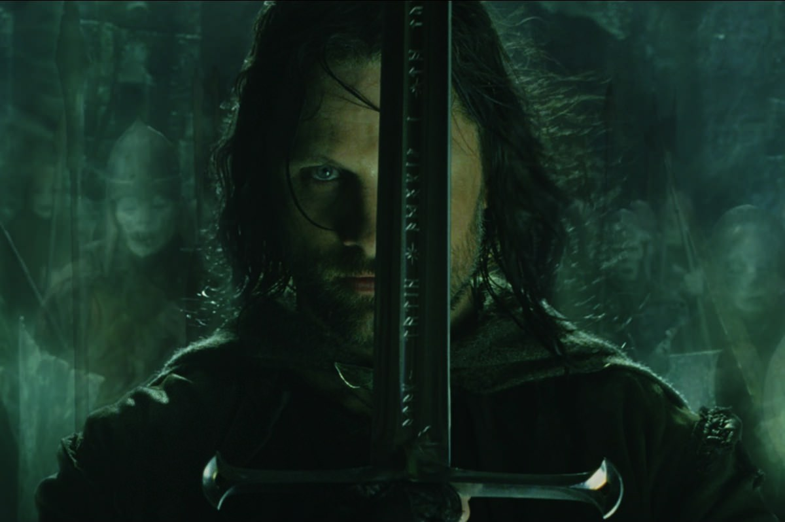

+++
type = "post"
titre = "<em>Le Seigneur des Anneaux : le retour du Roi</em>, Peter Jackson"
title = "Le Seigneur des Anneaux : le retour du Roi, Peter Jackson"
url = "/seigneur-anneaux-retour-roi-jackson"
date = "2012-07-22T10:20:57"
Lastmod = "2014-12-10T23:19:35"
cover = "seigneur-anneaux-retour-roi-elijah-wood.jpg"
categorie = [ "À voir" ]
tag = [ "Blockbuster", "Épopée", "Fantastique", "Guerre", "Heroïc-Fantasy", "Mythe", "Saga" ]
createur = [ "Peter Jackson" ]
acteur = [ "Andy Serkis", "Elijah Wood", "Ian McKellen", "Liv Tyler", "Orlando Bloom", "Sean Astin", "Viggo Mortensen" ]
annee = [ "2003" ]
weight = 2003
saga = [ "Le Seigneur des Anneaux" ]
pays = [ "États-Unis", "Nouvelle-Zélande" ]
original = "The Lord of the Rings: The Return of the King"

+++

La quête de l&rsquo;anneau se termine et avec elle, la guerre de la Terre du milieu. À bien des égards, <em>Le Seigneur des Anneaux : le retour du Roi</em> est l&rsquo;épisode plus épique de la trilogie, celui de tous les superlatifs. Peter Jackson offre à sa relecture une conclusion qui impressionne autant par l&rsquo;ampleur des dernières batailles où tout se joue, que par sa longueur : près de 3 h 30 au cinéma et même 4 h en version longue. Un film épique, mais aussi aride et très noir : même si le cinéaste n&rsquo;a pas su faire les coupes nécessaires à la fin, <em>Le Seigneur des Anneaux : le retour du Roi</em> reste un grand blockbuster qui termine la trilogie en beauté.

On a découvert les principaux protagonistes et leur quête dans <a title="Le Seigneur des anneaux : la Communauté de l’anneau, Peter Jackson" href="/2012/07/08/seigneur-anneaux-communaute-anneau-jackson/"><em>Le Seigneur des anneaux : la Communauté de l’anneau</em></a> ; l&rsquo;histoire jusque-là globalement linéaire se sépare alors en plusieurs intrigues menées de front dans <a title="Le Seigneur des anneaux : les deux tours, Peter Jackson" href="/2012/07/15/seigneur-anneaux-deux-tours-jackson/"><em>Le Seigneur des anneaux : les deux tours</em></a>, tandis que les hommes l&rsquo;emportaient contre Saroumane, allié à Sauron. Quand ce troisième épisode commence, le Mordor n&rsquo;a jamais été aussi proche de la victoire. Ses troupes sont prêtes et elles réussissent facilement à s&rsquo;emparer de l&rsquo;avant-poste situé à quelques mètres de Minas Tirith. La capitale du Gondor est importante à plus d&rsquo;un titre : c&rsquo;est la première forteresse du royaume, mais c&rsquo;est aussi un symbole, l&rsquo;ancienne cité des rois. Sauron veut l&rsquo;annihiler et empêcher ainsi tout espoir de la part des hommes, alors que tout pousse Aragorn pour accepter la couronne et reprendre le trône du Gondor. Le siège de la capitale ne tarde pas et les maigres forces regroupées dans la ville ne font pas vraiment le poids contre les dizaines de milliers d&rsquo;orcs et autres créatures diaboliques que le Mordor a rassemblés. Pendant que cette guerre fait rage, <em>Le Seigneur des Anneaux : le retour du Roi</em> suit toujours les avancées de Frodon et Sam, guidés vers le Mordor par Gollum. Leurs avancées en terrain ennemi sont toujours plus difficiles, à la fois parce que les risques de se faire prendre sont accrus, mais aussi parce que le hobbit a de plus en plus de mal à résister à l&rsquo;appel de l&rsquo;anneau et de son maître. Tout l&rsquo;espoir des hommes repose pourtant sur eux…

Si <em>Les deux tours</em> pratiquait déjà le montage alterné en suivant trois intrigues parallèles, jamais la quête et la guerre de l&rsquo;anneau n&rsquo;avaient été aussi liées que dans <em>Le Seigneur des Anneaux : le retour du Roi</em>. Peter Jackson montre bien que l&rsquo;un dépend nécessairement de l&rsquo;autre : les hommes gagnent la bataille de Minas Tirith, mais ils ne gagnent pas la guerre pour autant et Sauron dispose de troupes encore plus importantes dans le Mordor. Pour vaincre définitivement le mal, ils ont besoin de porter un coup décisif à leur ennemi et ce coup ne peut pas provenir des armes. Seul Frodon, le porteur de l&rsquo;anneau, peut en fait faire pencher la balance du bon côté. Reste que sa mission est extrêmement difficile et que la présence de Gollum ne simplifie pas les choses. Même quand il réussit enfin à entrer en pays ennemi, son avancée n&rsquo;est permise qu&rsquo;en raison de la diversion réussie par les hommes qui sont venus titiller Sauron pour le distraire. Les deux histoires avancent en parallèle dans <em>Le Seigneur des Anneaux : le retour du Roi</em> et elles ne se croisent jamais, les deux groupes ne peuvent d&rsquo;ailleurs pas communiquer, mais le cinéaste a bien réussi à rendre leur avancée commune. Au total, la victoire n&rsquo;est possible que par l&rsquo;action combinée de Frodon et Sam d&rsquo;une part, Gandalf et Aragorn d&rsquo;autre part. Les scénaristes ont retouché l&rsquo;œuvre de J.R.R. Tolkien pour réussir à la simplifier et obtenir ainsi deux actions parallèles, mais les changements sont plutôt bien vus. La tension permanente entre Frodon, Sam et Gollum est l&rsquo;une des bonnes idées du film, de même que la tentation de l&rsquo;anneau qui est très sensible, et ce jusqu&rsquo;à la dernière minute.

<em>Le Seigneur des Anneaux : le retour du Roi</em> surprend par son aridité et sa noirceur qui tranchent par rapport aux deux films précédents. Le happy-end ne parvient pas vraiment à contrebalancer ce sentiment général : Peter Jackson signe un troisième épisode sombre. La partie consacrée à la destruction de l&rsquo;anneau par les deux hobbits n&rsquo;a jamais été très amusante, mais elle se déroule désormais autour et dans le Mordor, un environnement volcanique lugubre et aride où toute forme de vie a déserté depuis longtemps. C&rsquo;est un terrain totalement minéral et la question des réservées de nourriture et bientôt d&rsquo;eau se posent. Sam et Frodon qui ne mangent que du pain rassis depuis des jours et des jours en sont maintenant réduits à le fractionner au maximum. Bientôt, ils n&rsquo;ont plus rien à manger ni à boire et ils doivent pourtant commencer l&rsquo;ascension du volcan, peut-être l&rsquo;étape la plus difficile de tout leur trajet. L&rsquo;heure n&rsquo;est pas à la détente, les deux hobbits ont bien compris qu&rsquo;ils ne pourraient jamais faire le trajet du retour et <em>Le Seigneur des Anneaux : le retour du Roi</em> transmet bien cette ambiance un peu tragique qui donne le sentiment que Frodon et Sam se sacrifient pour sauver la Terre du Milieu. La guerre justement n&rsquo;est pas beaucoup plus enthousiasmante dans cette conclusion. Les troupes de Saroumane envoyées contre le gouffre de Helm dans <em>Les deux tours</em> n&rsquo;étaient qu&rsquo;une rigolade à côté de l&rsquo;envoi de toutes les troupes de Sauron dans <em>Le Seigneur des Anneaux : le retour du Roi</em>. La forteresse de Minas Tirith est également beaucoup plus importante et l&rsquo;ensemble respire le combat de la dernière chance. Même les personnages de Legolas et de Gimli n&rsquo;arrivent plus à insuffler la pointe d&rsquo;humour qui les caractérisait précédemment : s&rsquo;ils comptent toujours leurs victimes sur le champ de bataille, Peter Jackson ne les exploite pas vraiment.

Les moyens déployés dans <em>Le Seigneur des Anneaux : le retour du Roi</em> sont à la hauteur des enjeux. Ce dernier film est le plus long, c&rsquo;est aussi le plus impressionnant sur le plan technique. C&rsquo;est le film qui utilise le plus d&rsquo;effets spéciaux numériques dans la trilogie. Le logiciel conçu spécifiquement pour créer des armées réalistes trouve ici son plus grand rôle et les nombreux plans sur les deux champs de bataille du film montrent bien à quel point il est efficace. Le rendu est indéniablement très bon, mais le résultat s&rsquo;avère étonnamment moins impressionnant que dans l&rsquo;opus précédent. Pour l&rsquo;attaque du gouffre de Helm, Peter Jackson avait privilégié les plans rapprochés qui ont l&rsquo;avantage d&rsquo;être extrêmement immersifs. Ici, le cinéaste a opté au contraire pour des plans larges qui favorisent la bonne compréhension de la bataille, un point important avec autant de troupes de part et d&rsquo;autre, mais qui offre au spectateur moins le sentiment d&rsquo;être au cœur de l&rsquo;action. Au total, <em>Le Seigneur des Anneaux : le retour du Roi</em> paraît un peu facile, comme si tout se déroulait mécaniquement selon un plan préétabli, même s&rsquo;il faut bien avouer que cette énorme bataille fait toujours son petit effet, encore aujourd&rsquo;hui. L&rsquo;aridité que l&rsquo;on évoquait précédemment fonctionne en revanche à plein pour la quête de l&rsquo;anneau. Peter Jackson a réussi à créer un Mordor réaliste et vraiment impressionnant, mais le succès de ces scènes est aussi celui des acteurs : Elijah Wood surtout, mais aussi Sean Astin sont excellents en hobbits, tandis que la transformation de Gollum reste l&rsquo;un des plus grands rôles d&rsquo;Andy Serkis. <em>Le Seigneur des Anneaux : le retour du Roi</em> a indéniablement marqué à sa sortie, sans doute parce que c&rsquo;est la conclusion de l&rsquo;épopée découverte par le grand public grâce à Peter Jackson, mais aussi parce que l&rsquo;on n&rsquo;avait jamais vu de film aussi gigantesque que celui-ci. Ses onze Oscars — pour onze nominations, un record — et ses bénéfices records pour l&rsquo;époque complètent le tableau et offrent à la trilogie une conclusion à la hauteur de ses ambitions.

La trilogie de J.R.R. Tolkien était réputée inadaptable au cinéma, mais Peter Jackson a largement prouvé le contraire avec sa version. Après deux films réussis, il offre à sa relecture une conclusion gigantesque qui impressionne encore aujourd&rsquo;hui. <em>Le Seigneur des Anneaux : le retour du Roi</em> met en scène une bataille finale épique en parallèle à un combat tout aussi difficile au cœur du mal. Une conclusion haletante, même si la fin est peut-être un peu trop longue. Pour avoir osé s&rsquo;attaquer à ce monument de l&rsquo;heroïc-fantasy, on est toutefois prêt à beaucoup pardonner à Peter Jackson et il fallait aussi une conclusion épique par sa durée…

<h3>Vous voulez m&rsquo;aider ?</h3>
<ul>
<li><a href="http://www.amazon.fr/gp/product/B003BGASZC/ref=as_li_ss_tl?ie=UTF8&amp;tag=leblogdenic07-21&amp;linkCode=as2&amp;camp=1642&amp;creative=19458&amp;creativeASIN=B003BGASZC">Acheter le film en Blu-Ray sur Amazon</a></li>
<li><a href="http://www.amazon.fr/gp/product/B004JP8OMS/ref=as_li_ss_tl?ie=UTF8&amp;tag=leblogdenic07-21&amp;linkCode=as2&amp;camp=1642&amp;creative=19458&amp;creativeASIN=B004JP8OMS">Acheter le film en DVD sur Amazon</a></li>
</ul>
<ul>
<li><a href="http://www.amazon.fr/gp/product/B003BGAT0G/ref=as_li_ss_tl?ie=UTF8&amp;tag=leblogdenic07-21&amp;linkCode=as2&amp;camp=1642&amp;creative=19458&amp;creativeASIN=B003BGAT0G">Acheter la trilogie en Blu-Ray sur Amazon</a> (<a href="http://www.amazon.fr/gp/product/B004WEHLKC/ref=as_li_ss_tl?ie=UTF8&amp;tag=leblogdenic07-21&amp;linkCode=as2&amp;camp=1642&amp;creative=19458&amp;creativeASIN=B004WEHLKC">versions longues</a>)</li>
<li><a href="http://www.amazon.fr/gp/product/B0052OSNGM/ref=as_li_ss_tl?ie=UTF8&amp;tag=leblogdenic07-21&amp;linkCode=as2&amp;camp=1642&amp;creative=19458&amp;creativeASIN=B0052OSNGM">Acheter la trilogie en DVD sur Amazon</a> (<a href="http://www.amazon.fr/gp/product/B0052OSMJK/ref=as_li_ss_tl?ie=UTF8&amp;tag=leblogdenic07-21&amp;linkCode=as2&amp;camp=1642&amp;creative=19458&amp;creativeASIN=B0052OSMJK">versions longues</a>)</li>
</ul>

