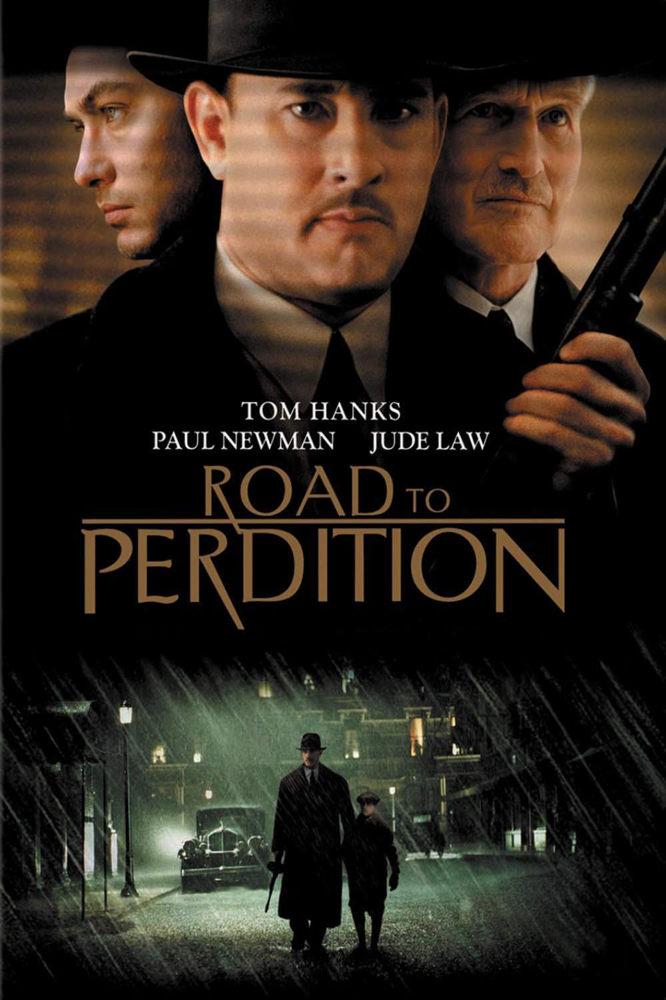
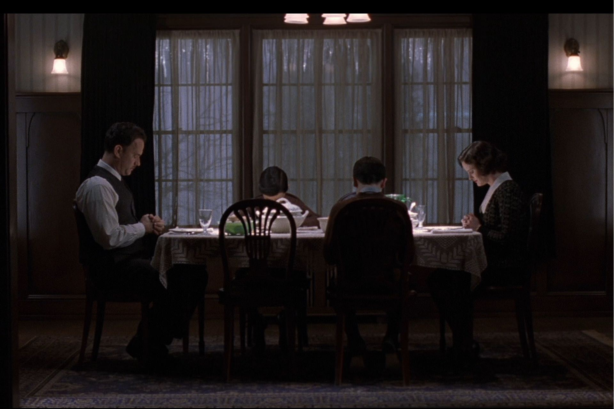
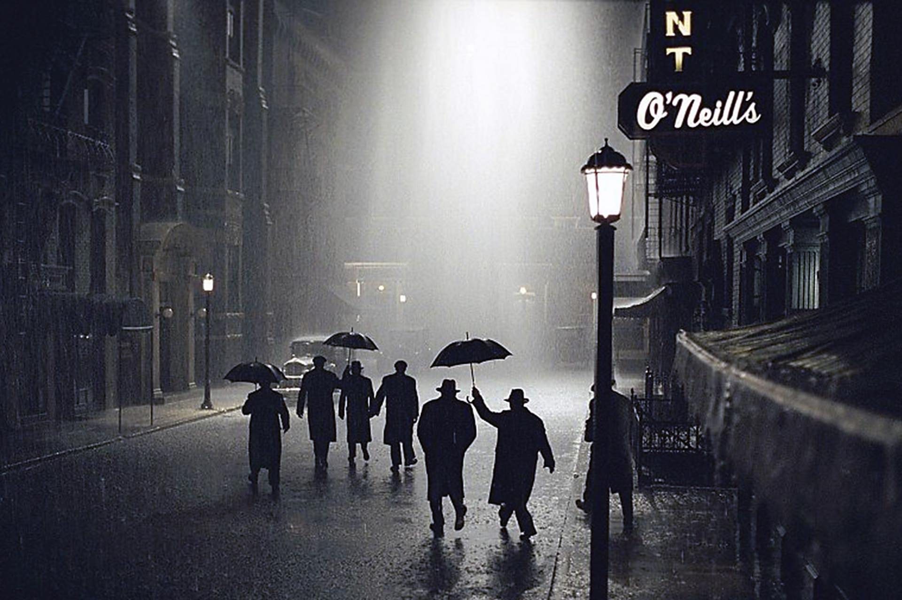

+++
type = "post"
titre = "<em>Les Sentiers de la Perdition</em>, Sam Mendes"
title = "Les Sentiers de la Perdition, Sam Mendes"
url = "/sentiers-perdition-mendes"
date = "2015-01-04T10:13:50"
Lastmod = "2015-01-03T22:26:53"
cover = "sentiers-de-la-perdition-tom-hanks.jpg"
categorie = [ "À voir" ]
tag = [ "Adaptation bande-dessinée", "Famille", "Film noir", "Histoire", "Mafia", "Road-movie", "Thriller", "Vengeance", "Violence" ]
createur = [ "Sam Mendes" ]
acteur = [ "Daniel Craig", "Jude Law", "Paul Newman", "Stanley Tucci", "Tom Hanks", "Tyler Hoechlin" ]
annee = [ "2002" ]
weight = 2002
pays = [ "États-Unis" ]
original = "Road to Perdition"

+++

Après l&rsquo;immense succès d&rsquo;<em>American Beauty</em>, Sam Mendes, désormais réalisateur bien en vu, cherche un nouveau projet et veut changer de genre. Adaptation d&rsquo;un roman graphique de Max Allan Collins, <em>Les Sentiers de la Perdition</em> est un film historique et en costume au cœur des années 1930 américaines et au cœur de la mafia. Pour autant, ce n&rsquo;est pas un film de mafieux comme pouvait l&rsquo;être la <a href="/saga/le-parrain/">saga <em>Le Parrain</em></a> par exemple. Ici, la mafia n&rsquo;est qu&rsquo;une excuse pour parler de liens familiaux et le scénario est une sorte de road-movie teinté de vengeance pour un père et un fils. Le deuxième film de Sam Mendes est aussi une œuvre aussi lente qu&rsquo;elle peut être magnifique, une réussite à (re)voir !

Hiver 1931, les États-Unis sont toujours sous le coup de la prohibition qui interdit toute consommation d&rsquo;alcool. Cette interdiction a surtout fait les affaires des organisations mafieuses qui se sont enrichies grâce à la distribution illégale d&rsquo;alcools en tout genre et <em>Les Sentiers de la Perdition</em> se déroule justement en marge de la mafia. Michael Sullivan est un Irlandais qui travaille pour le compte de John Rooney, parrain de la mafia locale. Même si Sam Mendes reste très discret sur son histoire personnelle, on en apprend assez pour savoir qu&rsquo;il doit tout à son patron, à commencer par sa maison, et probablement tout son argent. Il l&rsquo;aime comme un fils et cela tombe bien, John Rooney se considère aussi comme un père pour lui. Quand le film commence, tout semble aller pour le mieux pour Michael Sullivan, sa femme et ses deux enfants, mais ce n&rsquo;est qu&rsquo;une illusion et on sent très vite une forme de menace. Michael Jr, son fils ainé, se doute bien que son père a un travail pas tout à fait normal et il se met à poser des questions, puis à l&rsquo;espionner. Un soir, alors que son père accompagnait le fils du parrain pour une discussion qui s&rsquo;envenime avec l&rsquo;un des hommes de mains de la mafia, le fils suit son père dans la voiture et découvre qu&rsquo;il s&rsquo;agit en fait d&rsquo;un homme de main, d&rsquo;un meurtrier pour le compte de la mafia. Une découverte qui précipite la perte de la famille : Connor Rooney, le fils en question, décidé de tuer Michael Sullivan et toute sa famille pour éviter qu&rsquo;ils ne parlent et le personnage principal est obligé de partir avec son fils ainé quand il découvre que sa femme et son fils cadet ont déjà été tué. <em>Les Sentiers de la Perdition</em> devient alors une sorte de <em>road-movie</em> sur fond de vengeance, une histoire très classique, mais maîtrisée à la perfection par Sam Mendes.

Au fond, ce ne sont pas les histoires de mafia qui intéressent vraiment le cinéaste. D&rsquo;ailleurs, tous les personnages filmés par Sam Mendes appartiennent, de près ou de loin, à la mafia, mais tout l&rsquo;enjeu, pour Michael Sullivan, est précisément d&rsquo;éloigner son fils de ce milieu. <em>Les Sentiers de la Perdition</em> décrit ainsi le chemin d&rsquo;un homme vers l&rsquo;enfer imposé par la mafia, les meurtres à répétition et peut-être la perte, partielle au moins, de son humanité. C&rsquo;est de ce « sentier » décrit par le titre du long-métrage que Michael veut éloigner son fils, mais c&rsquo;est quelque chose de très difficile, d&rsquo;autant qu&rsquo;il veut en même temps venger la mort de sa femme et de son autre fils. Sam Mendes montre en parallèle trois couples père/fils : outre celui de Michael et de son fils, celui de John et Connor Rooney, il y a aussi John qui est comme un père pour Michael. Le scénario joue sur les différences et les points communs entre ces trois couples : de manière assez classique, le parrain apprécie plus Michael que son propre fils, caractériel et en plus qui se permet de voler son propre argent. Mais comment dénoncer sa propre chair ? <em>Les Sentiers de la Perdition</em> compose des personnages très crédibles, ce qu&rsquo;il doit largement à ses acteurs, tous excellents. Tom Hanks incarne un Michael Sullivan calme et solide, Paul Newmann est parfait en parrain et Daniel Craig est très bien lui aussi dans son rôle. C&rsquo;est un beau casting, mais le plus intéressant est sans doute le choix de Sam Mendes de réduire les dialogues au maximum. On attendait un blockbuster vitaminé, on a en fait un film très lent et contemplatif, avec quelques scènes de violence, certes, mais qui restent finalement assez rares et souvent filmées de biais. Le premier meurtre que l&rsquo;on voit, c&rsquo;est à travers les yeux du jeune Michael Jr, par le trou de la porte, qu&rsquo;on le voit et on a ainsi seulement du son et des balles qui tombent. L&rsquo;autre exemple frappant et devenu célèbre, c&rsquo;est la fusillade finale où l&rsquo;on n&rsquo;entend pas les armes à feu et où les corps tombent les uns après les autres, presque comme s&rsquo;il s&rsquo;agissait d&rsquo;une danse. Le cinéaste ne veut pas montrer la violence gratuitement et c&rsquo;est d&rsquo;ailleurs une différence majeure avec la bande-dessinée originale, beaucoup plus violente.

<em>Les Sentiers de la Perdition</em> fait de l&rsquo;économie de moyens son principal moteur, et c&rsquo;est probablement ce qui explique sa réussite. Plutôt que de tout expliquer et de ne rien laisser au hasard, Sam Mendes parie plutôt sur l&rsquo;intelligence des spectateurs et le résultat est une sensation de légèreté bienvenue. Même si la violence est présente, même si la mafia est au cœur des enjeux, le film ne ressemble absolument pas à un film de mafieux, à tel point que l&rsquo;on ne voit jamais Al Capone, figure pourtant extrêmement célèbre dans le Chicago mafieux des années 1930. Dommage que cette subtilité générale n&rsquo;ait pas empêché une ouverture et une fermeture alourdie par le narrateur, mais cela ne gâche pas le plaisir procuré par <em>Les Sentiers de la perdition</em>. Dans la grande famille des films sur la mafia, il a une place à part, ce qui le rend particulièrement intéressant.

<h3>Vous voulez <a href="/soutien/">m&rsquo;aider</a> ?</h3>
<ul>
<li><a href="http://www.amazon.fr/gp/product/B003DQWQ78/ref=as_li_ss_tl?ie=UTF8&amp;tag=leblogdenic07-21&amp;linkCode=as2&amp;camp=1642&amp;creative=19458&amp;creativeASIN=B003DQWQ78">Acheter le film en Blu-ray sur Amazon</a></li>
<li><a href="http://www.amazon.fr/gp/product/B00007146K/ref=as_li_ss_tl?ie=UTF8&amp;tag=leblogdenic07-21&amp;linkCode=as2&amp;camp=1642&amp;creative=19458&amp;creativeASIN=B00007146K">Acheter le film en DVD sur Amazon</a></li>
<li><a href="https://itunes.apple.com/fr/movie/les-sentiers-de-la-perdition/id368835989">Acheter ou louer le film sur l&rsquo;iTunes Store</a></li>
<li><a href="http://www.netflix.com/WiMovie/60023600?trkid=13462100">Regarder le film sur Netflix</a></li>
</ul>

