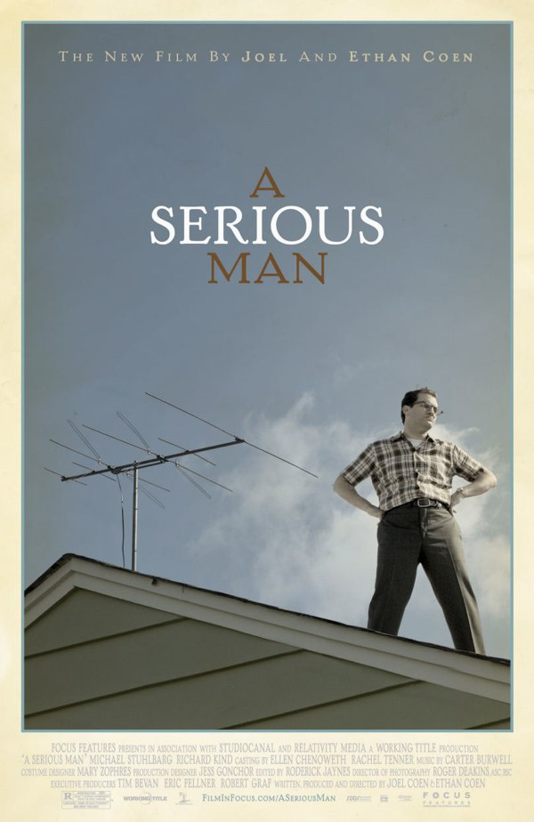
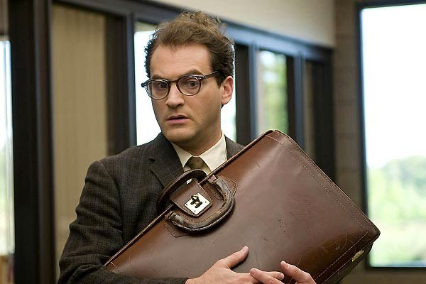
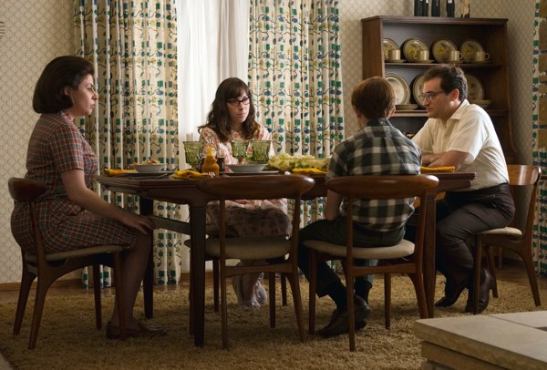
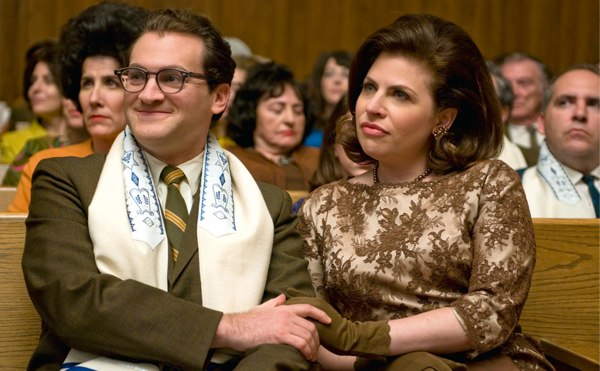

+++
type = "post"
titre = "<em>A Serious Man</em>, Joel et Ethan Coen"
title = "A Serious Man, Joel et Ethan Coen"
url = "/serious-man-coen"
date = "2010-01-24T00:38:01"
Lastmod = "2013-11-13T23:18:11"
cover = "a-serious-man-ethan-joel-coen.jpg"
categorie = [ "À voir" ]
tag = [ "Humour", "Philosophie", "Religion", "Société" ]
createur = [ "Joel et Ethan Coen" ]
acteur = [ "Fred Melamed", "Michael Stuhlbarg", "Richard Kind", "Sari Lennick" ]
annee = [ "2010" ]
weight = 2010
pays = [ "États-Unis" ]

+++

Avec <em>A Serious Man</em>, les deux frères Coen réussissent encore une fois à surprendre, tout en conservant leur style si particulier, une folie toujours plus affirmée au fil des films. On dit souvent que le duo alterne projets ambitieux et sérieux et films plus légers. Si <em>A Serious Man</em> est une comédie comme <em><a href="http://voiretmanger.fr/2008/12/11/burn-after-reading/">Burn After Reading</a></em>, leur film précédent, on est ici très loin de la légèreté de ce dernier. L&rsquo;humour se fait ici très noir et ironique. Une vraie réussite.

<em>A Serious Man</em> raconte les (mes)aventures de Larry Gopnik, un jeune professeur de physique de l&rsquo;université de Minneapolis en attente d&rsquo;une titularisation. Sa vie semble réglée comme une montre suisse et suit tous les archétypes de la Middle-Class américaine des années 1960 : grosse voiture, pavillon de banlieue avec un petit jardin ouvert autour, une femme, deux enfants, un garçon et une fille. La titularisation est en bonne voie, il aime son travail, et tout semble aller pour le mieux dans le meilleur des mondes.

Sauf que cela ne se passe jamais vraiment comme prévu chez les frères Coen. Ça ne manque pas cette fois, puisque les ennuis commencent très vite pour ce pauvre Larry. Des ennuis qu&rsquo;il accumule d&rsquo;ailleurs pendant tout le film, dans une montée en puissance des plus grisante et qui rappelle certains titres de musique. C&rsquo;est d&rsquo;abord au sein de la famille que naissent les problèmes : sa femme, qui constate de nombreux &laquo;&nbsp;problèmes&nbsp;&raquo; dans le couple, veut le quitter et lui annonce un soir qu&rsquo;ils devraient penser au divorce. Puis c&rsquo;est sa titularisation qui est remise en cause, alors qu&rsquo;un élève sud-coréen cherche à acheter son année. Les ennuis s&rsquo;ajoutent les uns aux autres, impitoyablement, et notre héros n&rsquo;en peut bientôt plus.

Larry est juif et pour régler ses multiples problèmes, quoi de mieux qu&rsquo;un conseil de son rabbin ? C&rsquo;est en tout cas ce que lui conseille son entourage et il finit par accepter l&rsquo;idée. <em>A Serious Man</em> contient ainsi trois confrontations avec trois rabbins différents, trois moments clés du film si l&rsquo;on en croit le choix des réalisateurs de les marquer d&rsquo;un écran noir et d&rsquo;un gimmick audio pour les introduire. Ces trois rendez-vous psycho-religieux sont en tout cas des climax dans l&rsquo;humour. Chacun à leur manière, ne répondent au mieux pas à Larry, mais bien souvent l&rsquo;enfoncent encore un peu plus dans les ennuis. Ce sont l&rsquo;occasion de succulentes scènes, comme le récit très amusant du dentiste, ou encore une obsession pour un parking.

L&rsquo;humour est omniprésent dans le film, d&rsquo;ailleurs classé dans le genre de la comédie. Mais il ne s&rsquo;agit pas d&rsquo;un humour au premier degré, comme ce pouvait l&rsquo;être pour <em>Burn After Reading</em> (et encore, je ne suis pas sûr que les frères Coen aient jamais réalisé un film au premier degré). Non, l&rsquo;humour ici est noir, ironique, mordant. Le scénario n&rsquo;est, de toute façon, pas des plus gais et la fin est très éloignée des traditionnels happy-ends à l&rsquo;américaine. C&rsquo;est aussi souvent un humour que l&rsquo;on range dans la catégorie un peu vague de l&rsquo;humour juif, et <em>A Serious Man</em> aurait pu, par certains aspects, être réalisé par Woody Allen. Le poids de traditions parfois stupides et d&rsquo;une communauté souvent bien trop pesante, les messages pseudo-philosophiques pour agir en fonction de la volonté de Dieu… autant d&rsquo;éléments qui auraient trouvé leur place chez le New-Yorkais.

Sauf que Joel et Ethan Coen imposent vite leur marque, qui pourrait se résumer à la folie. Folie des personnages bien sûr, et folie ici d&rsquo;un Larry qui perd visiblement la tête, fait les pires rêves et ne sait visiblement pas du tout comment s&rsquo;en sortir. On le voit sur le point de craquer, voire craquer tout à fait. Folie aussi du scénario, imprévisible et hors de contrôle, à l&rsquo;image du mythique rabbin qui, devant un jeune ébahi qui vient tout juste de faire sa Bar Mitzvah, les noms des membres du mythique groupe <a href="http://fr.wikipedia.org/wiki/Jefferson_Airplane">Jefferson Airplanes</a>, comme s&rsquo;il fallait y trouver un enseignement biblique. L&rsquo;histoire peut ainsi brusquement prendre un tournant comique, tandis que le scénario se permet des excroissances digressives, comme toute l&rsquo;histoire du jeune Sud-Coréen, mais aussi bien sûr comme le début du film. <em>A Serious Man</em> commence en effet, pour une raison qui reste largement mystérieuse, par une sorte de parabole en yiddish où un couple est menacé par le diable, mais réussit à le vaincre. Je ne sais pas ce que les réalisateurs ont voulu faire — montrer la place des femmes dans la société juive et <em>a contrario</em> la faiblesse des hommes ? signaler que la poisse peut arriver n&rsquo;importe où, n&rsquo;importe quand, à n&rsquo;importe qui ? ou tout simplement s&rsquo;amuser autour d&rsquo;un cinéma différent ? –, mais cette introduction ne manque pas d&rsquo;étonner.

Le film est porté par un Michael Stuhlbarg très convaincant pour interpréter Larry, mais aussi par la musique. Elle prend ici (comme toujours ?) une place essentielle, les Jefferson Airplane jouant presque un rôle à eux tous seuls. Ce sont, en tout cas, eux qui offrent au film &laquo;&nbsp;Somebody To Love&nbsp;&raquo;, une chanson mise en avant dès la bande-annonce, qui ouvre le film et qui est ensuite reprise à plusieurs reprises. Inconsciemment, elle impose à tout le film son rythme et son refrain évoque en boucle la nécessité d&rsquo;aimer et d&rsquo;être aimé. Comme si le film offrait une autre solution à Larry, fort différente des solutions religieuses.

Une fois encore, Joel et Ethan Coen s&rsquo;imposent comme de grands réalisateurs. Sous des apparences légères, <em>A Serious Man</em> est en fait un film plus grave qu&rsquo;il n&rsquo;en a l&rsquo;air, posant de nombreuses questions sur la vie, la religion et même les sciences. Les frères Coen proposent une vision du monde très désabusée, cynique et réjouissante à condition d&rsquo;aimer l&rsquo;humour noir. On n&rsquo;éclate pas de rire toutes les trente secondes, mais tout le film est empreint d&rsquo;un humour finalement assez subversif.

La critique &laquo;&nbsp;officielle&nbsp;&raquo; est largement <a href="http://www.allocine.fr/film/revuedepresse_gen_cfilm=128311.html">unanime et enthousiaste</a>, et on retrouve cette tendance dans la blogosphère. Rob a ainsi <a href="http://www.toujoursraison.com/2010/01/serious-man.html">beaucoup aimé</a>, idem chez <a href="http://laternamagika.wordpress.com/2010/01/22/a-serious-man-de-joel-et-ethan-coen/">Lantera Magica</a>. Le Dr Orlof est enchanté et il <a href="http://drorlof.over-blog.com/article-le-principe-d-incertitude--43451954.html">explique longuement pourquoi</a> : ses arguments sont vraiment convaincants et valent le détour, notamment sur la destruction du monde rassurant des sciences au profit de celui, beaucoup plus inquiétant, de la religion. Par contre, <a href="http://www.critikat.com/A-Serious-Man.html">Critikat</a> n&rsquo;a pas aimé du tout, voyant un film &laquo;&nbsp;sans grande folie, et presque sans surprises&nbsp;&raquo;. Étonnant&#8230;

<h3>Vous voulez m&rsquo;aider ?<a href="#footnote_0_2529" id="identifier_0_2529" class="footnote-link footnote-identifier-link" title="&Agrave; propos de la publicit&eacute;&hellip;">1</a></h3>
<ul>
<li><a href="http://www.amazon.fr/gp/product/B002E2M5IC/ref=as_li_ss_tl?ie=UTF8&#038;tag=leblogdenic07-21&#038;linkCode=as2&#038;camp=1642&#038;creative=19458&#038;creativeASIN=B002E2M5IC">Acheter le film en Blu-Ray sur Amazon</a></li>
<li><a href="http://www.amazon.fr/gp/product/B0037W55Q2/ref=as_li_ss_tl?ie=UTF8&#038;tag=leblogdenic07-21&#038;linkCode=as2&#038;camp=1642&#038;creative=19458&#038;creativeASIN=B0037W55Q2">Acheter le film en DVD sur Amazon</a></li>
<li><a href="https://itunes.apple.com/fr/movie/a-serious-man/id375352678">Acheter ou louer le film sur l&rsquo;iTunes Store</a></li>
</ul>

<ol class="footnotes"><li id="footnote_0_2529" class="footnote"><a href="http://voiretmanger.fr/soutien/">À propos de la publicité…</a> [<a href="#identifier_0_2529" class="footnote-link footnote-back-link">&#8617;</a>]</li></ol>
