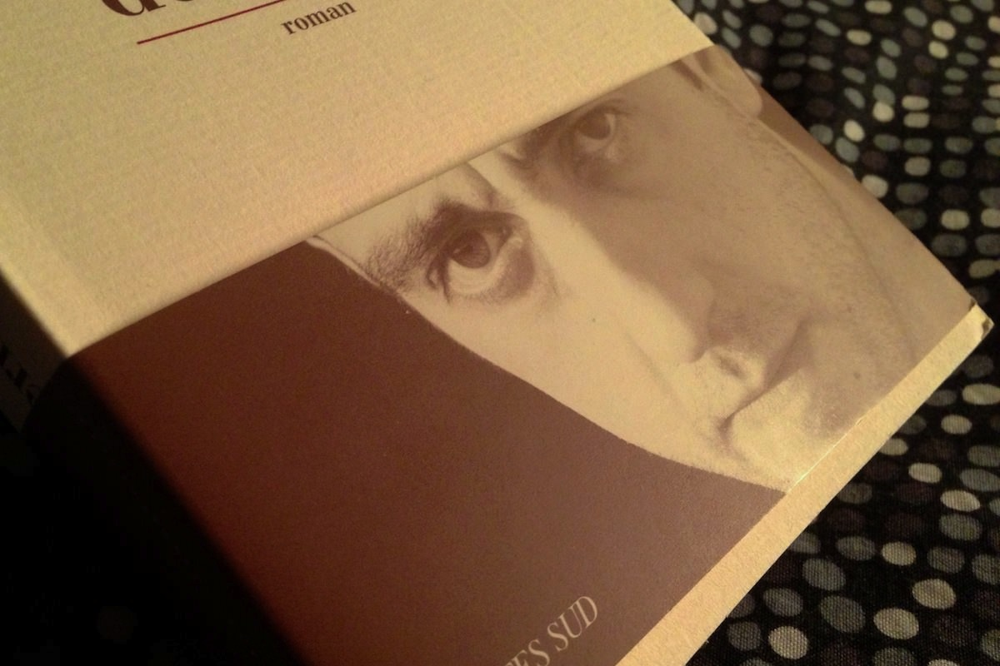
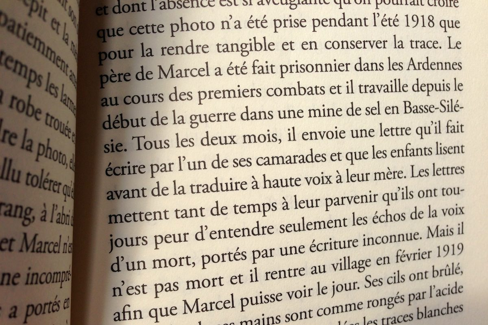

+++
titre = "Le sermon sur la chute de Rome, Jérôme Ferrari"
title = "Le sermon sur la chute de Rome, Jérôme Ferrari"
url = "/sermon-chute-rome-ferrari"
date = "2012-11-24T10:13:10"
Lastmod = "2012-11-24T10:35:14"
cover = "le-sermon-sur-la-chute-de-rome-ferrari.jpg"
categorie = [ "À lire" ]
tag = [ "Drame", "Famille", "Mort", "Prix Goncourt", "Roman", "Société", "Tragedie" ]
createur = [ "Jérôme Ferrari" ]
annee = [ "2012" ]
weight = 2012
pays = [ "France" ]

+++

Prix Goncourt de cette rentrée littéraire 2012, <em>Le sermon sur la chute de Rome</em> en impose dès son titre. Quand on apprend en plus que Jérôme Ferrari s’est vraiment inspiré d’un sermon prononcé par Saint-Augustin en 410, alors que Rome est assiégée par les barbares et sur le point de tomber, on a quelques réticences assez naturelles à ouvrir le roman. Ce serait pourtant dommage de s’arrêter à un programme beaucoup plus barbant en apparence qu’il ne l’est en réalité. <em>Le sermon sur la chute de Rome</em> n’est pas un livre de plage, certes, mais le court récit se lit très bien et l’écriture de Jérôme Ferrari n’est complexe qu’en apparence. Un roman passionnant, porté par une écriture saisissante, à ne pas rater !

Quand commence <em>Le sermon sur la chute de Rome</em>, Saint-Augustin est bien loin. Le roman se déroule en Corse et il ouvre sur une photographie : prise en 1918, elle représente la famille de Marcel, sa mère et ses cinq frères et sœurs. Son père, toujours prisonnier en Allemagne, est absent, mais c’est une autre absence qui le gêne : la sienne. Benjamin de la famille, il n’est pas encore né, mais quand le roman commence, il est le seul survivant. Cette absence le perturbe : et si elle était le signe de son inexistence ? Jérôme Ferrari détaillera par la suite son existence difficile, faite de maladies continues et de multiples déconvenues, mais ce n’est pas le seul personnage de son roman. On suit aussi les pas de Matthieu Antonetti, le petit-fils que Marcel déteste, ceux d’Aurélie, la sœur au contraire adorée par le grand-père. On suit surtout les aventures du petit bar d’un village perdu dans les montagnes corses : il est le seul élément de vie dans ce village, mais il semble maudit en entraînant tous ceux qui s’en chargent vers la chute. Après quelques péripéties, le bar est repris par Matthieu et Libéro, son meilleur ami : à la surprise générale, les deux jeunes hommes viennent d’abandonner de prometteuses études de philosophie à Paris pour tenter de donner un sens à leur vie dans le village de leur enfance. Ils reprennent la gérance du bar et essaient de proposer un cadre où tout le village saura se retrouver. 

<blockquote class="pull-quote">
Le monde est comme un homme : il naît, il grandit et il meurt.<cite class="author"> — Saint-Augustin, sermon 81, décembre 410</cite>

</blockquote>

<em>Le sermon sur la chute de Rome</em> assiste à la création de plusieurs mondes, mais aussi à leur chute inexorable. On ne dévoile rien en disant que l’histoire se finira mal pour tout le monde, l’auteur le dit dès le départ et le choix du sermon de Saint-Augustin est un indice explicite. Deux mondes se créent en parallèle : celui de Marcel, loin de sa Corse natale et celui de Matthieu et de Libéro qui tentent, au contraire, de retrouver les lieux de leur enfance. Dans les deux cas, il s’agit aussi de donner un sens à une vie, qui dans les colonies, qui dans ce bar ; dans les deux cas aussi, il s’agit d’un monde fermé — par la distance, loin de la famille et des proches pour Marcel, fermé sur le bar qui forme vite un univers parallèle. <em>Le sermon sur la chute de Rome</em> entremêle ces deux histoires qui commencent toujours plutôt bien : Marcel trouve une femme avec laquelle il vit quelques très belles années et a un enfant ; Libéro et Matthieu de leur côté parviennent à redresser la barre et à vivre confortablement de leur affaire qui rayonne sur toute la région. Pourtant, une force inexorable semble les tirer vers la chute : Marcel est toujours malade, mais c’est lui qui doit pourtant enterrer ses proches, les uns après les autres, jusqu’à son propre fils ; tout semble aller pour le mieux pour Matthieu et son ami, jusqu’au grain de sable qui enraye la mécanique. Matthieu a toujours désiré s’installer définitivement en Corse, lui qui n’avait droit à l’île que pendant ses vacances pendant des années ; il doit finalement s’exiler loin de son village. Marcel à l’inverse a toujours voulu s’éloigner de son lieu de naissance, mais il échoue dans les colonies et doit finalement revenir. Deux trajectoires qui se croisent, une même chute et le sermon de Saint-Augustin qui revient finalement, pour rappeler la métaphore, mais sans donner dans la morale pour autant. <em>Le sermon sur la chute de Rome</em> n’entend pas donner de leçon et Jérôme Ferrari raconte son histoire sans jugement ; au lecteur d’en tirer les éventuelles conclusions qu’il souhaite. Il y a dans le roman un personnage qui juge toutefois : Aurélie, la sœur de Matthieu, n’accepte pas l’idéalisme de son frère et elle juge d’emblée très sévèrement son retour sur l’île pour s’occuper du bar du village. L’auteur place rarement ce personnage au premier plan toutefois, si bien que le roman reste largement sans jugement.

Les personnages, comme le récit, ne sont pas très positifs. Libéro et Matthieu étaient promis à un avenir brillant, mais ils sont déçus par la philosophie et les études et décident de vivre une petite vie dans ce bar un peu miteux. Marcel quant à lui ne parvient pas à réaliser son rêve d’éloignement et il finit sa vie en solitaire dans le village corse où il est né. <em>Le sermon sur la chute de Rome</em> n’est pas un roman déprimant pour autant. Jérôme Ferrari nous emporte dans son histoire avec une telle force et une écriture si intense qu’elle parvient à nous faire oublier l’inéluctable fin. Son style est parfaitement fluide et il fait oublier la plupart du temps ces (très) longues phrases et ces paragraphes interminables, même si on ne retrouve pas tout à fait la simplicité et la force de Proust. Qu’importe, Jérôme Ferrari parvient à embarquer son lecteur et à condition d’accepter de se laisser porter par une écriture dense, on est très vite pris et il devient difficile de s’arrêter<a href="#footnote_0_7821" id="identifier_0_7821" class="footnote-link footnote-identifier-link" title="Pour en juger, l&rsquo;&eacute;diteur propose gratuitement le tr&egrave;s bon premier chapitre.">1</a>. L’enjeu n’est pas de savoir comment cela se termine, mais plus de suivre cette tragédie si bien racontée. <em>Le sermon sur la chute de Rome</em> n’est pas un roman facile à aborder, mais tous ceux qui font l’effort d’en commencer la lecture seront incontestablement récompensés…

<h3>Vous voulez m’aider ?<a href="#footnote_1_7821" id="identifier_1_7821" class="footnote-link footnote-identifier-link" title="&Agrave; propos de la publicit&eacute;&hellip;">2</a></h3>
<ul>
<li><a href="http://www.amazon.fr/gp/product/2330012594/ref=as_li_ss_tl?ie=UTF8&#038;tag=leblogdenic07-21&#038;linkCode=as2&#038;camp=1642&#038;creative=19458&#038;creativeASIN=2330012594">Acheter le livre sur Amazon</a></li>
<li><a href="http://www.amazon.fr/gp/product/B008KNAE8M/ref=as_li_ss_tl?ie=UTF8&#038;tag=leblogdenic07-21&#038;linkCode=as2&#038;camp=1642&#038;creative=19458&#038;creativeASIN=B008KNAE8M">Acheter le livre au format Kindle sur Amazon</a></li>
<li><a href="https://itunes.apple.com/fr/book/le-sermon-sur-la-chute-de-rome/id544335507?mt=11">Acheter le livre sur l’iBookstore</a></li>
</ul>

<ol class="footnotes"><li id="footnote_0_7821" class="footnote">Pour en juger, l’éditeur propose gratuitement le très bon <a href="http://www.actes-sud.fr/sites/default/files/9782330012595_extrait.pdf">premier chapitre</a>. [<a href="#identifier_0_7821" class="footnote-link footnote-back-link">&#8617;</a>]</li><li id="footnote_1_7821" class="footnote"><a href="http://voiretmanger.fr/soutien/">À propos de la publicité…</a> [<a href="#identifier_1_7821" class="footnote-link footnote-back-link">&#8617;</a>]</li></ol>
