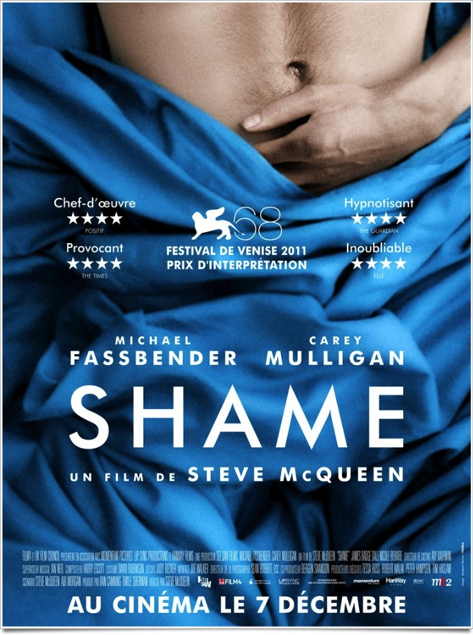

+++
titre = "<em>Shame</em>, Steve McQueen"
title = "Shame, Steve McQueen"
url = "/shame-mcqueen"
date = "2011-12-07T00:11:40"
Lastmod = "2014-12-12T17:10:47"
cover = "michael-fassbender-shame.jpg"
categorie = [ "À voir" ]
tag = [ "Amour", "Drame", "Drogue", "Famille", "Sexe" ]
createur = [ "Steve McQueen" ]
acteur = [ "Carrey Mulligan", "James Badge Dale", "Michael Fassbender", "Nicole Beharie" ]
annee = [ "2011" ]
weight = 2011
pays = [ "Grande-Bretagne" ]

+++

Dans <em><a href="http://voiretmanger.fr/2008/11/30/hunger/">Hunger</a></em>, Steve McQueen traitait de la faim physique. Avec <em>Shame</em>, son deuxième film, il filme une autre sorte de faim en évoquant l&rsquo;addiction au sexe. Une addiction montrée sans fard, face à la caméra, ce qui explique l&rsquo;interdiction aux moins de 12 ans. Loin d&rsquo;être un film pornographique toutefois, <em>Shame</em> est un drame terriblement prenant sur un couple à la dérive. Brillant.

La honte est présente dès le titre, mais elle infiltre le film dès ses premières images. Brandon, célibataire trentenaire et new-yorkais, a ses petites habitudes. Très régulièrement, il part en chasse et séduit des femmes pour le ramener dans son appartement doté d&rsquo;une belle vue sur la ville. Quand il n&rsquo;y arrive pas, il se rattrape avec une prostituée ou à défaut, avec des vidéos dénichées sur Internet. Brandon ne peut pas s&rsquo;en empêcher : il a constamment besoin de sexe. Même à son travail, il s&rsquo;isole régulièrement dans les toilettes pour se branler au-dessus de la cuvette et soulager son envie. Pour lui, le sexe est une véritable drogue et il ne peut s&rsquo;en passer à tel point qu&rsquo;il se met régulièrement en danger en le faisant dans les lieux publics, dans des backrooms ou en stockant des milliers de vidéos pornographiques sur l&rsquo;ordinateur de son travail. Quand Sissy, sa sœur, s&rsquo;installe sans prévenir dans son appartement, toute cette vie qu&rsquo;il essaie de cacher par honte explose en plein jour…

<em>Shame</em> raconte l&rsquo;histoire d&rsquo;un drogué du sexe, un homme qui ne sait plus s&rsquo;en passer, mais qui n&rsquo;en éprouve aussi plus aucun plaisir. Il n&rsquo;est jamais vraiment attiré par une femme en particulier, c&rsquo;est plutôt toutes les femmes qui l&rsquo;intéressent. L&rsquo;intérêt est en outre purement physique : pour le dire crûment, Brandon ne cherche que des trous à même d&rsquo;assouvir son besoin pressant. Ne trouvant aucune femme, il n&rsquo;hésite pas à entrer dans une boîte gay pour se rendre directement dans l&rsquo;arrière-salle où il trouvera des hommes à disposition. Le sexe devient purement mécanique et il semble éprouver autant de plaisir à se branler dans sa salle de bain ou dans les toilettes de son travail qu&rsquo;à baiser une femme. Le héros de <em>Shame</em> a constamment besoin de sexe, à tel point que ce besoin oppressant le rend totalement incapable d&rsquo;aimer. Quand il rencontre une fille qui semble s&rsquo;intéresser à lui, il est incapable de lui faire l&rsquo;amour le moment venu. Il ne parvient pas à la satisfaire et il se venge alors en appelant une autre fille, sans doute une prostituée, avec qui il n&rsquo;a aucun problème. Les seules relations qu&rsquo;il peut entretenir sont purement sexuelles et toute la honte qu&rsquo;il peut éprouver à cet égard n&rsquo;y change rien.

Au-delà du sexe, le sujet principal de <em>Shame</em> est d&rsquo;abord la honte. Honte de Brandon face à son addiction totalement incontrôlable. L&rsquo;irruption de sa sœur l&rsquo;oblige à se contrôler justement, mais il devient rapidement de très mauvaise humeur et même violence à mesure que le manque s&rsquo;accroit. Il s&rsquo;en prend alors à sa sœur qu&rsquo;il rejette violemment, alors même qu&rsquo;il s&rsquo;en veut de réagir ainsi. C&rsquo;est plus fort que lui et la présence d&rsquo;un tiers à ses côtés lui donne le sentiment d&rsquo;être piégé, acculé dos au mur. La honte devient si forte que Brandon finit par craquer : <em>Shame</em> le montre vidant son appartement de fond en comble dans des poubelles. Il jette tous ses magazines et vidéos pornos, tous ses accessoires et même son ordinateur portable qui lui procure du plaisir tous les soirs. Il jette tout dans un geste purificateur qui ne suffit pourtant pas. L&rsquo;appel du sexe est plus fort : il finit par surpasser la honte et l&rsquo;entraîne dans les bas-fonds de New York. Il se prend des coups, mais il encaisse, imperturbable : le héros de <em>Shame</em> va au-delà de la honte, comme si la drogue le rendait complètement insensible. Même quand il passe à deux doigts de la tragédie, cela ne lui sert pas de leçon et le film de Steve McQueen s&rsquo;avère assez pessimiste quant à sa conclusion… La honte est extrêmement forte, au point que l&rsquo;on craint parfois pour la vie de Brandon, mais elle ne suffit pas à enrayer le sexe, encore plus puissant.

<em>Hunger</em> faisait déjà preuve d&rsquo;un gout marqué pour des images très travaillées. <em>Shame</em> ne renie pas cette tendance de Steve McQueen, bien au contraire. Son second film bénéficie également de cadrages géométriques et d&rsquo;une photographie froide très réussie. Ainsi filmée, la vie de Brandon semble très réglée, comme s&rsquo;il parvenait à maintenir des cadres autour d&rsquo;une vie sexuelle totalement débridée. Une seule scène échappe à cette rigueur qui tend à l&rsquo;oppression. Une scène de sexe, encore une, mais c&rsquo;est la seule pendant près d&rsquo;1h40 qui bénéficie d&rsquo;une photographie chaleureuse et d&rsquo;une caméra souple qui compose un plan flou. Un contraste très réussi dans ce film extrêmement maîtrisé. Tout est affaire de goût, mais cette maîtrise formelle impressionne et s&rsquo;avère particulièrement efficace. La bande sonore accompagne admirablement <em>Shame</em> avec une utilisation très astucieuse du bruit des aiguilles d&rsquo;une montre qui renforce encore le sentiment de honte. Un effet qui tranche en outre avec le rythme plutôt lent du film. On a l&rsquo;impression de ressentir la même chose que le personnage principal et on le doit aussi à la performance de Michael Fassbender. Déjà excellent avec ses 14 kg de moins dans <em>Hunger</em>, il est passionnant en sex addict désespéré par son addiction. Son prix d&rsquo;interprétation à Venise n&rsquo;a pas été volé…

Réussite complète pour <em>Shame</em>, un film parfois brutal sur l&rsquo;addiction sexuelle d&rsquo;un homme assailli par une honte permanente. Le film pose calmement ses personnages et propose une vision assez terrifiante d&rsquo;un couple qui peine à avancer normalement. Un film assez dur, mais aussi très beau, à ne pas rater.

<h3>Vous voulez m&rsquo;aider ?</h3>
<ul>
<li><a href="http://www.amazon.fr/gp/product/B006QP0CGA/ref=as_li_ss_tl?ie=UTF8&#038;tag=leblogdenic07-21&#038;linkCode=as2&#038;camp=1642&#038;creative=19458&#038;creativeASIN=B006QP0CGA">Acheter le film en Blu-Ray sur Amazon</a></li>
<li><a href="http://www.amazon.fr/gp/product/B006QP0C5Q/ref=as_li_ss_tl?ie=UTF8&#038;tag=leblogdenic07-21&#038;linkCode=as2&#038;camp=1642&#038;creative=19458&#038;creativeASIN=B006QP0C5Q">Acheter le film en DVD sur Amazon</a></li>
<li><a href="http://itunes.apple.com/fr/movie/shame-vost/id508615228">Acheter ou louer le film sur l&rsquo;iTunes Store</a></li>
</ul>

