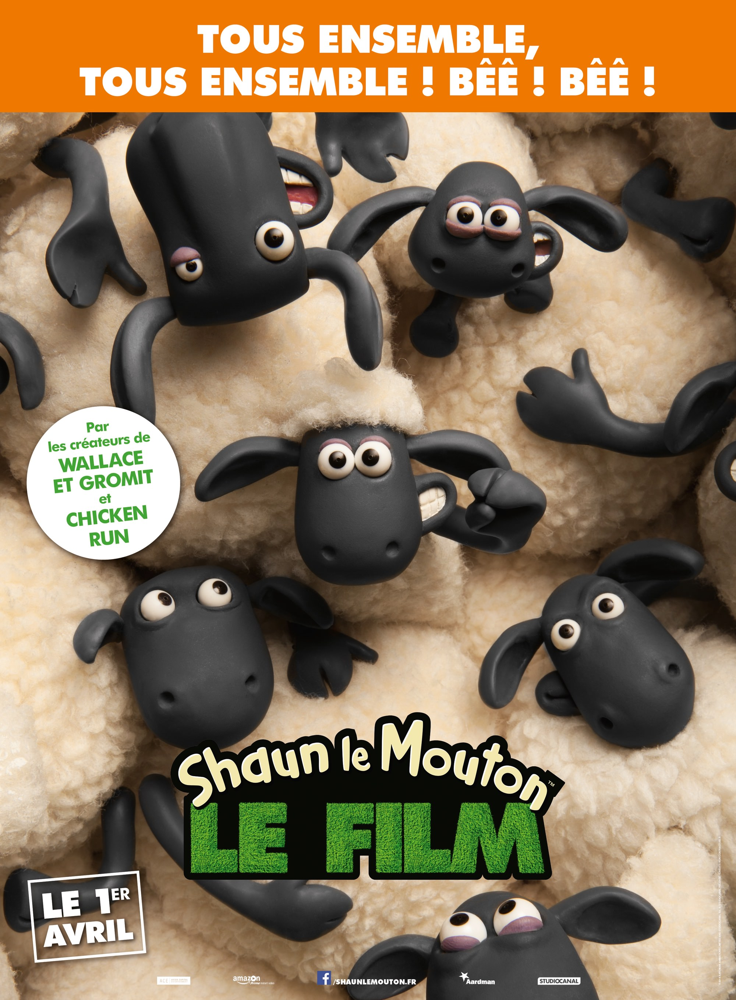
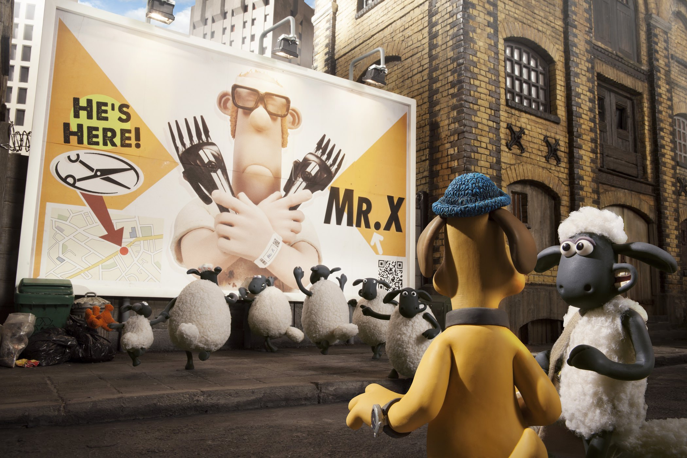
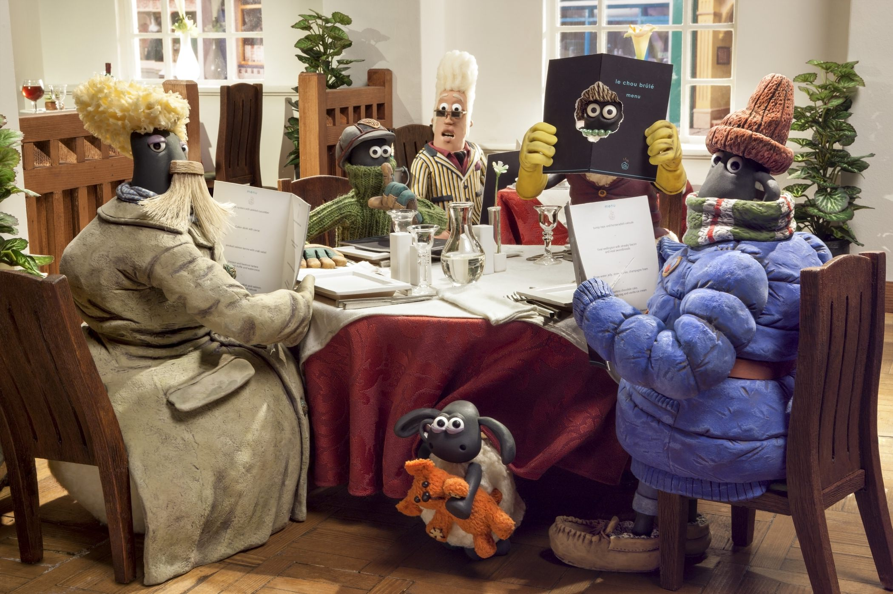

+++
type = "post"
titre = "<em>Shaun le Mouton</em>, Mark Burton et Richard Starzak"
title = "Shaun le Mouton, Mark Burton et Richard Starzak"
url = "/shaun-mouton-burton-starzak"
date = "2015-04-03T22:07:13"
Lastmod = "2015-04-04T17:54:33"
cover = "shaun-le-mouton-aardman.jpg"
categorie = [ "À voir" ]
tag = [ "Animation", "Animaux", "Éducation", "Humour", "Sorties du mois", "Ville" ]
createur = [ "Aardman Animations", "Mark Burton", "Richard Starzak" ]
annee = [ "2015" ]
weight = 2015
pays = [ "Grande-Bretagne" ]
original = "Shaun the Sheep Movie"

+++

Le retour à la pâte à modeler qui a fait la réputation des studios Aardman Animations a manifestement été une bonne chose. Après une période à vide marquée aussi par l&rsquo;utilisation exclusive du numérique, le retour à l&rsquo;animation traditionnelle pour <a href="http://voiretmanger.fr/pirates-bons-rien-mauvais-tout-lord/" title="Les Pirates ! Bons à rien, Mauvais en tout, Peter Lord"><em>Les Pirates ! Bons à rien, Mauvais en tout</em></a> était l&rsquo;occasion de signer un très bon film, drôle et marque à nouveau par cette teinte de rétro qui manquait tant. Trois ans après, les studios reviennent, cette fois avec l&rsquo;adaptation au cinéma d&rsquo;une série qui a connu énormément de succès dans le monde entier : <em>Shaun le Mouton</em>. Cette fois, Peter Lord et Nick Park cèdent leur place à la réalisation et c&rsquo;est Mark Burton et surtout Richard Starzak, qui travaille pour le studio depuis sa création, qui s&rsquo;y collent. Le résultat est un très joli film, qui plaira aux enfants même les plus jeunes, mais qui séduira aussi les adultes. Une réussite, d&rsquo;autant que le long-métrage est dépourvu de tout dialogue… un pari qui s&rsquo;avère payant !

À l&rsquo;origine, <em>Shaun le Mouton</em> était une série d&rsquo;animations avec un format assez particulier. Chaque épisode était très court (sept minutes) et sans aucun dialogue. Visant surtout les enfants, cette série a connu un énorme succès et elle a contribué à populariser le personnage de Shaun, un mouton futé qui était apparu pour la première fois dans l&rsquo;un des courts-métrages <em>Wallace et Groomit</em>, la série qui a fait connaître les studios Aardman Animations. Passer de ce format très court à un long-métrage complet n&rsquo;était pas une mince affaire et on pouvait craindre le pire. Et ce, surtout que le projet visait à nouveau les enfants et le message marketing qui a tourné en boucle avant sa sortie laissait craindre un film très classique, plein de gags un peu faciles et de clins d&rsquo;œil appuyés pour les accompagnateurs. Dès les premières minutes, <em>Shaun le Mouton</em> rassure : l&rsquo;esprit du studio est toujours bien là et Mark Burton et Richard Starzak n&rsquo;ont pas signé une œuvre d&rsquo;animation formatée pour plaire aussi bien aux enfants qu&rsquo;aux parents comme on voit si souvent. Après la parodie de pirates qui parlait plus aux adultes, ce nouveau long-métrage d&rsquo;Arrimant Animations s&rsquo;adresse plus aux enfants, mais le générique d&rsquo;ouverture, qui retrace l&rsquo;enfance du mouton Shaun et des autres animaux de la ferme, devrait toucher tout le monde. À la manière des meilleurs Pixar, le film commence d&rsquo;entrée de jeu avec une bonne dose d&rsquo;émotion et c&rsquo;est très bien vu. L&rsquo;ensemble est d&rsquo;ailleurs assez touchant, en plus d&rsquo;être drôle.

L&rsquo;intrigue se met en place autour de l&rsquo;idée que toute la ferme, des moutons au fermier, est prise dans le train-train du quotidien qui finit par lasser tout le monde. Chaque matin, tout le monde se réveille, les moutons vont dans le champ et de temps en temps, le fermier les tond. C&rsquo;est une routine qui finit par user tout le monde et Shaun, voyant un jour une publicité, a l&rsquo;idée de prendre un jour de congé. Avec les autres moutons, il prépare tout et le jour dit, ils éloignent le chien et endorment le fermier avant de l&rsquo;enfermer dans une caravane non loin. Comme prévu, tout ne se passe pas comme prévu et, par un étrange concours de circonstance, la caravane avec le fermier se retrouvent dans la grande ville d&rsquo;à côté. Et bientôt, ce sont tous les moutons et le chien qui suivent : <em>Shaun le Mouton</em> confronte alors ces animaux paisibles de la ferme à l&rsquo;horreur urbaine. La ligne directrice n&rsquo;est pas très originale, mais l&rsquo;angle suivi par les deux réalisateurs l&rsquo;est un petit peu plus. Respecter la forme de la série originale et en particulier l&rsquo;absence totale de dialogues, n&rsquo;était pas la voie la plus facile et même un pari assez gonflé. Le résultat prouve que c&rsquo;était la bonne chose toutefois : les animaux sont moins personnifiés, même s&rsquo;ils se déguisent comme des humains par ailleurs, mais l&rsquo;effet est aussi réussi pour les humains, qui ne s&rsquo;expriment plus que par onomatopées. C&rsquo;est une forme de simplicité pour <em>Shaun le Mouton</em> et ce choix distingue le film de toute la production habituelle en matière d&rsquo;animation. L&rsquo;absence de dialogues contribue aussi à une forme de poésie et il semble évident que le projet aurait pâti si les personnages parlaient.

Retour réussi autant à la pâte à modeler qu&rsquo;à l&rsquo;animation plutôt pour les enfants pour les studios Aardman Animations. <em>Shaun le Mouton</em> aurait pu n&rsquo;être qu&rsquo;un film formaté de plus, mais ses choix techniques et en particulier son absence totale de dialogues en font une réussite. Drôle, sans être non plus hilarant, le long-métrage de Mark Burton et Richard Starzak est aussi touchant et il devrait plaire à toute la famille. À ne pas rater !

