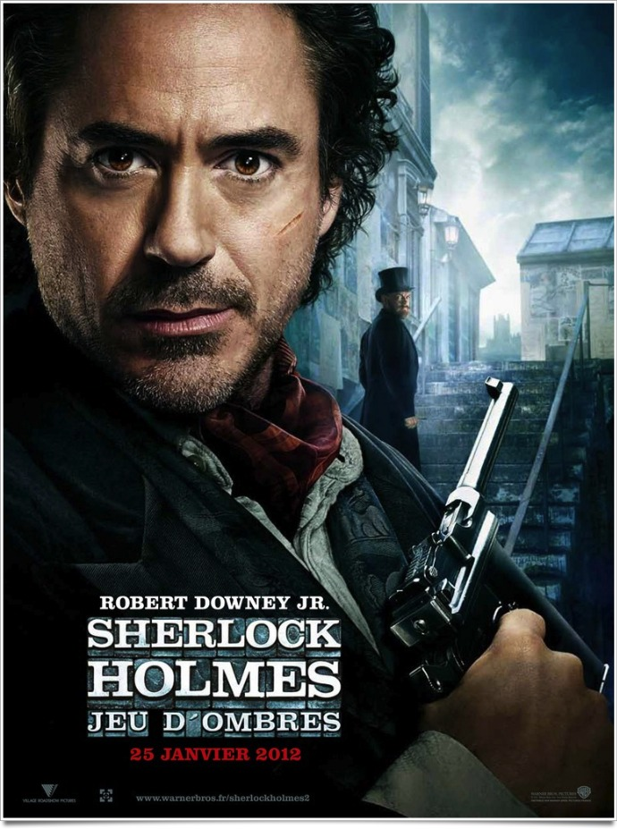
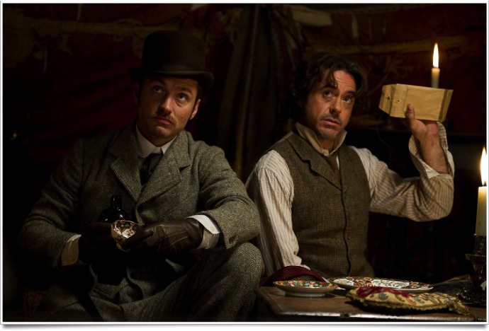

+++
type = "post"
titre = "<em>Sherlock Holmes : Jeu d&rsquo;ombres</em>, Guy Ritchie"
title = "Sherlock Holmes : Jeu d'ombres, Guy Ritchie"
url = "/sherlock-holmes-jeu-ombres-ritchie"
date = "2012-01-26T23:45:32"
Lastmod = "2015-01-04T20:27:35"
cover = "richtie-sherlock-holmes-jeu-ombres.jpg"
categorie = [ "À voir" ]
tag = [ "Action", "Blockbuster", "Guerre", "Homosexualité", "Humour", "Sherlock Holmes", "Vite oublié" ]
createur = [ "Guy Ritchie" ]
acteur = [ "Jude Law", "Noomi Rapace", "Robert Downey Jr" ]
annee = [ "2012" ]
weight = 2012
saga = [ "Sherlock Holmes" ]
pays = [ "États-Unis" ]
original = "Sherlock Holmes : A Game of Shadow"

+++

Pratiquement deux ans jour pour jour après la sortie d&rsquo;un <em><a href="/2010/02/06/sherlock-holmes-ritchie/">Sherlock Holmes</a></em> efficace et qui remettait au goût du jour et avec humour une licence bien connue, Guy Ritchie revient avec un nouvel épisode. <em>Sherlock Holmes : Jeu d&rsquo;ombres</em> sort l&rsquo;artillerie lourde avec le combat ultime, celui qui oppose le talentueux détective à Moriarty, son pire ennemi. À la clé, un film qui fait tout pour distraire son spectateur, quitte à en faire trop et à oublier l&rsquo;essentiel : Sherlock Holmes est censé être un détective privé, pas un James Bond de la fin du XIXe siècle. Amusant, mais très vite oublié.

À la fin de <em>Sherlock Holmes</em>, le nom du terrible Moriarty était découvert. Fin ouverte s&rsquo;il en est qui imposait une suite : <em>Sherlock Holmes : Jeu d&rsquo;ombres</em> la respecte scrupuleusement. Quand le film commence, Sherlock et le docteur Watson ne travaillent plus ensemble depuis quelque temps déjà. Le premier, toujours plus proche de la folie, poursuit ses enquêtes alors que le second se prépare à se marier. Il retrouve justement son vieil ami pour un enterrement de vie de garçon, mais le détective est trop occupé par une grande enquête. Sur une carte du monde, il recoupe des informations variées qui le mènent toutes à un homme : Moriarty. Ce professeur est au moins aussi brillant que son adversaire, mais il a beaucoup moins de scrupules. Depuis plusieurs années, il complote une idée diabolique : acheter toutes les entreprises liées à la guerre d&rsquo;une part et inciter l&rsquo;Allemagne et la France à se déclarer d&rsquo;autre part. En cette fin de XIXe siècle, le climat entre les deux pays n&rsquo;est pas bon et Moriarty cherche tout simplement à avancer de quelques années la Première Guerre mondiale. Sherlock Holmes entend bien arrêter cette folie meurtrière à temps et c&rsquo;est avec l&rsquo;aide de son fidèle ami qu&rsquo;il va tenter de déjouer Moriarty…

Avec <em>Sherlock Holmes</em>, Guy Ritchie avait trouvé un bon moyen de renouveler les aventures du célèbre détective créé par Sir Conan Doyle. Le grand spectacle obligatoire pour un blockbuster était équilibré par une enquête en bonne et due forme que le spectateur découvrait progressivement. <em>Sherlock Holmes : Jeu d&rsquo;ombres</em> va beaucoup plus loin que son prédécesseur avec un champ d&rsquo;action beaucoup plus vaste et une action musclée. Les protagonistes se rendent en France, en Allemagne et en Suisse et ils doivent affronter une véritable armée avec force canons et hommes surarmés. Moriarty est pointé du doigt dès le départ comme étant l&rsquo;ennemi à abattre et l&rsquo;intrigue laisse peu de place aux doutes et à la découverte. <em>Sherlock Holmes : Jeu d&rsquo;ombres</em> est mené tambours battants pendant plus de deux heures, mais Guy Ritchie ne prend jamais la peine de faire dérailler son histoire, pour un film bien peu original. Le cinéaste a repris certaines idées du premier, comme la préméditation des coups au ralenti, mais ce qui était alors original ne l&rsquo;est plus et cette idée est ici moins bien utilisée. On a vraiment l&rsquo;impression de voir un banal film d&rsquo;action comme il en sort des dizaines chaque année, alors que l&rsquo;on attendait plutôt un film policier revu et corrigé. Il n&rsquo;y a même pas d&rsquo;enquête ici, le seul enjeu étant d&rsquo;arrêter Moriarty à temps : c&rsquo;est tout de même dommage pour un film sur un détective privé…

Depuis le précédent épisode, les personnages ont évolué dans <em>Sherlock Holmes : Jeu d&rsquo;ombres</em>. Quelques mois, voire années, se sont écoulés et Sherlock Holmes est devenu encore plus étrange. Le détective se déguise à plusieurs reprises dans le film, avec des costumes toujours plus improbables, le clou du spectacle étant évidemment atteint quand il se travestit dans le train. C&rsquo;est assez amusant, une bonne partie de l&rsquo;humour du film provient d&rsquo;ailleurs de cela, mais c&rsquo;est aussi un peu lourd. Le docteur Watson a aussi changé par son mariage, il s&rsquo;est assagi, même si les aventures offertes par son ami détective semblent bien lui manquer. <em>Sherlock Holmes : Jeu d&rsquo;ombres</em> explicite brutalement la relation homosexuelle entre les deux personnages principaux : alors que <em>Sherlock Holmes</em> la passait presque totalement sous silence, elle est ici au cœur du film et plutôt claire. Jugez plutôt : Sherlock intervient dans le train qui emmène les jeunes mariés à leur lune de miel, il dégage du train la mariée pour rester avec le marié qu&rsquo;il enfourche alors qu&rsquo;il est déguisé en femme. Guy Ritchie reste bien évidemment aux allusions, mais elles ne sont plus du tout subtiles et participent au comique du film. Le détective privé est enfin beaucoup plus fragile dans <em>Sherlock Holmes : Jeu d&rsquo;ombres</em>. Loin d&rsquo;être infaillible, il est même blessé grièvement et approche dangereusement de la mort. Sa faiblesse n&rsquo;est pas que physique et les questions qu&rsquo;il pose à son seul ami sont plutôt touchantes, surtout dans le contexte homosexuel du film.

Guy Ritchie fait partie de ces réalisateurs qui disposent d&rsquo;un style propre et parfaitement reconnaissable. Son dernier film ne fait pas exception, mais le cinéaste britannique en fait même trop. <em>Sherlock Holmes : Jeu d&rsquo;ombres</em> est marqué par une mise en scène assez lourde où les raccourcis multiples et répétés, où la photographie très contrastée n&rsquo;apportent rien de fondamental et deviennent vite fatigants. Le film est efficace, indéniablement, mais il ressemble un peu trop à un blockbuster estival paresseux. Guy Ritchie ne semble pas croire à son film autant que dans le précédent, il paraît même parfois un peu absent, ou lointain et fait avancer l&rsquo;intrigue avec paresse. <em>Sherlock Holmes : Jeu d&rsquo;ombres</em> est parfois pataud, surtout dans sa partie centrale qui manque cruellement de la légèreté que l&rsquo;on retrouve heureusement au début et à la fin. Plus encore que dans <em>Sherlock Holmes</em>, tout le film repose sur les épaules de Robert Downey Jr. L&rsquo;acteur fait ce qu&rsquo;il sait faire de mieux, cabotiner et le show est plutôt efficace, quoique déjà vu. À ses côtés, Jude Law a déjà été plus inspiré et Noomi Rapace est transparente, un comble quand on sait ce qu&rsquo;elle peut faire d&rsquo;après la série <em>Millenium</em>.

Bilan mitigé pour <em>Sherlock Holmes : Jeu d&rsquo;ombres</em>. Le spectacle est assuré et on passe globalement un bon moment en compagnie du détective et de son ami, mais le compte n&rsquo;y est pas. Effaçant toute trace d&rsquo;enquête, le dernier film de Guy Ritchie oublie totalement l&rsquo;histoire qui est censée l&rsquo;avoir inspiré pour un blockbuster d&rsquo;action assez banal. <em>Sherlock Holmes</em> était prometteur, mais <em>Sherlock Holmes : Jeu d&rsquo;ombres</em> est décevant. Espérons que la suite, si suite il y a, redressera la barre…

<h3>Vous voulez m&rsquo;aider ?</h3>
<ul>
<li><a href="http://www.amazon.fr/gp/product/B007GE87FI/ref=as_li_ss_tl?ie=UTF8&tag=leblogdenic07-21&linkCode=as2&camp=1642&creative=19458&creativeASIN=B007GE87FI">Acheter le film en Blu-Ray et DVD sur Amazon</a></li>
<li><a href="http://www.amazon.fr/gp/product/B00715BGQY/ref=as_li_ss_tl?ie=UTF8&tag=leblogdenic07-21&linkCode=as2&camp=1642&creative=19458&creativeASIN=B00715BGQY">Acheter le film en DVD sur Amazon</a></li>
<li><a href="http://www.amazon.fr/gp/product/B007GE87C6/ref=as_li_ss_tl?ie=UTF8&tag=leblogdenic07-21&linkCode=as2&camp=1642&creative=19458&creativeASIN=B007GE87C6">Acheter le coffret avec les deux films en Blu-Ray et DVD sur Amazon</a></li>
</ul>

