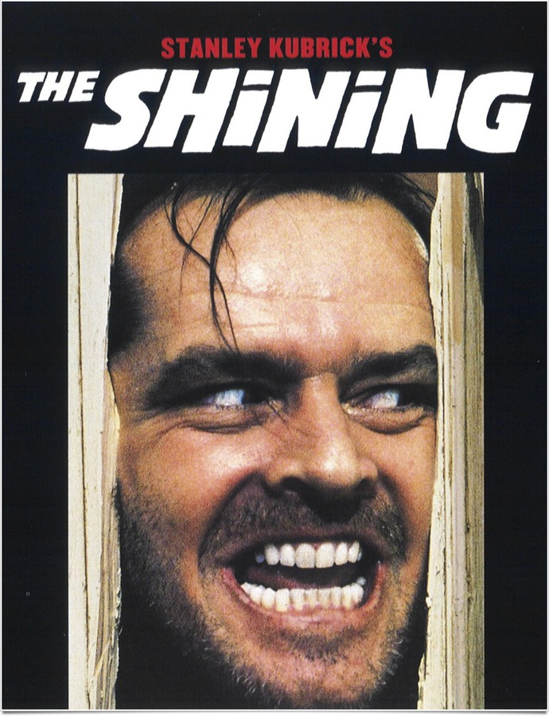
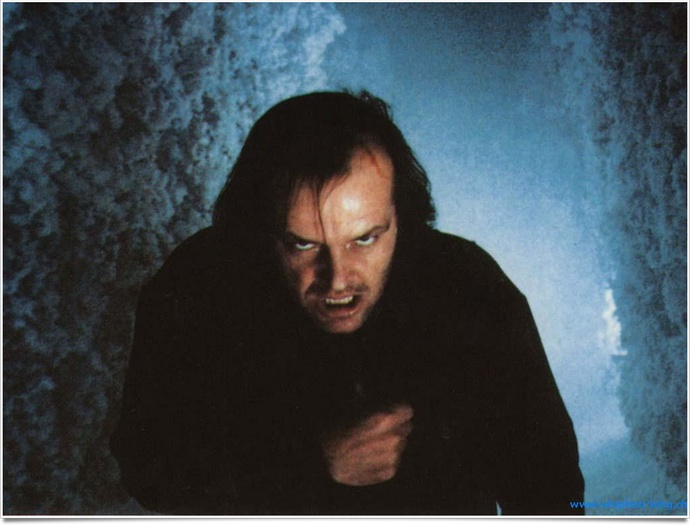
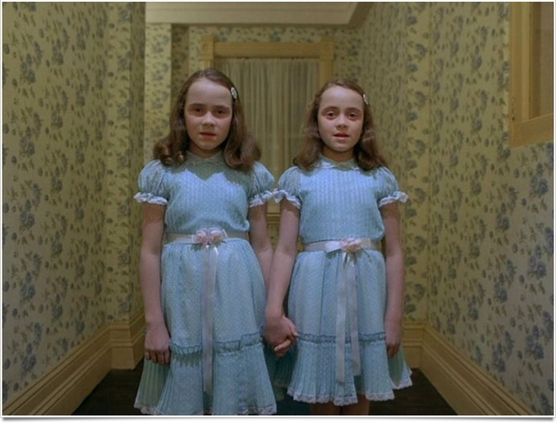

+++
type = "post"
titre = "<em>Shining</em>, Stanley Kubrick"
title = "Shining, Stanley Kubrick"
url = "/shining-kubrick"
date = "2011-04-17T01:05:46"
Lastmod = "2013-11-17T16:40:31"
cover = "shining-kubrick.jpg"
categorie = [ "À voir" ]
tag = [ "Adaptation littéraire", "Famille", "Fantastique", "Horreur", "Suspense", "Thriller" ]
createur = [ "Stanley Kubrick" ]
acteur = [ "Jack Nicholson", "Shelley Duvall" ]
annee = [ "1980" ]
weight = 1980
pays = [ "Grande-Bretagne" ]
original = "The Shining"

+++

<em>Shining</em> ne peut se comprendre sans jeter un œil rapide à la filmographie de Stanley Kubrick. Quand il attaque son onzième film, le cinéaste américain vient de réaliser coup sur coup deux films majeurs qu&rsquo;il considère comme deux chefs-d&rsquo;œuvre, mais aussi deux échecs commerciaux cuisants. Ni <a href="/2011/08/07/2001-odyssee-espace-kubrick/" title="2001 : l’odyssée de l’espace, Stanley Kubrick"><em>2001, Odyssée de l&rsquo;espace</em></a>, ni <a href="/2011/05/22/barry-lyndon-kubrick/" title="Barry Lyndon, Stanley Kubrick"><em>Barry Lindon</em></a> n&rsquo;ont trouvé leur public et les studios ne font plus vraiment confiance à Stanley Kubrick. Pour ce dernier, l&rsquo;enjeu est de taille : retrouver le public et avec lui le confort de pouvoir réaliser les films qu&rsquo;il veut. Kubrick se lance alors dans un genre qu&rsquo;il n&rsquo;avait jamais abordé en choisissant d&rsquo;adapter <em>The Shining</em>, un roman de Stephen King qui est déjà largement reconnu comme le maître des thrillers à tendance fantastique. Le romancier participe dans un premier temps au projet, avant de l&rsquo;abandonner en cours de route : <em>Shining</em>, le film, n&rsquo;a plus rien à voir avec son roman. Et pour cause, si le onzième film de Kubrick peut s&rsquo;apparenter à l&rsquo;origine à un projet commercial uniquement destiné à rencontrer un large public, le résultat est tout autre. <em>Shining</em> est bel et bien un film de Stanley Kubrick, un film personnel, exigeant, perfectionniste, perturbant… un film brillant.

Jack Torrance est un écrivain raté. Pendant un temps, il a enseigné pour gagner sa vie, mais il aimerait se remettre à l&rsquo;écriture. Pour cela, il a trouvé le plan d&rsquo;enfer : un petit boulot qui consiste simplement à vivre pendant tout un hiver dans un hôtel perdu dans les rocheuses. L&rsquo;Overlook est un palace très fréquenté l&rsquo;été, mais complètement vide l&rsquo;hiver : son isolement extrême rend l&rsquo;exploitation commerciale du lieu impossible. Jack doit donc y passer l&rsquo;hiver, maintenir en route le chauffage et réparer les éventuels dégâts que le mauvais temps pourrait causer. Tout le reste du temps, il pourra écrire en toute tranquillité. Jack accepte le job et emménage avec sa femme Wendy et son fils Danny dans le vaste hôtel désormais bien vide. Les premiers mois se déroulent plutôt bien, mais l&rsquo;hiver est terrible dans cette région du monde et c&rsquo;est particulièrement vrai cette année-là. Les lignes téléphoniques sont coupées et l&rsquo;Overlook est bientôt vraiment coupé du monde. C&rsquo;est alors que des évènements étranges vont commencer à se dérouler dans les longs couloirs de l&rsquo;hôtel et la relative tranquillité initiale va exploser d&rsquo;elle-même…

Stanley Kubrick s&rsquo;y connaît en manipulation et il s&rsquo;amuse à nous manipuler pendant tout le déroulement de <em>Shining</em>. Son film commence de manière assez rationnelle. Le jeune Danny est manifestement dérangé : il parle avec un ami imaginaire, Tony, qu&rsquo;il représente à l&rsquo;aide d&rsquo;un doigt. Alors qu&rsquo;il se brosse les dents, il a une vision terrifiante qui fait craindre pour sa santé mentale. La version longue, réservée aux États-Unis, renforce cette lecture rationnelle en faisant intervenir un docteur qui s&rsquo;inquiète de la présence de Tony et recommande, au moins implicitement, un traitement psychanalytique. Stanley Kubrick maintient cette explication longtemps encore : quand Jack se met à délirer, c&rsquo;est là encore un effet de son inconscient, il discute avec des personnes qui ne sont pas présentes et il entend des voix. Entre les deux, Wendy a bien du mal à tenir, mais elle reste logique et rationnelle. Le film avance néanmoins de plus en plus nettement vers une autre direction, cette fois irrationnelle et, disons-le, fantastique. Certains évènements ne peuvent s&rsquo;expliquer : comment Jack pourrait sortir de la réserve sans l&rsquo;aide de l&rsquo;esprit qu&rsquo;il croit entendre ? Comment pourrait-il parler avec des gens qui sont morts depuis longtemps ? Plus le temps passe, plus <em>Shining</em> perd sa rassurante explication psychanalytique et plus il avance vers le &laquo;&nbsp;<em>shining</em>&nbsp;&raquo; qui a donné son nom au roman et au film, c&rsquo;est-à-dire vers le monde des esprits et des médiums. Quand Wendy elle-même se met à avoir des visions, on est définitivement entré dans un univers irrationnel que Kubrick s&rsquo;amuse à la toute fin à confirmer, tout en plongeant encore plus le spectateur dans l&rsquo;incompréhension.

Ce balancement entre fantastique et psychanalyse est un apport de Stanley Kubrick. En fait, le cinéaste n&rsquo;a pas gardé beaucoup de choses du roman de Stephen King. L&rsquo;idée générale est bien là, les personnages sont présents, mais <em>Shining</em> s&rsquo;éloigne tellement du roman dont il est issu qu&rsquo;il constitue une œuvre à part. Au-delà des points de détail qui n&rsquo;ont pas vraiment d&rsquo;intérêt<a href="#footnote_0_4732" id="identifier_0_4732" class="footnote-link footnote-identifier-link" title="La chambre&nbsp;217 du roman devient la chambre&nbsp;237 dans le film. Si quelqu&rsquo;un a une explication rationnelle et intelligente, je suis curieux de l&rsquo;entendre&hellip;">1</a>, le cinéaste a opéré des changements très significatifs qui modifient complètement le sens du récit. Dans le roman, Jack est encore alcoolique et l&rsquo;alcool est la raison principale de sa folie ; dans le film, tout est intérieur : la folie du personnage est déjà là, elle va s&rsquo;exprimer pleinement dans la solitude de l&rsquo;hôtel. Chez Stephen King, Wendy est une femme sage et sûre d&rsquo;elle ; chez Stanley Kubrick, elle est au moins aussi folle que son mari, elle est en tout cas hystérique et psychologiquement fragile. Comme toujours, le cinéaste s&rsquo;est inspiré d&rsquo;une recette originale, il en a repris quelques ingrédients, mais il l&rsquo;a réalisé à sa manière et le résultat n&rsquo;a plus rien à voir. C&rsquo;était déjà le cas avec <a href="/2011/05/08/lolita-kubrick/" title="Lolita, Stanley Kubrick"><em>Lolita</em></a> ou <em>2001, Odyssée de l&rsquo;espace</em> notamment, c&rsquo;est encore le cas avec <em>Shining</em> qui est d&rsquo;abord et avant tout un film de Stanley Kubrick. Projet commercial ou non, le réalisateur a placé dans son long-métrage plusieurs de ses thèmes fétiches. La double personnalité tout d&rsquo;abord, présente autant chez Jack que chez Danny et qui se traduit ici par la présence marquée des miroirs. C&rsquo;est à chaque fois un miroir qui cause le dédoublement : la première vision de Danny a lieu pendant qu&rsquo;il se brosse les dents face au miroir ; c&rsquo;est aussi face à un miroir que Jack se met à discuter avec le barman ; c&rsquo;est grâce au miroir que Wendy comprend le mot écrit à l&rsquo;envers par Danny sur une porte. On notera aussi la forte présence de la violence contenue dans l&rsquo;homme et qui semble faire partie de lui.

<em>Shining</em> reste dans les annales du cinéma pour deux choses : les plans dans les couloirs de l&rsquo;hôtel d&rsquo;une part, le tournage éprouvant d&rsquo;autre part. Stanley Kubrick a toujours été un réalisateur perfectionniste, mais plus il vieillit, plus il le devient. Avec ce onzième film, on atteint un nouveau niveau que seul <a href="/2011/05/01/eyes-wide-shut-kubrick/" title="Eyes Wide Shut, Stanley Kubrick"><em>Eyes Wide Shut</em></a> viendra concurrencer. Le tournage de <em>Shining</em> a été très long, non pas tant en raison de difficultés techniques particulières — le film a été tourné quasiment exclusivement en studio, en Grande-Bretagne –, mais parce que chaque scène a été tournée un nombre incroyable de fois. Le cas le plus connu est cette fameuse scène de la dispute dans l&rsquo;escalier entre Jack et sa femme, tournée pas moins de 84 fois. Le résultat se voit à l&rsquo;écran : la maîtrise technique légendaire de Stanley Kubrick n&rsquo;est plus à démontrer, mais cette volonté de refaire indéfiniment une même séquence à un autre avantage pour <em>Shining</em>. Les acteurs étaient épuisés par ce perfectionnisme et ils se sont sans doute énervés à devoir, encore et encore, refaire une scène. Le résultat est impressionnant : Jack Nicholson est brillant dans ce rôle qui va d&rsquo;ailleurs marquer toute sa carrière, sa folie est aussi réaliste qu&rsquo;effrayante. Le trio d&rsquo;acteurs principaux est de toute manière assez exceptionnel, que ce soit Shelley Duvall ou le jeune Danny Lloyd. Perfectionnisme chez Stanley Kubrick qui se retrouve à tous les niveaux. La double personnalité et les miroirs sont des thèmes centraux de <em>Shining</em>, les plans sont aussi en majorité symétriques. Le labyrinthe est au cœur de l&rsquo;intrigue et il symbolise la folie des personnages : il est bien réel à l&rsquo;extérieur de l&rsquo;hôtel, mais il est aussi à l&rsquo;intérieur de l&rsquo;hôtel par la fameuse moquette des couloirs. L&rsquo;hôtel tout entier est filmé comme un vaste labyrinthe composé de couloirs qui tournent en rond et ne sortent jamais du huis clos composé par ce cadre.

Il y aurait encore tant à dire sur <em>Shining</em>, notamment sur la musique du film. Stanley Kubrick a toujours eu un rapport particulier avec les bandes originales de ses réalisations et il compose dans ce film une bande-son oppressante et angoissante, qui n&rsquo;est jamais là pour combler un silence, mais qui joue un rôle à part entière, comme un narrateur. Par la musique, Stanley Kubrick parvient à suggérer l&rsquo;intériorité de ses personnages avec une intensité rare. Rien que la musique dans <em>Shining</em> mériterait un article complet, mais il est temps de conclure celui-ci.

Stephen King a d&rsquo;abord collaboré avec Stanley Kubrick pour l&rsquo;aider à écrire le scénario de son film, avant de claquer la porte. C&rsquo;est peut-être la critique la plus favorable que l&rsquo;on puisse faire de <em>Shining</em> : le cinéaste a pris un matériau et en a fait un film personnel. Son échec au box-office n&rsquo;est pas non plus un hasard, ce film n&rsquo;est en rien un blockbuster standardisé, c&rsquo;est même un film très personnel qui ne ménage pas les spectateurs. Tant mieux, a-t-on envie de dire en sortant de la salle : <em>Shining</em> est un film à (re)voir…

<h3>Vous voulez m&rsquo;aider ?<a href="#footnote_1_4732" id="identifier_1_4732" class="footnote-link footnote-identifier-link" title="&Agrave; propos de la publicit&eacute;&hellip;">2</a></h3>
<ul>
<li><a href="http://www.amazon.fr/gp/product/B000XIABVW/ref=as_li_ss_tl?ie=UTF8&tag=leblogdenic07-21&linkCode=as2&camp=1642&creative=19458&creativeASIN=B000XIABVW">Acheter le film en Blu-Ray sur Amazon</a></li>
<li><a href="http://www.amazon.fr/gp/product/B00005NDRZ/ref=as_li_ss_tl?ie=UTF8&tag=leblogdenic07-21&linkCode=as2&camp=1642&creative=19458&creativeASIN=B00005NDRZ">Acheter le film en DVD sur Amazon</a></li>
<li><a href="http://itunes.apple.com/fr/movie/shining/id368166310">Acheter ou louer le film sur l&rsquo;iTunes Store</a></li>
</ul>

<ol class="footnotes"><li id="footnote_0_4732" class="footnote">La chambre 217 du roman devient la chambre 237 dans le film. Si quelqu&rsquo;un a une explication rationnelle et intelligente, je suis curieux de l&rsquo;entendre… [<a href="#identifier_0_4732" class="footnote-link footnote-back-link">&#8617;</a>]</li><li id="footnote_1_4732" class="footnote"><a href="/a-propos/publicite/">À propos de la publicité…</a> [<a href="#identifier_1_4732" class="footnote-link footnote-back-link">&#8617;</a>]</li></ol>
