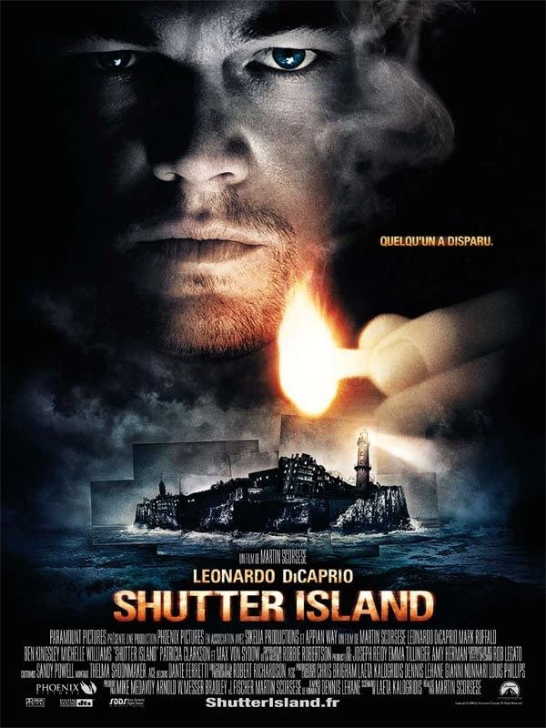
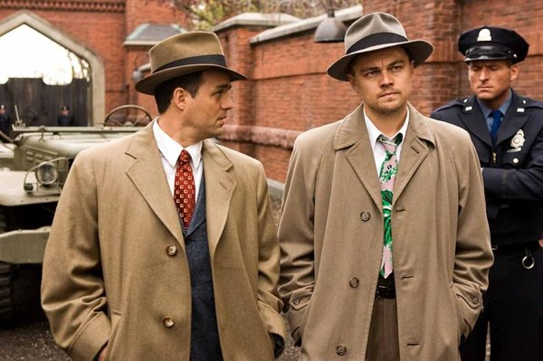
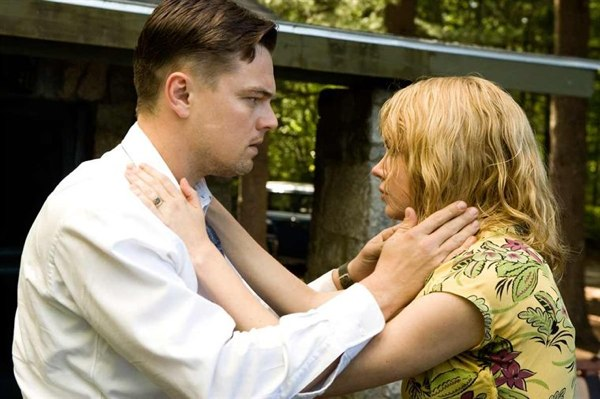

+++
type = "post"
titre = "Shutter Island"
title = "Shutter Island"
url = "/shutter-island-scorsese"
date = "2010-02-26T12:03:00"
Lastmod = "2015-05-10T21:29:33"
cover = "shutter-island-martin-scorsese.jpg"
categorie = [ "Archives du blog" ]

+++

Le couple Scorsese/Di Caprio est de retour avec <em>Shutter Island</em>, et je ne pouvais raisonnablement pas laisser passer ce film. Depuis <em>Gangs of New York,</em> ce couple a plusieurs fois prouvé sa force et le suivre est une question de principe. Le résultat est néanmoins mitigé : si l&rsquo;histoire n&rsquo;est pas inintéressante, son traitement tout comme la forme du film pèche par trop de lourdeur.

<strong><em>Attention, il y autant de spoilers dans ce qui suit, que de cadavres dans</em> Shutter Island !</strong>

D&rsquo;emblée, on comprend que le séjour des deux marshals sur l&rsquo;île de Shutter, dans la baie de, ne sera pas de tout repos. Alors que le marin les presse de descendre pour éviter la tempête qui s&rsquo;annonce, les deux hommes tombent sur une bande de gros durs armés jusqu&rsquo;aux dents. Sur cette île qui fait office de pénitenciers pour fous dangereux, une patiente/prisonnière a mystérieusement disparu et tout le monde est sur les crans pour la retrouver. Les deux hommes envoyés du continent se plient, non sans protester aux règles imposées par le directeur de l&rsquo;île, mais on sent vite la suspicion les gagner. Teddy Daniels, le supérieur hiérarchique du duo, est même hostile à l&rsquo;encontre du corps médical et on comprend vite qu&rsquo;il les suspecte de commettre les pires atrocités sur les &laquo;&nbsp;patients&nbsp;&raquo; avec en toile de fond la guerre froide (nous sommes dans les années 1950) et la lutte contre les communistes. Si on pouvait transformer tous les salauds communistes en légumes, voilà qui serait fort utile aux États-Unis et voilà ce qui se met au point sur cette île maudite.

Le fil narratif de <em>Shutter Island</em> est en fait plus complexe qu&rsquo;il n&rsquo;y paraît. Le scénario multiplie les fausses pistes, notamment par les nombreux flashbacks qui ponctuent le film, et laisse planer le doute pendant la majeure partie du récit. Ça n&rsquo;est qu&rsquo;à la toute fin que la réalité éclate, véritable twist scénaristique qui ne manquera pas de surprendre la majorité des spectateurs, ceux au moins, qui n&rsquo;ont pas lu le livre à l&rsquo;origine de <em>Shutter Island</em>. Néanmoins, certains comprennent assez vite ce qui se dévoile finalement, et si ce ne fut pas mon cas (je suis toujours très bon public avec les films à intrigue et retournement d&rsquo;intrigue, en général je ne vois rien venir), je dois avouer un étrange sentiment de déjà-vu. Un sentiment aussi tenace qu&rsquo;inexplicable, mais qui tient sans doute à l&rsquo;<a href="http://fr.wikipedia.org/wiki/Twist_final">usage très large</a> du twist final, surtout dans les thrillers à tendance psychologique.

Néanmoins, je n&rsquo;avais pas compris réellement ce qui se passait avant la fin du film et l&rsquo;apparition du clou du spectacle et le plaisir du retournement de scénario et de relecture du film s&rsquo;est avéré intact. Bien évidemment, tout fait sens quand on repense au film à la lumière de sa fin : le puzzle méticuleusement mis en place par le scénario reprend ses droits, les pièces s&rsquo;assemblent et l&rsquo;on peut comprendre tous les évènements restés obscurs jusque-là. Je suppose que de connaître (ou découvrir) le twist avant la fin gâche un peu le plaisir, du coup. Ce scénario m&rsquo;a semblé intéressant, surtout du côté de ses implications politiques sur fond de guerre froide et de passé nazi. Le psychiatre en chef sur l&rsquo;île est ainsi un ancien nazi qui, comme on peut le comprendre, a sans doute participé aux expérimentations médicales dans les camps de concentration. L&rsquo;idée d&rsquo;une poursuite d&rsquo;expérimentations nazies pour mieux contrer l&rsquo;opposant bolchevique m&rsquo;a, je dois l&rsquo;avouer, beaucoup amusé. Le film se conclut aussi sur une petite phrase qui signale un ultime potentiel retournement de situation bienvenu, même s&rsquo;il n&rsquo;est pas vraiment exploité puisque le film se termine.

Mais si l&rsquo;histoire de <em>Shutter Island</em> est intéressante, malgré un retournement de veste peut-être un peu facile et déjà vu ailleurs, le film souffre d&rsquo;un défaut majeur. Martin Scorsese n&rsquo;a pas voulu, ou n&rsquo;a pas voulu, faire confiance à ses spectateurs. Je ne m&rsquo;explique pas ce choix absurde qui crée un film d&rsquo;une lourdeur vraiment pénible. Faut-il y voir la marque d&rsquo;un Hollywood désireux de s&rsquo;adresser au plus grand nombre ? Ou d&rsquo;un réel déficit de confiance de la part du réalisateur, ce qui serait confirmé par son appel à voir deux fois son film (certes, c&rsquo;est aussi financièrement motivé, restons sérieux) ? Je ne sais pas, mais je sais au moins que <em>Shutter Island</em> aurait gagné à avoir un scénario moins explicatif et surtout une réalisation plus légère.

Rien n&rsquo;est laissé au hasard sur le passé de Teddy. Tout est explicité par le détail dans des flashbacks qui tombent le plus souvent comme des cheveux sur une soupe, il faut le dire. L&rsquo;excuse des hallucinations a bon dos, le scénario n&rsquo;arrête pas de nous faire reculer dans le temps, tantôt dans le camp de Dachau en 1945, tantôt à une période indéterminée, avec son ex-femme. Le summum est évidemment atteint avec la révélation finale, on voit alors dans un flashback ce qui s&rsquo;est réellement passé. Je n&rsquo;aime pas les flashbacks. Je les trouve en général lourds, mal réalisés, trop convenus… Ça n&rsquo;a pas raté avec <em>Shutter Island</em>, d&rsquo;autant que l&rsquo;on aurait très bien pu s&rsquo;en passer. Était-ce bien nécessaire de savoir que Teddy est entré chez lui, a bu un verre d&rsquo;un alcool indéterminé, avant de constater que sa femme a noyé tous ses enfants ? Heureusement, le principe du flashback sert aussi à introduire des éléments étranges qui interpellent autant le héros que les spectateurs. C&rsquo;est bien vu et pour le coup plus intéressant que les larmoyants retours dans le camp de concentration, par exemple.

<em>Shutter Island</em> est, à mon sens, miné par une réalisation des plus lourdes. Scorsese n&rsquo;a sans doute jamais été un cinéaste très subtil, convenons-en. Néanmoins, il ne m&rsquo;avait jamais semblé aussi pataud qu&rsquo;avec son dernier film. Si certains plans sont très bien filmés et si l&rsquo;atmosphère lourde et poisseuse de l&rsquo;île est bien rendue, on déplore au contraire la laideur de quelques scènes, surtout dans les flashbacks (je pense tout particulièrement au cauchemar de l&rsquo;incendie, avec un nuage de cendre très laid). L&rsquo;esthétique générale du film est un peu datée, un choix revendiqué par le Martin Scorsese au nom de l&rsquo;inspiration des classiques (Hitchcock est cité en bonne place). Après tout, pourquoi pas. Mais le sentiment général n&rsquo;est pas positif : la musique par exemple, ne fait rien pour alléger un film déjà bien peu digeste. Censée ajouter de l&rsquo;intensité dramatique par des touches massives, mais de courte durée, de violons, elle contribue surtout à rendre ajouter une couche à ce que l&rsquo;image disait déjà de manière appuyée. Le spectateur a alors le sentiment d&rsquo;être pris par la main par un réalisateur qui, gentiment, lui indique quand trembler pour la vie du héros. Personnellement, je déteste être ainsi pris par la main et je pense qu&rsquo;ajouter ainsi de l&rsquo;information sur de l&rsquo;information est d&rsquo;abord un signe de faiblesse.

Mon bilan de <em>Shutter Island</em> est donc plutôt mitigé, malheureusement ai-je envie de dire. Je n&rsquo;explique pas totalement ce sentiment de lourdeur, cet agacement ressenti à de multiples reprises devant le film, au point de lever plusieurs fois les yeux au ciel (métaphoriquement du moins). Devait-on attendre plus d&rsquo;un cinéaste de l&rsquo;envergure de Scorsese ? Pas nécessairement, après tout il n&rsquo;a plus besoin de prouver qu&rsquo;il est un grand cinéaste. <em>Shutter Island</em> reste, de fait, un film maitrisé et intéressant, avec une excellente performance d&rsquo;acteur de la part de Leonardo DiCaprio, comme d&rsquo;habitude a-t-on un peu envie de dire. À défaut d&rsquo;avoir un grand film, on a un thriller psychologique assez efficace, mais peu novateur.

Les avis sont plutôt positifs sur Internet. <a href="http://www.toujoursraison.com/2010/02/shutter-island.html">Rob</a> a beaucoup aimé et je dois dire que je suis déçu de n&rsquo;avoir pas été, comme lui, &laquo;&nbsp;<em>pantelant, ravagé par la plus grande mise en scène de l&rsquo;année</em>.&nbsp;&raquo; Même ambiance sous la <a href="http://laternamagika.wordpress.com/2010/02/16/shutter-island-de-martin-scorsese/">lanterne magique</a> ou <a href="http://www.surlarouteducinema.com/archive/2010/02/24/shutter-island-de-martin-scorsese.html">sur la route du cinéma</a> ou encore dans <a href="http://www.plan-c.fr/article-shutter-island-l-ile-mysterieuse-45638081.html">le plan cinéma</a>. <a href="http://www.critikat.com/Shutter-Island.html">Critikat</a>, par contre, est de mon avis, alors que la critique traditionnelle s&rsquo;est largement enthousiasmée pour la dernière création de Martin Scorsese.

<h3>Vous voulez m&rsquo;aider ?<a href="#footnote_0_2899" id="identifier_0_2899" class="footnote-link footnote-identifier-link" title="&Agrave; propos de la publicit&eacute;&hellip;">1</a></h3>
<ul>
<li><a href="http://www.amazon.fr/gp/product/B0037KL97S/ref=as_li_ss_tl?ie=UTF8&#038;tag=leblogdenic07-21&#038;linkCode=as2&#038;camp=1642&#038;creative=19458&#038;creativeASIN=B0037KL97S">Acheter le film en Blu-Ray sur Amazon</a></li>
<li><a href="http://www.amazon.fr/gp/product/B0037KL978/ref=as_li_ss_tl?ie=UTF8&#038;tag=leblogdenic07-21&#038;linkCode=as2&#038;camp=1642&#038;creative=19458&#038;creativeASIN=B0037KL978">Acheter le film en DVD sur Amazon</a></li>
<li><a href="http://itunes.apple.com/fr/movie/shutter-island/id378058836">Acheter le film sur l&rsquo;iTunes Store</a></li>
</ul>

<ol class="footnotes"><li id="footnote_0_2899" class="footnote"><a href="http://voiretmanger.fr/soutien/">À propos de la publicité…</a> [<a href="#identifier_0_2899" class="footnote-link footnote-back-link">&#8617;</a>]</li></ol>
