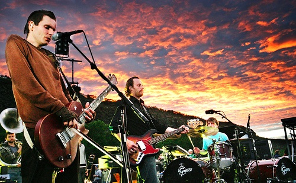
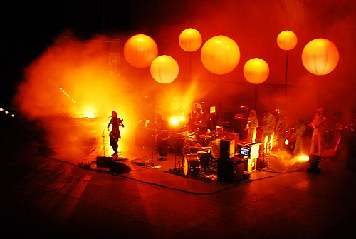
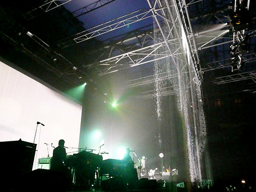
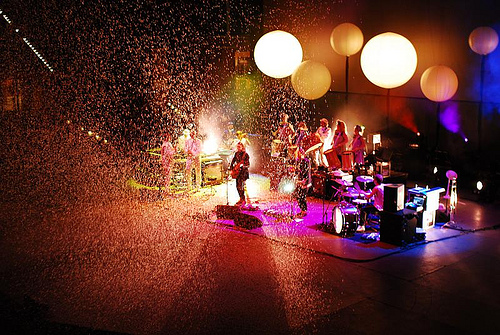
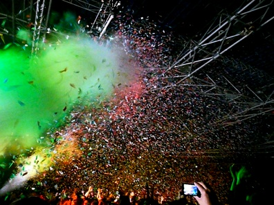
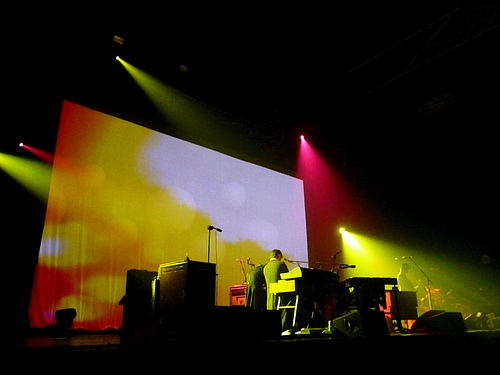
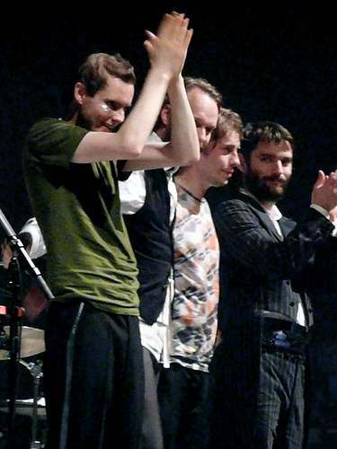

+++
titre = "Sigur Ros au Zénith (15 novembre 2008)"
title = "Sigur Ros au Zénith (15 novembre 2008)"
url = "/sigur-ros-au-zenith"
date = "2008-11-16T21:54:13"
Lastmod = "2010-02-01T22:41:32"
cover = "sigur-ros-live.jpg"
categorie = [ "À voir… en live" ]
tag = [ "Concert", "Post-Rock", "Zénith" ]
annee = [ "2008" ]
weight = 2008

+++

Hier soir, j&rsquo;ai réalisé un de mes nombreux rêves en allant voir et écouter sur scène Sigur Ros, ce groupe islandais à la carrière brillante et dont <a href="http://voiretmanger.fr/index.php/2008/07/28/sigur-ros/">le dernier m&rsquo;avait tant plu</a>. Dans ce même billet, je disais aussi tout le bien que je pense du DVD, <em>Heima</em> qui transportait le spectateur dans une Islande quasiment féérique, très poétique à tout le moins. Par ailleurs, ce DVD confirmait ce que j&rsquo;avais souvent entendu : Sigur Ros, en live, ça le fait. Oui parce que si l&rsquo;on écoute les albums, c&rsquo;est pas forcément évident à la première écoute, que cette musique passera bien en live&#8230;

Sigur Ros n&rsquo;est plus le groupe islandais connu de personne en-dehors de leur île natale qu&rsquo;il était à la sortie d&rsquo;Ágætis byrjun. Depuis, de l&rsquo;eau a coulé sous les ponts, le groupe est devenu célèbre, propulsé notamment par les premières parties de Radiohead. Résultat, quand j&rsquo;ai acheté mon billet, la fosse était pleine et j&rsquo;ai été obligé de me rabattre sur les places assises. Le concert lui-même fut complet. Remplir un Zénith, belle performance qui fait plaisir, même si j&rsquo;aurai vraiment aimé les voir quand ils jouaient dans les petites salles parisiennes.

En première partie, point d&rsquo;Amiina comme ce fut longtemps le cas. Ce quatuor à cordes nordique les a longtemps accompagné en concert, apportant une touche acoustique aux concerts. À la place, nous avons droit à <em>For a Minor Reflection</em>, groupe également islandais qui a joué trois titres d&rsquo;un post-rock loin d&rsquo;être déplaisant mais assez classique (qui m&rsquo;a beaucoup fait penser à <em>Explosions in the Sky</em> personnellement). Une courte première partie qui a rempli son rôle de chauffer un peu la salle et le matériel, en attendant les choses sérieuses.

Entre les deux, la préparation de la scène se fait malheureusement dans le noir, mais on peut apercevoir plusieurs éléments. Je sais, d&rsquo;après le DVD, que les concerts de Sigur Ros sont très travaillés visuellement, et on ne sera pas déçu sur ce point. Et puis après l&rsquo;attente, les lumières s&rsquo;éteignent, des sortes de bougies s&rsquo;allument, la musique commence, et le concert démarre.

Un concert de Sigur Ros, c&rsquo;est d&rsquo;abord une musique, et surtout pas des stars. Ainsi, comme <a href="http://voiretmanger.fr/index.php/2008/11/06/ez3kiel-groupe-qui-gagnerait-a-etre-connu/">Ez3kiel vu il y a deux semaines</a>, les quatre artistes se retirent complètement derrière leur musique, mais aussi, il faut bien le dire, un visuel très travaillé. Pour preuve, les spots ne sont quasiment jamais dirigés depuis la salle vers la scène, mais le plus souvent de la scène vers la salle (cf la photo ci-dessus par exemple). On ne voit jamais vraiment autre chose que des silhouettes, avec parfois de véritables réussites visuelles. Ainsi, un spot placé devant le chanteur/guitariste (si tant est que l&rsquo;on puisse parler de guitariste) varie d&rsquo;intensité pour former, sur la toile de fond, une ombre plus ou moins grande en fonction de l&rsquo;intensité musicale. Le groupe utilise plusieurs éléments, à la fois classiques : sur le fond sont projetées des images, souvent filmées sur scène mais bien retravaillées (noir et blanc le plus souvent) ; plusieurs ballons sont suspendus au-dessus de la scène et éclairés ou pas (ci-dessus). Mais aussi des éléments bien plus originaux : un magnifique rideau de pluie (ci-dessous), des confettis, des bulles, de la neige&#8230;

Mais si les effets visuels sont nombreux, ça n&rsquo;est pas du tout au détriment de la musique que cela se fait. La musique est bien l&rsquo;essentielle chez Sigur Ros, heureusement. Et quelle musique ! Tout d&rsquo;abord, il faut rappeler que c&rsquo;est le premier groupe, sans doute, à avoir systématisé l&rsquo;utilisation d&rsquo;un archet avec une guitare, pour des effets très étonnants, des notes suraiguës à des sons puissants. Ce son est aujourd&rsquo;hui clairement identifié à Sigur Ros, même si d&rsquo;autres groupes ont repris l&rsquo;idée. Puis vient cette voix, puissante, qui monte haut sans jamais sonner faux. Une magnifique voix qui, combinée à l&rsquo;islandais (voire à la langue inventée par le groupe) apporte comme une magie.

Magie, c&rsquo;est bien le mot, c&rsquo;est ce que l&rsquo;on ressent à un concert de Sigur Ros. Magie, mais aussi poésie et rêve : le mieux est de se laisser emporter par les sons et de profiter pleinement du spectacle. Un spectacle malheureusement bien court : moins d&rsquo;une heure et demi de concert, c&rsquo;était bien peu, et on est sorti avec l&rsquo;étrange impression d&rsquo;avoir assisté à un (long) festival&#8230; Mais en même temps, que faire de plus, de mieux, que la dernière chanson ? Ah, cette montée tout au long du morceau et cette explosion finale ! Que ce fut beau !

Pourtant, si explosion il y eut (et plus d&rsquo;une fois), le public fut globalement très calme. L&rsquo;écoute religieuse primait ce soir-là au Zénith. Certes, la musique de Sigur Ros n&rsquo;est sans doute pas aussi entraînante que celle d&rsquo;AC/DC, pour prendre un exemple au hasard. Mais enfin, il y avait de quoi bouger ! Surtout avec les nouveaux titres du dernier album, des titres plus légers que la moyenne, plus simples d&rsquo;accès aussi (tout en restant du Sigur Ros) et qui ont apporté une touche colorée dans le spectacle (cf ci-dessous), c&rsquo;était assez amusant&#8230; C&rsquo;est d&rsquo;ailleurs sur un de ces morceaux que la salle entière s&rsquo;est levée et à applaudit à tout rompre : sans doute l&rsquo;un des meilleurs morceaux du concert à mes yeux (et oreilles).

Ceci étant, force est de le reconnaître, la musique de Sigur Ros n&rsquo;est pas facile d&rsquo;accès. D&rsquo;ailleurs, en y repensant après coup, c&rsquo;est quand même une belle prouesse d&rsquo;avoir rempli une si grande salle. Certes, il n&rsquo;y a que très peu de concerts en France, mais quand même ! C&rsquo;est étonnant de voir que certains groupes &laquo;&nbsp;pointus&nbsp;&raquo; réussissent là où d&rsquo;autres, parfois même plus faciles d&rsquo;accès, &laquo;&nbsp;échouent&nbsp;&raquo; commercialement parlant. Vous me direz que cela tient à la qualité de la musique. Certes, mais si le succés était vraiment lié à la qualité d&rsquo;un groupe, ça se saurait, non ?

En tout cas, ce fut une merveilleuse expérience, bien que vraiment trop courte à mon goût. Je trouve aussi que les quatre filles d&rsquo;Amiina apportaient vraiment un plus en jouant vraiment sur scène, là où la nouvelle première partie se contente, en gros, de taper sur un tambour. Elles manquent un peu, même si le plaisir n&rsquo;en fut pas gâché.

C&rsquo;est vous que l&rsquo;on applaudit et remercie, messieurs !

<strong>Note</strong> : je remercie tous les auteurs (<a href="http://flickr.com/photos/oliverpeel/">oliver.peel</a> en particulier) des photographies du concert utilisées ici, et m&rsquo;excuse humblement pour le pillage Flickresque&#8230;

