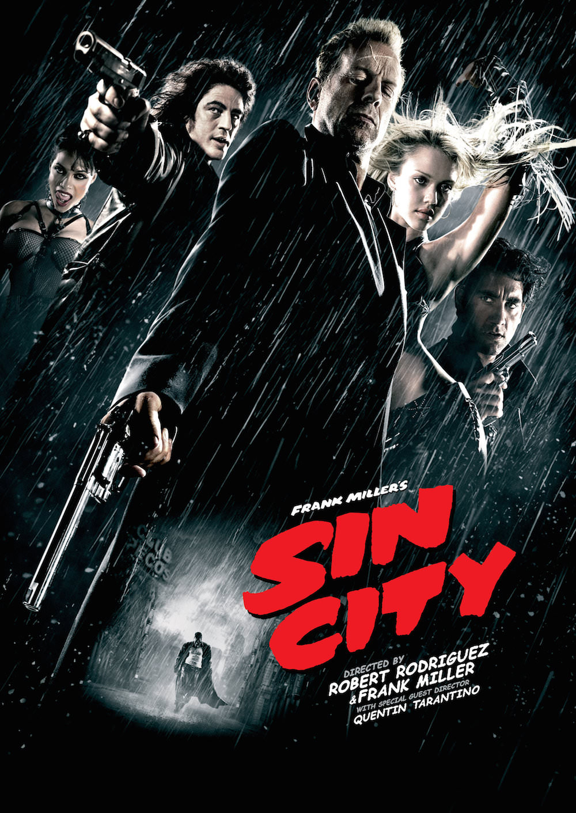
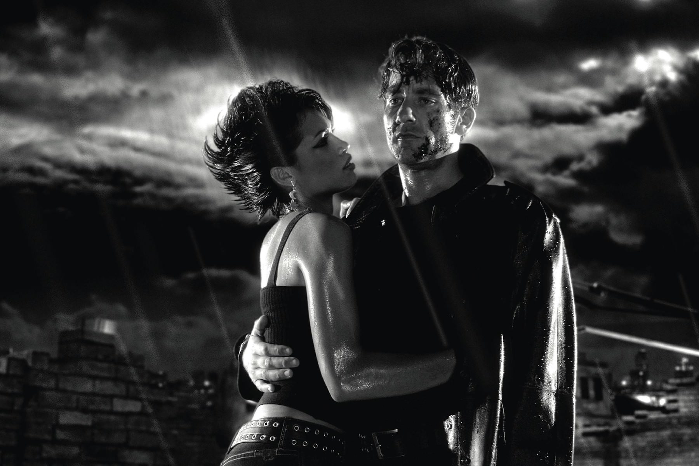
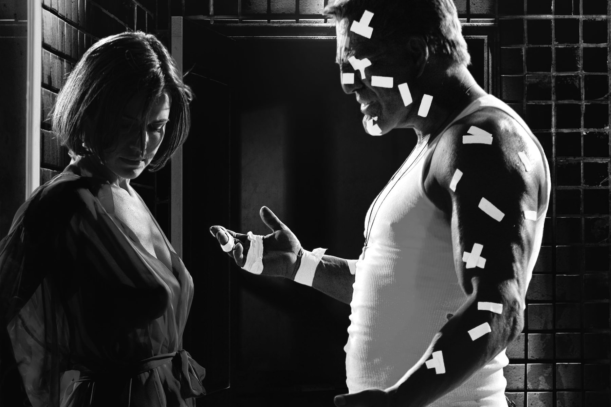

+++
type = "post"
titre = "<em>Sin City</em>, Robert Rodriguez et Frank Miller"
title = "Sin City, Robert Rodriguez et Frank Miller"
url = "/sin-city-rodriguez-miller"
date = "2014-03-26T08:27:45"
Lastmod = "2014-03-26T15:07:22"
cover = "sin-city-bruce-willis.jpg"
categorie = [ "À voir" ]
tag = [ "Action", "Adaptation bande-dessinée", "Comics", "Mort", "Police", "Politique", "Religion", "Serial-killer", "Société", "Thriller", "Violence" ]
createur = [ "Frank Miller", "Quentin Tarantino", "Robert Rodriguez" ]
acteur = [ "Benicio Del Toro", "Bruce Willis", "Clive Owen", "Elijah Wood", "Jessica Alba", "Mickey Rourke", "Rosario Dawson" ]
annee = [ "2005" ]
weight = 2005
saga = [ "Sin City" ]
pays = [ "États-Unis" ]

+++

La bande dessinée est souvent source d’inspiration pour le cinéma, mais les auteurs de bande dessinée passent rarement eux-mêmes derrière la caméra. Frank Miller est l’exception qui a confirmé la règle quand il a accepté de diriger, avec Robert Rodriguez, l’adaptation de <em>Sin City</em>. Le cinéaste a mis plusieurs années à convaincre l’auteur, et pour cause : ce comics est d’une telle noirceur, il est si désespéré et en même temps tellement plein d’une folie meurtrière que l’on pouvait avoir du mal à imaginer comment le cinéma pourrait s’en emparer sans le dénaturer. C’est peut-être, d’ailleurs, pour cette raison que Frank Miller a accepté de co-réaliser l’adaptation cinématographique. Robert Rodriguez a eu l’étonnante ambition de coller au plus près au récit original, tant sur le fond que la forme. Le résultat est pour le moins étrange : <em>Sin City</em> ressemble plus à un film d’animation, avec sa photographie radicale et son traitement qui refuse souvent le réalisme. Le résultat, souvent déstabilisant, ne plaira pas à tout le monde, mais il est incontestablement passionnant…

Résumer <em>Sin City</em> est peine perdue, surtout dans la version sortie au cinéma qui opte pour un montage éclaté dans l’esprit d’un <a href="/kill-bill-tarantino/" title="Kill Bill, Quentin Tarantino"><em>Kill Bill</em></a>. Robert Rodriguez et Frank Miller ont puisé dans le premier, le troisième et le quatrième volume de la série sur papier pour constituer une plongée dans l’enfer de la ville qui porte bien son nom. Dans cette ville du péché, il n’y a que police corrompue, mafia toute puissante et politiciens véreux. Un univers de violence extrême où tout le monde peut tuer tout le monde sans vraiment être inquiété, du moins à condition de disposer des bons soutiens politiques. La séquence avec le fils du sénateur qui viole et tue impunément des petites filles est à cet égard saisissante : le policier qui sauve une fille est condamné alors qu’il est évidemment innocent, mais la police et la justice préfèrent écouter les influences plutôt que de regarder les faits. Pendant plus de deux heures, <em>Sin City</em> évolue constamment entre violence gratuite et justice personnelle, dans un univers où la police armée d’Uzis tire sans réfléchir, où un évêque aide un serial-killer cannibal, où des prostituées signent un accord avec la police pour faire leur propre justice… bref, un univers particulièrement sombre. L’adaptation est fidèle, jusqu’aux dialogues qui ont été repris tels que des bandes dessinées, et cela se voit et surtout s’entend. L’utilisation quasiment systématique des narrateurs est assez troublante dans un premier temps, mais c’est aussi cette particularité qui crée une ambiance particulière. Et ce respect le plus total de l’œuvre originale se ressent encore mieux dans la version « <em>recut, unrated, extended</em> » qui a été proposée en plus de celle sortie en salles, sur les DVD et Blu-ray. Abandonnant le montage alterné entre plusieurs récits, cette variante opte pour une chronologie pure et fait succéder quatre ou cinq petits films indépendants, comme s’il s’agissait de tomes papier. Moins audacieuse, cette version a toutefois le mérite de mettre encore mieux en valeur la noirceur absolue de l’univers créé par Frank Miller, mais aussi sa répétition permanente.

Pour présenter un univers aussi sombre, Robert Rodriguez est resté fidèle à l’œuvre originale avec un long-métrage aussi noir sur la forme, qu’il peut l’être sur le fond. De fait, c’est la première chose qui frappe quand on commence à regarder <em>Sin City</em> : la photographie est si noire que l’on a parfois l’impression de regarder des dessins, et non des acteurs filmés avec des caméras. Tourné entièrement en studio, exclusivement sur des fonds verts, le film est d’une radicalité absolue avec même, sur de nombreux blancs, une manipulation des couleurs qui perturbe consciemment le spectateur. Il y a d’une part ces couleurs qui sont sauvegardées sur certains plans : uniquement le rouge dans la séquence d’ouverture, plus tard uniquement la peau jaune d’un personnage, ou alors le bleu d’une voiture. Et puis il y a cette façon d’effacer et en même temps de renforcer le sang et d’autres éléments à l’image en les passant en blanc. Le résultat est très original et saisissant et, que l’on aime ou pas le style déployé dans le film, force est de reconnaître que <em>Sin City</em> est visuellement très impressionnant. La technique déployée par Robert Rodriguez et Frank Miller est d’une cohérence absolue et on ne ressort pas indemne d’une plongée de deux heures dans cet univers poisseux et étouffant. L’effet est très réussi et même si on ne se passionne pas pour les histoires, la forme du long-métrage suffit à justifier qu’on le voit au moins une fois. C’est une expérience étonnante qui a été par la suite un peu trop reprise et systématisée dans d’autres productions, mais qui est ici étonnamment radicale. Qu’elle soit inspirée par une bande dessinée et non sortie droit de la tête de Robert Rodriguez n’a aucune importance, on ne peut que constater son efficacité.

<em>Sin City</em> est un film étrange, incontestablement. Composé de plusieurs petites histoires très vaguement liées, mais qui restent largement indépendantes, le long-métrage de Robert Rodriguez et Frank Miller est une œuvre radicalement noire, tant sur la forme que le fond. Une expérience déroutante et pas forcément agréable, mais nécessairement passionnante, en raison de sa radicalité justement. Difficile de voir comment l’essai pourra être transformé avec la suite, attendue dans les prochains mois, mais <em>Sin City</em> restera, quoi qu’il arrive, une expérience cinématographique très intéressante.

<h3>Vous voulez m’aider ?</h3>
<ul>
<li><a href="http://www.amazon.fr/gp/product/B006LNA8CA/ref=as_li_ss_tl?ie=UTF8&tag=leblogdenic07-21&linkCode=as2&camp=1642&creative=19458&creativeASIN=B006LNA8CA">Acheter le film en Blu-Ray sur Amazon</a></li>
<li><a href="http://www.amazon.fr/gp/product/B006LNABPE/ref=as_li_ss_tl?ie=UTF8&tag=leblogdenic07-21&linkCode=as2&camp=1642&creative=19458&creativeASIN=B006LNABPE">Acheter le film en DVD sur Amazon</a></li>
<li><a href="https://itunes.apple.com/fr/movie/sin-city-vost/id417803202">Acheter ou louer le film sur l’iTunes Store</a></li>
</ul>

