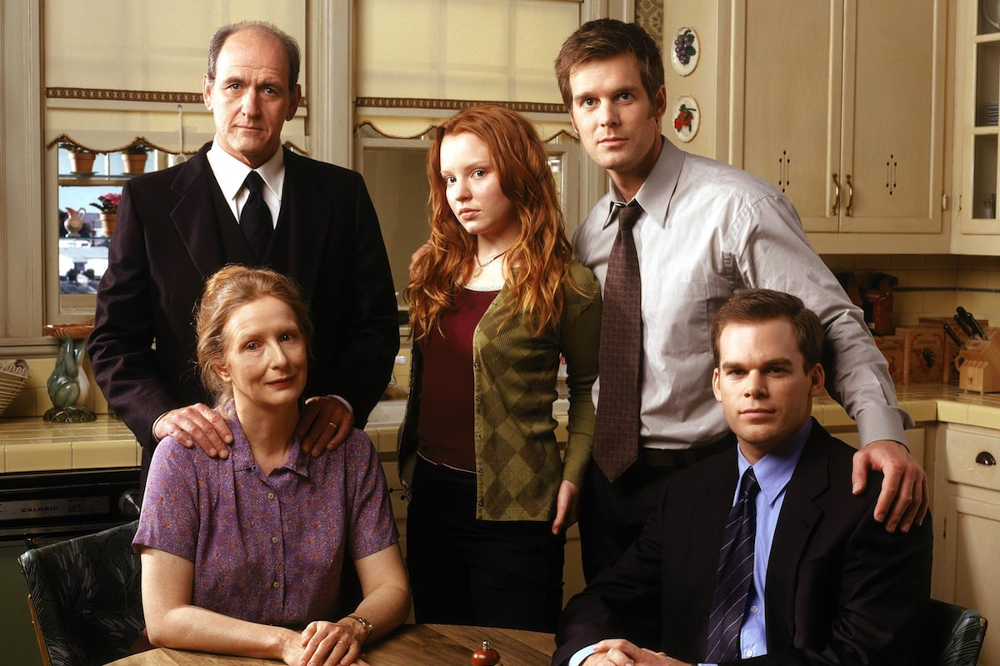
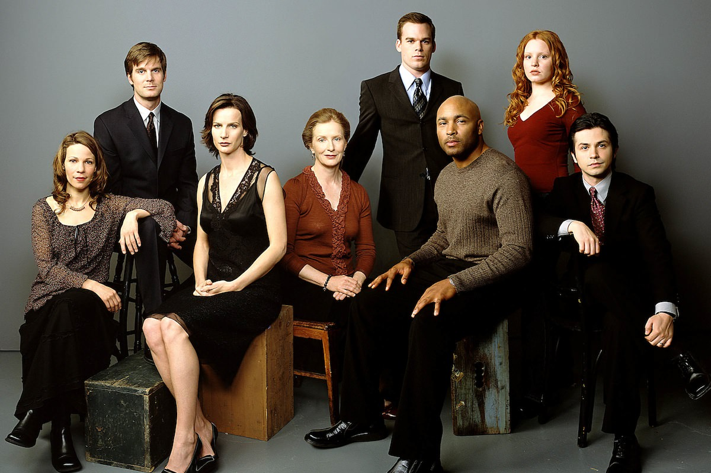

+++
titre = "<em>Six Feet Under</em>, Alan Ball (HBO)"
title = "Six Feet Under, Alan Ball (HBO)"
url = "/six-feet-under-ball-hbo"
date = "2012-08-01T22:42:05"
Lastmod = "2014-11-29T17:49:57"
cover = "six-feet-under-hbo.jpg"
categorie = [ "À voir" ]
tag = [ "Drame", "Famille", "Folie", "Homosexualité", "Humour", "Mort", "Série", "Sexe" ]
createur = [ "Alan Ball", "HBO" ]
acteur = [ "Frances Conroy", "Freddy Rodriguez", "James Cromwell", "Lauren Ambrose", "Matthew St. Patrick", "Michael C. Hall", "Peter Krause", "Rachel Griffiths", "Richard Jenkins" ]
annee = [ "2001" ]
weight = 2001
pays = [ "États-Unis" ]

+++

Créée en 2001 par Alan Ball pour la célèbre chaîne HBO, <em>Six Feet Under</em> n&rsquo;a pas de point de départ particulièrement original comme pouvait s&rsquo;en prévaloir <a title="Breaking Bad, Vince Gilligan (AMC)" href="http://voiretmanger.fr/2012/06/24/breaking-bad-gilligan/"><em>Breaking Bad</em></a> qui racontait l&rsquo;histoire d&rsquo;un professeur de chimie mourant qui se mettait à produire de la meth. Ici, il ne s&rsquo;agit &laquo;&nbsp;que&nbsp;&raquo; d&rsquo;une famille dont on va suivre les histoires sur environ cinq ans et autant de saisons. Alan Ball ne choisit pas n&rsquo;importe quelle famille bien sûr : les Fisher ont la particularité de posséder une entreprise familiale… de pompes funèbres. De ce fait, la mort plane sur toute la série qui n&rsquo;est toutefois en rien macabre. Une série qui ne fait pas dans l&rsquo;époustouflant, mais la justesse de ses personnages et de son histoire force encore aujourd&rsquo;hui le respect.

<em>Six Feet Under</em> commence par… une mort. Nathaniel Fisher, le père de famille, se tue dans un accident de la circulation alors qu&rsquo;il allait chercher son fils Nate à l&rsquo;aéroport. On est à quelques jours de Noël, la seule fête qui parviennent encore à réunir cette famille par ailleurs si désunie. Nathaniel a épousé Ruth de nombreuses années auparavant et ils ont eu trois enfants. Nate justement, l&rsquo;aîné, qui n&rsquo;a jamais supporté l&rsquo;entreprise familiale et qui a tout fait pour s&rsquo;en éloigner ; quand la série commence, il habite et travaille à Seattle. David ensuite, qui a suivi un parcours opposé à celui de son grand frère : fasciné par le travail de son père, il fait des études pour devenir à son tour entrepreneur en pompes funèbres et il travaille depuis dans l&rsquo;entreprise familiale. Claire enfin, la petite dernière qui est encore au lycée quand la série démarre, peine à trouver sa voie : artiste un peu bohème, elle est bien différente de sa mère, rigoureuse femme au foyer.

D&rsquo;emblée, Alan Ball nous fait comprendre que tout ne va pas pour le mieux dans la famille Fisher. <em>Six Feet Under</em> exploite logiquement ces failles qui explosent brutalement au grand jour avec la mort du père. Sa femme et ses enfants découvrent alors qu&rsquo;il était un homme très secret, qu&rsquo;il utilisait plusieurs pièces dans la ville sans prévenir personne. Qu&rsquo;y faisait-il ? Qu&rsquo;avait-il à cacher ? Autant de questions qui interpellent les personnages principaux, mais qui n&rsquo;appellent plus de réponses, le principal intéressé étant mort. La disparition de Nathaniel bouleverse les équilibres en place. David ne peut plus assurer seul la bonne marche de l&rsquo;entreprise et il convainc, avec l&rsquo;aide de sa mère qui n&rsquo;a jamais vécu seule, Nate de rester pour l&rsquo;aider. Le jeune homme a toutefois du mal à vivre ce retour à la maison familiale, lui qui voulait tant s&rsquo;en éloigner. Les tensions retenues pendant des années ne tardent pas à revenir à la surface et <em>Six Feet Under</em> ne manque pas de les exploiter.

La mort frappe <em>Six Feet Under</em> dès les premières minutes et elle ne quitte jamais bien longtemps la série. Alan Ball a la bonne idée de commencer chaque épisode avec un mort : après Nathaniel Fisher, une longue série d&rsquo;inconnus meurt dans les premières minutes de chaque épisode. Certaines morts sont banales — la vieillesse, une longue maladie —, d&rsquo;autres sont au contraire plus surprenantes et la série adopte même par moment une allure de <em>Destination finale</em> qui n&rsquo;est pas déplaisante. Ces mises à mort ne durent qu&rsquo;une poignée de minutes, mais elles ont ensuite une influence sur tout l&rsquo;épisode. À chaque fois, un mort est plus particulièrement présent, ne serait-ce que par le biais de sa famille qui vient l&rsquo;enterrer chez les Fisher, parfois présent lui-même. Autre bonne idée de <em>Six Feet Under</em>, les morts apparaissent régulièrement aux vivants et ils jouent un vrai rôle, comme s&rsquo;ils étaient vraiment présents. La mort devient en quelque sorte la norme dans la série, même s&rsquo;il ne faut pas imaginer un ensemble morbide, les vivants restent plus importants et c&rsquo;est plus une manière très décomplexée d&rsquo;aborder le sujet.

Si le point de départ de <em>Six Feet Under</em> ne brille pas par son originalité, les scénaristes n&rsquo;ont pas manqué d&rsquo;idées pour remplir cinq saisons. Les enjeux professionnels sont présents et la question de la vente de l&rsquo;entreprise familiale à une grosse entreprise nationale occupe de nombreux épisodes. Reste que l&rsquo;essentiel n&rsquo;est pas là : Alan Ball a bien compris que ce sont les personnages qui comptent le plus dans une série, et les problèmes des uns et des autres occupent l&rsquo;essentiel de <em>Six Feet Under</em>. Des problèmes le plus souvent d&rsquo;ordre conjugal, voire sexuel, un sujet central ici comme il l&rsquo;a été ensuite dans <a title="True Blood saison 1, HBO" href="http://voiretmanger.fr/2010/07/04/true-blood-saison-1-hbo/"><em>True Blood</em></a>, autre création d&rsquo;Alan Ball. Aux quatre membres de la famille Fisher restants, la série ajoute ainsi des pièces rapportées pour former une série de couples. Nate rencontre Brenda dès son arrivée à l&rsquo;aéroport, Ruth essaie de trouver un autre homme après la mort de son mari, Claire multiplie les rencontres et David vit avec Keith depuis quelques mois déjà quand la série débute. Au fil des saisons, les couples vont se faire et se défaire, certains vont finir par se stabiliser assez rapidement, d&rsquo;autres au contraire restent très instables la majeure partie du temps. Ce sont des histoires classiques, pleines d&rsquo;amour, de haine, de séparations et d&rsquo;unions, mais ce sont des histoires qui fonctionnent toujours et qui trouvent dans <em>Six Feet Under</em> un cadre très porteur.

Peu de séries ont réussi à créer des personnages aussi réalistes. À revoir <em>Six Feet Under</em> aujourd&rsquo;hui, on est encore frappé par la justesse de ses récits et de ses interprètes, principaux comme secondaires. À la fin de la cinquième saison, Alan Ball a réussi quelque chose de très rare : les personnages qu&rsquo;il a imaginé nous semblent aussi familiers que s&rsquo;ils étaient nos proches, on a un peu le sentiment d&rsquo;appartenir à la famille Fisher. Les mots deviennent inutiles pour exprimer tout ce qu&rsquo;ils ressentent, on le comprend simplement en les regardant. <em>Six Feet Under</em> a réussi à maintenir ce très bon niveau pendant ses cinq saisons, avec un rythme assez lent qui tranche avec les productions actuelles, mais qui était nécessaire pour ne pas passer à côté de la psychologie des personnages. Alan Ball a su prendre son temps pour passionner finalement avec des histoires somme toute banales, mais toujours parfaitement crédibles. C&rsquo;est incontestablement le plus grand mérite de la série, cette sobriété qu&rsquo;il est bien difficile de réussir et surtout de tenir pendant plus de soixante épisodes.

La pâte HBO est sensible dès le générique d&rsquo;ouverture, ou plutôt surtout pendant ce générique. La musique composée par Thomas Newmann n&rsquo;a pas remporté trois récompenses pour rien, elle est vraiment sublime et offre à <em>Six Feet Under</em> une identité propre très marquée. Les images évoquent quant à elles l&rsquo;univers des cimetières et la mort, mais si l&rsquo;ensemble est sérieux, il n&rsquo;est pas plus morbide que la série elle-même. Cette dernière a été supervisée d&rsquo;un bout à l&rsquo;autre par Alan Ball, créateur et producteur de l&rsquo;ensemble. Comme c&rsquo;est souvent le cas, chaque épisode a été scénarisé et mis en scène par quelques personnes différentes, mais l&rsquo;ensemble est très homogène. <em>Six Feet Under</em> se permet quelques incursions dans le fantastique, par la présence des morts déjà, mais elle ne brille pas par une forme très originale. Là encore, elle fait le pari de la sobriété et de l&rsquo;efficacité et elle doit énormément à ses acteurs. Tous les rôles principaux sont excellents, que ce soit le duo de frères Peter Krause et Michael C. Hall que l&rsquo;on retrouvera, métamorphosé, dans <em>Dexter</em>. Frances Conroy compose un personnage très touchant et beaucoup plus subtil qu&rsquo;il n&rsquo;y paraissait au premier abord, tandis que Lauren Ambrose qui joue sa fille suscite beaucoup de curiosité. Dans les pièces rapportées, Rachel Griffiths est certainement la plus intéressante dans ce personnage de fille de psys qui a du mal à vivre normalement, mais Mathew St Patrick n&rsquo;est pas mal du tout en compagnon de David.

<iframe src="http://player.vimeo.com/video/12620728?byline=0&amp;portrait=0&amp;color=ffffff" frameborder="0" width="100%" height="500"></iframe>

Certaines séries marquent plus que d&rsquo;autres et <em>Six Feet Under</em> en fait partie. Ce n&rsquo;est pas pour son idée de départ très originale, pas plus pour sa réalisation audacieuse ou son action vigoureuse. Non, le succès de la série imaginée par Alan Ball est à la fois beaucoup plus simple et très complexe à résumer. <em>Six Feet Under</em> est une série très juste, son histoire est banale, mais extrêmement précise et crédible. Si on la retient, c&rsquo;est parce que ses personnages semblent faire partie de notre famille… une belle prouesse.

<h3>Vous voulez m&rsquo;aider ?</h3>
<ul>
<li><a href="http://www.amazon.fr/gp/product/B0012OSLFO/ref=as_li_ss_tl?ie=UTF8&amp;tag=leblogdenic07-21&amp;linkCode=as2&amp;camp=1642&amp;creative=19458&amp;creativeASIN=B0012OSLFO">Acheter la première saison en DVD sur Amazon</a></li>
<li><a href="http://www.amazon.fr/gp/product/B0013E0WP0/ref=as_li_ss_tl?ie=UTF8&amp;tag=leblogdenic07-21&amp;linkCode=as2&amp;camp=1642&amp;creative=19458&amp;creativeASIN=B0013E0WP0">Acheter la deuxième saison en DVD sur Amazon</a></li>
<li><a href="http://www.amazon.fr/gp/product/B0013DZ6BQ/ref=as_li_ss_tl?ie=UTF8&amp;tag=leblogdenic07-21&amp;linkCode=as2&amp;camp=1642&amp;creative=19458&amp;creativeASIN=B0013DZ6BQ">Acheter la troisième saison en DVD sur Amazon</a></li>
<li><a href="http://www.amazon.fr/gp/product/B0013DZ6CU/ref=as_li_ss_tl?ie=UTF8&amp;tag=leblogdenic07-21&amp;linkCode=as2&amp;camp=1642&amp;creative=19458&amp;creativeASIN=B0013DZ6CU">Acheter la quatrième saison en DVD sur Amazon</a></li>
<li><a href="http://www.amazon.fr/gp/product/B0013DVSWW/ref=as_li_ss_tl?ie=UTF8&amp;tag=leblogdenic07-21&amp;linkCode=as2&amp;camp=1642&amp;creative=19458&amp;creativeASIN=B0013DVSWW">Acheter la cinquième saison en DVD sur Amazon</a></li>
</ul>
<ul>
<li><a href="http://www.amazon.fr/gp/product/B002698EW4/ref=as_li_ss_tl?ie=UTF8&amp;tag=leblogdenic07-21&amp;linkCode=as2&amp;camp=1642&amp;creative=19458&amp;creativeASIN=B002698EW4">Acheter la série intégrale en DVD sur Amazon</a></li>
<li><a href="http://itunes.apple.com/WebObjects/MZStore.woa/wa/viewMultiRoom?fcId=452359996">Acheter la série sur l&rsquo;iTunes Store</a></li>
</ul>

