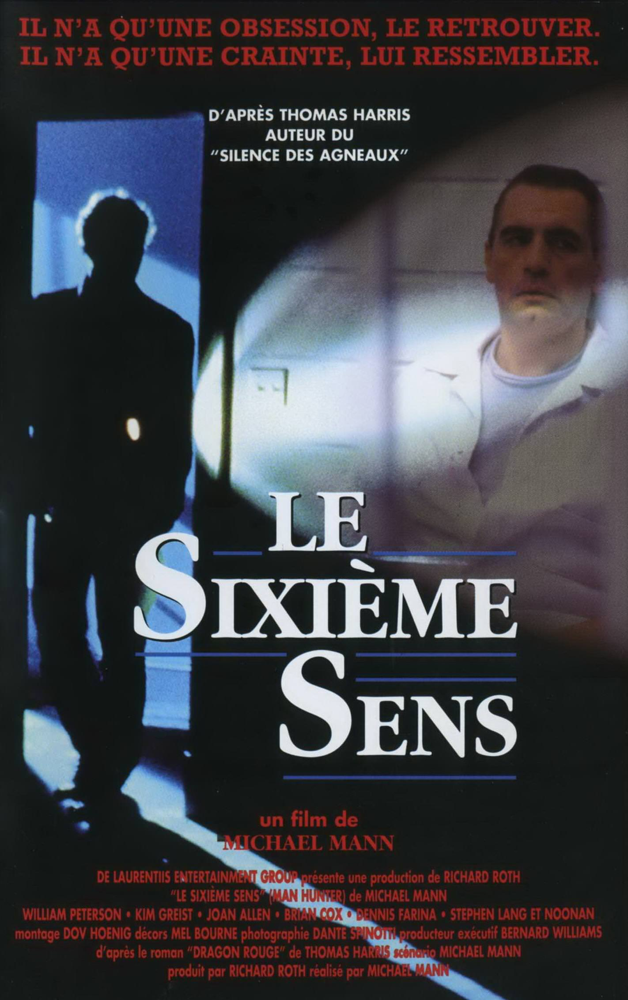
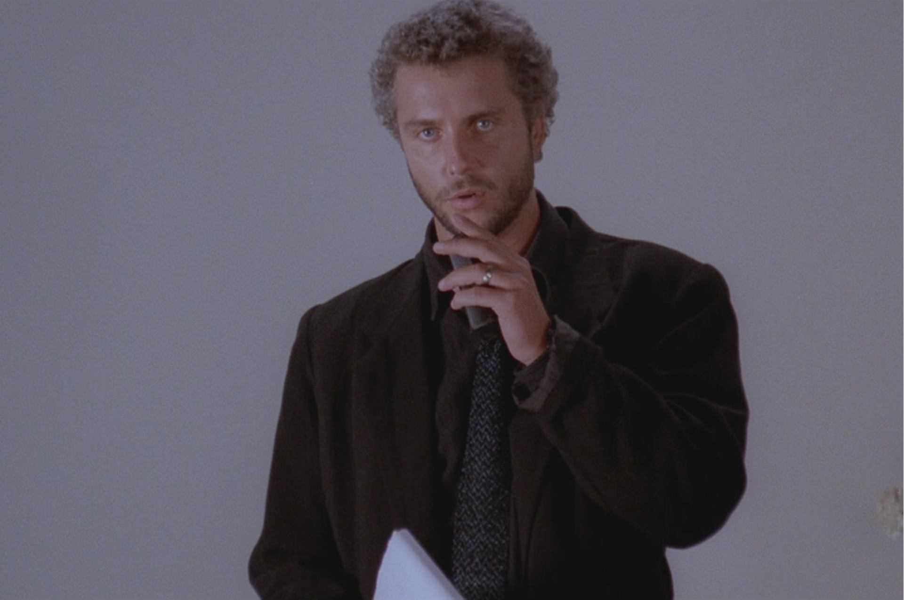
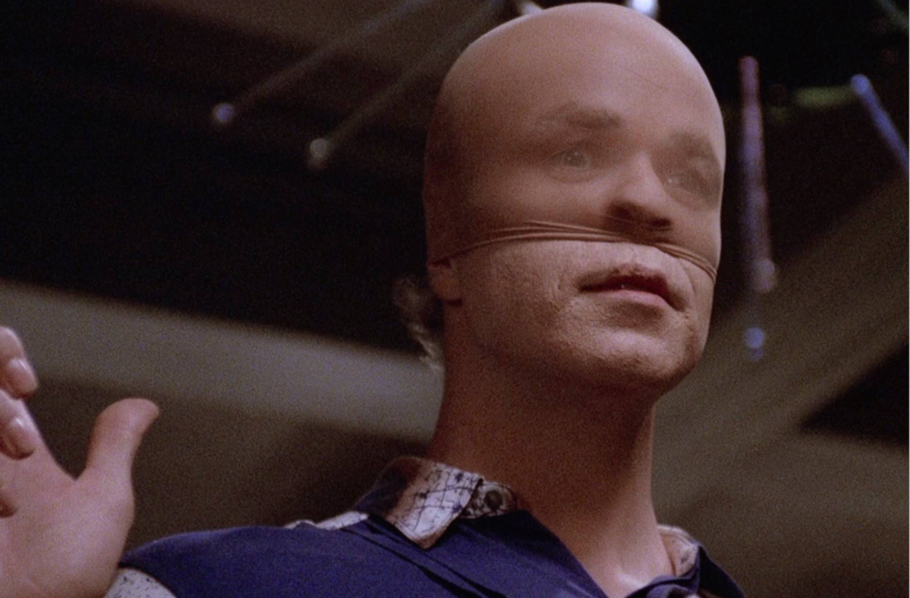

+++
type = "post"
titre = "<em>Le Sixième Sens</em>, Michael Mann"
title = "Le Sixième Sens, Michael Mann"
url = "/sixieme-sens-mann"
date = "2015-01-17T09:05:48"
Lastmod = "2015-01-17T01:12:12"
cover = "le-sixieme-sens-william-l-petersen.jpg"
categorie = [ "À voir" ]
tag = [ "Adaptation littéraire", "Enquête", "Famille", "Folie", "Police", "Serial-killer", "Thriller" ]
createur = [ "Michael Mann" ]
acteur = [ "Brian Cox", "Kim Greist", "Tom Noonan", "William L. Petersen" ]
annee = [ "1987" ]
weight = 1987
saga = [ "Hannibal Lecter" ]
pays = [ "États-Unis" ]
original = "Manhunter"

+++

Probablement écrasé par l&rsquo;immense succès de <a href="/sixieme-sens-shyamalan/" title="Sixième Sens, M. Night Shyamalan"><em>Sixième Sens</em></a> et par son titre français un petit peu trop proche, certainement écarté des mémoires par le succès tout aussi important du <em>Silence des Agneaux</em>, on ignore souvent que le troisième film de Michael Mann appartient à la <a href="/saga/hannibal-lecter/">saga <em>Hannibal Lecter</em></a>. Même si le serial-killer et cannibal n&rsquo;est qu&rsquo;un personnage secondaire dans <em>Le Sixième Sens</em>, on le retrouve bien au cœur des enjeux et surtout, déjà, dans la confrontation avec l&rsquo;inspecteur Will Graham<a href="#fn-12871-1" rel="footnote">1</a>. Ce long-métrage est aussi l&rsquo;occasion, pour le cinéaste américain, d&rsquo;affiner le style qui fera son succès quelques années après. Loin de la maîtrise technique qu&rsquo;il a imposé dans les décennies suivantes, ce petit film bien ancré dans les années 1980 reste toutefois très sympathique. <em>Le Sixième Sens</em> mériterait à être un petit peu plus (re)connu et il gagne à être (re)vu, à condition de tolérer une bande-originale très typée 1980&rsquo;s, naturellement.

<em>Dragon Rouge</em> est le premier roman de Thomas Harris qui évoque le personnage de Hannibal Lecter, et paradoxalement il l&rsquo;aborde au passé. Quand l&rsquo;histoire commence, l&rsquo;inspecteur Will Graham a déjà démasqué le serial-killer quelques mois auparavant, le cannibale est déjà emprisonné, bref c&rsquo;est presque déjà de l&rsquo;histoire ancienne. Le personnage apparaît malgré tout, parce que Will Graham a besoin de l&rsquo;aide de son ennemi, mais ce n&rsquo;est pas lui qui est au cœur des enjeux. <em>Le Sixième Sens</em> se concentre ainsi sur un autre tueur en série, surnommé Dragon Rouge, qui a tué sauvagement deux familles, toujours les soirs de pleine lune. Le scénario se concentre ainsi sur l&rsquo;enquête qui consiste à démasquer le tueur et finalement l&rsquo;arrêter et le lien avec le serial-killer de la saga reste ainsi ténu. Qu&rsquo;importe, Michael Mann réalise avant tout une œuvre personnelle, où il met en pratique quelques idées qui feront sa patte de réalisateur plus tard. Ses talents de cadreur sont déjà bien mis en valeur, avec des plans toujours composés avec une précision chirurgicale. Quant à la photographie, elle est souvent sublime, très typée années 1980 avec ses couleurs vives — et pas toujours naturelles : dormir dans une pièce éclairée en bleu paraît vraiment stupide —, mais pas seulement. Certains plans paraissent peut-être un peu vieillots aujourd&rsquo;hui, mais d&rsquo;autres sont magnifiques, surtout de nuit ; <em>Le Sixième Sens</em> sert en quelque sorte de laboratoire expérimental pour le réalisateur. Fort heureusement pour le film, il n&rsquo;a pas que sa technique à faire valoir. Heureusement, car si on peut saluer le travail de Michael Mann dans l&rsquo;ensemble, on doit aussi constater qu&rsquo;il est inconstant par moments. Certains plans accumulent les faux raccords au point qu&rsquo;ils deviennent confus et toute la séquence finale est d&rsquo;ailleurs si mal conçue, qu&rsquo;elle en devient presque gênante. L&rsquo;ensemble paraît bien amateur et on est encore loin de la perfection formelle et technique des futurs films du réalisateur, mais qu&rsquo;importe.

<em>Le Sixième Sens</em> est d&rsquo;abord le récit d&rsquo;un personnage complexe et donc passionnant. L&rsquo;inspecteur Will Graham est peut-être le meilleur « <em>profiler</em> » du FBI, c&rsquo;est aussi un homme qui a été brisé par son enquête contre Hannibal Lecter et qui reste psychologiquement faible. D&rsquo;ailleurs, au début du film, son supérieur lui demande de revenir et d&rsquo;arrêter le congé qu&rsquo;il a pris suite à cette affaire. C&rsquo;est donc un homme affaibli qui mène cette enquête, mais c&rsquo;est surtout un homme aux intentions troubles. Sa confrontation en prison avec le cannibale est l&rsquo;occasion d&rsquo;une scène prenante où l&rsquo;on découvre que Will Graham a aussi des pulsions meurtrières. S&rsquo;il n&rsquo;est jamais passé à l&rsquo;acte, il n&rsquo;est pas si différent, au fond, des serial-killers qu&rsquo;il poursuit. C&rsquo;est précisément ce qui fait qu&rsquo;il est si bon, certes, mais c&rsquo;est aussi dangereux : comme l&rsquo;affiche originale du film l&rsquo;indique bien, il est constamment en train d&rsquo;osciller entre son métier et ses cibles. Pour interpréter un personnage aussi complexe, Michael Mann a vu juste avec William L. Petersen, parfait dans ce rôle. Et si on a du mal à oublier la prestation d&rsquo;Anthony Hopkins dans la suite de la saga, il faut souligner que Brian Cox compose un Hannibal Lecter convaincant, beaucoup plus calme, peut-être moins impressionnant que son successeur, mais convaincant malgré tout. D&rsquo;ailleurs, l&rsquo;autre tueur du film, celui qui est censé être au cœur du récit, a bien du mal à exister à ses côtés. Tom Noonan est assez impressionnant avec son maquillage, mais il lui manque l&rsquo;épaisseur psychologique du cannibale et le personnage est moins intéressant. Michael Mann n&rsquo;a pas cherché à lui apporter beaucoup de matière et on sent bien que son véritable intérêt est plutôt du côté de son inspecteur toujours trouble.

Avec son style un peu trop coloré et surtout sa musique si typée années 1980, <em>Le Sixième Sens</em> n&rsquo;a pas très bien vieilli, c&rsquo;est incontestable. Toutefois, le long-métrage de Michael Mann reste intéressant et il est même très moderne sur certains aspects. En particulier, le traitement très scientifique de l&rsquo;enquête était novateur à l&rsquo;époque et il reste d&rsquo;actualité aujourd&rsquo;hui, même si la méthode pré-informatique semble bien ridicule. Le personnage de l&rsquo;inspecteur Will Graham reste quoi qu&rsquo;il en soit passionnant, et très bien interprété et <em>Le Sixième Sens</em> est toujours un thriller bien mené, en plus d&rsquo;être un fascinant terrain d&rsquo;expérimentations pour Michael Mann.

<h3>Vous voulez <a href="/soutien/">m&rsquo;aider</a> ?</h3>
<ul>
<li><a href="http://www.amazon.fr/gp/product/B004EMS0WA/ref=as_li_ss_tl?ie=UTF8&amp;tag=leblogdenic07-21&amp;linkCode=as2&amp;camp=1642&amp;creative=19458&amp;creativeASIN=B004EMS0WA">Acheter le film en Blu-ray sur Amazon</a></li>
<li><a href="http://www.amazon.fr/gp/product/B00008NEFG/ref=as_li_ss_tl?ie=UTF8&amp;tag=leblogdenic07-21&amp;linkCode=as2&amp;camp=1642&amp;creative=19458&amp;creativeASIN=B00008NEFG">Acheter le film en DVD sur Amazon</a></li>
<li><a href="https://itunes.apple.com/fr/movie/le-sixieme-sens/id541449416">Acheter ou louer le film sur l&rsquo;iTunes Store</a></li>
<li><a href="http://www.netflix.com/WiMovie/60004275?trkid=13462100">Regarder le film sur Netflix</a></li>
</ul>

<ol>
<li id="fn-12871-1">
Même si, pour une raison difficile à expliquer, le film ne le nomme pas « Lecter », mais « Lektor ». On voit mal comment Michael Mann, qui signe le scénario, aurait pu se tromper, mais si c&rsquo;est volontaire, qu&rsquo;est-ce que cela veut dire ?&#160;<a href="#fnref-12871-1" rev="footnote">&#8617;</a>
</li>
</ol>

