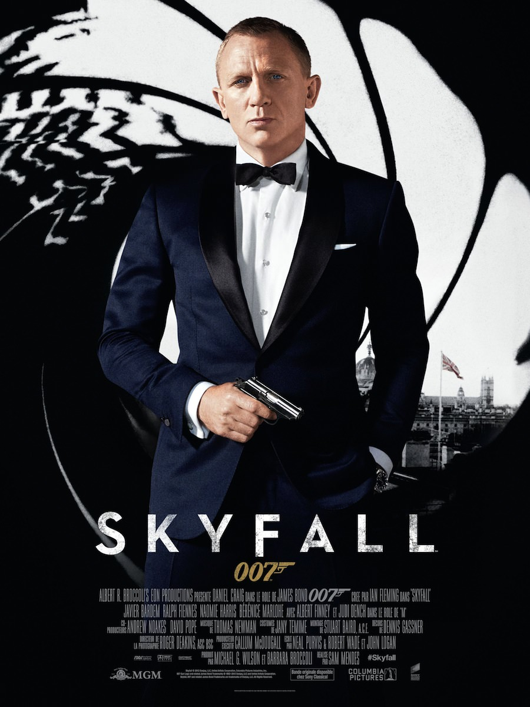
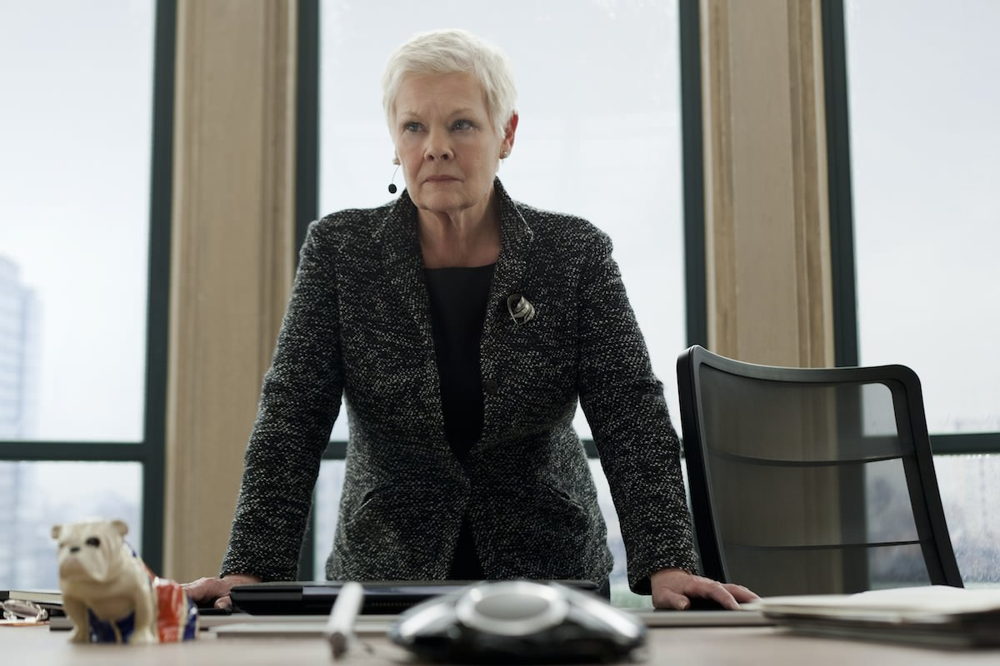

+++
type = "post"
titre = "<em>Skyfall</em>, Sam Mendes"
title = "Skyfall, Sam Mendes"
url = "/skyfall-mendes"
date = "2012-10-27T00:43:57"
Lastmod = "2014-12-18T15:07:38"
cover = "skyfall-javier-bardem.jpg"
categorie = [ "À voir" ]
tag = [ "Action", "Blockbuster", "Espionnage", "James Bond", "Violence" ]
createur = [ "Sam Mendes" ]
acteur = [ "Ben Whishaw", "Bérénice Marlohe", "Daniel Craig", "Javier Bardem", "Judi Dench" ]
annee = [ "2012" ]
weight = 2012
saga = [ "James Bond" ]
pays = [ "États-Unis" ]

+++

La série avait failli s&rsquo;arrêter, faute d&rsquo;argent, mais l&rsquo;espion secret fait un retour fracassant sur les toiles cette année. <em>Skyfall</em> est le troisième <em>James Bond</em> interprété par Daniel Craig et après un excellent <a href="/2012/11/18/casino-royale-campbell/" title="Casino Royale, Martin Campbell"><em>Casino Royale</em></a> qui avait offert à la saga un nouveau souffle, suivi d&rsquo;un <a title="James Bond, Quantum of Solace" href="/2008/10/31/james-bond-quantum-of-solace/"><em>Quantum of Solace</em></a> assez décevant, on pouvait espérer, mais aussi craindre, beaucoup. Derrière les caméras, Sam Mendes mène ce blockbuster avec brio et parvient à concilier l&rsquo;action brutale de <em>Casino Royale</em> et le charme désuet teinté d&rsquo;humour britannique des <em>James Bond</em> les plus classiques. Un mélange qui fait mouche et <em>Skyfall</em> est indéniablement un très bon divertissement et un excellent épisode dans la série de 23&nbsp;films qui composent aujourd&rsquo;hui la saga au cinéma… À voir, sur grand écran bien sûr !

<em>Skyfall</em> ouvre… sur la mort de James Bond. On ne révèlera rien d&rsquo;essentiel en disant qu&rsquo;il ne s&rsquo;agit bien évidemment que d&rsquo;une fausse mort. Une mission en Turquie, une course-poursuite qui ne se passe pas bien, une balle perdue et l&rsquo;agent 007 qui tombe d&rsquo;un pont. Déclaré disparu, il est finalement enterré et son employeur, les services secrets britanniques du MI6, tentent d&rsquo;oublier l&rsquo;un de leurs meilleurs agents. Pendant que James Bond se la coule douce sur une île paradisiaque, le siège du MI6 subit une attaque informatique qui se termine en explosion. Quelqu&rsquo;un d&rsquo;extrêmement dangereux et qui connaît parfaitement bien les services secrets vise l&rsquo;institution et en particulier M, sa dirigeante. Cette attaque incite l&rsquo;agent à ressusciter et il retourne sur le terrain pour aider le MI6. Sa mission le mène tout droit vers l&rsquo;auteur de l&rsquo;attaque, un ancien agent brillant qui en veut personnellement à M et qui entend bien la retrouver et la tuer. Le combat s&rsquo;annonce difficile, mais 007 n&rsquo;est pas du genre à se laisser faire…

Comme c&rsquo;est la tradition dans la saga, <em>Skyfall</em> s&rsquo;ouvre sur une longue scène d&rsquo;action. Cette fois, Sam Mendes nous emmène en Turquie, dans une course-poursuite qui ressemble à s&rsquo;y méprendre aux fameuses scènes de la trilogie <em>Jason Bourne</em>. Le message est passé, <em>James Bond</em> n&rsquo;est plus une série un peu monotone où chaque épisode se résume souvent à une série d&rsquo;affrontements à gadgets et à des filles à gogo. La violence est ici beaucoup plus crue et l&rsquo;action beaucoup plus réaliste, une tendance initiée avec <em>Casino Royale</em> et qui est confirmée ici. L&rsquo;agent 007 ne se bat plus contre des méchants mégalos qui ne rêvent que de faire exploser l&rsquo;univers, mais contre un ennemi d&rsquo;autant plus dangereux qu&rsquo;il est familier et motivé simplement par un désir de vengeance. Comme dans ses deux prédécesseurs, le réalisme est ici de mise et les gadgets sont totalement éradiqués, ou presque. Q fait son retour dans la série, mais il offre à l&rsquo;agent secret une radio de détresse et un pistolet qui détecte la main de James Bond, certes, mais qui ne fait rien de plus. <em>Skyfall</em> offre ainsi un spectacle assez cru, où les armes servent autant que les coups de poing et le héros prend lui aussi des coups, des vrais. Le film de Sam Mendes se nourrit des blockbusters de ces dernières années et si l&rsquo;on retrouve <em>Jason Bourne</em>, l&rsquo;intrigue et le ton tendent parfois tantôt vers le travail de Christopher Nolan sur les superhéros — en particulier <a title="The Dark Knight Rises, Christopher Nolan" href="/2012/07/25/dark-knight-rises-nolan/"><em>The Dark Knight Rises</em></a> et son méchant manipulateur et amateur de souterrains&nbsp;— et tantôt vers la série <em>Mission Impossible</em>. <em>Skyfall</em> parvient toutefois à éviter le plagiat ou l&rsquo;hommage trop forcé pour une bonne raison&nbsp;: il retrouve en même temps le ton et l&rsquo;ambiance des films de la grande époque.

«&nbsp;<em>Vous vous attendiez peut-être à un stylo explosif&nbsp;? On ne fait plus trop ce genre de gadgets de nos jours…</em>&nbsp;» Cette réplique de Q résume bien l&rsquo;esprit de <em>Skyfall</em>. Ce vingt-troisième épisode au cinéma maintient les acquis de ces six dernières années, l&rsquo;esprit plus sérieux et la tonalité plus sombre, mais il ne renie pas pour autant l&rsquo;héritage de la saga <em>James Bond</em>. Les notes du thème 007, l&rsquo;un des plus connus de l&rsquo;histoire du cinéma, reviennent à intervalles réguliers dans la <a href="http://www.amazon.fr/gp/product/B0096233ZW/ref=as_li_ss_tl?ie=UTF8&tag=leblogdenic07-21&linkCode=as2&camp=1642&creative=19458&creativeASIN=B0096233ZW">bande originale de Thomas Newman</a>, comme un gimmick qui rappelle que l&rsquo;on est bien dans un épisode de la série. Les clins d&rsquo;œil vont plus loin toutefois&nbsp;: l&rsquo;agent secret utilise une fois le fameux «&nbsp;<em>Bond, James Bond</em>&nbsp;», mais Sam Mendes s&rsquo;est amusé à glisser des références au décorum et aux habitudes liées à la saga. On a déjà évoqué le stylo à explosif, <em>Skyfall</em> n&rsquo;hésite pas à offrir une place de choix à une <a href="http://fr.wikipedia.org/wiki/Aston_Martin_DB5">Aston Martin DB5</a> qui est peut-être la voiture la plus archétypique dans la série. De manière générale, c&rsquo;est l&rsquo;humour britannique que l&rsquo;on retrouve dans le long-métrage, un humour qui manquait cruellement à <em>Quantum of Solace</em>. Il offre au film la petite dose de dérision nécessaire à la fois pour désamorcer une intrigue qui pourrait sembler beaucoup trop sérieuse sans cela, et pour rappeler l&rsquo;humour pince-sans-rire des James Bond des années 1970 et 1980. L&rsquo;ensemble est très réussi et <em>Skyfall</em> parvient autant à offrir de l&rsquo;action intense qu&rsquo;à divertir, ce qui est après tout le propre d&rsquo;un blockbuster réussi. La bonne idée du film est de se concentrer sur une histoire volontairement très simple&nbsp;: loin de la complexité des intrigues de couloir de <em>Jason Bourne</em>, ou de la noirceur des <em>Dark Knight</em> de Christopher Nolan, Sam Mendes se concentre sur une intrigue assez linéaire. Cela lui permet en outre d&rsquo;explorer des thèmes rares dans la saga, comme l&rsquo;enfance de James Bond et ses relations avec M.

Dans <em>Skyfall</em>, l&rsquo;importance des personnages est d&rsquo;ailleurs surprenante. Alors que l&rsquo;on s&rsquo;attend traditionnellement à une abondance de James Bond girls, avec souvent une fille qui sort du lot, elles n&rsquo;ont ici qu&rsquo;un rôle insignifiant. On a beaucoup mis en avant Bérénice Marlohe qui tient ce rôle, mais l&rsquo;actrice fait plus de la figuration qu&rsquo;autre chose. Celle qui lui vole la vedette, c&rsquo;est bien le personnage de M qui passe pour la première fois dans l&rsquo;histoire de <em>James Bond</em> du rôle très secondaire au premier plan. Judi Dench incarne ce rôle pour la septième fois et elle est à nouveau remarquable dans ce rôle de dirigeante du MI6 et en même temps de figure maternelle. À propos de personnage féminin, <em>Skyfall</em> est peut-être le premier à mettre en scène une femme agente secrète aux côtés de 007. Sam Mendes n&rsquo;est pas un cinéaste connu jusque-là pour les blockbusters d&rsquo;action à (très) gros budget, mais le réalisateur de <a title="Les noces rebelles, de Sam Mendes" href="/2009/01/21/les-noces-rebelles-de-sam-mendes/"><em>Les noces rebelles</em></a> s&rsquo;en sort plutôt bien, avec des scènes d&rsquo;action réussies et un bon rythme qui maintient l&rsquo;intérêt des spectateurs pendant près de 2h30. Il peut en tout cas compter sur un Daniel Craig impeccable dans le rôle-titre, même s&rsquo;il faut bien avouer que l&rsquo;agent secret se fait littéralement voler la vedette par son ennemi. Dans le rôle du méchant, <em>Skyfall</em> nous permet de (re)découvrir un Javier Bardem très impressionnant, tant sur le plan physique — excellente coupe de cheveux blonds peroxydée&nbsp;— que sur son jeu d&rsquo;acteur&nbsp;: quelques mimiques lui suffisent à transmettre toute la folie de son personnage. C&rsquo;est certainement l&rsquo;un des plus grands méchants dans la saga <em>James Bond</em>, et même un grand méchant de cinéma tout court.

La saga <em>James Bond</em> semble enfin avoir trouvé la bonne recette pour dépasser son statut de films cultes un peu vieillots, sans pour autant tomber dans l&rsquo;action pure et banale comme on en voit tant au cinéma. Sam Mendes a réussi à trouver un équilibre convaincant dans <em>Skyfall</em>, tout en allant creuser dans des zones méconnues, notamment autour de l&rsquo;enfance du personnage principal. Espérons qu&rsquo;ils feront aussi bien avec le prochain film, mais en attendant vous pouvez courir en salles voir ce vingt-troisième <em>James Bond</em>&nbsp;!

<strong>James Bond reviendra dans… <em>Spectre</em></strong>

<h3>Vous voulez m&rsquo;aider ?</h3>
<ul>
<li><a href="http://www.amazon.fr/gp/product/B00ABX489U/ref=as_li_ss_tl?ie=UTF8&tag=leblogdenic07-21&linkCode=as2&camp=1642&creative=19458&creativeASIN=B00ABX489U">Acheter le film en Blu-Ray sur Amazon</a></li>
<li><a href="http://www.amazon.fr/gp/product/B00ABX497G/ref=as_li_ss_tl?ie=UTF8&tag=leblogdenic07-21&linkCode=as2&camp=1642&creative=19458&creativeASIN=B00ABX497G">Acheter le film en DVD sur Amazon</a></li>
<li><a href="https://itunes.apple.com/fr/movie/skyfall/id598856950">Acheter ou louer le film sur l&rsquo;iTunes Store</a></li>
</ul>
<ul>
<li><a href="http://www.amazon.fr/gp/product/B006VCDMQU/ref=as_li_ss_tl?ie=UTF8&tag=leblogdenic07-21&linkCode=as2&camp=1642&creative=19458&creativeASIN=B006VCDMQU">Acheter le coffret <em>James Bond</em> en Blu-Ray sur Amazon</a></li>
<li><a href="http://www.amazon.fr/gp/product/B006VCDMD8/ref=as_li_ss_tl?ie=UTF8&tag=leblogdenic07-21&linkCode=as2&camp=1642&creative=19458&creativeASIN=B006VCDMD8">Acheter le coffret <em>James Bond</em> en DVD sur Amazon</a></li>
</ul>

