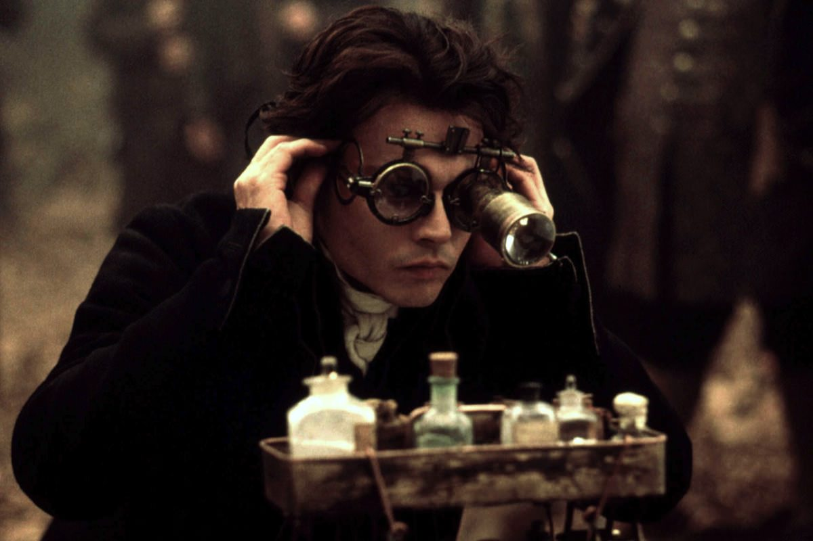
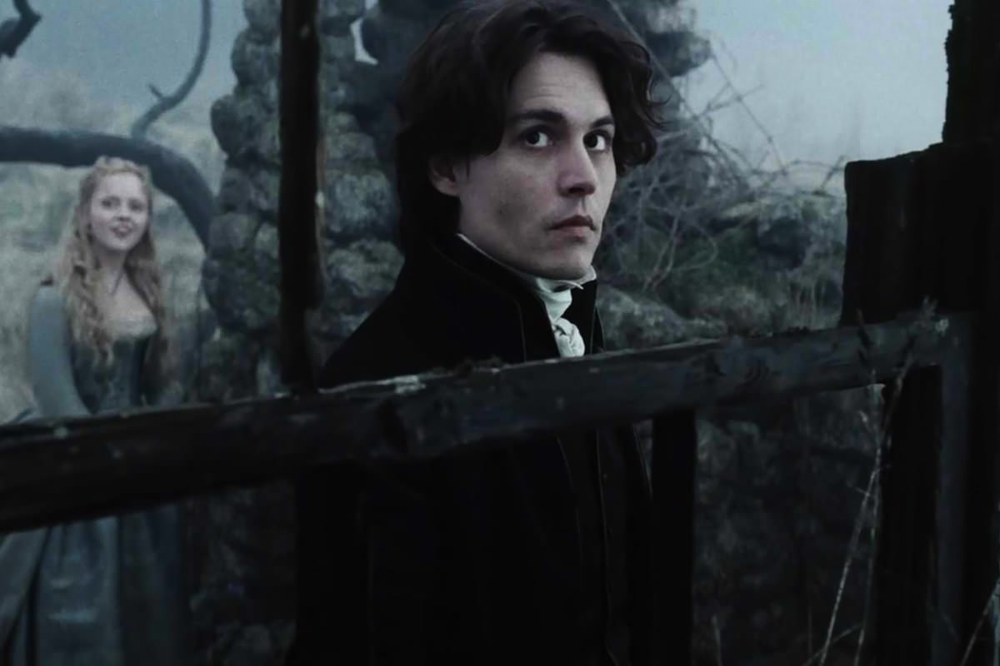

+++
type = "post"
titre = "<em>Sleepy Hollow, la légende du cavalier sans tête</em>, Tim Burton"
title = "Sleepy Hollow, la légende du cavalier sans tête, Tim Burton"
url = "/sleepy-hollow-legende-cavalier-sans-tete-burton"
date = "2013-01-07T10:36:01"
Lastmod = "2014-02-22T10:12:40"
cover = "sleepy-hollow-burton.jpg"
categorie = [ "À voir" ]
tag = [ "Enquête", "Fantastique", "Gothique", "Histoire", "Horreur", "Mort", "Police", "Société" ]
createur = [ "Tim Burton" ]
acteur = [ "Christina Ricci", "Christopher Walken", "Johnny Depp" ]
annee = [ "1999" ]
weight = 1999
pays = [ "États-Unis" ]
original = "Sleepy Hollow"

+++

La noirceur a toujours été une composante essentielle du cinéma de Tim Burton, mais <em>Sleepy Hollow, la légende du cavalier sans tête</em> est peut-être le plus ouvertement noir de tous ses films. C’est peut-être le seul qui tend aussi ouvertement vers le genre de l’horreur et ce huitième long-métrage est d’ailleurs l’occasion, pour le cinéaste américain, de citer bon nombre de ses références. C’est aussi un film à l’esthétique gothique qui rassemble toutes les obsessions de Tim Burton. Un bon film d’ambiance qui a plutôt bien vieilli, à (re)voir…

États-Unis, à la toute fin du XVIIIe siècle. Ichabod Crane est un jeune inspecteur new-yorkais qui aimerait imposer des méthodes plus modernes pour faire son métier. Mal vu par ses pairs, il est expédié dans un tout petit village perdu de la Nouvelle-Angleterre pour y mener son enquête comme il l’entend. En deux semaines, une demi-douzaine de cadavres a été retrouvée : les corps sont à chaque fois décapités d’un coup net et la tête reste introuvable. Les habitants du village en sont persuadés, un chevalier sans tête vient les hanter et tue le premier quidam qui passait par là. Rationaliste convaincu, Ichabod ne peut croire à cette légende fantastique et il est persuadé que l’un des villageois se cache derrière ce cavalier sans tête. Il commence alors son enquête, mais la légende le rattrape vite…

Tim Burton ouvre son film comme de nombreux films du genre, par un crime. On y voit un homme dans une calèche, de nuit, puis un grand cavalier sur son cheval noir et effectivement sans tête qui décapite le conducteur, puis l’homme dans la calèche. <em>Sleepy Hollow, la légende du cavalier sans tête</em> nous présente ensuite son personnage principal : Ichabod Crane aimerait travailler différemment, mais la police de l’époque ne s’embarrasse pas avec les détails. Un homme trouvé mort dans l’eau ? Il s’est noyé, affaire classée, et l’homme est immédiatement brûlé. L’inspecteur a beau demander à inspecter le corps, ne serait-ce que pour savoir si la mort est survenue avant ou après la noyade, ses collègues ne veulent rien entendre et ses supérieurs qui n’aiment pas ces méthodes, décident de l’envoyer loin de New York. Alors qu’Ichabod représente la modernité, le village de Sleepy Hollow semble tout droit sorti de l’époque médiévale. Tout y est sombre et sale, et tous les habitants sont intimement convaincus que le cavalier est envoyé par le diable pour les tuer tous. Dans un premier temps, Tim Burton fait astucieusement tout pour nous nous mettre du côté de son héros. Comme lui, on se dit que le cavalier sans tête n’est qu’un stratagème astucieux mis en place par l’un des habitants pour une vengeance personnelle, ou par simple goût du meurtre. L’utilisation des instruments, le côté sérieux de l’enquête nous incitent à croire que la résolution sera rationnelle, à l’image du <em>Chien des Baskerville</em> de la saga <em>Sherlock Holmes</em>. Une bonne piste, mais <em>Sleepy Hollow, la légende du cavalier sans tête</em> prend un malin plaisir à brouiller rapidement les cartes et à tendre peu à peu vers le fantastique pur. 

Alors que le spectateur pouvait s’attendre à un film rationnel de bout en bout dans un premier temps, Tim Burton fait surgir assez brutalement le fantastique à un moment donné. Les sorcières semblent trop nombreuses dans <em>Sleepy Hollow, la légende du cavalier sans tête</em> pour ne pas constituer un indice, mais le film finit par nous l’imposer quand on découvre le cavalier sortant d’un arbre qui pisse le sang. L’intrigue change alors du tout au tout et on passe de la recherche rationnelle d’un meurtrier à une quête presque folle de celui qui tire les ficelles. L’enquête s’avère assez fine et on ne révélera pas qui est le coupable, mais Tim Burton a su faire avancer son histoire sans trop en dire et ainsi ménager un certain suspense. Au-delà de son enquête, <em>Sleepy Hollow, la légende du cavalier sans tête</em> est aussi un film sur un personnage et ses difficultés : Ichabod Crane n’est pas l’inspecteur sans peur que l’on imaginait au début, mais un homme craintif et qui manque d’assurance. On comprend au fil du récit que son aversion pour la sorcellerie et le fantastique et son goût au contraire pour la raison ne sont pas du tout un hasard, mais liés à son histoire personnelle. Dès lors, le personnage de Katrina Van Tassel apparaît sous un autre jour : tantôt aide, tantôt suspecte, elle est la sorcière qui pourra peut-être réconcilier Ichabod avec son passé. Sous des apparences de film de genre assez banal, Tim Burton est parvenu à aller plus loin et à enrichir son film avec des personnages plus profonds qu’en apparence.

Le goût de Tim Burton pour les univers gothiques est incontestable et il le prouve avec brio ici encore. <em>Sleepy Hollow, la légende du cavalier sans tête</em> est un modèle dans le genre gothique, tout ici respire le gothique, que ce soit l’architecture ou les personnages. La petite ville de Sleepy Hollow l’est, mais c’est surtout le bois qui la borde qui est extrêmement sombre et cumule tous les clichés du genre. On sent que Tim Burton s’est amusé à créer ces décors et le plaisir est partagé : les amateurs du genre seront certainement aux anges. L’utilisation de vrais décors plutôt que de leurs équivalents numériques qui commencent alors à se développer — les studios de tournage venaient d’être libérés du tournage de <a href="http://voiretmanger.fr/2012/02/12/star-wars-1-menace-fantome-lucas/" title="Star Wars, Épisode I : La Menace fantôme, George Lucas - À voir et à manger"><em>Star Wars, Épisode I : La Menace fantôme</em></a> qui est certainement le premier film à les exploiter aussi intensément — confère au long-métrage une réalisation qui a très bien vieilli. Le cinéaste n’a pas son pareil pour filmer ce genre de décors et <em>Sleepy Hollow, la légende du cavalier sans tête</em> est vraiment plaisant à regarder. Danny Elfmann est fidèle au poste pour enrichir encore ces décors de sa musique et Tim Burton a pioché parmi ses acteurs fétiches, à nouveau. C’est ainsi le fidèle Johnny Depp qui joue le rôle de l’inspecteur et il est ici parfait, avec ses mimiques habituelles, mais une plus grande sobriété qui lui convient mieux. À ses côtés, Christina Ricci interprète une très bonne Katrina, troublante comme il se doit. 

<em>Sleepy Hollow, la légende du cavalier sans tête</em> permet à Tim Burton d’explorer pleinement sa veine noire et surtout son amour pour le gothique et l’horreur. Interdit aux moins de 12 ans à sa sortie, le film s’avère effectivement visuellement assez impressionnant, preuve de sa réussite. Plus que l’intrigue policière elle-même, on retiendra ces images sombres du village et surtout de la forêt qui atteint une forme de perfection dans le genre. 

<h3>Vous voulez m&rsquo;aider ?<a href="#footnote_0_8266" id="identifier_0_8266" class="footnote-link footnote-identifier-link" title="&Agrave; propos de la publicit&eacute;&hellip;">1</a></h3>
<ul>
<li><a href="http://www.amazon.fr/gp/product/B002CXG7IC/ref=as_li_ss_tl?ie=UTF8&amp;tag=leblogdenic07-21&amp;linkCode=as2&amp;camp=1642&amp;creative=19458&amp;creativeASIN=B002CXG7IC">Acheter le film en Blu-Ray sur Amazon</a></li>
<li><a href="http://www.amazon.fr/gp/product/B000LXISGE/ref=as_li_ss_tl?ie=UTF8&amp;tag=leblogdenic07-21&amp;linkCode=as2&amp;camp=1642&amp;creative=19458&amp;creativeASIN=B000LXISGE">Acheter le film en DVD sur Amazon</a></li>
<li><a href="https://itunes.apple.com/fr/movie/sleepy-hollow/id505902965">Acheter ou louer le film sur l&rsquo;iTunes Store</a></li>
</ul>

<ol class="footnotes"><li id="footnote_0_8266" class="footnote"><a href="http://voiretmanger.fr/soutien/">À propos de la publicité…</a> [<a href="#identifier_0_8266" class="footnote-link footnote-back-link">&#8617;</a>]</li></ol>
