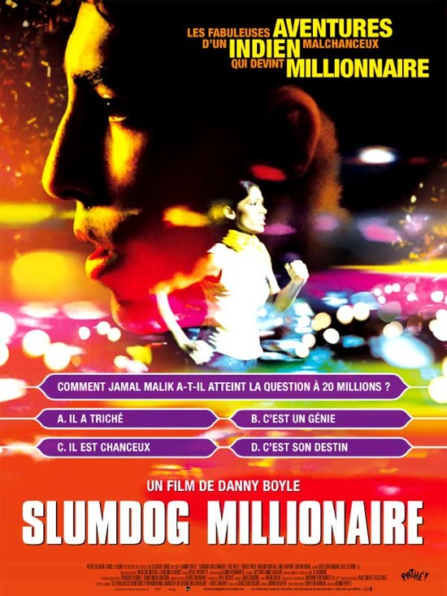

+++
type = "post"
titre = "Mais pourquoi tout le monde aime Slumdog Millionnaire ?"
title = "Mais pourquoi tout le monde aime Slumdog Millionnaire ?"
url = "/slumdog-millionnaire"
date = "2009-02-24T22:39:43"
Lastmod = "2013-03-31T23:11:58"
cover = "slumdog-millionaire-danny-boyle.jpg"
categorie = [ "À voir" ]
tag = [ "Bollywood", "Coup de gueule", "Oscars", "Vite oublié" ]
createur = [ "Danny Boyle" ]
acteur = [ "Anil Kapoor", "Dev Patel", "Freida Pinto" ]
annee = [ "2009" ]
weight = 2009
pays = [ "États-Unis" ]

+++

Alors que <em>Slumdog Millionnaire</em> de Danny Boyle a raflé la mise aux oscars, il devenait urgent<a href="#footnote_0_1235" id="identifier_0_1235" class="footnote-link footnote-identifier-link" title="Oui, je sais, ou pas&hellip;">1</a> d&rsquo;en dire tout le mal que j&rsquo;en pense. Et de m&rsquo;interroger par la même occasion : pourquoi <a href="http://www.allocine.fr/film/critiquepublic_gen_cfilm=129924.html">tout le monde aime</a> cet ersatz de Bollywood mâtiné de cinéma à l&rsquo;occidental sur le thème du &laquo;&nbsp;De la réussite du petit de ce monde&nbsp;&raquo; ou alors &laquo;&nbsp;Des apprentissages de la vie et des conséquences possibles de ceux-ci sur la réussite sociale&nbsp;&raquo; ?

Soit un garçon des bidonvilles de Mumbai qui gagne au &laquo;&nbsp;<em>Qui veut gagner des millions ?</em>&nbsp;&raquo; et devient brusquement multimillionnaire. Soit des autorités méfiantes face à cette étonnante réussite pour un &laquo;&nbsp;<em>slumdog</em>&laquo;&nbsp;, littéralement un chien des bidonvilles<a href="#footnote_1_1235" id="identifier_1_1235" class="footnote-link footnote-identifier-link" title="Tu m&rsquo;&eacute;tonnes que les Indiens n&rsquo;aient pas tellement appr&eacute;ci&eacute;&hellip;">2</a>. Les forces de l&rsquo;ordre interrogent donc ce jeune homme pour déterminer s&rsquo;il est juste chanceux ou guidé par une voix divine, ou s&rsquo;il a triché.

Tout le film est entièrement basé sur un seul principe : les policiers demandent au héros comment il savait la réponse à une question ; en guise de réponse, un flash-back présente l&rsquo;explication. À chaque fois, donc, la réponse se logeait dans un élément de sa vie ; le plus souvent il est tombé dessus par hasard. Et, par une chance finalement assez inouïe (comme les choses sont bien faites), il a vécu exactement ce qu&rsquo;il fallait pour avoir toutes les réponses à toutes les questions.

<em>Slumdog Millionnaire</em> est issu d&rsquo;un roman d&rsquo;où vient aussi ce principe systématique de la réponse à chercher dans le passé. Je ne sais pas ce qu&rsquo;il en est dans le livre, mais dans le film, cela ne marche pas du tout. Je ne suis jamais un grand fan des flash-back, qui sont le plus souvent téléphonés, mal intégrés au présent et qui font un peu passage obligé du cinéma. Dès le premier, ça ne rate pas, l&rsquo;effet téléphoné survient et le ridicule avec. Malheureusement, ça n&rsquo;était que le premier d&rsquo;une longue série qui va conduire, les épisodes mis bout à bout, à obtenir la vie complète du jeune héros.

Cette dernière n&rsquo;est pas plus une réussite. Il a tout vu et tout vécu selon le principe bien connu (ne serait-ce que Picaro) et l&rsquo;opposition avec son frère permet de mettre en valeur que lui est bon, alors que l&rsquo;autre est méchant (même si tout le monde a droit à la rédemption, bien sûr&#8230;). Le petit garçon qui l&rsquo;interprète jeune est là pour que l&rsquo;on se dise (oh qu&rsquo;il est mignon) et satisfait ce rôle. Tout le monde il est content dans le bidonville, jusqu&rsquo;à un obscur massacre religieux (le film reste discret) qui conduit à la mort de la mère et la fuite des deux jeunes vers des centaines d&rsquo;aventures diverses.

Et évidemment, il y a une fille. Vous imaginez bien que notre gentil héros n&rsquo;allait pas jouer à &laquo;&nbsp;<em>Qui veut gagner des millions ?</em>&nbsp;&raquo; pour l&rsquo;argent ? Mais non, c&rsquo;est uniquement par amour pour sa belle, pour se faire remarquer d&rsquo;elle (oui, notre héros est non seulement gentil, mais aussi idiot, ou naïf selon les points de vue). Bon, je casse immédiatement le suspense (si tant est qu&rsquo;il y eût un suspense), ça marche.

La subtilité est un élément inconnu dans ce film, ni par le scénario, ni par la réalisation. L&rsquo;image est constamment saturée de couleurs, sans doute pour la faire correspondre à l&rsquo;imaginaire collectif concernant l&rsquo;Inde, fortement lié à l&rsquo;image de Bollywood. Le bidonville ressemble à l&rsquo;archétype de tout bidonville avec force détails sales pour &laquo;&nbsp;faire vrai&nbsp;&raquo; comme les fameuses toilettes extérieures (la cabane au fond du jardin de l&rsquo;oncle Francis, mais en moins poétique). Non seulement l&rsquo;image est saturée de couleurs et détails plus vrais que nature, mais en plus le film est mené tambour battant avec une musique tonitruante et assez désagréable. J&rsquo;aime bien la musique dans les films, mais elle est ici si forte que l&rsquo;on n&rsquo;entend plus qu&rsquo;elle et cela en devient assez désagréable. Il est vrai que les gamins n&rsquo;ont pas grand-chose d&rsquo;intéressant à dire ou faire : ils se contentent de crier et de courir.

On pouvait s&rsquo;en douter, la subtilité des personnages n&rsquo;est pas plus présente. Il y a deux catégories, les gentils (les deux héros, en gros) et les méchants (le reste) même si, attention ça se complique, certains sont d&rsquo;abord méchants puis deviennent gentils (le frère) voire sont un peu entre les deux (l&rsquo;animateur). Enfin globalement, on comprend vite qui fait quoi et comme on connaît la fin avant le début du film (franchement, vous attendriez autre chose qu&rsquo;un <em>happy-end</em> ?), on repassera pour la finesse psychologique.

Bon, je ne vais pas m&rsquo;étendre encore plus sur ce film. À dire vrai, je n&rsquo;avais pas passé un si mauvais moment que ça en salle, même si tous les éléments signalés précédemment m&rsquo;avaient, déjà, un peu exaspéré, une nouvelle preuve, sans doute, de mon incompatibilité bollywwodienne&#8230; Je trouve ce film très moyen, facile, d&rsquo;un intérêt limité et à l&rsquo;arrière-plan idéologique douteux (encore une fois, les protestations des vrais Indiens depuis la sortie du film ne me semblent pas anodines).

Alors rafler les Oscars comme ça (meilleur film, meilleur réalisateur, meilleur scénario, meilleur son, meilleures chanson et musique), non, je ne comprends pas. En même temps, si les Oscars récompensaient vraiment les meilleurs de chaque catégorie, ça se saurait depuis longtemps. Peut-être, même, faudrait-il y voir une confirmation de ce que j&rsquo;en pensais&#8230;

Pour mon plus grand désespoir (ou pas), je suis tout à fait d&rsquo;accord avec cet article des <em><a href="http://www.lesinrocks.com/cine/cinema-article/article/larnaque-slumdog-millionaire/">Inrockuptibles</a></em>. Au mieux, ce serait un téléfilm sympathoche, pas plus. Et fallait-il le préciser ?, <a href="http://www.critikat.com/Slumdog-Millionaire.html">Critikat</a> est d&rsquo;accord avec moi (ou vice-versa) : la critique, dans le genre assassinat d&rsquo;un film en quelques lignes, vaut d&rsquo;ailleurs le détour.

<h3>Vous voulez m&rsquo;aider ?<a href="#footnote_2_1235" id="identifier_2_1235" class="footnote-link footnote-identifier-link" title="&Agrave; propos de la publicit&eacute;&hellip;">3</a></h3>
<ul>
<li><a href="http://www.amazon.fr/gp/product/B003T0M60K/ref=as_li_ss_tl?ie=UTF8&tag=leblogdenic07-21&linkCode=as2&camp=1642&creative=19458&creativeASIN=B003T0M60K">Acheter le film en Blu-Ray sur Amazon</a></li>
<li><a href="http://www.amazon.fr/gp/product/B0025UAFVC/ref=as_li_ss_tl?ie=UTF8&tag=leblogdenic07-21&linkCode=as2&camp=1642&creative=19458&creativeASIN=B0025UAFVC">Acheter le film en DVD sur Amazon</a></li>
<li><a href="https://itunes.apple.com/fr/movie/slumdog-millionaire/id384592895">Acheter ou louer le film sur l&rsquo;iTunes Store</a></li>
</ul>

<ol class="footnotes"><li id="footnote_0_1235" class="footnote">Oui, je sais, ou pas&#8230; [<a href="#identifier_0_1235" class="footnote-link footnote-back-link">&#8617;</a>]</li><li id="footnote_1_1235" class="footnote">Tu m&rsquo;étonnes que les Indiens n’aient pas tellement apprécié&#8230; [<a href="#identifier_1_1235" class="footnote-link footnote-back-link">&#8617;</a>]</li><li id="footnote_2_1235" class="footnote"><a href="http://voiretmanger.fr/soutien/">À propos de la publicité…</a> [<a href="#identifier_2_1235" class="footnote-link footnote-back-link">&#8617;</a>]</li></ol>
