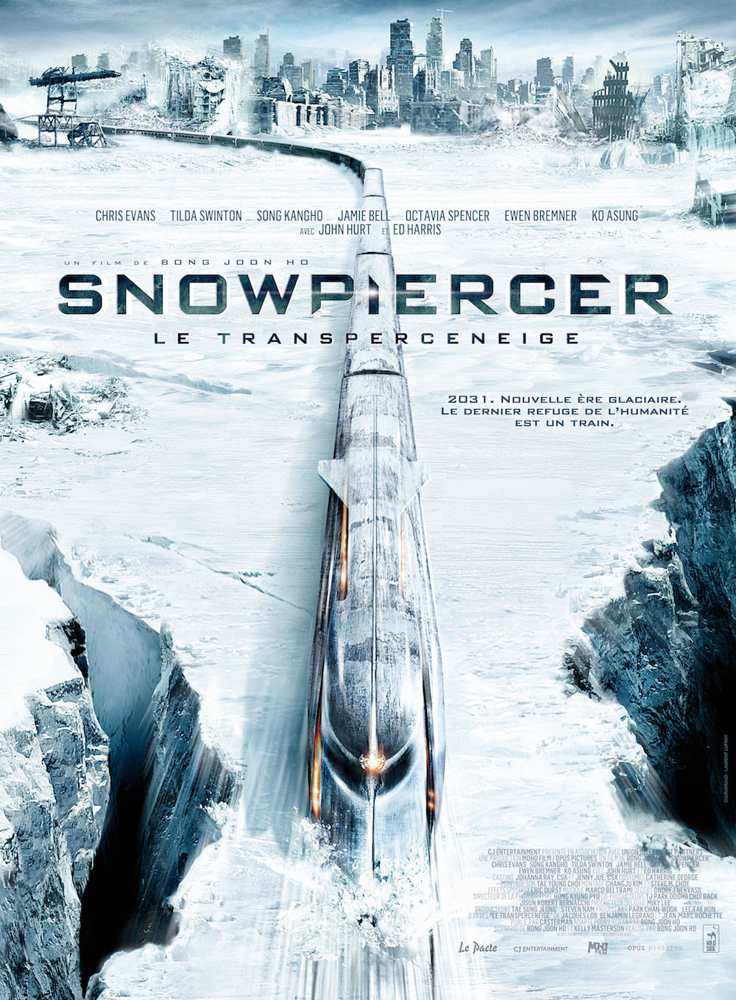
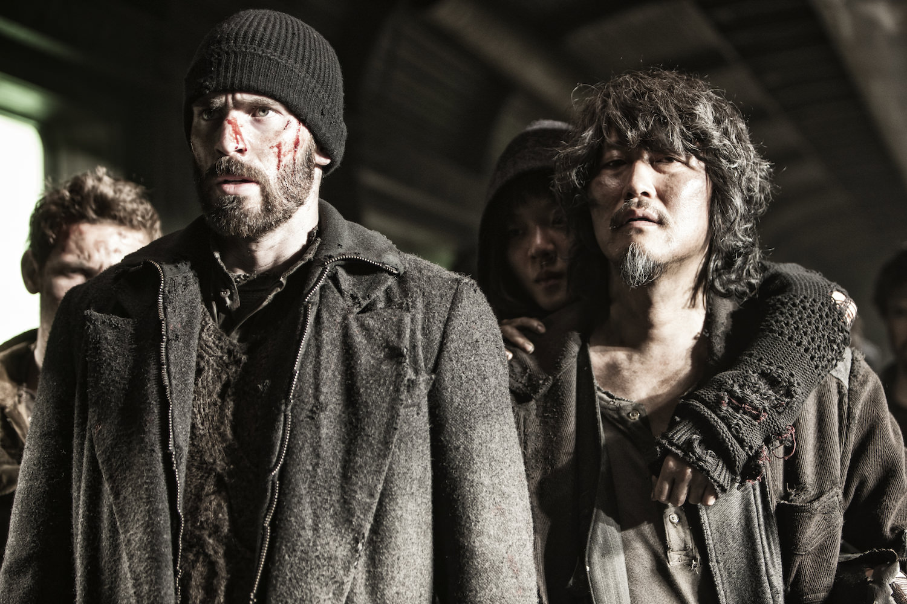
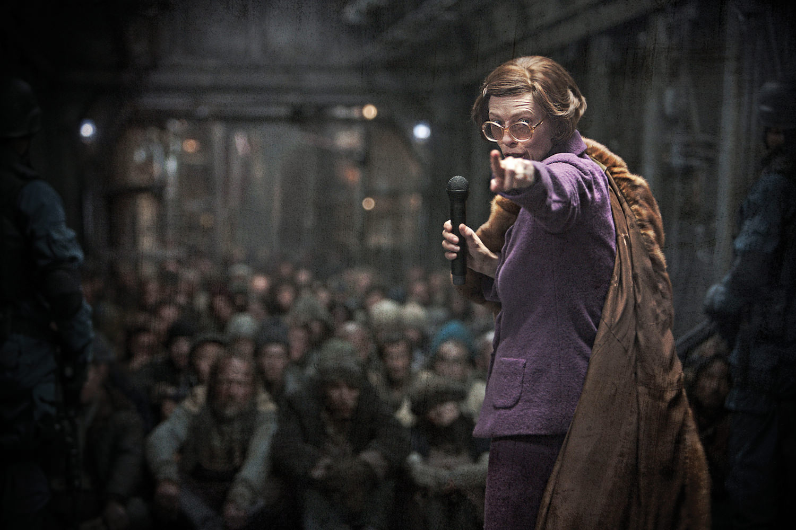

+++
type = "post"
titre = "<em>Snowpiercer, Le Transperceneige</em>, Bong Joon-ho"
title = "Snowpiercer, Le Transperceneige, Bong Joon-ho"
url = "/snowpiercer-transperceneige-bong"
date = "2013-11-05T23:51:39"
Lastmod = "2015-06-09T22:56:31"
cover = "snowpiercer-transperceneige-chris-evans.jpg"
categorie = [ "À voir" ]
tag = [ "Adaptation bande-dessinée", "Blockbuster", "Drame", "Dystopie", "Écologie", "Huis clos", "Science-Fiction", "Société", "Train" ]
createur = [ "Bong Joon-ho" ]
acteur = [ "Chris Evans", "Ed Harris", "Jamie Bell", "John Hurt", "Song Kang-Ho", "Tilda Swinton" ]
annee = [ "2013" ]
weight = 2013
pays = [ "Corée du Sud" ]
original = "Snowpiercer"

+++

Inspiré par une <a href="/transperceneige-lob-rochette-legrand/">bande dessinée française</a>, le dernier film du Coréen Bong Joon-ho part d’un postulat très original. L’humanité a créé elle-même une nouvelle ère glaciaire qui rend toute vie impossible sur la planète. Seul un train conçu spécifiquement pour rouler sans s’arrêter autour de la Terre protège la poignée de derniers survivants. <em>Snowpiercer, Le Transperceneige</em>[^1] est construit autour de cette idée extrêmement originale et le long-métrage est, à bien des égards, une prouesse technique éprouvante. Bong Joon-ho ne quitte jamais son train, dans un huis clos extrêmement efficace. Loin de se perdre avec ce blockbuster international — stars américaines et langue anglaise au programme —, le cinéaste impose sa marque et propose une expérience cinéma particulièrement réussie. À ne pas rater, de préférence sur grand écran pour en profiter au maximum. 

La bande dessinée de Jacques Lob et Jean-Marc Rochette qui a inspiré le film ne donnait aucune explication sur les origines de la catastrophe qui réduit l’humanité entière à un seul train en perpétuel mouvement. <em>Snowpiercer, Le Transperceneige</em> en dit plus et le film commence sur une petite séquence d’explications, sans images, mais avec des extraits de journaux qui résument la situation. Surfant sur le réchauffement climatique, le scénario imagine un point de départ plutôt malin où les hommes inventent un produit miraculeux qui doit rafraichir l’atmosphère et revenir à des températures raisonnables. L’effet sera bien trop efficace, puisque ce produit diminue les températures bien au-delà du raisonnable. Le dérapage a lieu en 2014, quasiment dans notre présent en somme, mais l’action se déroule une quinzaine d’années après. Bong Joon-ho nous plonge dans un train où l’humanité s’est organisée rapidement en classes très fermées. En tête du train, derrière la locomotive, les classes dirigeantes vivent dans l’opulence : ils cultivent leurs légumes, font grandir animaux et poissons pour se nourrir normalement et ils jouissent de tous les plaisirs de la vie ; bref, ils mènent une vie quasiment normale, même s’ils sont enfermés en permanence. Plus on s’éloigne de la tête et que l’on approche de la queue du train, plus on descend l’échelle sociale jusqu’à la fin, où s’entassent tous ceux qui n’ont pas payé leur billet et qui survivent du mieux qu’ils peuvent, entassés dans la crasse. Cette organisation sociale horizontale est la grande originale du récit et <em>Snowpiercer, Le Transperceneige</em> la gère parfaitement bien. Le long-métrage se concentre, comme la bande dessinée, sur la progression d’un homme dans le train, de la queue vers la tête. Les décors créés pour le film, parfois en taille réelle, sont d’excellente qualité et ils contribuent incontestablement à la réussite de l’ensemble. Le cinéaste a mis en place un univers réaliste et très sombre qui fonctionne vraiment bien. Sur le plan technique, le film est d’ailleurs irréprochable, avec une photographie terne très réussie et des scènes de bataille d’une intensité rare.

Pendant légèrement plus de deux heures, <em>Snowpiercer, Le Transperceneige</em> nous emporte au cœur d’un lutte à mort entre deux castes que tout oppose. Dans un premier temps, Bong Joon-ho présente en quelques plans la situation en queue du train, l’oppression totale d’une population déjà écrasée par la misère, mais aussi les conditions difficiles imposées par ce train en mouvement qui n’est pas des plus confortables aussi loin de la locomotive. Sans donner dans le misérabilisme, il faut reconnaître que la présentation est redoutable d’efficacité et le cinéaste parvient rapidement à poser le décor. L’irruption brutale du pouvoir est représentée avec beaucoup de force par l’intervention absurde et en même temps terrifiante de Mason. Cette femme que l’on imagine puissante dans le train vient donner un discours totalement absurde pour expliquer aux hommes et aux femmes de la queue qu’ils doivent rester à leur place et assurer leur rôle de chaussure. Le cynisme de ses propos est glaçant et il faut saluer ici la performance remarquable de Tilda Swinton. <em>Snowpiercer, Le Transperceneige</em> propose une vision du futur qui fait froid dans le dos et on n’avait pas vu de dystopie aussi noire depuis longtemps. Le cinéaste coréen l’exploite très bien et son personnage de révolté, Curtis, est également une réussite. Incarné par un Chris Evans étonnant — il ne pourrait être plus éloigné de <a href="/captain-america-first-avenger-johnston/">son rôle de superhéros</a> —, ce Curtis est un personnage complexe, à la fois prêt à exploser après 15 ans d’enfermement et de contraintes, mais posé et réfléchi, à la fois chaleureux et prêt à tout pour aider les siens, mais aussi déterminé, quitte à sacrifier un proche. Bong Joon-ho réussit à proposer un spectacle extrêmement prenant jusqu’au bout, même si la fin, que l’on ne dévoilera pas, n’est pas le meilleur élément du long-métrage. Comme pour le début, les scénaristes ont imaginé une version très différente de l’œuvre originale qui ne disait pas grand-chose et rien de bien positif. Même si cette fin est peut-être un peu plus faible, l’impression générale n’en reste pas moins très positive et on sort encore sous le choc de cette expérience de cinéma très originale. Les amateurs de la bande dessinée seront peut-être déçus du peu d&rsquo;élément conservé — il n&rsquo;est pas question de révolte collective chez Lob et Rochette, mais d&rsquo;un parcours individuel —, mais le cinéaste n&rsquo;avait sans doute pas le choix pour tenir son film jusqu&rsquo;au bout et les changements effectués sont convaincants.

<em>Snowpiercer, Le Transperceneige</em> s’apparente d’abord à un pari un peu fou : faire tenir un film dans un seul train. Bong Joon-ho a su exploiter au mieux son huis clos pour proposer un long-métrage prenant de bout en bout. On apprécie l’originalité radicale de l’idée de départ, mais aussi ce qu’en ont fait les scénaristes. Le spectacle est indéniablement au rendez-vous, le projet tient la route et le résultat est d’une intensité et d’une noirceur rares. Une très belle réussite, à ne pas rater…

<h3>Vous voulez <a href="/soutien/">m&rsquo;aider</a> ?</h3>
<ul>
<li><a href="http://www.amazon.fr/gp/product/B00GOZSMIC/ref=as_li_ss_tl?ie=UTF8&amp;tag=leblogdenic07-21&amp;linkCode=as2&amp;camp=1642&amp;creative=19458&amp;creativeASIN=B00GOZSMIC">Acheter le film en Blu-ray sur Amazon</a></li>
<li><a href="http://www.amazon.fr/gp/product/B00GOZSLQK/ref=as_li_ss_tl?ie=UTF8&amp;tag=leblogdenic07-21&amp;linkCode=as2&amp;camp=1642&amp;creative=19458&amp;creativeASIN=B00GOZSLQK">Acheter le film en DVD sur Amazon</a></li>
<li><a href="https://itunes.apple.com/fr/movie/snowpiercer-vost/id816471887">Acheter ou louer le film sur l&rsquo;iTunes Store</a></li>
</ul>

