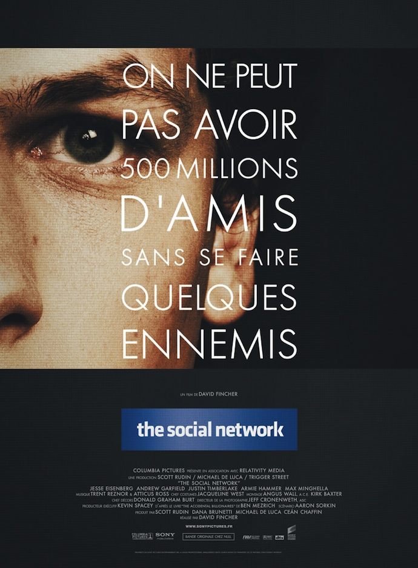
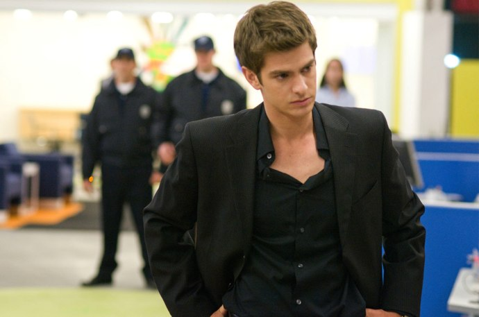

+++
titre = "<em>The Social Network</em>, David Fincher"
title = "The Social Network, David Fincher"
url = "/social-network-fincher"
date = "2010-10-12T11:27:56"
Lastmod = "2013-08-22T00:23:42"
cover = "the-social-network-david-fincher.jpg"
categorie = [ "À voir" ]
tag = [ "Drame", "Facebook", "Internet", "Société" ]
createur = [ "David Fincher" ]
acteur = [ "Andrew Garfield", "Jesse Eisenberg", "Justin Timberlake" ]
annee = [ "2010" ]
weight = 2010
pays = [ "États-Unis" ]

+++

Facebook, phénomène planétaire tellement énorme que l&rsquo;on peut sans crainte le classer comme événement historique majeur. Plus de 500 millions de personnes à travers le monde rassemblées, au moins potentiellement, sur un même site. Le plus époustouflant est certainement son histoire : né des mains d&rsquo;un génie en informatique de l&rsquo;université de Harvard, le site est rapidement devenu gigantesque et échappant à tout contrôle. L&rsquo;histoire de Mark Zuckerberg, créateur de thefacebook.com qui deviendra ensuite Facebook tout court, est un sujet extrêmement intéressant. Le récit de celui qui est aujourd&rsquo;hui le plus jeune milliardaire au monde est hautement romanesque et il n&rsquo;est pas étonnant qu&rsquo;il ait droit aujourd&rsquo;hui à un premier film. Mais si c&rsquo;est un sujet passionnant, c&rsquo;est aussi un sujet très dangereux. Plusieurs films récents l&rsquo;ont prouvé, cinéma et Internet font rarement bon ménage, le septième art peinant à rendre de manière réalise un univers virtuel. David Fincher a su éviter les pièges tendus par son sujet en se concentrant sur les hommes. <em>The Social Network</em> n&rsquo;est pas l&rsquo;histoire de Facebook, c&rsquo;est l&rsquo;histoire de Mark Zuckerberg, ce jeune nerd connu de tous, mais aussi totalement solitaire. Un thème certes classique, mais diablement efficace et qui permet au film d&rsquo;éviter les clichés attendus. Un très bon film en somme, à ne pas rater, même si (surtout ?) vous détestez Facebook…

<em>The Social Network</em> commence sans grande originalité, mais aussi très logiquement, aux origines de Facebook. Et les origines, c&rsquo;est d&rsquo;abord une idée un peu bête née de l&rsquo;esprit bouillonnant du jeune Mark Zuckerberg. Alors que ce dernier vient de s&rsquo;être fait plaquer par sa copine, il se venge sur son blog en déversant tout son fiel, puis en cherchant une occupation pour détourner son esprit de la jeune fille. Une idée lui vient alors : et s’il ouvrait un site permettant de comparer les filles du campus, et de choisir la meilleure ? Un peu saoul, il code le site en une poignée d&rsquo;heures et le met en ligne au cœur de la nuit. <a href="http://en.wikipedia.org/wiki/History_of_Facebook#Facemash">Facemash.com</a> connaît un succès immédiat, à tel point que les serveurs d&rsquo;Harvard explosent et le site ferme rapidement. Ce coup d&rsquo;éclat vaut à Mark autant d&rsquo;amis, souvent des garçons qui ont trouvé l&rsquo;idée géniale, que d&rsquo;ennemis, parmi la gent féminine essentiellement. Trois riches étudiants le repèrent également : ils ont dans l&rsquo;idée de faire un site où les étudiants de Harvard, et seulement eux, pourraient raconter leur vie et se constituer des groupes d&rsquo;amis. Cette idée manquait à Mark pour passer de Facemash, petit site bricolé en une nuit qui lui a valu des ennuis pour avoir piraté les serveurs de l&rsquo;université, à Facebook,  site multimillionnaire. Acceptant de travailler avec ces étudiants, il buche en fait de son côté à son propre site. Les premiers moyens financiers proviennent d&rsquo;Eduardo Saverin, son meilleur ami et en février 2004, thefacebook.com ouvre ses portes.

Le succès est aussi rapide que massif. Très rapidement, toute l&rsquo;université de Harvard est sur ce site et son concepteur entreprend alors son expansion. Le réseau social reste longtemps universitaire et Mark Zuckerberg l&rsquo;ouvre aux plus grandes universités américaines, puis à toutes les universités, lance une version anglaise avant, en septembre 2006, de l&rsquo;ouvrir à tous les Internautes. Ce succès énorme ne s&rsquo;est pas fait sans heurt et très vite ce petit nerd qui s&rsquo;était illustré en piratant les ordinateurs de Harvard devient un gars dangereux. Le film entremêle plusieurs couches temporelles puisqu&rsquo;il se déroule au moment de deux procès, le premier entre Mark Zuckerberg et les étudiants qui voulaient l&rsquo;embaucher pour créer leur réseau social pour vol d&rsquo;idées, le second entre Mark et Eduardo, ce dernier ayant été évincé par le premier de Facebook en réduisant ses parts de 30 % à 0,03 %. Deux procès qui en disent long à la fois sur le succès incontrôlable du site, les rancœurs qui se sont créées autour de ce succès, mais aussi sur Mark, un vrai petit con quand il le veut. Ces procès mettent également bien en valeur la richesse incroyable que le site et son créateur obtiennent en un rien de temps. Commencé avec 19 000 $, Facebook brasse rapidement des millions après avoir été <a href="http://en.wikipedia.org/wiki/History_of_Facebook#Financials">financé</a> par quelques organismes à hauteur de plusieurs dizaines de millions de dollars. Pourtant, Mark refuse de monétiser le site et d&rsquo;y mettre de la pub, nœud du conflit avec son ancien ami et associé Eduardo. <em>The Social Network</em> n&rsquo;est pas très bavard sur le sujet, ce qui est dommage (mais sans doute manque-t-on encore d&rsquo;informations), mais on se demande bien comment l&rsquo;idée d&rsquo;utiliser les informations énormes détenues par le site à des fins commerciales a émergé. Finalement, la fortune de Facebook est énorme, mais reste en grande partie virtuelle. Suffisante, en tout cas, pour payer les millions de dollars <a href="http://en.wikipedia.org/wiki/Cameron_Winklevoss#Facebook_lawsuits">demandés</a> par ses adversaires.

<em>The Social Network</em> n&rsquo;est pas un film de geek sur des geeks enfermés devant leur ordinateur. Il y en a bien, certes, à commencer par un Mark Zuckerberg incapable d&rsquo;oublier une seule seconde son site et capable au contraire de tout quitter et courir dans la neige jusqu&rsquo;à son ordinateur s&rsquo;il a une idée. Mais David Fincher prend soin de l&rsquo;entourer d&rsquo;un contexte social riche et convaincant, en l&rsquo;occurrence l&rsquo;université de Harvard. Université parmi les plus prestigieuses des États-Unis et même du monde, Harvard est un lieu d&rsquo;élite où des clubs privés abritent tous les futurs grands chefs d&rsquo;entreprise, voire hommes d&rsquo;État. Des clubs où tout étudiant aspire à entrer et c&rsquo;est notamment l&rsquo;ambition première de Mark et certainement sa plus grande déception. <em>The Social Network</em> évoque les soirées VIP que ces clubs organisent et où l&rsquo;alcool, les filles et sans doute la drogue circulent à volonté. Il évoque aussi les bizutages organisés pour décider de qui entre ou qui reste à l&rsquo;extérieur. Mais surtout, le film montre très bien en quoi Facebook a répondu à une attente de la part de ces jeunes pour qui tout passe par le réseau, les amis, les clubs. Comme le comprend très bien Mark Zuckerberg, le succès énorme de son facemash n&rsquo;avait rien à voir avec le principe de comparer deux filles, mais était lié au fait que l&rsquo;on pouvait comparer deux filles que l&rsquo;on connaissait ou que l&rsquo;on pouvait connaître. La mise en relation virtuelle de connaissances réelles, voilà la véritable origine du succès. Ça et aussi le statut sentimental ou sexuel des individus pour tous ceux qui cherchent à partir en chasse.

Décidément très complet, <em>The Social Network</em> rend également bien compte de l&rsquo;émergence d&rsquo;une startup dans l&rsquo;ère de l&rsquo;Internet pour tous et après la <a href="http://fr.wikipedia.org/wiki/Bulle_Internet">bulle Internet</a>, mais avant les polémiques sur la vie privée ou les pédophiles. L&rsquo;heure est à l&rsquo;euphorie et au jackpot pour celui qui a eu l&rsquo;idée avant les autres. Il faut toujours être le premier sur Internet, mais à une époque où tout était encore à inventer, c&rsquo;était sans doute le plus important. Constat cruel, mais vrai : Mark Zuckerberg a créé Facebook, pas ses compétiteurs et le succès est dès lors mérité. Dès le départ, l&rsquo;effet de masse joue à plein : si une université prestigieuse dispose déjà d&rsquo;un réseau social, Facebook est proposé à toutes les universités aux alentours pour que les étudiants de l&rsquo;université en question finissent par s&rsquo;y inscrire. Cette expansion rapide dépasse largement son concepteur et ses associés : il déménage en Californie, loue une maison, embauche des stagiaires, reçoit finalement des investissements énormes… Tout va vite, très vite même puisque le film se déroule quasiment uniquement sur l&rsquo;année 2004. En quelques mois à peine, thefacebook.com, petit site de Harvard est devenu facebook.com, avec un million de membres. David Fincher s&rsquo;attache à décrire l&rsquo;ambiance de cet univers totalement irréel où des jeunes à peine sortis de l&rsquo;adolescence se retrouvent à la tête de projets et de sommes immenses et sont un peu déstabilisés par ce succès. Les déviances sont nombreuses, la drogue circule un peu trop et les premiers clashs apparaissent vite.

Si <em>The Social Network</em> est une réussite, c&rsquo;est d&rsquo;abord parce que David Fincher s&rsquo;est concentré sur l&rsquo;humain. Facebook est d&rsquo;abord une aventure humaine et ses raisons profondes sont à rechercher en premier lieu chez Mark Zuckerberg. Le réalisateur pose une hypothèse qui, à défaut d&rsquo;être vérifiable, est plutôt satisfaisante. Le film ouvre sur une discussion au bar entre Mark et sa copine du moment. On comprend très vite que Mark est quelqu&rsquo;un d&rsquo;assez sauvage, très direct, incapable de quitter une idée quand il en a une en tête et capable de suivre deux conversations à la fois. Son obsession, on l&rsquo;a dit, est d&rsquo;entrer dans un des prestigieux clubs de Harvard et il traite avec un brin de condescendance même pas dissimulé sa copine qui est dans une université plus banale. Quand cette fille le quitte, il entre dans une colère froide qui, combinée à l&rsquo;alcool, le conduit à créer Facemash. Ensuite, c&rsquo;est sa rencontre avec les deux membres d&rsquo;un club très haut classé et issus d&rsquo;une grande et riche famille qui lui donne l&rsquo;idée de Facebook. Fincher choisit, intelligemment, de laisser une part de doute : il suggère des hypothèses, mais n&rsquo;en impose jamais aux spectateurs. Ainsi, le conflit entre Eduardo et Mark s&rsquo;explique sans doute par le fait que le premier a été sélectionné pour entrer dans un de ces clubs privés de Harvard, rêve du second qui se serait vengé en virant son ami. C&rsquo;est une hypothèse, mais on peut aussi comprendre que Sean Parker, fondateur de Napster qui devient numéro deux de Facebook, a évincé son concurrent. Toujours est-il que l&rsquo;humain est au cœur du film et c&rsquo;est ça qui fait son intérêt. Les problèmes techniques de Facebook n&rsquo;avaient vraiment aucun intérêt, alors que les conflits entre Mark et Eduardo, ou les raisons profondes qui ont poussé le petit génie asocial à fonder l&rsquo;un des plus gros sites du monde fournissent des sujets passionnants pour un film qui l&rsquo;est tout autant. Fincher exploite aussi l&rsquo;idée convenue, mais fort efficace, du gars aussi populaire que solitaire, sans en faire des tonnes. L&rsquo;image qui clôt le film suffit à tout dire : Mark, le soir après une journée d&rsquo;audition dans le conflit qui l&rsquo;oppose à son ancien meilleur ami, demande la fille qui l&rsquo;a quitté en début de film comme amie. Il recharge la page sans fin, mais le statut reste sur « En attente »…

<em>The Social Network</em> avait besoin d&rsquo;acteurs à la hauteur pour rendre son histoire attachante et crédible et David Fincher a fait de bons choix. Jesse Eisenberg, déjà repéré dans <em><a href="http://voiretmanger.fr/2009/11/28/bienvenue-a-zombieland-fleischer/">Bienvenue à Zombieland</a></em>, compose un excellent Zuckerberg, éternel ado renfermé et misanthrope. Andrew Garfield, croisé dans <em><a href="http://voiretmanger.fr/2009/03/14/boy-a/">Boy A</a></em> ou <em><a href="http://voiretmanger.fr/2010/05/15/red-riding-trilogy-1974-jarrold/">1974</a></em>, confirme son talent d&rsquo;acteur. Mention personnelle spéciale pour Justin Timberlake, que je déteste cordialement comme chanteur, mais que je découvrais comme acteur. Disons-le, il s&rsquo;en tire plutôt bien. Il ne reste plus qu&rsquo;à espérer que l&rsquo;idée absurde de &laquo;&nbsp;chanter&nbsp;&raquo; l&rsquo;a bel et bien quittée. Sur ce film, David Fincher assure une réalisation classique, très bien maîtrisée et sans faille. Le film dure deux heures à un rythme très élevé : il y a très peu de pauses, les personnages parlent très vite (surtout Mark Zuckerberg) et cela pourra en surprendre plus d&rsquo;un. Pourtant, ce rythme intense est plus une force qu&rsquo;une faiblesse je trouve, il permet au film de ne pas s&rsquo;alourdir sur certains aspects et au contraire de gagner en légèreté. Et puis quoi de mieux pour illustrer l&rsquo;effervescence du projet et de cette génération Internet ? La musique originale composée par Trent Reznor (leader de Nine Inch Nails) et Atticus Ross est vraiment excellente et convient parfaitement à un tel film. On peut l&rsquo;<a href="http://nullco.com/TSN/">acheter</a> pour vraiment pas grand-chose (5 $) en version sans perte et l&rsquo;album vaut aussi la peine d&rsquo;être écouté.

La naissance de Facebook, sujet aussi passionnant que dangereux. Force est de constater que David Fincher s&rsquo;en est vraiment bien sorti. Privilégiant les histoires humaines aux problèmes techniques, <em>The Social Network</em> est un film passionnant aussi bien sur le phénomène mondial qu&rsquo;est Facebook, que sur l&rsquo;énigme Zuckerberg. Sujet hautement romanesque que Fincher est le premier à exploiter et il place d&rsquo;emblée la barre assez haute. Enfin un film qui évoque Internet de manière réaliste et censée !

Déluge de critiques positives sur les blogs, chez <a href="http://www.plan-c.fr/article-critique-the-social-network-de-david-fincher-58198299.html">Alexandre</a>, <a href="http://myscreens.fr/2010/cinema/the-social-network-critique/">Fred</a>, <a href="http://nivrae.fr/2010/10/02/critique-cinema-the-social-network/">Nivrae</a>, <a href="http://www.anglesdevue.com/2010/10/11/the-social-network-de-david-fincher/">Boustoune</a> (qui regrette quand même le rythme intense du film) ou encore <a href="http://www.filmosphere.com/2010/10/critique-the-social-network-2010/">Nicolas</a>.

<h3>Vous voulez m&rsquo;aider ?<a href="#footnote_0_4152" id="identifier_0_4152" class="footnote-link footnote-identifier-link" title="&Agrave; propos de la publicit&eacute;&hellip;">1</a></h3>
<ul>
<li><a href="http://www.amazon.fr/gp/product/B005V5XKJM/ref=as_li_ss_tl?ie=UTF8&#038;tag=leblogdenic07-21&#038;linkCode=as2&#038;camp=1642&#038;creative=19458&#038;creativeASIN=B005V5XKJM">Acheter le film en Blu-Ray sur Amazon</a></li>
<li><a href="http://www.amazon.fr/gp/product/B005JS6T8U/ref=as_li_ss_tl?ie=UTF8&#038;tag=leblogdenic07-21&#038;linkCode=as2&#038;camp=1642&#038;creative=19458&#038;creativeASIN=B005JS6T8U">Acheter le film en DVD sur Amazon</a></li>
<li><a href="http://itunes.apple.com/fr/movie/the-social-network/id415748826">Acheter ou louer le film sur l&rsquo;iTunes Store</a></li>
</ul>

<ol class="footnotes"><li id="footnote_0_4152" class="footnote"><a href="http://voiretmanger.fr/soutien/">À propos de la publicité…</a> [<a href="#identifier_0_4152" class="footnote-link footnote-back-link">&#8617;</a>]</li></ol>
