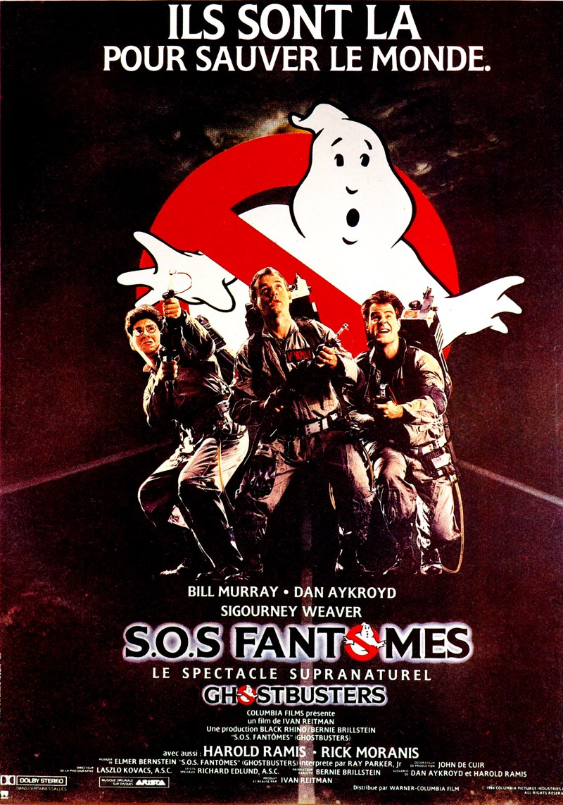
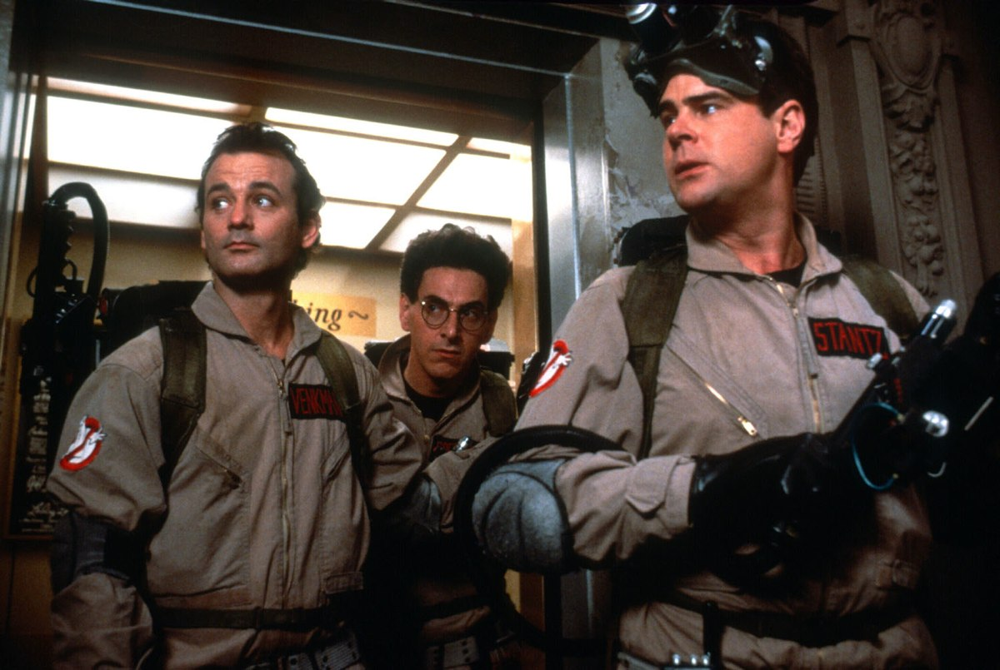

+++
type = "post"
titre = "<em>S.O.S. Fantômes</em>, Ivan Reitman"
title = "S.O.S. Fantômes, Ivan Reitman"
url = "/sos-fantomes-reitman"
date = "2012-05-08T23:27:54"
Lastmod = "2014-01-05T19:30:47"
cover = "sos-fantomes-1984.jpg"
categorie = [ "À voir" ]
tag = [ "Comédie", "Fantastique", "Humour", "Science-Fiction" ]
createur = [ "Ivan Reitman" ]
acteur = [ "Bill Murray", "Dan Aykroyd", "Harold Ramis", "Sigourney Weaver" ]
annee = [ "1984" ]
weight = 1984
pays = [ "États-Unis" ]
original = "Ghostbusters"

+++

Alors que le troisième opus serait, dit-on, toujours en préparation pour une sortie l&rsquo;année prochaine, <em>S.O.S. Fantômes</em> reste aujourd&rsquo;hui encore un film culte qui a marqué les années 1980 par son humour décalé et son ambiance si typique. Et si les effets spéciaux ont, forcément, un peu vieilli, le film d&rsquo;Ivan Reitman est resté plutôt efficace et plaisant à regarder encore aujourd&rsquo;hui. La comédie n&rsquo;y est pas fine, mais elle se regarde avec plaisir…

<em>S.O.S. Fantômes</em> part du postulat qu&rsquo;il existe des fantômes plutôt pénibles dont il faut se débarrasser. Trois scientifiques ont ouvert un bureau d&rsquo;étude paranormale un peu loufoque dans une université. Ils sont censés étudier ces fantômes, mais ce bureau leur sert surtout d&rsquo;excuse pour s&rsquo;amuser ou draguer, selon les cas. Un jour, l&rsquo;université en question les met à la porte et les trois compères ouvrent une entreprise censée capturer les fantômes : Ghostbusters et sa <a href="http://www.youtube.com/watch?v=Oznj6AFeiRE">fameuse chanson</a> sont nés. Dans un premier temps, personne ne prend ces individus un peu ringards au sérieux, mais New York est soudain envahie de fantômes et l&rsquo;équipe est appelée régulièrement à la rescousse. Les succès se multiplient jusqu&rsquo;au jour où un politique un peu zélé libère tous les fantômes emprisonnés jusque-là. L&rsquo;avenir de New York et donc de la planète tout entière est alors en danger, mais heureusement, les Ghosbusters ne sont pas loin…

Le film d&rsquo;Ivan Reitman ne bénéficie pas d&rsquo;un scénario particulièrement fin, on le comprend bien. <em>S.O.S. Fantômes</em> prend son histoire plutôt à la légère et cette histoire de menace sur le monde est plus ridicule qu&rsquo;autre chose. L&rsquo;équipe de chasseurs de fantômes est composée exclusivement d&rsquo;amateurs qui ne savent pas bien ce qu&rsquo;ils font, le scénario du long-métrage n&rsquo;est pas différent. <em>S.O.S. Fantômes</em> est d&rsquo;abord et avant tout une comédie en roue libre et c&rsquo;est bien cela qui fait tout son charme. Les Ghostbusters forment une belle équipe de bras cassés, même si deux sur les quatre membres savent à peu près ce qu&rsquo;ils font. Leur première chasse d&rsquo;un fantôme, dans une salle de réception, en dit long sur leur niveau de compétence : ils apprennent sur le tas, et tant pis si cela génère un peu de casse. L&rsquo;humour nait aussi de leur aspect ridicule : leur première publicité en est un bon exemple, mais c&rsquo;est sans doute leur voiture qui résume le mieux cet aspect. Les méchants ne sont guère mieux toutefois et les effets spéciaux mobilisés d&rsquo;un côté comme de l&rsquo;autre parachèvent le tout. <em>S.O.S. Fantômes</em> n&rsquo;est heureusement pas un film catastrophe, mais plutôt une comédie légère et familiale.

L&rsquo;humour de <em>S.O.S. Fantômes</em> est étonnamment proche de l&rsquo;idée que l&rsquo;on se fait de Bill Murray. Cet excellent comédien trop souvent cantonné aux seconds rôles ouvre sa notoriété avec ce film. Il est ici tout à son aise, à tel point que l&rsquo;on pourrait croire que son rôle a été composé pour lui, ce qui n&rsquo;est pourtant pas du tout le cas. Son regard désabusé, ses intonations composent un personnage vraiment drôle, dans cet esprit pince-sans-rire qu&rsquo;il a entretenu dans la majorité de sa carrière. Autour de lui, les trois autres membres de l&rsquo;équipe sont tout aussi ridicules et on note la présence surprenante de Sigourney Weaver dans un second rôle pas si éloigné de ses participations à la saga <em>Alien</em>. <em>S.O.S. Fantômes</em> c&rsquo;est aussi des effets spéciaux très colorés, trop pour être crédibles, des effets qui contribuent à l&rsquo;ambiance si années 1980 du film. Par moment, Ivan Reitman donne presque l&rsquo;impression troublante de faire dans la parodie de films de ces années-là, ce qui est indéniablement une bonne nouvelle.

Certes, <em>S.O.S. Fantômes</em> a un peu vieilli et le film d&rsquo;Ivan Reitman n&rsquo;est pas le plus intelligent de l&rsquo;histoire du cinéma. Il n&rsquo;est pas devenu culte sans raison toutefois : <em>S.O.S. Fantômes</em> est très efficace, c&rsquo;est une comédie familiale qui se laisse voir et revoir avec un grand plaisir. Difficile de savoir si un troisième opus sortira finalement, encore moins de savoir s&rsquo;il sera réussi, mais on peut tout à fait revoir ce premier film en attendant d&rsquo;en savoir plus… Et surtout, n&rsquo;oubliez pas :

<blockquote>
If there&rsquo;s something strange 
in your neighborhood 
Who ya gonna call ? 
GHOSTBUSTERS
</blockquote>

<h3>Vous voulez m&rsquo;aider ?<a href="#footnote_0_6400" id="identifier_0_6400" class="footnote-link footnote-identifier-link" title="&Agrave; propos de la publicit&eacute;&hellip;">1</a></h3>
<ul>
<li><a href="http://www.amazon.fr/gp/product/B0025UAFMG/ref=as_li_ss_tl?ie=UTF8&amp;tag=leblogdenic07-21&amp;linkCode=as2&amp;camp=1642&amp;creative=19458&amp;creativeASIN=B0025UAFMG">Acheter le film en Blu-Ray sur Amazon</a></li>
<li><a href="http://www.amazon.fr/gp/product/B00008LSS3/ref=as_li_ss_tl?ie=UTF8&amp;tag=leblogdenic07-21&amp;linkCode=as2&amp;camp=1642&amp;creative=19458&amp;creativeASIN=B00008LSS3">Acheter le film en DVD sur Amazon</a></li>
<li><a href="http://itunes.apple.com/fr/movie/s.o.s.-fantomes/id371754461">Acheter ou louer le film sur l&rsquo;iTunes Store</a></li>
</ul>

<ol class="footnotes"><li id="footnote_0_6400" class="footnote"><a href="/a-propos/publicite/">À propos de la publicité…</a> [<a href="#identifier_0_6400" class="footnote-link footnote-back-link">&#8617;</a>]</li></ol>
