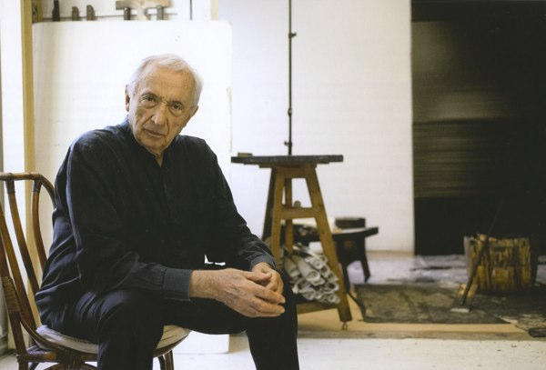
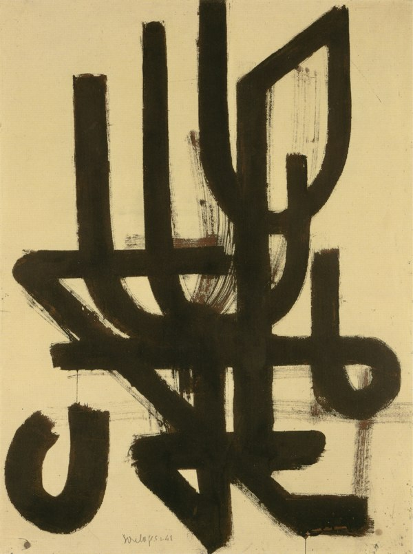
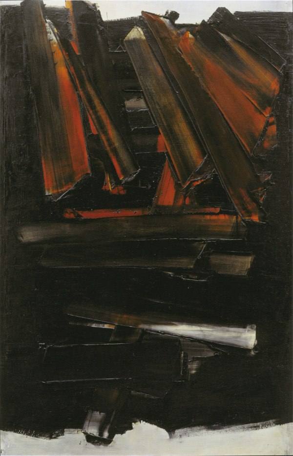
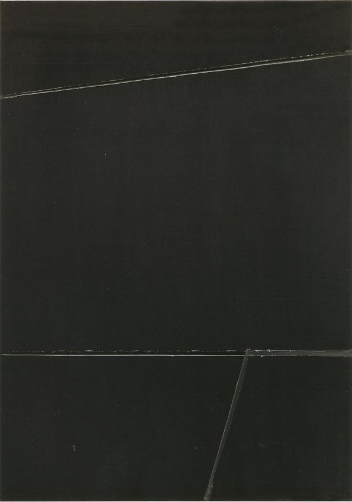
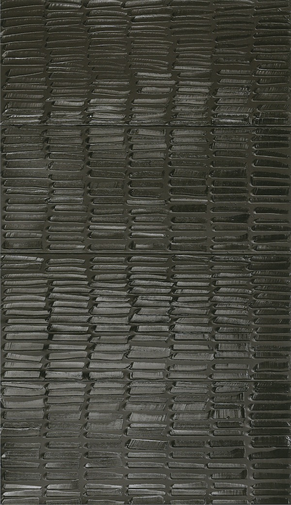

+++
type = "post"
titre = "Soulages à Beaubourg (2009-2010)"
title = "Soulages à Beaubourg (2009-2010)"
url = "/soulages-beaubourg"
date = "2010-01-29T23:48:47"
Lastmod = "2013-09-08T00:23:28"
cover = "pierre-soulages-beaubourg.jpg"
tag = [ "Art", "Beaubourg", "Exposition", "Noir et blanc", "Peinture" ]
annee = [ "2010" ]
weight = 2010
pays = [ "France" ]

+++

Pierre Soulages est sans doute le peintre français contemporain encore vivant le plus connu au monde. Artiste obstiné sur la quête de l&rsquo;outrenoir, il n&rsquo;est néanmoins pas un peintre aussi opaque que sa couleur d&rsquo;adoption, le noir donc, le laisserait supposer. Certes, l&rsquo;art — surtout contemporain — atteint chaque individu différemment, mais le travail de Soulages fascine par cette quête qu&rsquo;il a suivi toute sa vie, et qu&rsquo;il poursuit encore aujourd&rsquo;hui. Plus que pour tout autre artiste peut-être, les toiles de Pierre Soulages se doivent d&rsquo;être vues en vrai, les photographies ne rendant que piètrement justice aux formes mêmes de la matière picturale. C&rsquo;est pourquoi l&rsquo;exposition qui lui est consacrée à Beaubourg jusqu&rsquo;en mars 2010 est à ne rater sous aucun prétexte.

L&rsquo;exposition suit grosso modo un ordre chronologique, des premières œuvres au brou de noix des années 1947/1948 jusqu&rsquo;aux dernières toiles de Pierre Soulages, certaines créations datant de mars 2009. L&rsquo;ordre n&rsquo;est pas scrupuleusement respecté puisque, originalité rendue possible par la présence de l&rsquo;artiste, le peintre s&rsquo;est fortement investi dans l&rsquo;organisation de l&rsquo;exposition. Il est manifestement coutumier de cette volonté de régler ses expositions au millimètre près : une vidéo en fin d&rsquo;exposition le montre ainsi alors qu&rsquo;il organise une exposition qui lui a été consacrée à Montpellier. Il prépare le placement des œuvres sur une maquette, avant de juger en conditions réelles du bien-fondé de ses choix. Les lumières, la hauteur des œuvres… tout est contrôlé par le maître et on comprend vite pourquoi quand on constate à quel point la lumière joue un rôle essentiel dans son travail.

Ce qui est fascinant, c&rsquo;est de constater à quel point Pierre Soulages n&rsquo;a été animé toute sa vie que par un seul objectif que l&rsquo;on peut aisément réduire à l&rsquo;outrenoir. Mais on ne peut le faire qu&rsquo;a<em> posteriori</em> car comme il l&rsquo;exprimait dès 1953, &laquo;&nbsp;<em>C&rsquo;est ce que je fais qui m&rsquo;apprend ce que je cherche</em>&laquo;&nbsp;. Je crois que c&rsquo;est là un jugement à la fois d&rsquo;une grande modestie et très lucide : l&rsquo;art contemporain impose souvent une recherche à l&rsquo;aveugle, une absence de maîtrise qui conduit, parfois, au sublime. Mais si Soulages dit ne jamais savoir ce qu&rsquo;il cherche avant de l&rsquo;avoir trouvé, il n&rsquo;a pas moins une idée fixe derrière la tête depuis la plus tendre enfance. Le catalogue de l&rsquo;exposition nous apprend ainsi de sa plume qu&rsquo;il était fasciné, jeune, par une tâche de goudron sur le sol, par sa texture et par sa faculté à se transformer en coq selon le point de vue que l&rsquo;on avait. Petit, il dessinait déjà des lignes noires abstraites sur des feuilles blanches et expliquait alors qu&rsquo;il voulait &laquo;&nbsp;peindre la neige&nbsp;&raquo;. Autant dire que le petit Pierre n&rsquo;était pas un garçon typique.

<em>Brou de noix sur papier 100 x 75 cm, 1948</em>

Après quelques études artistiques peu concluantes et une guerre qui le mobilise avant de le laisser rapidement tranquille, il se consacre entièrement à la peinture. Ses premières œuvres ne sont pas noires et blanches, mais bien plus d&rsquo;infinies variations autour du brou de noix, une matière marron foncé. Les toiles sur lesquelles il travaille ne sont pas blanches, mais jaunes, si bien que le résultat est assez coloré (exemple ci-dessus<a href="#footnote_0_2546" id="identifier_0_2546" class="footnote-link footnote-identifier-link" title="Tous les titres des &oelig;uvres de Pierre Soulages sont ainsi : type de l&rsquo;&oelig;uvre, puis ses dimensions, et enfin sa date. Aucune cl&eacute; de lecture n&rsquo;est propos&eacute;e par l&rsquo;artiste, fid&egrave;le ainsi &agrave; ses principes sur le r&ocirc;le central du spectateur.">1</a>). Des formes s&rsquo;entremêlent et si l&rsquo;on ne distingue pas d&rsquo;objets en tant que tels, on peut y lire de nombreuses choses, tantôt des lettres, tantôt une croix. Certaines de ces toiles sont vraiment très belles et conservent leur part de mystère, tout en étant beaucoup moins abstraite que par la suite.

Au cours des années, le noir s&rsquo;impose de plus en plus dans l&rsquo;œuvre de Pierre Soulages. Cela se traduit concrètement par la disparition progressive de la couleur de la toile au profit essentiellement du noir. Néanmoins, le changement est progressif et au départ, la couleur combat, en quelque sorte, le noir. On sent vraiment une tension dans les toiles des années 1950 entre un noir toujours plus dominateur, et des couleurs qui tentent de résister. Sur l&rsquo;exemple ci-dessous, on voit bien que le peintre a commencé par appliquer une couche de couleurs, ici dans les rouges orangés, avant de poser une couche épaisse de noir immédiatement et en partie supprimée à l&rsquo;aide d&rsquo;un couteau. Sous le noir paraissent donc de magnifiques couleurs qui se mêlent d&rsquo;ailleurs au noir pour former toute une gamme du rouge au marron. D&rsquo;autres exemples existent, souvent autour du rouge ou de l&rsquo;or, mais aussi en bleu. Ce sont de magnifiques toiles à mon avis, avec de couleurs souvent très belles et très mises en valeur par le noir. Ce sont les premières toiles du peintre qui utilisent concrètement la matière : les couches s&rsquo;épaississent et on commence à repérer des reliefs.

<em>Peinture 202 x 125 cm, 15 décembre 1959</em>

Ce fut au cours des années 1960 que le noir s&rsquo;impose définitivement, d&rsquo;abord mêlé au blanc. Ça n&rsquo;est pas la période qui m&rsquo;a le plus intéressé, même si la disparition progressive du blanc jusqu&rsquo;à la simple tâche dans un coin de la toile est loin d&rsquo;être sans intérêt. Les toiles de cette période m&rsquo;ont semblé néanmoins plus classiques. Pierre Soulages abandonne en tout cas définitivement la couleur et ne peint plus qu&rsquo;en noir. Jusqu&rsquo;à ce jour, il n&rsquo;a plus fait que ça : peindre avec une seule et unique couleur. C&rsquo;est doublement exceptionnel : c&rsquo;est à la fois le peintre qui a le plus peint avec la même couleur et c&rsquo;est aussi le choix du noir, la non-couleur par excellence là où le blanc est au contraire réunion de toutes les autres couleurs. L&rsquo;artiste a dû se justifier de ce choix à de multiples reprises, et sa célèbre réponse ne s&rsquo;est pas fait attendre : &laquo;&nbsp;<em>Pourquoi le noir ? La seule réponse incluant les raisons ignorées, tapies au plus obscur de nous-mêmes et des pouvoirs de la peinture, c&rsquo;est : PARCE QUE.</em>&nbsp;&raquo; (1986)

Cette réponse peut paraître enfantine, stupide, mais elle ne l&rsquo;est pas du tout quand on entre dans la galerie de l&rsquo;outrenoir. Soulages a d&rsquo;ailleurs voulu, pour cette exposition parisienne, que l&rsquo;entrée dans l&rsquo;univers du noir soit clairement identifiée comme telle. On passe ainsi de grandes pièces très lumineuses et hautes de plafond à la suite de l&rsquo;exposition par une petite pièce entièrement noire, excepté son plafond qui est au contraire blanc et très éclairé. Au fond de la pièce, trois toiles sont exposées, non pas au mur, mais accrochées en l&rsquo;air. Trois œuvres des années 1990 et brusquement, on comprend pourquoi Pierre Soulages a créé ce néologisme d&rsquo;outrenoir. Non, ça n&rsquo;est pas une coquetterie de l&rsquo;artiste qui veut laisser une marque. C&rsquo;est qu&rsquo;effectivement, ses toiles sont &laquo;&nbsp;<em>au-delà du noir</em>&nbsp;&raquo;<a href="#footnote_1_2546" id="identifier_1_2546" class="footnote-link footnote-identifier-link" title="&laquo;&nbsp;Outrenoir pour dire : au-del&agrave; du noir une lumi&egrave;re refl&eacute;t&eacute;e, transmut&eacute;e par le noir. Outrenoir : noir qui cessant de l&rsquo;&ecirc;tre devient &eacute;metteur de clart&eacute;, de lumi&egrave;re secr&egrave;te. Outrenoir : nun autre champ mental que celui du simple noir.&nbsp;&raquo; Pierre Soulages">2</a>. Depuis janvier 1979 — c&rsquo;est Pierre Soulages lui-même qui le dit —, toutes ses toiles sont intégralement noires. Et pourtant, cette caractéristique forte s&rsquo;oublie vite, tant les toiles sont d&rsquo;une richesse insoupçonnée. On pourrait passer des heures à se perdre dans certains de ses polyptyques, et contre toute attente, les couleurs sont multiples.

<em>Peinture 222 x 157 cm, 19 février 1991</em>

Avant de continuer à évoquer les dernières œuvres de Pierre Soulages, il convient de signaler que les images montrées ici en guise d&rsquo;exemples ne rendent pas du tout, mais alors vraiment pas justice aux toiles vues en vrai. Le catalogue de l&rsquo;exposition est déjà meilleur, au moins les couleurs sont respectées. Mais de toute manière, le travail de Pierre Soulages avec l&rsquo;outrenoir se fait essentiellement par le relief créé par abstraction d&rsquo;une épaisse couche de peinture. Ces trames en trois dimensions, parfois légères (ci-dessus), parfois au contraire plus marquées (ci-dessous), perdent tout leur sens une fois photographiées. Il faut absolument les voir en vrai si vous en avez l&rsquo;occasion. Il faut d&rsquo;autant plus les voir que Pierre Soulages est certes un &laquo;&nbsp;peintre du noir&nbsp;&raquo;, mais aussi de la lumière.

L&rsquo;outrenoir remet en fait en cause toute la peinture classique. Sa radicalité ne concerne pas tant le choix du monochrome, ni même le choix du noir, mais bien plus que l&rsquo;œuvre ne nait plus de la peinture proprement dite, mais de la lumière. C&rsquo;est en effet la lumière que reflètent les tableaux de Pierre Soulages qui constitue réellement le travail de l&rsquo;artiste. Sa peinture, tantôt mate, tantôt brillante, reflète la lumière par le schéma construit de l&rsquo;accumulation de la matière première (la peinture noire) et surtout de la suppression d&rsquo;une partie de cette matière. Des creux et des bosses se forment ainsi sur tout ou partie de la surface de la toile, et ce sont ces creux ou bosses qui renvoient ou retiennent la lumière vers le spectateur, c&rsquo;est-à-dire créent l&rsquo;œuvre proprement dite. Mais laissons ici s&rsquo;exprimer l&rsquo;artiste et théoricien de sa propre œuvre : &laquo;&nbsp;<em>La lumière venant de la toile vers le regardeur crée un espace devant la toile et le regardeur se trouve dans cet espace : il y a instantanéité de la vision pour chaque point de vue, si on change il y a dissolution de la première vision, effacement, apparition d&rsquo;une autre ; la toile est présente dans l&rsquo;instant où elle est vue, elle n&rsquo;est pas à distance dans le temps.</em>&nbsp;&raquo; (1997) Ce qui intéresse Soulages, ça n&rsquo;est donc pas tant l&rsquo;œuvre en soi telle qu&rsquo;on l&rsquo;a conçu depuis que l&rsquo;artiste existe, mais bien plus l&rsquo;action du regard, du point de vue instantané qui forme l&rsquo;œuvre. On retrouve ici l&rsquo;idée post-moderne bien connue qui nie toute existence en soi : l&rsquo;œuvre n&rsquo;existe que parce quelle est regardée, et elle n&rsquo;existe qu&rsquo;à travers ce regard momentané. On comprend dès lors mieux que Pierre Soulages s&rsquo;investisse tant dans ses expositions : la position d&rsquo;un simple spot lumineux peut changer une œuvre du tout au tout.

<em>Peinture 324 x 181 cm, 19 février 2009</em>

La majeure partie de l&rsquo;exposition est consacrée à la période de l&rsquo;outrenoir, période contemporaine donc puisque Pierre Soulages peint toujours et n&rsquo;a pas changé ses méthodes. Cela fait donc maintenant trente ans qu&rsquo;il crée des œuvres en creusant ou accumulant de la peinture noire. L&rsquo;accumulation de ses œuvres est ici exceptionnelle, à tel point que l&rsquo;on peut vite ressentir vite un trop-plein. Il faut dire que ces grandes toiles noires ne sont sans doute pas des plus apaisantes pour le regard (on est loin de la douceur des couleurs pastel) et il peut y en avoir vingt dans une même salle. Heureusement, il y a une salle de projection qui présente un documentaire (trop long pour me permettre de le regarder en entier, malheureusement) fort intéressant sur Pierre Soulages, son atelier, son travail, sa vie. De quoi retourner ensuite au contact d&rsquo;œuvres aussi belles que mystérieuses et que l&rsquo;on quitte à regret.

Je voudrais conclure à nouveau sur un mot de l&rsquo;artiste, tant il me paraît censé : &laquo;&nbsp;<em>Je ne demande rien au spectateur, je lui propose une peinture : il en est le libre et nécessaire interprète</em>&laquo;&nbsp;. Nul besoin de chercher à tout comprendre, tout expliquer. Mieux vaut se laisser emporter et se sentir touché… ou pas d&rsquo;ailleurs.

Toujours est-il que je recommande encore une fois l&rsquo;exposition du Centre Pompidou sur l&rsquo;œuvre de Pierre Soulages, jusqu&rsquo;au 8 mars 2010. Tous les tableaux devraient être vus et appréciés en direct, devant la toile. Ceux de Soulages encore plus que tous les autres.

<h3>Vous voulez m&rsquo;aider ?<a href="#footnote_2_2546" id="identifier_2_2546" class="footnote-link footnote-identifier-link" title="&Agrave; propos de la publicit&eacute;&hellip;">3</a></h3>
<ul>
<li><a href="http://www.amazon.fr/mn/search/?_encoding=UTF8&x=0&tag=leblogdenic07-21&linkCode=ur2&y=0&camp=1642&creative=19458&field-keywords=pierre%20soulages&url=search-alias%3Daps">Pierre Soulages sur Amazon</a></li>
</ul>

<ol class="footnotes"><li id="footnote_0_2546" class="footnote">Tous les titres des œuvres de Pierre Soulages sont ainsi : type de l&rsquo;œuvre, puis ses dimensions, et enfin sa date. Aucune clé de lecture n&rsquo;est proposée par l&rsquo;artiste, fidèle ainsi à ses principes sur le rôle central du spectateur. [<a href="#identifier_0_2546" class="footnote-link footnote-back-link">&#8617;</a>]</li><li id="footnote_1_2546" class="footnote">&laquo;&nbsp;<em>Outrenoir pour dire : au-delà du noir une lumière reflétée, transmutée par le noir. Outrenoir : noir qui cessant de l&rsquo;être devient émetteur de clarté, de lumière secrète. Outrenoir : nun autre champ mental que celui du simple noir.</em>&nbsp;&raquo; Pierre Soulages [<a href="#identifier_1_2546" class="footnote-link footnote-back-link">&#8617;</a>]</li><li id="footnote_2_2546" class="footnote"><a href="http://voiretmanger.fr/a-propos/publicite/">À propos de la publicité…</a> [<a href="#identifier_2_2546" class="footnote-link footnote-back-link">&#8617;</a>]</li></ol>
