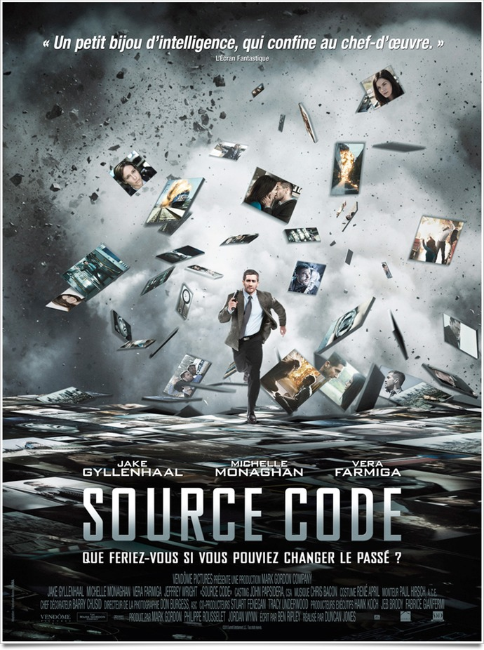
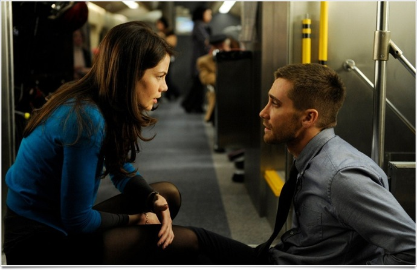

+++
type = "post"
titre = "<em>Source Code</em>, Duncan Jones"
title = "Source Code, Duncan Jones"
url = "/source-code-jones"
date = "2011-04-19T00:39:03"
Lastmod = "2015-03-15T00:59:25"
cover = "source-code.jpg"
categorie = [ "À voir" ]
tag = [ "Amour", "Mort", "Science-Fiction", "Thriller", "Voyage temporel" ]
createur = [ "Duncan Jones" ]
acteur = [ "Jake Gyllenhaal", "Jeffrey Wright", "Michelle Monaghan" ]
annee = [ "2011" ]
weight = 2011
pays = [ "États-Unis" ]

+++

<em><a href="http://voiretmanger.fr/2010/03/08/moon-jones/">Moon</a></em>, son premier film, n&rsquo;a même pas eu les honneurs d&rsquo;une sortie en salles, les producteurs ayant sans doute jugé que le public français n&rsquo;était pas apte à comprendre ce huis clos assez époustouflant. Heureusement, le fils de David Bowie a suffisamment marqué le milieu du cinéma pour avoir droit à une star, ce qui permet à <em>Source Code</em> de bénéficier d&rsquo;une (relativement) large sortie au cinéma. Duncan Jones bénéficie ici d&rsquo;un budget largement supérieur à celui de <em>Moon</em><a href="#fn-4745-1" rel="footnote">1</a>, mais toujours aussi ridicule comparé au budget du plus petit film hollywoodien. Cette fois encore, le cinéaste fait des merveilles pour construire son film avec peu de matériau. Si le résultat est plus anecdotique que pour son précédent film, <em>Source Code</em> s&rsquo;avère assez plaisant pour qui aime les paradoxes temporels.

Quand Colter Stevens, officier en guerre en Afghanistan, se réveille dans un train qui le mène à Chicago, la surprise est de taille. Hébété et amnésique, il cherche à comprendre comment il s&rsquo;est retrouvé dans ce train et qui est cette jolie femme en face de lui qui semble si bien le connaître. Il finit par comprendre qu&rsquo;il n&rsquo;est pas celui qu&rsquo;il croit être, mais qu&rsquo;il vit dans le corps d&rsquo;un professeur en histoire. Sur ces entrefaites, une bombe explose et Colter se retrouve dans un caisson où une femme lui explique qu&rsquo;il participe à un programme nommé Source Code. Ce programme militaire exploite les huit dernières minutes laissées par tout mort sous la forme de trace et reconstitue à partir de ces données les évènements qui précèdent l&rsquo;explosion. Colter est en fait envoyé dans l&rsquo;esprit d&rsquo;un des passagers avec un objectif en tête : découvrir qui a posé cette première bombe pour déjouer un second attentat qui doit anéantir tout Chicago. À chaque échec, la bombe explose, Colter se retrouve dans le caisson et il est renvoyé dans le train, huit minutes avant l&rsquo;explosion, ou plutôt dans une représentation des huit minutes avant, puisqu&rsquo;il ne s&rsquo;agit pas de voyage dans le temps.

<em>Source Code</em> est présenté comme un thriller haletant, ce qui n&rsquo;est que le cas. Le temps est un élément central du film, on l&rsquo;aura compris, et ce pour deux raisons. À chaque fois que Colter retourne dans le train, il n&rsquo;a que huit minutes pour trouver la bombe et le terroriste. Autre temporalité, celle de réalité et de la lutte antiterroriste : il faut trouver le terroriste et déjouer ses plans avant leurs mises en action et Colter est pressé de trouver des réponses. Le temps presse donc et <em>Source Code</em> montre bien comment Colter apprend au fur et à mesure, déjoue les pièges des différents évènements, essaient plusieurs tentatives, moleste quelques fausses pistes avant de, patiemment, se diriger vers la bonne cible. Duncan Jones nous permet de vivre ces huit minutes à plusieurs reprises, sous différents angles et à des rythmes variables (le film n&rsquo;est quand même pas composé de <em>n</em> fois les huit minutes). Invariablement, ou presque, la bombe explose au bout du temps imparti, le héros se réveille dans son caisson, il effectue un débriefing bref et repart dans le train. Cet aspect thriller est bien assumé par Duncan Jones qui offre ainsi une sorte de <em>Moon</em> dopé aux amphétamines, mais ce n&rsquo;est pas le seul du film et heureusement d&rsquo;ailleurs, car toute l&rsquo;intrigue est résolue très rapidement par Colter

Film de science-fiction comme son prédécesseur, <em>Source Code</em> choisit cette fois un autre domaine de prédilection du genre avec le voyage dans le temps. Si Colter ne voyage pas vraiment dans le temps étant donné qu&rsquo;il voit une projection des huit minutes qui précède l&rsquo;explosion, le résultat est le même : il peut, ou veut en tout cas, modifier le cours des choses et faire évoluer le présent en fonction de ses modifications. Un dialogue quasiment métaphysique s&rsquo;ouvre alors entre Colter et les responsables du projet Source Code sur la vie et la mort, sur le temps et les univers parallèles. Ces interludes réflexifs seraient inattendus chez un autre cinéaste et ils sont en quelque sorte la marque de fabrique du cinéaste. Colter refuse sa condition, il refuse de croire qu&rsquo;il ne peut pas modifier le cours du temps et éviter l&rsquo;explosion et la mort de tous les passagers, dont la charmante jeune femme avec laquelle il partage son voyage. Un autre élément vient en effet perturber le dispositif : l&rsquo;amour. Colter tombe amoureux de la femme qui ne devrait être qu&rsquo;une projection et il finit par tant l&rsquo;aimer que sa mission passe au second plan. Sans dévoiler la fin, disons que cette astuce est à l&rsquo;origine du twist final qui est plutôt bien mené, à défaut d&rsquo;être très original. Si vous aimez les réalités parallèles et autres impossibilités quantiques, vous devriez vous amuser avec celles de <em>Source Code</em>.

Le scénario de <em>Source Code</em>, contrairement à celui de <em>Moon</em>, n&rsquo;est pas de Duncan Jones. Il est néanmoins suffisamment malin pour s&rsquo;accorder à un budget réduit. L&rsquo;idée des huit minutes précédant l&rsquo;explosion est aussi économique que bien trouvée et le cinéaste parvient à nous faire revivre plusieurs fois la même séquence sans pour autant que l&rsquo;ennui s&rsquo;instaure. À travers des variations minimes ou plus importantes, il nous fait vivre la même scène sous des angles légèrement différents à chaque fois. C&rsquo;est classique, mais efficace et très bien mené dans ce film. On sent que le film n&rsquo;a pas bénéficié d&rsquo;un budget illimité, mais Duncan Jones dissimule plutôt bien ces relatives faiblesses et offre un spectacle tout à fait convenable. On notera la belle performance de Jake Gyllenhaal, excellent en ancien soldat américain qui parvient à jouer contre la montre, au sens propre du terme. L&rsquo;histoire d&rsquo;amour est très présente, peut-être un peu trop, mais Duncan Jones se révèle là encore malin et évite la lourdeur que l&rsquo;on attendait, notamment grâce au jeu de ses deux acteurs principaux.

<em>Source Code</em> n&rsquo;a pas la force et la sécheresse de son prédécesseur. Comparé à <em>Moon</em>, ce film a un budget énorme qui le rapproche des standards hollywoodiens, même s&rsquo;il en reste encore éloigné. Duncan Jones parvient néanmoins à garder son regard original et propose film qui paraît assez convenu dans l&rsquo;ensemble, mais qui se révèle finalement moins caricatural qu&rsquo;il n&rsquo;y semblait. <em>Source Code</em> confirme en tout cas tout le bien que l&rsquo;on pense du jeune cinéaste que l&rsquo;on espère revoir dans d&rsquo;autres films plus personnels.

<h3>Vous voulez m&rsquo;aider ?</h3>
<ul>
<li><a href="http://www.amazon.fr/gp/product/B0053G4V24/ref=as_li_ss_tl?ie=UTF8&tag=leblogdenic07-21&linkCode=as2&camp=1642&creative=19458&creativeASIN=B0053G4V24">Acheter le film en Blu-Ray sur Amazon</a></li>
<li><a href="http://www.amazon.fr/gp/product/B0053G4V3I/ref=as_li_ss_tl?ie=UTF8&tag=leblogdenic07-21&linkCode=as2&camp=1642&creative=19458&creativeASIN=B0053G4V3I">Acheter le film en DVD sur Amazon</a></li>
<li><a href="https://itunes.apple.com/fr/movie/source-code/id453704232">Acheter ou louer le film sur l&rsquo;iTunes Store</a></li>
</ul>

<ol>
<li id="fn-4745-1">
<em>Source Code</em> a droit à 32 millions de dollars, contre… 5 millions pour <em>Moon</em>.&#160;<a href="#fnref-4745-1" rev="footnote">&#8617;</a>
</li>
</ol>

