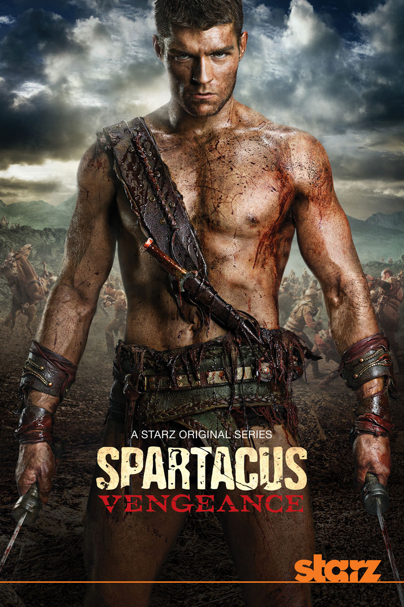
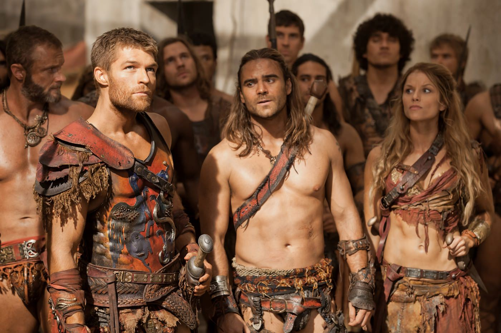
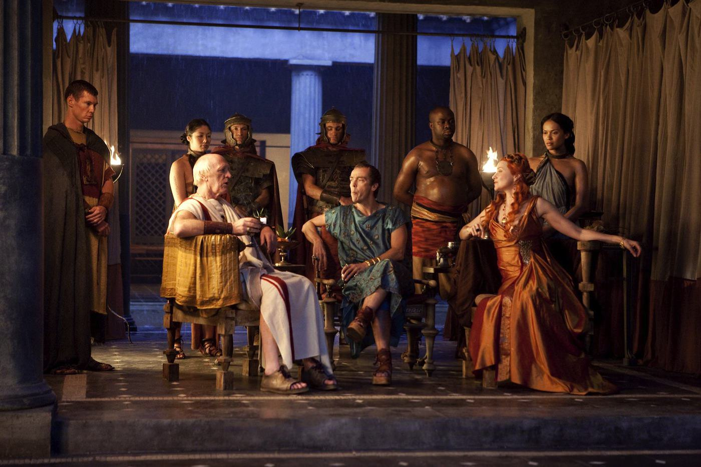
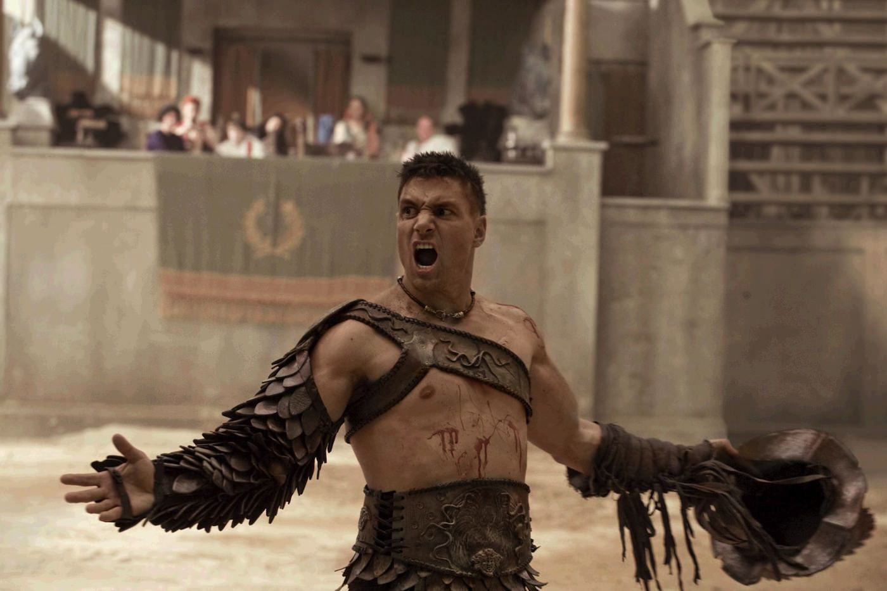

+++
type = "post"
titre = "<em>Spartacus</em>, Steven S. DeKnight (Starz)"
title = "Spartacus, Steven S. DeKnight (Starz)"
url = "/spartacus-deknight-starz"
date = "2013-03-30T09:53:19"
Lastmod = "2015-02-02T23:51:59"
cover = "spartacus-deknight-andy-whitfield.jpg"
categorie = [ "À voir" ]
tag = [ "Esclavage", "Guerre", "Histoire", "Histoire vraie", "Série", "Sexe", "Société", "Violence" ]
createur = [ "Starz", "Steven S. DeKnight" ]
acteur = [ "Andy Whitfield", "John Hannah", "Liam McIntyre", "Lucy Lawless", "Manu Bennett", "Peter Mensah" ]
annee = [ "2010" ]
weight = 2010
pays = [ "États-Unis" ]

+++

L’<a href="http://fr.wikipedia.org/wiki/Spartacus">histoire de Spartacus</a> est devenue une légende très populaire, un mythe, un symbole même. Ce gladiateur qui a réussi à lever une armée contre Rome dans les années 70 av. J.-C. est devenu le symbole de la liberté et de la lutte contre l’oppression, mais aussi par extension un symbole de la démocratie elle-même. Popularisée par le <a href="http://voiretmanger.fr/2011/08/28/spartacus-kubrick/" title="Spartacus, Stanley Kubrick - À voir et à manger"><em>Spartacus</em></a> de Stanley Kubrick, son histoire a été à nouveau exploitée dans une série télévisée, cinquante ans après. <em>Spartacus</em> raconte en trois saisons la vie de cet homme devenu gladiateur, avant de se faire meneur d’hommes dans une immense guerre qui a fait trembler Rome. Un récit épique extrêmement ambitieux pour une série découpée en épisodes d’une cinquantaine de minutes et aux moyens nécessairement inférieurs à ceux du cinéma. Au total, <em>Spartacus</em> fonctionne plutôt bien et parvient, malgré ses défauts, à nous entraîner dans une histoire passionnante que l’on ne veut plus quitter…

Le film de Stanley Kubrick faisait de Spartacus un grand défenseur de la liberté, voire même un communiste qui s’élève contre une dictature décadente, tandis que son armée avait des allures de mouvement hippie. Sorti en 1960, ce film faisait écho à la Guerre froide qui menaçait les États-Unis et surtout à la politique extrêmement dure mise en place par le sénateur McCarthy qui touchait le cinéma comme toute chose. La série <em>Spartacus</em> ne pouvait évidemment pas partir sur les mêmes bases : la première saison est diffusée outre-Atlantique en 2010 et les deux blocs opposés de la Guerre froide ne sont qu’un lointain souvenir, tandis que cela fait longtemps que l’on ne se bat plus pour des idéaux. Les scénaristes ont dès lors opté pour un autre angle, que l’on pourrait qualifier d’hyper réalisme. Dans l’esprit d’autres séries historiques, telles que <em>Rome</em> ou <em>Borgia</em> dans le même contexte géographique, ou <a href="http://voiretmanger.fr/2010/05/10/deadwood-hbo/" title="Deadwood, HBO - À voir et à manger"><em>Deadwood</em></a> dans un tout autre contexte, on entre ici dans une histoire crasseuse, pleine de boue, de sang et de sexe pour un récit qui se veut réaliste, avec des salauds et des gentils dans tous les camps.

Réalisme, certes, mais l’histoire de Spartacus a été nécessairement romancée pour adopter le format d’une série télévisée et surtout maintenir l’intérêt le temps de trois saisons. Les principaux personnages de la <a href="http://fr.wikipedia.org/wiki/Troisième_Guerre_servile">Troisième Guerre servile</a> sont présents, à commencer par les trois dirigeants de l’armée, même si leurs personnages sont assez différents dans la fiction. Outre Spartacus, Crixus joue un rôle central tout au long de <em>Spartacus</em>, tandis qu’Œnomaüs tient également une place importante. La série se concentre toutefois autour du personnage principal qui donne son nom à l’ensemble et on le découvre, dans le premier épisode, quand il n’était pas encore esclave. Comme souvent à une époque aussi lointaine, son histoire est mal connue, surtout avant d’être gladiateur. Les scénaristes optent d’emblée pour une mise en avant du personnage, en faisant de Spartacus le chef de sa tribu thrace — région qui correspond aux Balkans aujourd’hui. Il accepte la proposition de Glaber, un officier romain qui veut s’allier avec les Thraces pour repousser un ennemi commun, mais Spartacus refuse d’obéir aux ordres quand il comprend qu’il a été trompé et que l’armée romaine veut en fait utiliser ses hommes pour toute autre chose. Ce refus en fait un déserteur et Glaber le vend comme esclave à « ludus », une maison où l’on forme les gladiateurs. C’est à partir de là que <em>Spartacus</em> commence vraiment.

<em>Spartacus</em> est divisée en trois saisons et même si les motivations des producteurs pour se limiter à trois saisons par ailleurs assez brèves (une dizaine d’épisodes à chaque fois) sont d’abord liées au succès relatif de la série, ce découpage est tout à fait logique. Dans la première saison, nommée <em>Le Sang des gladiateurs</em>, on suit les progrès de Spartacus comme gladiateur. Dans un premier temps, l’homme est rebelle et refuse de se battre pour Rome, mais son maître Batiatus — qui est d’ailleurs un personnage historique — parvient à l’amadouer en lui promettant de retrouver sa femme, vendue elle aussi comme esclave après sa désertion. La saison avance et Spartacus devient un héros à Capoue, un héros de l’arène qui enflamme les foules. Grâce à lui, la maison de Batiatus connaît gloire et fortune et <em>Spartacus</em> s’intéresse justement à ce fond politique. Comme toutes les bonnes séries, l’intérêt vient aussi et peut-être surtout de ces tractations politiques, des manœuvres des hommes et des femmes aussi souvent pour accéder au pouvoir. À cet époque, l’honneur et la réputation font tout et la série rend plutôt bien cette quête permanente de l’élévation chez le très ambitieux Batiatus. Suivre ses tractations et surtout les manœuvres de sa femme qui essaie de faire de la femme de Glaber son amie pour s’approcher du pouvoir est vraiment réjouissant, si bien que cette saison bien équilibrée entre combats sur le sable et combats de salon est très plaisante.

Dans l’arène aussi, <em>Spartacus</em> ménage une bonne place aux intrigues, cette fois autour de Spartacus et de Crixus. Dès l’arrivée du gladiateur thrace, ces deux hommes se détestent : Crixus est alors gladiateur depuis plusieurs années et ce gaulois est le héros de Capoue et celui que l’on nomme « le Gaulois invaincu » est de fait capable de tuer n’importe quel gladiateur dans l’arène. L’arrogance du nouveau venu l’énerve au plus haut point et il le déteste immédiatement, Spartacus le lui rendant bien. Cette opposition est un moteur non pas seulement de la première saison, mais de toute la série. <em>Vengeance</em>, la deuxième saison, suit le parcours de Spartacus et des gladiateurs qui l’ont suivi après leur fuite sanglante de la maison de Batiatus. Crixus se range alors sous les ordres de Spartacus, non par choix, mais il a été libéré par cet homme et il lui doit tout, il n’a pas vraiment d’autre choix que de le suivre. Les tensions entre les deux persistent, mais cette saison très différente de la précédente est pleine de tension et l’heure n’est pas au conflit. Il faut dire que l’armée de Spartacus n’est pas encore formée et les rebelles sont encore assez faibles et doivent ruser pour déjouer les attaques de Glaber. À nouveau, les tensions entre Romains sont palpables et elles jouent un rôle essentiel, plus encore que dans la saison un, dans la victoire de l’ancien gladiateur.

La série change encore plus de ton et d’ampleur avec <em>La Guerre des damnés</em>, la troisième et dernière saison. Une astucieuse ellipse temporelle<a href="#fn-8966-1" rel="footnote">1</a> nous fait retrouver plusieurs mois après la fin de la deuxième saison : Spartacus a rassemblé autour de lui plus de 100 000 personnes, d’anciens esclaves essentiellement qui ont suivi le mouvement et se sont libérés derrière Spartacus. Une masse énorme qui force le Sénat romain à frapper de toute ses forces : Rome envoie plusieurs légions dirigées par Marcus Crassus, l’homme le plus riche de l’époque qui permet de rassembler une immense armée pour écraser les rebelles. <em>Spartacus</em> entre alors dans une phase de gigantisme où des armées de plusieurs milliers d’hommes s’affrontent, mais cette saison se concentre en grande partie autour de la petite ville portuaire de Sinuessa. Spartacus doit nourrir ses troupes et tous ceux qui le suivent et il décide d’attaquer la ville pour ses ressources. C’est toutefois une erreur stratégique qui permet à Crassus de les prendre au piège derrière les murs fortifiés de la ville. Encore une fois, cette saison qui fait la part belle aux combats n’en oublie pas les conflits internes, tant chez les gladiateurs que du côté des Romains.

Incontestablement, les producteurs ont mis la barre très haut en matière de réalisme visuel. <em>Spartacus</em> nous plonge dès ses premiers épisodes dans un univers sale et dangereux, où la mort est quotidienne et normale, et pas uniquement dans l’arène d’ailleurs. On découvre des Romains assez rustres, de gros buveurs qui tombent souvent dans la violence, même dans les plus hautes sphères. Batiatus, le maître des gladiateurs, n’hésite jamais à tuer un rival ou même une femme, si cette mort sert son objectif. La violence est omniprésente et la série le rend bien, avec une violence visuelle digne des films d’horreur et ce n’est certainement pas innocent que l’on retrouve Sam Raimi parmi les producteurs. Le sang coule à flots, il s’échappe régulièrement des membres tranchés en filets sous pression, mais on voit aussi de temps en temps des entrailles ou des crabes brisés avec un luxe de détails qui justifient tout à fait l’interdiction pour les plus jeunes. <em>Spartacus</em> fait de cette violence un argument de vente, quitte d’ailleurs à parfois en faire un peu trop, même si elle pose indéniablement le contexte. Outre le sang, le sexe est aussi omniprésent dans la série qui n’hésite pas à montrer des corps féminins et masculins totalement nus, et des scènes de sexe assez suggestives. On est par moment à la limite du film de charme, mais il faut reconnaître que dans cette région méridionale, on était rarement complètement vêtu, surtout chez les gladiateurs qui sont la plupart du temps en slip. On se demande en revanche si les corps huilés étaient bien utiles sur le plan historique, mais les amateurs/rices apprécieront.

Une autre référence saute aux yeux quand on commence à regarder <em>Spartacus</em> : <em>300</em>, le fameux film de Zack Snyder  qui se déroule dans un contexte assez proche et qui a marqué les esprits par son esthétique outrancière et surtout ses ralentis. Les producteurs de cette série ont manifestement apprécié le film, au point d’en reprendre littéralement cette esthétique. Tous les combats sont filmés avec des ralentis et des accélérations censés amplifier le suspense, mais qui deviennent assez lourds sur trois saisons. Disons-le, ce n’est pas l’aspect le plus réussi de la série et ces combats donnent à <em>Spartacus</em> un côté redite assez peu plaisant, même si on finit par s’y faire. Dommage en tout cas d’avoir été si peu innovant, alors que les séries constituent souvent un formidable terrain de jeu et d’expérimentations pour les réalisateurs. Autre point qui fâche : les décors extérieurs. Si l’intérieur du ludus de Batiatus, puis les intérieurs des camps rebelles et des villas romaines sont tous réussis, les producteurs ont eu la fâcheuse idée de représenter des villes entières, de Capoue à Rome en passant par Sinuessa. L’idée n’était pas mauvaise, mais le manque de moyens conduit à n’avoir que des images de synthèse digne d’un jeu sorti dix ans auparavant. <em>Spartacus</em> est loin du photoréalisme que l’on sait faire aujourd’hui en matière d’images numériques, mais même sans prétendre au meilleur, on était en droit d’espérer un mieux que ces blocs carrés sans vie qui évoquent une maquette en carton plutôt qu’une vraie ville. Cette représentation nuit quelque peu au réalisme de l’ensemble, d’autant plus que ces scènes sont fréquentes.

La série est aussi handicapée par le changement forcé de son personnage principal : dans la première saison, Andy Whitfield incarne Spartacus et il est excellent de force et de détermination. Malheureusement, il tombe gravement malade alors que le tournage de la deuxième saison devait commencer et il meurt peu après. <em>Spartacus</em> aurait pu en rester là, mais les producteurs décident de continuer avec un nouvel acteur. La deuxième saison Liam McIntyre, un autre acteur australien qui est plus jeune que son prédécesseur, moins musclé, mais surtout qui peine un peu à s’imposer. Avec le temps, on s’habitue à ce nouveau visage, d’autant que la série fait judicieusement évoluer le personnage pour mieux correspondre au nouvel acteur. Heureusement, à une autre exception près, les acteurs ne changent pas d’une saison à l’autre et ils sont tous plutôt convaincants, avec une mention spéciale à Manu Bennett qui en impose dans son rôle de Crixus, mais aussi à Lucy Lawless dans son rôle de Lucretia, une romaine perfide et prête à tout pour s&rsquo;imposer.

Sans atteindre la perfection de certaines séries, <em>Spartacus</em> convainc par son univers violent qui sonne vrai. On adhère volontiers à cette vie difficile où la mort est omniprésente, à cette société où tout le monde a une arme et n’hésite pas à s’en servir. La série passe du confort des villas romaines à la crasse des logements de gladiateurs et c’est une opposition qui fonctionne. La bonne idée de <em>Spartacus</em>, c’est de ne pas se limiter aux combats qui sont d’ailleurs filmés de manière un peu trop lourde : les intrigues politiques sont meilleures et elles ajoutent beaucoup d’intérêt à la série. On apprécie à ce propos leur présence tant chez les Romains que du côté des rebelles et ces conflits humains omniprésents contribuent largement au réalisme de l’ensemble. Le bilan est ainsi plutôt positif pour <em>Spartacus</em> et on finit par être porté par ces intrigues, plus finalement que par cette guerre dont on sait très bien comment elle se termine…

<h3>Vous voulez <a href="http://voiretmanger.fr/soutien/">m&rsquo;aider</a> ?</h3>
<ul>
<li><a href="http://www.amazon.fr/gp/product/B00KKHSJ92/ref=as_li_ss_tl?ie=UTF8&amp;tag=leblogdenic07-21&amp;linkCode=as2&amp;camp=1642&amp;creative=19458&amp;creativeASIN=B00KKHSJ92">Acheter la série en Blu-ray sur Amazon</a></li>
<li><a href="http://www.amazon.fr/gp/product/B00NLRWRNM/ref=as_li_ss_tl?ie=UTF8&amp;tag=macgeneration&amp;linkCode=as2&amp;camp=1642&amp;creative=19458&amp;creativeASIN=B00NLRWRNM">Acheter la série en DVD sur Amazon</a></li>
<li><a href="https://itunes.apple.com/fr/tv-season/spartacus-le-sang-des-gladiateurs/id674197253">Acheter ou louer la série sur l&rsquo;iTunes Store</a></li>
<li><a href="http://www.netflix.com/WiMovie/70136152?trkid=50361908">Regarder la série sur Netflix</a></li>
</ul>

<ol>
<li id="fn-8966-1">
Astucieuse, car <a href="http://fr.wikipedia.org/wiki/Troisième_Guerre_servile#D.C3.A9faite_des_arm.C3.A9es_consulaires_.28-72.29">les récits divergent</a> largement sur ce qu’il advient de Spartacus et ses troupes entre la victoire contre Glaber et l’entrée en matière de Crassus. Plutôt que de choisir, les producteurs préfèrent passer directement au bouquet final…&#160;<a href="#fnref-8966-1" rev="footnote">&#8617;</a>
</li>
</ol>

