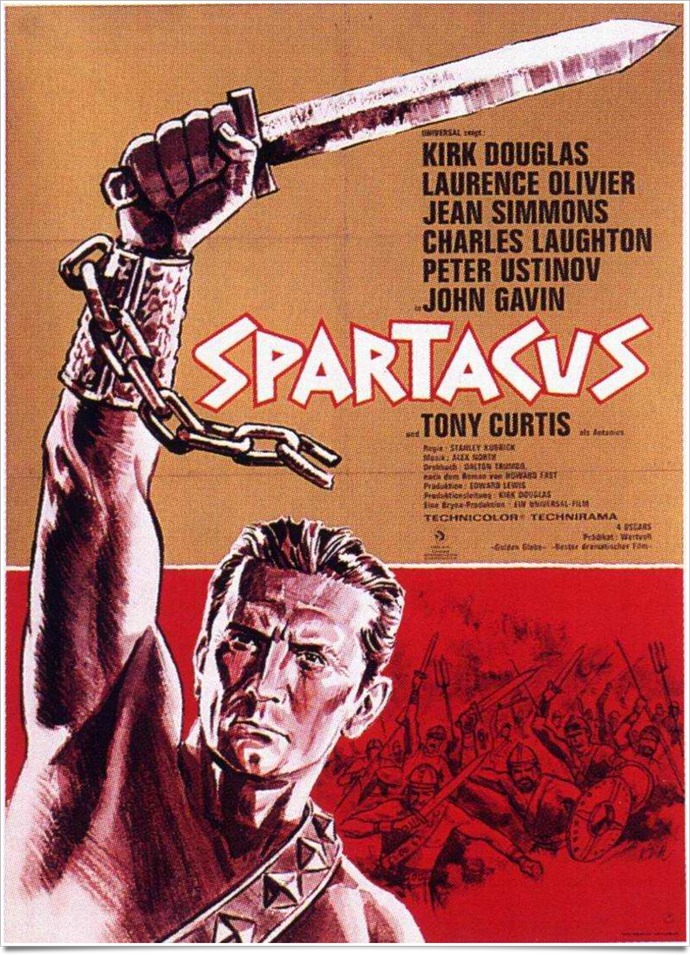
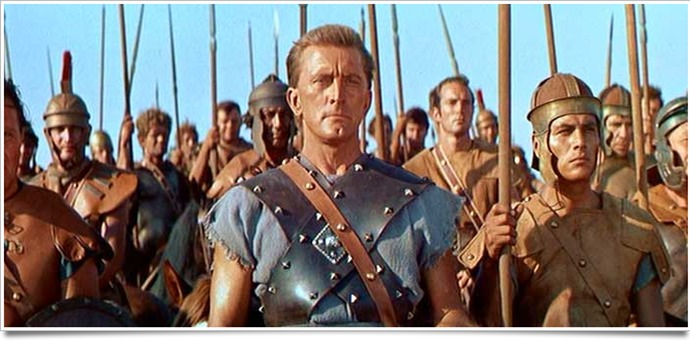
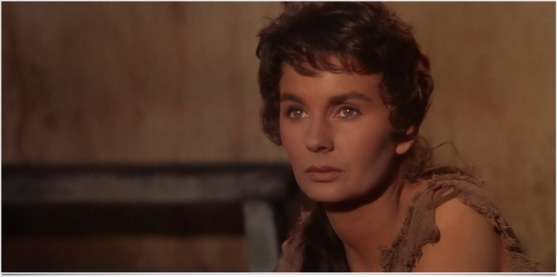

+++
type = "post"
titre = "Spartacus, Stanley Kubrick"
title = "Spartacus, Stanley Kubrick"
url = "/spartacus-kubrick"
date = "2011-08-28T17:26:35"
Lastmod = "2013-03-27T11:31:34"
cover = "spartacus-kubrick.jpg"
categorie = [ "À voir" ]
tag = [ "Amour", "Blockbuster", "Histoire", "Peplum", "Politique", "Société" ]
createur = [ "Stanley Kubrick" ]
acteur = [ "Jean Simmons", "John Gavin", "Kirk Douglas", "Laurence Olivier" ]
annee = [ "1960" ]
weight = 1960
pays = [ "États-Unis" ]

+++

Quand <em>Spartacus</em> sort dans les salles, en 1960, Stanley Kubrick n&rsquo;a que 32 ans et il vient de diriger un film aux dimensions hollywoodiennes. Lui qui n&rsquo;avait tourné que des films assez modestes jusque-là par leurs budgets et par leurs histoires se charge d&rsquo;un film doté d&rsquo;un budget de 12 millions de dollars et des centaines et des centaines d&rsquo;acteurs. Un projet pharaonique conçu et scrupuleusement protégé par Kirk Douglas. L&rsquo;acteur a rencontré Stanley Kubrick sur <em><a href="/2011/05/29/sentiers-gloire-kubrick/">Les Sentiers de la Gloire</a></em> et le cinéaste n&rsquo;a pas encore l&rsquo;aura qu&rsquo;il obtiendra plus tard. <em>Spartacus</em> est sans doute son film le moins personnel, c&rsquo;est une commande qu&rsquo;il exécutera sans avoir son mot à dire. Le cinquième film de Stanley Kubrick n&rsquo;est certes pas le plus intéressant de sa carrière, mais c&rsquo;est un des meilleurs péplums de la grande époque…

<em>Spartacus</em> est l&rsquo;adaptation au cinéma d&rsquo;une histoire vraie. <a href="http://fr.wikipedia.org/wiki/Spartacus">Spartacus</a> a vraiment existé : cet esclave gladiateur thrace a menacé une vaste rébellion contre l&rsquo;Empire romain à la fin des années 70 av. J.-C., une rébellion connue sous le nom de Troisième guerre servile. Le film, tel un biopic, suit la vie de cet esclave, acheté pour devenir gladiateur et qui réussit à s&rsquo;échapper, entraînant avec lui tous les gladiateurs de son école. Le mouvement s&rsquo;amplifie rapidement et les esclaves sont systématiquement libérés au passage de Spartacus qui réussit ainsi à former une armée forte de plusieurs dizaines de milliers d&rsquo;hommes. Pas assez pour vaincre Rome et ses Légions, mais les esclaves rebelles ont quand même tenu deux ans, une longueur exceptionnelle qui s&rsquo;explique notamment par la lenteur des Romains à réagir sérieusement. Au départ, personne ne prend au sérieux cette armée d&rsquo;esclaves et Rome n&rsquo;envoie pour les battre que quelques milliers d&rsquo;hommes qui sont décimés rapidement. Ce n&rsquo;est qu&rsquo;une fois les Légions rassemblées que Spartacus et ses hommes doivent se rendre. Entre temps, Spartacus découvre l&rsquo;amour en rencontrant Varinia, une esclave bretonne qu&rsquo;il finit par épouser…

Comme c&rsquo;est toujours le cas à Hollywood, l&rsquo;Histoire ne sert que de prétexte à élaborer l&rsquo;histoire d&rsquo;un film qui doit parler au plus grand nombre. Le scénario de <em>Spartacus</em> n&rsquo;hésite ainsi pas à s&rsquo;éloigner du personnage pour en faire un héros des temps modernes, à l&rsquo;assaut d&rsquo;un Empire romain décadent et en faveur de la liberté et, partant, de la démocratie. Conçu dans les années 1950, le film est d&rsquo;abord un pied de nez au climat anticommuniste de l&rsquo;époque. L&rsquo;âge d&rsquo;or du sénateur <a href="http://fr.wikipedia.org/wiki/Joseph_McCarthy">McCarthy</a> et de sa croisade contre le communisme avait bien sûr des conséquences sur l&rsquo;industrie du cinéma. Des acteurs, des réalisateurs et des scénaristes sont ainsi mis sur une liste noire qui les empêche de travailler suite à des soupçons de sympathies communistes. Le cinéma a toujours réussi à contourner les règles, mais <em>Spartacus</em> enfonce le clou. Le scénario est écrit par Dalton Trumbo, opposant farouche du maccarthysme qui a longtemps écrit des scénarios sous pseudonyme et qui accepte pour ce film d&rsquo;afficher son nom. Son scénario est lui aussi dans cet état d&rsquo;esprit : Spartacus devient une sorte de communiste avant l&rsquo;heure et la communauté d&rsquo;esclaves libérés rappelle fort les mouvements hippies des années 1970. Le scénario simplifie les faits pour ne retenir qu&rsquo;une lutte sans merci avec deux camps bien opposés et un manichéisme appuyé. Tous les Romains sans exception sont corrompus ou alors sans pitié et ils sont tous prêts à tout pour conserver leur pouvoir et écraser les esclaves qui sont quant à eux entièrement positifs. Un exemple parmi tant d&rsquo;autres : dans le film, on voit Spartacus intervenir pour empêcher un combat à mort de Romains organisé par les anciens gladiateurs ; on sait dans les faits que des centaines de soldats ont été ainsi tués dans des jeux du cirque.

Relecture historique, donc, mais relecture aussi &laquo;&nbsp;douglasienne&nbsp;&raquo;. <em>Spartacus</em> est le film le moins personnel de Stanley Kubrick et pour cause, il s&rsquo;agit beaucoup plus d&rsquo;un film de… Kirk Douglas. L&rsquo;acteur principal dans le film est aussi l&rsquo;instigateur du projet et il est le producteur exécutif du film. Un poste clé qui laisse au comédien toute latitude pour imposer son point et <em>Spartacus</em> témoigne bien de ce pouvoir. Spartacus, l&rsquo;homme, est ici le leader incontesté et incontestable du mouvement, ce qui était loin d&rsquo;être aussi évident dans la réalité. On sait au moins qu&rsquo;une partie des esclaves rebelles sont morts sous la direction de Crixius qui ne joue ici qu&rsquo;un rôle minime alors que la tension entre les deux hommes est minime. Le message a été lissé au maximum, certes pour combattre le maccarthysme et imposer un cinéma plus libre, mais aussi pour mettre en valeur Kirk Douglas qui a, après tout, initié le projet après s&rsquo;être fait rejeter de <em>Ben-Hur</em>. Quand il appelle Stanley Kubrick, il vient de congédier le réalisateur qu&rsquo;il avait précédemment choisi et le message est très clair : c&rsquo;est lui qui dirige. Plusieurs scènes se comprennent mieux par cette présence, notamment toutes celles, assez annexes dans le développement du récit, qui concernent son amour pour Varinia. La fin, totalement réécrite par rapport à la réalité, fait en outre de Spartacus un martyr sur la croix, figure christique par excellence…

Après <em>Spartacus</em>, Stanley Kubrick part le plus loin possible de Hollywood et tourne <em><a href="/2011/05/08/lolita-kubrick/">Lolita</a></em> en Grande-Bretagne. Le cinéaste ne quittera ensuite plus ce pays, préférant même reconstituer des rues entières de New York pour <em><a href="/2011/05/01/eyes-wide-shut-kubrick/">Eyes Wide Shut</a></em> plutôt que de poser à nouveau ses caméras sur le sol américain. Le dégoût est fort et il s&rsquo;explique essentiellement par l&rsquo;expérience <em>Spartacus</em>. Le jeune Kubrick est frustré sur cet énorme tournage, il n&rsquo;a aucun contrôle sur le scénario, ni même sur le tournage proprement dit : il n&rsquo;a été invité que pour poser ses caméras là où on le lui demande. Rien ne pourrait plus être éloigné de sa conception du cinéma : ce perfectionniste qui a pu demander à ses acteurs de refaire une même scène plusieurs dizaines de fois jusqu&rsquo;à atteindre la perfection ne peut ici rien faire, si ce n&rsquo;est râler. Les relations entre le cinéaste et Kirk Douglas ont manifestement été troubles et les deux hommes resteront fâchés. <em>Spartacus</em> garde ainsi très peu d&rsquo;influence de Stanley Kubrick, mais ce dernier a réussi tout de même à glisser un peu de lui-même, l&rsquo;air de rien. Le film aurait été sans doute moins violent et moins réaliste sans lui : les images de carnage, les meurtres face à la caméra, c&rsquo;est lui. L&rsquo;énorme bataille finale est son idée aussi et on sent qu&rsquo;il a aimé tourner ces énormes scènes et diriger les milliers de figurants nécessaires. C&rsquo;est néanmoins bien peu dans les quasiment 3h20 que durent <em>Spartacus</em> et on peut comprendre le dégoût du réalisateur pour Hollywood quand on compare ce film au reste de sa carrière.

<em>Spartacus</em> fait partie de la dernière série des péplums de l&rsquo;âge d&rsquo;or du genre et il représente en quelque sorte la quintessence du genre. Le film a connu beaucoup de succès et il est resté gravé dans les mémoires collectives pour cette raison. À cet égard, il mérite tout à fait d&rsquo;être (re)vu, mais celui qui y cherche Stanley Kubrick risque bien d&rsquo;être déçu. Le cinéaste n&rsquo;est pas totalement absent, mais ce premier et dernier film de commande dans sa carrière est son film le moins personnel et sans doute le plus décevant comparé aux autres films.

<h3>Vous voulez m&rsquo;aider ?<a href="#footnote_0_5099" id="identifier_0_5099" class="footnote-link footnote-identifier-link" title="&Agrave; propos de la publicit&eacute;&hellip;">1</a></h3>
<ul>
<li><a href="http://www.amazon.fr/gp/product/B004AYHZW8/ref=as_li_ss_tl?ie=UTF8&tag=leblogdenic07-21&linkCode=as2&camp=1642&creative=19458&creativeASIN=B004AYHZW8">Acheter le film en Blu-Ray sur Amazon</a></li>
<li><a href="http://www.amazon.fr/gp/product/B000223VXY/ref=as_li_ss_tl?ie=UTF8&tag=leblogdenic07-21&linkCode=as2&camp=1642&creative=19458&creativeASIN=B000223VXY">Acheter le film en DVD sur Amazon</a></li>
<li><a href="https://itunes.apple.com/fr/movie/spartacus-1960/id423533520">Acheter ou louer le film sur l&rsquo;iTunes Store</a></li>
</ul>

<ol class="footnotes"><li id="footnote_0_5099" class="footnote"><a href="/soutien/">À propos de la publicité…</a> [<a href="#identifier_0_5099" class="footnote-link footnote-back-link">&#8617;</a>]</li></ol>
