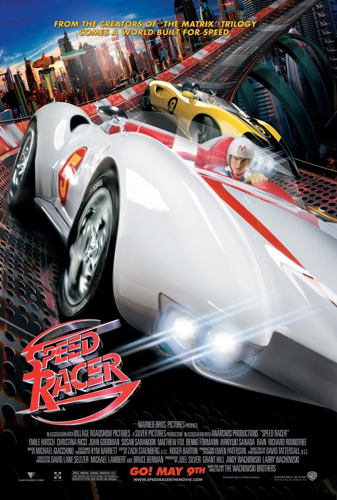
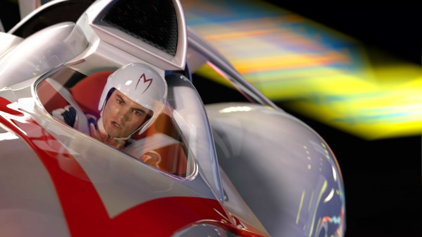

+++
type = "post"
titre = "<em>Speed Racer</em>, Andy et Lana Wachowski"
title = "Speed Racer, Andy et Lana Wachowski"
url = "/speed-racer-wachowski"
date = "2011-03-08T11:32:30"
Lastmod = "2015-03-24T23:48:59"
cover = "wachowski-speed-racer.jpg"
categorie = [ "À voir" ]
tag = [ "Blockbuster", "Course", "Famille", "Science-Fiction" ]
createur = [ "Andy et Lana Wachowski" ]
acteur = [ "Christina Ricci", "Emile Hirsch" ]
annee = [ "2008" ]
weight = 2008
pays = [ "États-Unis" ]

+++

Comment rebondir après l&rsquo;énorme succès de la trilogie <em><a href="/2011/01/02/trilogie-matrix-wachowski/">Matrix</a></em> ? Les frères Wachowski ont profité de la confiance des studios pour réaliser ce qui est, on l&rsquo;imagine, un rêve d&rsquo;enfance : le remake de <em>Speed Racer</em>, un <a href="http://en.wikipedia.org/wiki/Speed_Racer">manga japonais</a>. Le résultat est étonnant : un délire visuellement assez époustouflant, des effets spéciaux spectaculaires, pas toujours du meilleur goût et une narration qui va aussi vite que les bolides du film. Un film mal aimé, mal compris sans doute, bien éloigné il est vrai de la science-fiction verte. Pourtant, même si <em>Speed Racer</em> n&rsquo;est clairement pas un chef-d&rsquo;œuvre, le dernier film à ce jour d&rsquo;Andy et Larry Wachowski n&rsquo;est pas sans intérêt.

<em>Speed Racer</em> ne brille pas par l&rsquo;originalité de son récit : histoire d&rsquo;apprentissage, de passage à l&rsquo;âge adulte pour un jeune pilote passionné par la course et la vitesse. Le cadre du film l&rsquo;est plus : <em>Speed Racer</em> se déroule dans un futur pas si lointain, où les voitures ont encore des roues, mais roulent beaucoup, beaucoup plus vite et sont capables de faire des bonds de plusieurs dizaines de mètres. Les courses automobiles se déroulent désormais sur des circuits plus que tortueux où tout est possible, même s&rsquo;il s&rsquo;agit de défier la gravité. On y suit Speed, né dans une famille qui ne vit que pour la course automobile : le père construit les voitures et Rex, le grand frère de Speed, est un pilote de légende qui a battu tous les records avant de disparaître dans un tragique accident. C&rsquo;est avec ce lourd héritage qu&rsquo;il va devoir composer et se construire : alors que sa carrière atteint des sommets, il refuse une proposition alléchante de la part d&rsquo;un grand industriel propriétaire d&rsquo;une brillante équipe de pilotes. Deux visions de la course vont alors s&rsquo;affronter : la passion d&rsquo;un côté, l&rsquo;argent de l&rsquo;autre. L&rsquo;enjeu du film ne fait alors plus aucun doute : qui va l&rsquo;emporter ? La réponse ne surprendra pas les amateurs de blockbusters, le méchant est bien trop méchant pour ne pas devenir grotesque, et donc drôle. Un peu contre toute attente, l&rsquo;humour est très présent dans <em>Speed Racer</em>, film qui ne se prend jamais complètement au sérieux. L&rsquo;exemple le plus frappant est sans doute dans la caricature des personnages secondaires, autant en ce qui concerne la famille du héros que les méchants : ils sont tous bien trop caricaturaux pour être pris au sérieux… Les touches humoristiques sont bienvenues, le film aurait été sans doute bien mauvais sans ces pointes de second degré et d&rsquo;auto-dérision.

Rien d&rsquo;original donc, mais peu importe. <em>Speed Racer</em> est un film sur des bolides et son récit avance au même rythme. Les frères Wachowski ont adapté leur scénario au sujet du film : les ellipses se multiplient, l&rsquo;histoire avance à grands pas, on passe d&rsquo;une époque à une autre, d&rsquo;un lieu à un autre en une fraction de seconde, si bien que le récit ne prend jamais le temps de s&rsquo;alourdir. Ce choix de la nervosité est très bien vu pour un récit entièrement consacré aux courses automobiles. Cette rapidité se retrouve aussi bien sûr dans la réalisation, de manière plus classique. Pour une fois, on apprécie le montage sous amphétamine qui est si souvent employé, souvent à tort et à travers. Dans le cas de <em>Speed Racer</em> au contraire, il est parfaitement adapté et justifié et donne aux séquences de course une vivacité rarement vue au cinéma. Le résultat est assez impressionnant, d&rsquo;autant que l&rsquo;univers du film marque par son originalité extrême. À l&rsquo;image de certains dessins animés pour enfant, <em>Speed Racer</em> est un film extrêmement coloré et souvent simpliste. Les décors ne sont jamais naturels et font toujours faux, ou kitsch. Les frères Wachowski ont fait le choix étonnant de mêler décors et voitures futuristes pour les courses, et ambiance des années 1980 pour tout le reste. La maison de la famille est ainsi une vraie caricature des années 1980, avec ses couleurs criardes et ses formes géométriques. Les habits sont aussi ancrés dans cette ambiance, alors que le film s&rsquo;amuse à brouiller les pistes en incluant des courses automobiles des années 1940. Si <em>Speed Racer</em> se veut futuriste, on ne sait jamais, au juste, à quelle époque on se situe. Comme si plutôt que de futur, il fallait parler l&rsquo;univers parallèle.

<em>Speed Racer</em> a été un désastre à sa sortie. Les critiques furent très négatives, le public n&rsquo;a pas été attiré par le nouveau film des réalisateurs de <em>Matrix</em> comme la promotion l&rsquo;a mis en avant et le film a coûté beaucoup plus cher que ce qu&rsquo;il a coûté. La vraie raison de ce désastre est sans doute que le film a été mal compris. <em>Speed Racer</em> n&rsquo;est pas un film à prendre au sérieux comme les trois épisodes de <em>Matrix</em> : ce film est un vaste délire visuel, un rêve d&rsquo;enfant que les deux gosses Wachowski ont enfin pu réaliser. Il y a une part d&rsquo;égoïsme dans leur démarche et on peut comprendre que le grand public y soit resté insensible. Le film était aussi peut-être trop complexe pour un certain public : il est vrai que les allers et retours incessants entre les époques, les raccourcis rendent le film un peu plus complexe, même si l&rsquo;on est loin de pouvoir parler de film obscur.

Quelles que soient les raisons de cet échec commercial, elles n&rsquo;effacent pas totalement un film qui, s&rsquo;il n&rsquo;est pas sans défaut (on regrette un côté un peu niais), mérite tout de même qu&rsquo;on s&rsquo;y intéresse. Son univers haut en couleur est tout de même particulier et propose, à tout le moins, d&rsquo;en prendre plein la vue.

<h3>Vous voulez m&rsquo;aider ?</h3>
<ul>
<li><a href="http://www.amazon.fr/gp/product/B001G53KNM/ref=as_li_ss_tl?ie=UTF8&tag=leblogdenic07-21&linkCode=as2&camp=1642&creative=19458&creativeASIN=B001G53KNM">Acheter le film en Blu-Ray sur Amazon</a></li>
<li><a href="http://www.amazon.fr/gp/product/B001G53KNW/ref=as_li_ss_tl?ie=UTF8&tag=leblogdenic07-21&linkCode=as2&camp=1642&creative=19458&creativeASIN=B001G53KNW">Acheter le film en DVD sur Amazon</a></li>
<li><a href="https://itunes.apple.com/fr/movie/speed-racer/id397117197">Acheter ou louer le film sur l&rsquo;iTunes Store</a></li>
</ul>

